ANÁLISIS DEL CONTENIDO DE NUTRIENTES EN SAVIA, Y SU RELACIÓN CON EL
RENDIMIENTO EN PLANTAS DE PAPA (SOLANUM TUBEROSUM)
================

``` r
knitr::opts_chunk$set(fig.width=12, fig.height=8)
```

``` r
setwd("C:/Users/david/OneDrive/Escritorio/Personal/R/Data_science")
```

# 1) CONTENIDO EN SAVIA EN EL TIEMPO

Primero que todo, vamos a utilizar la información de elementos
contenidos en savia, determinados en diferentes momentos para los
tratamientos en cuestión.

``` r
library(readxl)
mccain_savia <- read_excel("C:/Users/david/OneDrive/Escritorio/Personal/R/mccain_savia.xlsx")
head(mccain_savia)
```

    ## # A tibble: 6 × 11
    ##   Fecha               Variedad   DDS Muest…¹ Trata…² Repet…³ Muestra    Ca     K
    ##   <dttm>              <chr>    <dbl>   <dbl> <chr>     <dbl>   <dbl> <dbl> <dbl>
    ## 1 2021-10-16 00:00:00 CIP 1       36       1 100% F…       1       1     4  5500
    ## 2 2021-10-16 00:00:00 CIP 1       36       1 100% F…       1       2     4  5800
    ## 3 2021-10-16 00:00:00 CIP 1       36       1 100% F…       1       3     8  5600
    ## 4 2021-10-16 00:00:00 CIP 1       36       1 100% F…       2       1    23  5700
    ## 5 2021-10-16 00:00:00 CIP 1       36       1 100% F…       2       2    17  5800
    ## 6 2021-10-16 00:00:00 CIP 1       36       1 100% F…       2       3    32  5700
    ## # … with 2 more variables: NO3 <dbl>, MATERIA_SECA <lgl>, and abbreviated
    ## #   variable names ¹​Muestreo, ²​Tratamiento, ³​Repetición

Inicialmente, se realiza un análisis exploratorio del dataframe
utilizado, para tener claridad sobre las variables a implementar
posteriormente.

``` r
names(mccain_savia)
```

    ##  [1] "Fecha"        "Variedad"     "DDS"          "Muestreo"     "Tratamiento" 
    ##  [6] "Repetición"   "Muestra"      "Ca"           "K"            "NO3"         
    ## [11] "MATERIA_SECA"

Por cuestiones de estética, se realiza un primer apartado en el cual se
definen los estándares de los gráficos que se generarán más adelante.

En este caso, utilizaremos la librería ggplot2.

``` r
library(ggplot2)

tema <-   theme(legend.position="bottom",panel.background = element_rect(fill = NA),panel.grid.major.y = element_line(colour = "grey90"),legend.key = element_rect(fill = "white"),axis.line = element_line(colour = "grey90"),legend.title = element_text(colour = "white"))
```

## ELMENTOS EN SAVIA

Para facilitar la ejecución de gráficos, se creará una función en la
cual se especifique el dataframe a utilizar, la variedad de papa en
cuestión, y la variable de interés. Eston se realiza con el fin de
obtener un análisis exploratorio de la información suministrrada.

La libraría dplyr nos permite generar consultas dentro de un dataframe
previamente incorporado, y almacenarlas dentro de un nuevo dataframe el
cual se trabajará.

``` r
library(dplyr)

crear_grafico <- function(datos, variedad, variable) {
  nombre_variable <- as.character(substitute(variable))  # Obtener el nombre de la variable
  
  datos %>%
    filter(Variedad == variedad) %>%
    group_by(DDS, Tratamiento) %>%
    summarise(Variable = mean({{variable}}, na.rm = TRUE),
              DDS = DDS,
              TRATAMIENTO = Tratamiento,
              SE = sd({{variable}}, na.rm = TRUE) / sqrt(sum({{variable}}))) %>%
    ggplot(aes(x = DDS, y = Variable, group = TRATAMIENTO, colour = TRATAMIENTO, shape = TRATAMIENTO)) +
    geom_errorbar(aes(ymin = Variable - 2 * SE, ymax = Variable + 2 * SE), width = 1) +
    geom_line(size = 0.5) +
    scale_y_continuous(breaks = seq(0, 10000, 500)) +
    scale_x_continuous(breaks = seq(0, 150, 15)) +
    labs(title = paste(nombre_variable, "en savia - Variedad", variedad),
         subtitle = paste("Representación gráfica de medias para la variedad", variedad),
         caption = paste("Variedad", variedad),
         x = "DDS", y = paste("Contenido de", nombre_variable, "(ppm)")) +
    geom_point(size = 2, fill = "white") +
    scale_color_manual(values = c("seagreen2", "cadetblue3", "cadetblue4", "cadetblue2")) +
    tema
}

grafico_variedad_1_NO3 <- crear_grafico(mccain_savia, "CIP 1", NO3)
grafico_variedad_1_K <- crear_grafico(mccain_savia, "CIP 1", K)
grafico_variedad_1_Ca <- crear_grafico(mccain_savia, "CIP 1", Ca)
grafico_variedad_39_NO3 <- crear_grafico(mccain_savia, "CIP 39", NO3)
grafico_variedad_39_K <- crear_grafico(mccain_savia, "CIP 39", K)
grafico_variedad_39_Ca <- crear_grafico(mccain_savia, "CIP 39", Ca)
grafico_variedad_102_NO3 <- crear_grafico(mccain_savia, "CIP 102", NO3)
grafico_variedad_102_K <- crear_grafico(mccain_savia, "CIP 102", K)
grafico_variedad_102_Ca <- crear_grafico(mccain_savia, "CIP 102", Ca)
```

``` r
grafico_variedad_1_NO3
```

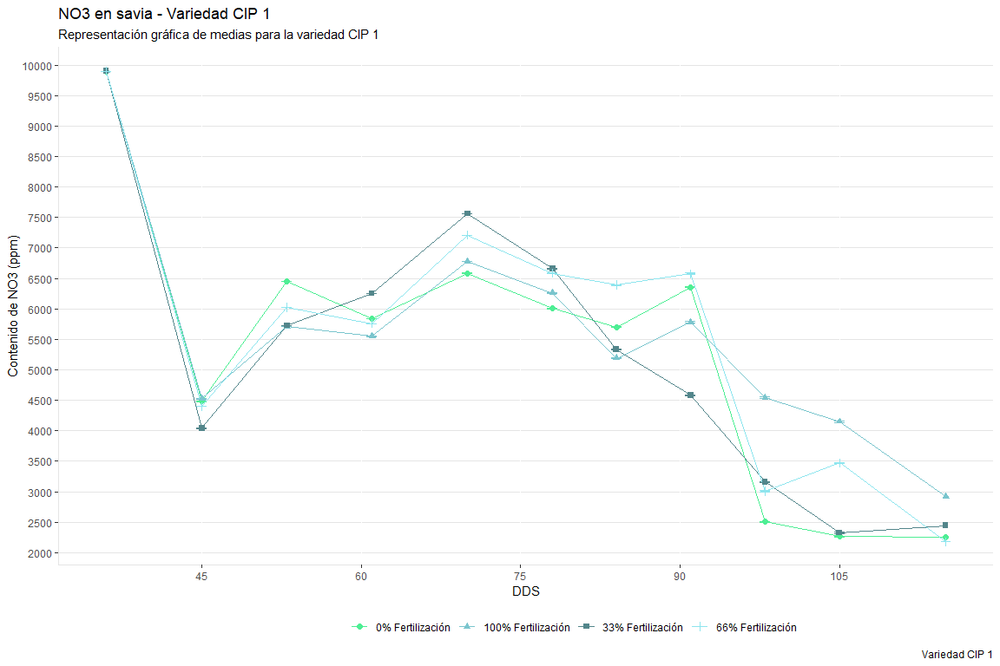<!-- -->

``` r
grafico_variedad_1_K
```

<!-- -->

``` r
grafico_variedad_1_Ca
```

<!-- -->

``` r
grafico_variedad_39_NO3
```

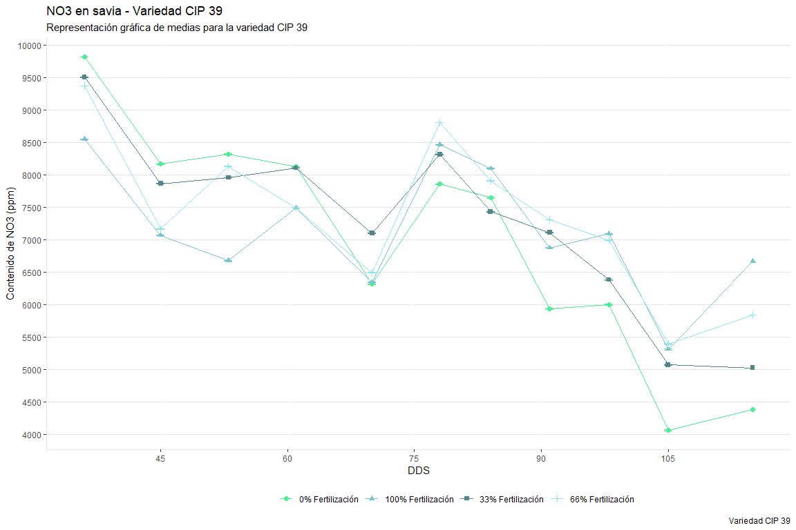<!-- -->

``` r
grafico_variedad_39_K
```

<!-- -->

``` r
grafico_variedad_39_Ca
```

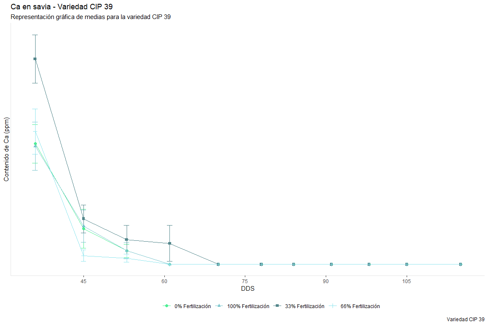<!-- -->

``` r
grafico_variedad_102_NO3
```

<!-- -->

``` r
grafico_variedad_102_K
```

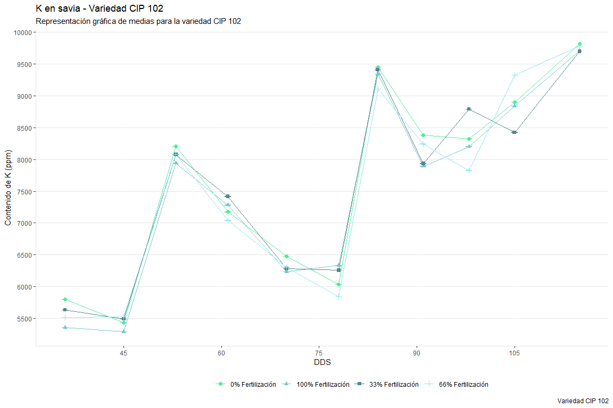<!-- -->

``` r
grafico_variedad_102_Ca
```

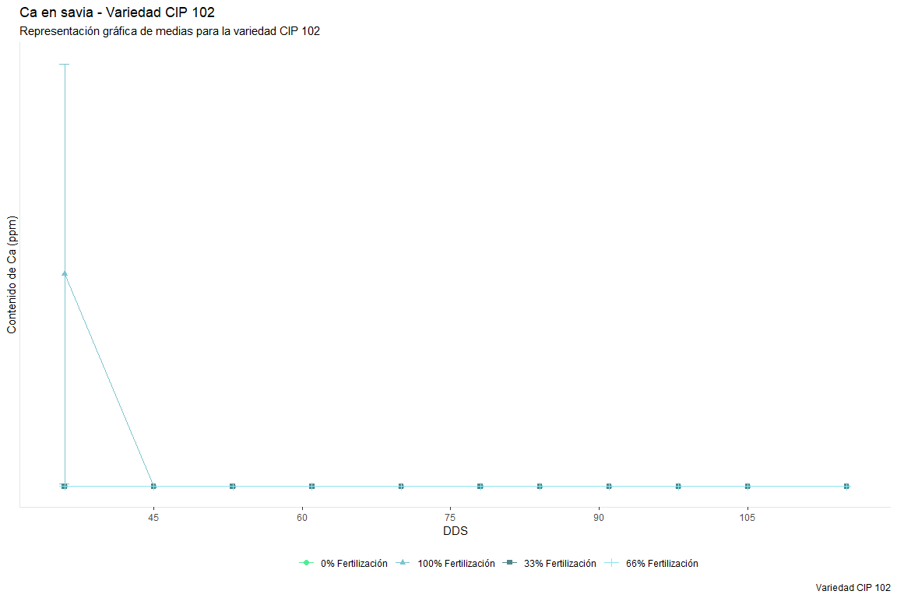<!-- -->

Con esto, podemos definir inicialmente que el comportamiento del calcio
no está claro. En este caso, el argumento de esto no puede ser revelado.

# 2) MODELO PESOS SECOS

En este apartado, se tomarán datos de la producción de masa seca de las
plantas, en estos tratamientos.

``` r
library(readxl)
datos_masa_seca <- read_excel("C:/Users/david/OneDrive/Escritorio/Personal/R/masa_seca.xlsx")
head(datos_masa_seca)
```

    ## # A tibble: 6 × 9
    ##   VARIEDAD TRATAMIENTO.      DDS REPET…¹ PESO_…² PESO_…³ PESO_…⁴ PROPO…⁵ REND_…⁶
    ##      <dbl> <chr>           <dbl>   <dbl>   <dbl>   <dbl>   <dbl>   <dbl>   <dbl>
    ## 1        1 100% Fertiliza…    43       1    16.9    4.22   0.151  0       0     
    ## 2        1 100% Fertiliza…    43       2    30      7.5    0.268  0       0     
    ## 3        1 100% Fertiliza…    43       3    15.8    3.96   0.141  0       0     
    ## 4        1 100% Fertiliza…    43       4    30.2    7.56   0.270  0       0     
    ## 5        1 100% Fertiliza…    60       1    73.0   18.3    0.652  0.0305  0.0199
    ## 6        1 100% Fertiliza…    60       2   229.    57.1    2.04   0.218   0.444 
    ## # … with abbreviated variable names ¹​REPETICION, ²​PESO_TOTAL, ³​PESO_UNIDAD,
    ## #   ⁴​`PESO_HA _(TON_HA)`, ⁵​PROPORCION_TUB, ⁶​REND_TUB_TON_HA

Igualmente, se realiza un análisis exploratorion del dataframe, para
obtener las variables.

``` r
names(datos_masa_seca)
```

    ## [1] "VARIEDAD"          "TRATAMIENTO."      "DDS"              
    ## [4] "REPETICION"        "PESO_TOTAL"        "PESO_UNIDAD"      
    ## [7] "PESO_HA _(TON_HA)" "PROPORCION_TUB"    "REND_TUB_TON_HA"

Por cuestiones de independencia en el análisis, se realizará y ejecutará
por separado el código para cada variedad, a diferencia de las primeras
gráficas ejecutadas en el prsente script.

## VARIEDAD 1

Primero, se realiza una aproximación mediante un gráfico de puntos, para
comprender inicialmente el cmportamiento de la acumulaicón de biomasa.

``` r
library(dplyr)

masa_seca_1 <- datos_masa_seca %>% 
  filter(VARIEDAD=="1")%>%
  group_by(DDS,TRATAMIENTO.)%>%
  summarise(PESO_TOTAL=mean(PESO_TOTAL,na.rm = T),
            DDS=DDS,
            TRATAMIENTO=TRATAMIENTO.)


ggplot() + geom_point(data=masa_seca_1, aes(x=DDS, y = PESO_TOTAL, group = TRATAMIENTO., colour = TRATAMIENTO.)) +
  xlab("DDS") + 
  ylab("PESO TOTAL") + 
  ggtitle("") +
  tema
```

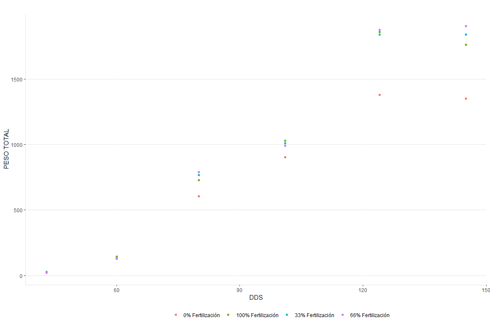<!-- -->

En este estudio, se implementa el **modelo de gompertz**, ajustado con
respecto a la función original, ya que este define la acumulación de
biomasa en especies vegetales.

Este modelo corresponde a una función sigmoidal, la cual describe la
acumulaión de biomasa de forma lenta al inicio (baja síntesis de
fotoasimilados) y al final del ciclo de vida (disminución de acumulación
debido a la marchitez de la parte aérea de las plantas).

Este es un caso especial de la **función logística**, y la modificación
implementada en este estudio se trabaja para poblaciones y acumulación
de biomasa.

En este modelo, se tiene:

- **y0:** El valor inicial de la función. En este caso, no partimos de
  cero.
- **ymax:** Es el límite de la función, es deir, su valor máximo.
- **lag:** Es una fase inicial, en la cual no se genera acumulación de
  biomasa en la raíz, sino que se desarrolla tejido aéreo para la
  síntesis de fotoasimilados y retraslocación.
- **k:** Se relaciona con la velocidad de crcimiento máxima alcanzada.

Para evaluar el modelo, se utiliza el comando *nls*, el cual corresponde
a la evaluación de modelos no lineales.

``` r
Gompertz <- function(x, y0, ymax, k, lag){
  result<- y0 + (ymax)*exp(-exp(k*(lag-x)/(ymax-y0) + 1))
  return(result)
}

masa_seca_100_1 <- datos_masa_seca %>%
  filter(VARIEDAD =="1",TRATAMIENTO.=="100% Fertilización")%>%
  group_by(DDS, TRATAMIENTO.)%>%
  summarise(PESO_TOTAL_100_1=PESO_TOTAL,
            DDS_100_1=DDS,
            TRATAMIENTO=TRATAMIENTO.)

Gomp_100_1 <- nls(PESO_TOTAL_100_1 ~ Gompertz(DDS_100_1, y0, ymax, k, lag),
             data=masa_seca_100_1,
             start = list(y0=15, ymax=2500, k=10, lag=1))

masa_seca_66_1 <- datos_masa_seca %>%
  filter(VARIEDAD =="1",TRATAMIENTO.=="66% Fertilización")%>%
  group_by(DDS, TRATAMIENTO.)%>%
  summarise(PESO_TOTAL_66_1=PESO_TOTAL,
            DDS_66_1=DDS,
            TRATAMIENTO=TRATAMIENTO.)

Gomp_66_1 <- nls(PESO_TOTAL_66_1 ~ Gompertz(DDS_66_1, y0, ymax, k, lag),
             data=masa_seca_66_1,
             start = list(y0=31, ymax=2100, k=15, lag=1))

masa_seca_33_1 <- datos_masa_seca %>%
  filter(VARIEDAD =="1",TRATAMIENTO.=="33% Fertilización")%>%
  group_by(DDS, TRATAMIENTO.)%>%
  summarise(PESO_TOTAL_33_1=PESO_TOTAL,
            DDS_33_1=DDS,
            TRATAMIENTO=TRATAMIENTO.)

Gomp_33_1 <- nls(PESO_TOTAL_33_1 ~ Gompertz(DDS_33_1, y0, ymax, k, lag),
             data=masa_seca_33_1,
             start = list(y0=21, ymax=2200, k=15, lag=1))

masa_seca_0_1 <- datos_masa_seca %>%
  filter(VARIEDAD =="1",TRATAMIENTO.=="0% Fertilización")%>%
  group_by(DDS, TRATAMIENTO.)%>%
  summarise(PESO_TOTAL_0_1=PESO_TOTAL,
            DDS_0_1=DDS,
            TRATAMIENTO=TRATAMIENTO.)

Gomp_0_1 <- nls(PESO_TOTAL_0_1 ~ Gompertz(DDS_0_1, y0, ymax, k, lag),
             data=masa_seca_0_1,
             start = list(y0=-7, ymax=1700, k=10, lag=1))
```

Ahora, podemos determinar los parámetros que describen los modelos
calculados para cada uno de los tratamientos.

``` r
coefs_100_1 <- coef(Gomp_100_1)
y0_100_1 = coefs_100_1[1]
ymax_100_1=coefs_100_1[2]
k_100_1=coefs_100_1[3]
lag_100_1=coefs_100_1[4]

coefs_100_1
```

    ##          y0        ymax           k         lag 
    ##    1.387849 2057.881732   77.494638   57.722265

``` r
coefs_66_1 <- coef(Gomp_66_1)
y0_66_1 = coefs_66_1[1]
ymax_66_1=coefs_66_1[2]
k_66_1=coefs_66_1[3]
lag_66_1=coefs_66_1[4]

coefs_66_1
```

    ##         y0       ymax          k        lag 
    ##  -38.24123 2387.35844   74.54711   54.75422

``` r
coefs_33_1 <- coef(Gomp_33_1)
y0_33_1 = coefs_33_1[1]
ymax_33_1=coefs_33_1[2]
k_33_1=coefs_33_1[3]
lag_33_1=coefs_33_1[4]

coefs_33_1
```

    ##         y0       ymax          k        lag 
    ##  -21.89891 2218.96587   75.02687   55.70686

``` r
coefs_0_1 <- coef(Gomp_0_1)
y0_0_1 = coefs_0_1[1]
ymax_0_1= coefs_0_1[2]
k_0_1 = coefs_0_1[3]
lag_0_1 = coefs_0_1[4]

coefs_0_1
```

    ##          y0        ymax           k         lag 
    ##    8.705103 1482.380971   61.599052   55.830652

Y finalmente, podemos determinar la significancia de cada estimador.

``` r
summary(Gomp_100_1)
```

    ## 
    ## Formula: PESO_TOTAL_100_1 ~ Gompertz(DDS_100_1, y0, ymax, k, lag)
    ## 
    ## Parameters:
    ##      Estimate Std. Error t value Pr(>|t|)    
    ## y0      1.388    113.980   0.012     0.99    
    ## ymax 2057.882    283.427   7.261 5.04e-07 ***
    ## k      77.495     10.881   7.122 6.69e-07 ***
    ## lag    57.722      7.782   7.417 3.68e-07 ***
    ## ---
    ## Signif. codes:  0 '***' 0.001 '**' 0.01 '*' 0.05 '.' 0.1 ' ' 1
    ## 
    ## Residual standard error: 180.8 on 20 degrees of freedom
    ## 
    ## Number of iterations to convergence: 17 
    ## Achieved convergence tolerance: 6.599e-06

``` r
summary(Gomp_66_1)
```

    ## 
    ## Formula: PESO_TOTAL_66_1 ~ Gompertz(DDS_66_1, y0, ymax, k, lag)
    ## 
    ## Parameters:
    ##      Estimate Std. Error t value Pr(>|t|)    
    ## y0     -38.24     171.28  -0.223 0.825587    
    ## ymax  2387.36     502.42   4.752 0.000122 ***
    ## k       74.55       9.93   7.507 3.07e-07 ***
    ## lag     54.75      11.12   4.923 8.21e-05 ***
    ## ---
    ## Signif. codes:  0 '***' 0.001 '**' 0.01 '*' 0.05 '.' 0.1 ' ' 1
    ## 
    ## Residual standard error: 201.1 on 20 degrees of freedom
    ## 
    ## Number of iterations to convergence: 13 
    ## Achieved convergence tolerance: 3.945e-06

``` r
summary(Gomp_33_1)
```

    ## 
    ## Formula: PESO_TOTAL_33_1 ~ Gompertz(DDS_33_1, y0, ymax, k, lag)
    ## 
    ## Parameters:
    ##      Estimate Std. Error t value Pr(>|t|)    
    ## y0     -21.90     174.82  -0.125 0.901563    
    ## ymax  2218.97     471.78   4.703 0.000136 ***
    ## k       75.03      12.42   6.043 6.59e-06 ***
    ## lag     55.71      11.67   4.773 0.000116 ***
    ## ---
    ## Signif. codes:  0 '***' 0.001 '**' 0.01 '*' 0.05 '.' 0.1 ' ' 1
    ## 
    ## Residual standard error: 231.7 on 20 degrees of freedom
    ## 
    ## Number of iterations to convergence: 12 
    ## Achieved convergence tolerance: 6.069e-06

``` r
summary(Gomp_0_1)
```

    ## 
    ## Formula: PESO_TOTAL_0_1 ~ Gompertz(DDS_0_1, y0, ymax, k, lag)
    ## 
    ## Parameters:
    ##      Estimate Std. Error t value Pr(>|t|)    
    ## y0      8.705    106.533   0.082    0.936    
    ## ymax 1482.381    215.236   6.887 1.09e-06 ***
    ## k      61.599     10.892   5.655 1.55e-05 ***
    ## lag    55.831      9.007   6.198 4.70e-06 ***
    ## ---
    ## Signif. codes:  0 '***' 0.001 '**' 0.01 '*' 0.05 '.' 0.1 ' ' 1
    ## 
    ## Residual standard error: 167.4 on 20 degrees of freedom
    ## 
    ## Number of iterations to convergence: 12 
    ## Achieved convergence tolerance: 3.561e-06

En este caso, se puede observar que el error estandar del residuo tiende
a 200. Sin embargo, se debe hacer la aclaración de que estos modelos
están en una escala de más de 2.000 gramos, equivalente a un error del
10%, por lo cual, describen los datos de forma óptima.

Igualmente, hay que consderar que existen otros modelos de acumulaciónde
biomasa, pero debido a la naturaleza de la de especie *tuberosum*, la
cual seca su parte aérea al final de su ciclo, esta última etapa será la
de menor llenado de tubérculos, ya que todos los fotoasimilados de la
parte aérea se habrán traslocado, y no se sintetizarán más.

Por último, para cada modelo, realizamos un gráfico en el que se
muestren los puntos originales, y una curva con los puntos que predice
el modelo, para cada día desde el día 0 hasta el día 150, el cual es
genéricamente el final del ciclo productivo de estos cultivos.

``` r
DDS_LEVELS <- seq(0,150,by=1)

par(mfrow=c(2,2))

pred <- predict(Gomp_100_1, list(x=DDS_LEVELS))
plot(PESO_TOTAL_100_1~DDS_100_1, data=masa_seca_100_1, xlim=c(0,150), ylim=c(0,2600),
     xlab="DDS", ylab="Peso total (g)")
lines(DDS_LEVELS, Gompertz(DDS_LEVELS, y0_100_1, ymax_100_1, k_100_1, lag_100_1),
      lty=1, col="cadetblue3", lwd = 2)

pred <- predict(Gomp_66_1, list(x=DDS_LEVELS))
plot(PESO_TOTAL_66_1~DDS_66_1, data=masa_seca_66_1, xlim=c(0,150), ylim=c(0,2600),
     xlab="DDS", ylab="Peso total (g)")
lines(DDS_LEVELS, Gompertz(DDS_LEVELS, y0_66_1, ymax_66_1, k_66_1, lag_66_1),
      lty=1, col="cadetblue2", lwd = 2)

pred <- predict(Gomp_33_1, list(x=DDS_LEVELS))
plot(PESO_TOTAL_33_1~DDS_33_1, data=masa_seca_33_1, xlim=c(0,150), ylim=c(0,2600),
     xlab="DDS", ylab="Peso total (g)")
lines(DDS_LEVELS, Gompertz(DDS_LEVELS, y0_33_1, ymax_33_1, k_33_1, lag_33_1),
      lty=1, col="cadetblue4", lwd = 2)

pred <- predict(Gomp_0_1, list(x=DDS_LEVELS))
plot(PESO_TOTAL_0_1~DDS_0_1, data=masa_seca_0_1, xlim=c(0,150), ylim=c(0,2600),
     xlab="DDS", ylab="Peso total (g)")
lines(DDS_LEVELS, Gompertz(DDS_LEVELS, y0_0_1, ymax_0_1, k_0_1, lag_0_1),
      lty=1, col="seagreen2", lwd = 2)
```

<!-- -->

``` r
par(mfrow=c(1,1))

plot(PESO_TOTAL~DDS, data=masa_seca_1, xlim=c(0,150), ylim=c(0,2600),
     xlab="DDS", ylab="Peso total (g)")
lines(DDS_LEVELS, Gompertz(DDS_LEVELS, y0_100_1, ymax_100_1, k_100_1, lag_100_1),
      lty=1, col="cadetblue3", lwd = 2)
lines(DDS_LEVELS, Gompertz(DDS_LEVELS, y0_66_1, ymax_66_1, k_66_1, lag_66_1),
      lty=1, col="cadetblue2", lwd = 2)
lines(DDS_LEVELS, Gompertz(DDS_LEVELS, y0_33_1, ymax_33_1, k_33_1, lag_33_1),
      lty=1, col="cadetblue4", lwd = 2)
lines(DDS_LEVELS, Gompertz(DDS_LEVELS, y0_0_1, ymax_0_1, k_0_1, lag_0_1),
      lty=1, col="seagreen2", lwd = 2)
legend("topleft",legend=c("100% Fertilización", "66% Fertilización", "33% Fertilización", "0% Fertilización"), lwd = 3, col = c("cadetblue3","cadetblue2","cadetblue4","seagreen2"))
```

<!-- -->

Ahora, con estos modelos, podemos determinar la acumulación de biomasa
para un día de interés. Esto se ha realizado debido a que a la empresa
le interezaba correlacionar estos valores modelados, con valores de
contenido en savia que se tenían para fechas distintas.

``` r
pesos_savia_100_1 <- Gompertz(c(36,45,53,61,70,78,84,91,98,105,115),y0_100_1,ymax_100_1,k_100_1,lag_100_1)
DDS_100_1 <- c(36,45,53,61,70,78,84,91,98,105,115)
TRATAMIENTO_100_1 <- rep("100% Fertilización",11)
Tabla_pesos_savia_100_1 <- data.frame(pesos_savia_100_1,DDS_100_1,TRATAMIENTO_100_1)
Tabla_pesos_savia_100_1
```

    ##    pesos_savia_100_1 DDS_100_1  TRATAMIENTO_100_1
    ## 1           5.721753        36 100% Fertilización
    ## 2          26.897839        45 100% Fertilización
    ## 3          81.363913        53 100% Fertilización
    ## 4         187.619445        61 100% Fertilización
    ## 5         373.049929        70 100% Fertilización
    ## 6         581.612147        78 100% Fertilización
    ## 7         751.037173        84 100% Fertilización
    ## 8         948.807045        91 100% Fertilización
    ## 9        1135.484281        98 100% Fertilización
    ## 10       1303.498509       105 100% Fertilización
    ## 11       1504.723028       115 100% Fertilización

``` r
pesos_savia_66_1 <- Gompertz(c(36,45,53,61,70,78,84,91,98,105,115),y0_66_1,ymax_66_1,k_66_1,lag_66_1)
DDS_66_1 <- c(36,45,53,61,70,78,84,91,98,105,115)
TRATAMIENTO_66_1 <- rep("66% Fertilización",11)
Tabla_pesos_savia_66_1 <- data.frame(pesos_savia_66_1,DDS_66_1,TRATAMIENTO_66_1)
Tabla_pesos_savia_66_1
```

    ##    pesos_savia_66_1 DDS_66_1  TRATAMIENTO_66_1
    ## 1         -19.31557       36 66% Fertilización
    ## 2          22.67193       45 66% Fertilización
    ## 3          97.27439       53 66% Fertilización
    ## 4         215.02064       61 66% Fertilización
    ## 5         397.28500       70 66% Fertilización
    ## 6         592.82700       78 66% Fertilización
    ## 7         751.31563       84 66% Fertilización
    ## 8         939.89405       91 66% Fertilización
    ## 9        1124.30361       98 66% Fertilización
    ## 10       1298.04933      105 66% Fertilización
    ## 11       1519.81605      115 66% Fertilización

``` r
pesos_savia_33_1 <- Gompertz(c(36,45,53,61,70,78,84,91,98,105,115),y0_33_1,ymax_33_1,k_33_1,lag_33_1)
DDS_33_1 <- c(36,45,53,61,70,78,84,91,98,105,115)
TRATAMIENTO_33_1 <- rep("33% Fertilización",11)
Tabla_pesos_savia_33_1 <- data.frame(pesos_savia_33_1,DDS_33_1,TRATAMIENTO_33_1)
Tabla_pesos_savia_33_1
```

    ##    pesos_savia_33_1 DDS_33_1  TRATAMIENTO_33_1
    ## 1         -10.35121       36 33% Fertilización
    ## 2          23.45632       45 33% Fertilización
    ## 3          91.24389       53 33% Fertilización
    ## 4         205.78932       61 33% Fertilización
    ## 5         389.81583       70 33% Fertilización
    ## 6         589.73987       78 33% Fertilización
    ## 7         751.40417       84 33% Fertilización
    ## 8         941.92559       91 33% Fertilización
    ## 9        1125.36260       98 33% Fertilización
    ## 10       1294.89657      105 33% Fertilización
    ## 11       1505.67225      115 33% Fertilización

``` r
pesos_savia_0_1 <- Gompertz(c(36,45,53,61,70,78,84,91,98,105,115),y0_0_1,ymax_0_1,k_0_1,lag_0_1)
DDS_0_1 <- c(36,45,53,61,70,78,84,91,98,105,115)
TRATAMIENTO_0_1 <- rep("0% Fertilización",11)
Tabla_pesos_savia_0_1 <- data.frame(pesos_savia_0_1,DDS_0_1,TRATAMIENTO_0_1)
Tabla_pesos_savia_0_1
```

    ##    pesos_savia_0_1 DDS_0_1  TRATAMIENTO_0_1
    ## 1         11.63301      36 0% Fertilización
    ## 2         29.33399      45 0% Fertilización
    ## 3         78.23070      53 0% Fertilización
    ## 4        174.60043      61 0% Fertilización
    ## 5        338.34740      70 0% Fertilización
    ## 6        514.08931      78 0% Fertilización
    ## 7        650.33807      84 0% Fertilización
    ## 8        802.19661      91 0% Fertilización
    ## 9        938.51624      98 0% Fertilización
    ## 10      1055.30552     105 0% Fertilización
    ## 11      1187.47471     115 0% Fertilización

Con esto, se tiene la información requerida para estimar la relación
entre la acumulación de biomasa, y el contenido de nutrientes en savia.

Desde este punto, se realiza el mismo procedimiento para las otras dos
variedades.

## VARIEDAD 39

``` r
masa_seca_39 <- datos_masa_seca %>% 
  filter(VARIEDAD=="39")%>%
  group_by(DDS,TRATAMIENTO.)%>%
  summarise(PESO_TOTAL_39=mean(PESO_TOTAL,na.rm = T),
            DDS_39=DDS,
            TRATAMIENTO_39=TRATAMIENTO.)

ggplot() + geom_point(data=masa_seca_39, aes(x=DDS, y = PESO_TOTAL_39, group = TRATAMIENTO., colour = TRATAMIENTO.)) + 
  xlab("DDS") + 
  ylab("PESO TOTAL") + 
  ggtitle("") +
  tema
```

<!-- -->

``` r
Gompertz <- function(x, y0, ymax, k, lag){
  result<- y0 + ymax*exp(-exp(k*(lag-x)/(ymax-y0) + 1))
  return(result)
}

masa_seca_100_39 <- datos_masa_seca %>%
  filter(VARIEDAD =="39",TRATAMIENTO.=="100% Fertilización")%>%
  group_by(DDS, TRATAMIENTO.)%>%
  summarise(PESO_TOTAL_100_39=PESO_TOTAL,
            DDS_100_39=DDS,
            TRATAMIENTO_39=TRATAMIENTO.)

Gomp_100_39 <- nls(PESO_TOTAL_100_39 ~ Gompertz(DDS_100_39, y0, ymax, k, lag),
             data=masa_seca_100_39,
             start = list(y0=20, ymax=2500, k=15, lag=1))

masa_seca_66_39 <- datos_masa_seca %>%
  filter(VARIEDAD =="39",TRATAMIENTO.=="66% Fertilización")%>%
  group_by(DDS, TRATAMIENTO.)%>%
  summarise(PESO_TOTAL_66_39=PESO_TOTAL,
            DDS_66_39=DDS,
            TRATAMIENTO_39=TRATAMIENTO.)

Gomp_66_39 <- nls(PESO_TOTAL_66_39 ~ Gompertz(DDS_66_39, y0, ymax, k, lag),
             data=masa_seca_66_39,
             start = list(y0=27, ymax=2000, k=15, lag=1))

masa_seca_33_39 <- datos_masa_seca %>%
  filter(VARIEDAD =="39",TRATAMIENTO.=="33% Fertilización")%>%
  group_by(DDS, TRATAMIENTO.)%>%
  summarise(PESO_TOTAL_33_39=PESO_TOTAL,
            DDS_33_39=DDS,
            TRATAMIENTO_39=TRATAMIENTO.)

Gomp_33_39 <- nls(PESO_TOTAL_33_39 ~ Gompertz(DDS_33_39, y0, ymax, k, lag),
             data=masa_seca_33_39,
             start = list(y0=15, ymax=1500, k=15, lag=1))

masa_seca_0_39 <- datos_masa_seca %>%
  filter(VARIEDAD =="39",TRATAMIENTO.=="0% Fertilización")%>%
  group_by(DDS, TRATAMIENTO.)%>%
  summarise(PESO_TOTAL_0_39=PESO_TOTAL,
            DDS_0_39=DDS,
            TRATAMIENTO_39=TRATAMIENTO.)

Gomp_0_39 <- nls(PESO_TOTAL_0_39 ~ Gompertz(DDS_0_39, y0, ymax, k, lag),
             data=masa_seca_0_39,
             start = list(y0=10, ymax=1400, k=15, lag=1))
```

``` r
coefs_100_39 <- coef(Gomp_100_39)
y0_100_39 = coefs_100_39[1]
ymax_100_39=coefs_100_39[2]
k_100_39=coefs_100_39[3]
lag_100_39=coefs_100_39[4]

coefs_100_39
```

    ##          y0        ymax           k         lag 
    ##   -3.604808 2387.514898   89.275503   59.498652

``` r
coefs_66_39 <- coef(Gomp_66_39)
y0_66_39 = coefs_66_39[1]
ymax_66_39=coefs_66_39[2]
k_66_39=coefs_66_39[3]
lag_66_39=coefs_66_39[4]

coefs_66_39
```

    ##          y0        ymax           k         lag 
    ##   -5.314855 2133.045759   78.100622   56.431156

``` r
coefs_33_39 <- coef(Gomp_33_39)
y0_33_39 = coefs_33_39[1]
ymax_33_39=coefs_33_39[2]
k_33_39=coefs_33_39[3]
lag_33_39=coefs_33_39[4]

coefs_33_39
```

    ##         y0       ymax          k        lag 
    ##   59.90541 1470.75563   85.96584   65.63933

``` r
coefs_0_39 <- coef(Gomp_0_39)
y0_0_39 = coefs_0_39[1]
ymax_0_39=coefs_0_39[2]
k_0_39=coefs_0_39[3]
lag_0_39=coefs_0_39[4]

coefs_0_39
```

    ##         y0       ymax          k        lag 
    ##   42.05877 1542.08124   67.81940   64.49388

``` r
summary(Gomp_100_39)
```

    ## 
    ## Formula: PESO_TOTAL_100_39 ~ Gompertz(DDS_100_39, y0, ymax, k, lag)
    ## 
    ## Parameters:
    ##      Estimate Std. Error t value Pr(>|t|)    
    ## y0     -3.605    116.798  -0.031    0.976    
    ## ymax 2387.515    317.300   7.524 2.96e-07 ***
    ## k      89.276     11.979   7.452 3.42e-07 ***
    ## lag    59.499      7.126   8.350 5.98e-08 ***
    ## ---
    ## Signif. codes:  0 '***' 0.001 '**' 0.01 '*' 0.05 '.' 0.1 ' ' 1
    ## 
    ## Residual standard error: 197.2 on 20 degrees of freedom
    ## 
    ## Number of iterations to convergence: 15 
    ## Achieved convergence tolerance: 7.827e-06

``` r
summary(Gomp_66_39)
```

    ## 
    ## Formula: PESO_TOTAL_66_39 ~ Gompertz(DDS_66_39, y0, ymax, k, lag)
    ## 
    ## Parameters:
    ##      Estimate Std. Error t value Pr(>|t|)    
    ## y0     -5.315     90.960  -0.058    0.954    
    ## ymax 2133.046    223.812   9.531 7.06e-09 ***
    ## k      78.101      7.747  10.081 2.76e-09 ***
    ## lag    56.431      5.999   9.407 8.75e-09 ***
    ## ---
    ## Signif. codes:  0 '***' 0.001 '**' 0.01 '*' 0.05 '.' 0.1 ' ' 1
    ## 
    ## Residual standard error: 133.6 on 20 degrees of freedom
    ## 
    ## Number of iterations to convergence: 12 
    ## Achieved convergence tolerance: 4.102e-06

``` r
summary(Gomp_33_39)
```

    ## 
    ## Formula: PESO_TOTAL_33_39 ~ Gompertz(DDS_33_39, y0, ymax, k, lag)
    ## 
    ## Parameters:
    ##      Estimate Std. Error t value Pr(>|t|)    
    ## y0     59.905     67.308   0.890    0.384    
    ## ymax 1470.756    126.603  11.617 2.41e-10 ***
    ## k      85.966     17.310   4.966 7.43e-05 ***
    ## lag    65.639      5.364  12.238 9.60e-11 ***
    ## ---
    ## Signif. codes:  0 '***' 0.001 '**' 0.01 '*' 0.05 '.' 0.1 ' ' 1
    ## 
    ## Residual standard error: 160.7 on 20 degrees of freedom
    ## 
    ## Number of iterations to convergence: 16 
    ## Achieved convergence tolerance: 8.113e-06

``` r
summary(Gomp_0_39)
```

    ## 
    ## Formula: PESO_TOTAL_0_39 ~ Gompertz(DDS_0_39, y0, ymax, k, lag)
    ## 
    ## Parameters:
    ##      Estimate Std. Error t value Pr(>|t|)    
    ## y0     42.059     82.442   0.510    0.616    
    ## ymax 1542.081    206.916   7.453 3.42e-07 ***
    ## k      67.819     13.230   5.126 5.15e-05 ***
    ## lag    64.494      7.344   8.782 2.68e-08 ***
    ## ---
    ## Signif. codes:  0 '***' 0.001 '**' 0.01 '*' 0.05 '.' 0.1 ' ' 1
    ## 
    ## Residual standard error: 177.9 on 20 degrees of freedom
    ## 
    ## Number of iterations to convergence: 18 
    ## Achieved convergence tolerance: 5.989e-06

``` r
DDS_LEVELS <- seq(0,150,by=1)

par(mfrow=c(2,2))

pred <- predict(Gomp_100_39, list(x=DDS_LEVELS))
plot(PESO_TOTAL_100_39~DDS_100_39, data=masa_seca_100_39, xlim=c(0,150), ylim=c(0,3000),
     xlab="DDS", ylab="Peso total")
lines(DDS_LEVELS, Gompertz(DDS_LEVELS, y0_100_39, ymax_100_39, k_100_39, lag_100_39),
      lty=1, col="cadetblue3", lwd = 2)

pred <- predict(Gomp_66_39, list(x=DDS_LEVELS))
plot(PESO_TOTAL_66_39~DDS_66_39, data=masa_seca_66_39, xlim=c(0,150), ylim=c(0,3000),
     xlab="DDS", ylab="Peso total")
lines(DDS_LEVELS, Gompertz(DDS_LEVELS, y0_66_39, ymax_66_39, k_66_39, lag_66_39),
      lty=1, col="cadetblue2", lwd = 2)

pred <- predict(Gomp_33_39, list(x=DDS_LEVELS))
plot(PESO_TOTAL_33_39~DDS_33_39, data=masa_seca_33_39, xlim=c(0,150), ylim=c(0,3000),
     xlab="DDS", ylab="Peso total")
lines(DDS_LEVELS, Gompertz(DDS_LEVELS, y0_33_39, ymax_33_39, k_33_39, lag_33_39),
      lty=1, col="cadetblue4", lwd = 2)

pred <- predict(Gomp_0_39, list(x=DDS_LEVELS))
plot(PESO_TOTAL_0_39~DDS_0_39, data=masa_seca_0_39, xlim=c(0,150), ylim=c(0,3000),
     xlab="DDS", ylab="Peso total")
lines(DDS_LEVELS, Gompertz(DDS_LEVELS, y0_0_39, ymax_0_39, k_0_39, lag_0_39),
      lty=1, col="seagreen2", lwd = 2)
```

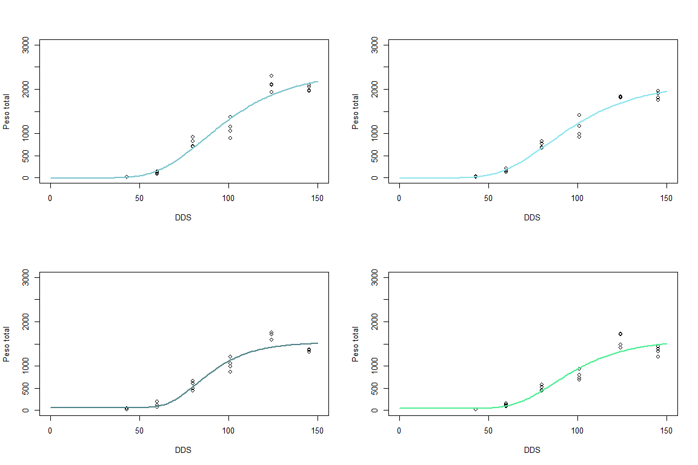<!-- -->

``` r
par(mfrow=c(1,1))

plot(PESO_TOTAL_39~DDS, data=masa_seca_39, xlim=c(0,150), ylim=c(0,3000),
     xlab="DDS", ylab="Peso total (g)")
lines(DDS_LEVELS, Gompertz(DDS_LEVELS, y0_100_39, ymax_100_39, k_100_39, lag_100_39),
      lty=1, col="cadetblue3", lwd = 2)
lines(DDS_LEVELS, Gompertz(DDS_LEVELS, y0_66_39, ymax_66_39, k_66_39, lag_66_39),
      lty=1, col="cadetblue2", lwd = 2)
lines(DDS_LEVELS, Gompertz(DDS_LEVELS, y0_33_39, ymax_33_39, k_33_39, lag_33_39),
      lty=1, col="cadetblue4", lwd = 2)
lines(DDS_LEVELS, Gompertz(DDS_LEVELS, y0_0_39, ymax_0_39, k_0_39, lag_0_39),
      lty=1, col="seagreen2", lwd = 2)
legend("topleft", legend=c("100% Fertilización", "66% Fertilización", "33% Fertilización", "0% Fertilización"), lwd = 3, col = c("cadetblue3","cadetblue2","cadetblue4","seagreen2"))
```

<!-- -->

``` r
pesos_savia_100_39 <- Gompertz(c(36,45,53,61,70,78,84,91,98,105,115),y0_100_39,ymax_100_39,k_100_39,lag_100_39)
DDS_100_39 <- c(36,45,53,61,70,78,84,91,98,105,115)
TRATAMIENTO_100_39 <- rep("100% Fertilización",11)
Tabla_pesos_savia_100_39 <- data.frame(pesos_savia_100_39,DDS_100_39,TRATAMIENTO_100_39)
Tabla_pesos_savia_100_39
```

    ##    pesos_savia_100_39 DDS_100_39 TRATAMIENTO_100_39
    ## 1          -0.1428543         36 100% Fertilización
    ## 2          18.7542208         45 100% Fertilización
    ## 3          71.0799227         53 100% Fertilización
    ## 4         179.1064577         61 100% Fertilización
    ## 5         376.8636375         70 100% Fertilización
    ## 6         607.7237456         78 100% Fertilización
    ## 7         799.9629919         84 100% Fertilización
    ## 8        1028.6597073         91 100% Fertilización
    ## 9        1248.2202203         98 100% Fertilización
    ## 10       1448.6200148        105 100% Fertilización
    ## 11       1691.9380392        115 100% Fertilización

``` r
pesos_savia_66_39 <- Gompertz(c(36,45,53,61,70,78,84,91,98,105,115),y0_66_39,ymax_66_39,k_66_39,lag_66_39)
DDS_66_39 <- c(36,45,53,61,70,78,84,91,98,105,115)
TRATAMIENTO_66_39 <- rep("66% Fertilización",11)
Tabla_pesos_savia_66_39 <- data.frame(pesos_savia_66_39,DDS_66_39,TRATAMIENTO_66_39)
Tabla_pesos_savia_66_39
```

    ##    pesos_savia_66_39 DDS_66_39 TRATAMIENTO_66_39
    ## 1           1.591339        36 66% Fertilización
    ## 2          29.099953        45 66% Fertilización
    ## 3          92.601063        53 66% Fertilización
    ## 4         208.433519        61 66% Fertilización
    ## 5         401.877776        70 66% Fertilización
    ## 6         614.162484        78 66% Fertilización
    ## 7         784.813714        84 66% Fertilización
    ## 8         983.236115        91 66% Fertilización
    ## 9        1170.528075        98 66% Fertilización
    ## 10       1339.618095       105 66% Fertilización
    ## 11       1543.450806       115 66% Fertilización

``` r
pesos_savia_33_39 <- Gompertz(c(36,45,53,61,70,78,84,91,98,105,115),y0_33_39,ymax_33_39,k_33_39,lag_33_39)
DDS_33_39 <- c(36,45,53,61,70,78,84,91,98,105,115)
TRATAMIENTO_33_39 <- rep("33% Fertilización",11)
Tabla_pesos_savia_33_39 <- data.frame(pesos_savia_33_39,DDS_33_39,TRATAMIENTO_33_39)
Tabla_pesos_savia_33_39
```

    ##    pesos_savia_33_39 DDS_33_39 TRATAMIENTO_33_39
    ## 1           59.90550        36 33% Fertilización
    ## 2           60.00908        45 33% Fertilización
    ## 3           64.05024        53 33% Fertilización
    ## 4           99.83936        61 33% Fertilización
    ## 5          242.91105        70 33% Fertilización
    ## 6          468.84052        78 33% Fertilización
    ## 7          665.07134        84 33% Fertilización
    ## 8          883.64050        91 33% Fertilización
    ## 9         1067.30697        98 33% Fertilización
    ## 10        1208.75965       105 33% Fertilización
    ## 11        1345.82126       115 33% Fertilización

``` r
pesos_savia_0_39 <- Gompertz(c(36,45,53,61,70,78,84,91,98,105,115),y0_0_39,ymax_0_39,k_0_39,lag_0_39)
DDS_0_39 <- c(36,45,53,61,70,78,84,91,98,105,115)
TRATAMIENTO_0_39 <- rep("0% Fertilización",11)
Tabla_pesos_savia_0_39 <- data.frame(pesos_savia_0_39,DDS_0_39,TRATAMIENTO_0_39)
Tabla_pesos_savia_0_39
```

    ##    pesos_savia_0_39 DDS_0_39 TRATAMIENTO_0_39
    ## 1          42.13947       36 0% Fertilización
    ## 2          44.23686       45 0% Fertilización
    ## 3          58.02055       53 0% Fertilización
    ## 4         105.96620       61 0% Fertilización
    ## 5         227.29861       70 0% Fertilización
    ## 6         394.48995       78 0% Fertilización
    ## 7         542.52947       84 0% Fertilización
    ## 8         721.21251       91 0% Fertilización
    ## 9         890.43157       98 0% Fertilización
    ## 10       1039.74334      105 0% Fertilización
    ## 11       1210.96189      115 0% Fertilización

## VARIEDAD 102

``` r
masa_seca_102 <- datos_masa_seca %>% 
  filter(VARIEDAD=="102")%>%
  group_by(DDS,TRATAMIENTO.)%>%
  summarise(PESO_TOTAL_102=mean(PESO_TOTAL,na.rm = T),
            DDS_102=DDS,
            TRATAMIENTO_102=TRATAMIENTO.)

ggplot() + geom_point(data=masa_seca_102, aes(x=DDS, y = PESO_TOTAL_102, group = TRATAMIENTO., colour = TRATAMIENTO.)) + 
  xlab("DDS") + 
  ylab("PESO TOTAL") + 
  ylim(c(0,3000)) +
  ggtitle("") +
  tema
```

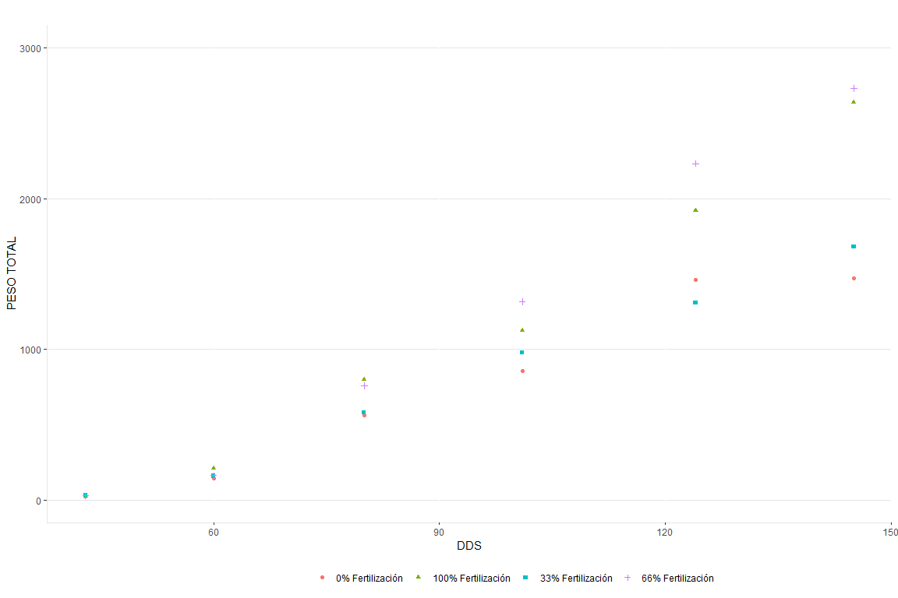<!-- -->

``` r
Gompertz <- function(x, y0, ymax, k, lag){
  result<- y0 + ymax*exp(-exp(k*(lag-x)/(ymax-y0) + 1))
  return(result)
}

Cuadratica <- function(x,y0,a){
  result<- (y0 + a*x^3)
  return(result)
}

masa_seca_100_102 <- datos_masa_seca %>%
  filter(VARIEDAD =="102",TRATAMIENTO.=="100% Fertilización")%>%
  group_by(DDS, TRATAMIENTO.)%>%
  summarise(PESO_TOTAL_100_102=PESO_TOTAL,
            DDS_100_102=DDS,
            TRATAMIENTO_102=TRATAMIENTO.)

Cuad_100_102 <- nls(PESO_TOTAL_100_102~Cuadratica(DDS_100_102,y0,a),
             data=masa_seca_100_102,
             start = list(y0=0,a=1))

masa_seca_66_102 <- datos_masa_seca %>%
  filter(VARIEDAD =="102",TRATAMIENTO.=="66% Fertilización")%>%
  group_by(DDS, TRATAMIENTO.)%>%
  summarise(PESO_TOTAL_66_102=PESO_TOTAL,
            DDS_66_102=DDS,
            TRATAMIENTO=TRATAMIENTO.)

Gomp_66_102 <- nls(PESO_TOTAL_66_102 ~ Gompertz(DDS_66_102, y0, ymax, k, lag),
             data=masa_seca_66_102,
             start = list(y0=20, ymax=3000, k=15, lag=1))

masa_seca_33_102 <- datos_masa_seca %>%
  filter(VARIEDAD =="102",TRATAMIENTO.=="33% Fertilización")%>%
  group_by(DDS, TRATAMIENTO.)%>%
  summarise(PESO_TOTAL_33_102=PESO_TOTAL,
            DDS_33_102=DDS,
            TRATAMIENTO_102=TRATAMIENTO.)

Gomp_33_102 <- nls(PESO_TOTAL_33_102 ~ Gompertz(DDS_33_102, y0, ymax, k, lag),
             data=masa_seca_33_102,
             start = list(y0=0, ymax=2200, k=15, lag=1))

masa_seca_0_102 <- datos_masa_seca %>%
  filter(VARIEDAD =="102",TRATAMIENTO.=="0% Fertilización")%>%
  group_by(DDS, TRATAMIENTO.)%>%
  summarise(PESO_TOTAL_0_102=PESO_TOTAL,
            DDS_0_102=DDS,
            TRATAMIENTO_102=TRATAMIENTO.)

Gomp_0_102 <- nls(PESO_TOTAL_0_102 ~ Gompertz(DDS_0_102, y0, ymax, k, lag),
             data=masa_seca_0_102,
             start = list(y0=20, ymax=1700, k=10, lag=1))
```

``` r
coefs_100_102 <- coef(Cuad_100_102)
y0_100_102 = coefs_100_102[1]
a_100_102=coefs_100_102[2]

coefs_100_102
```

    ##           y0            a 
    ## 1.396666e+02 8.650325e-04

``` r
coefs_66_102 <- coef(Gomp_66_102)
y0_66_102 = coefs_66_102[1]
ymax_66_102=coefs_66_102[2]
k_66_102=coefs_66_102[3]
lag_66_102=coefs_66_102[4]

coefs_66_102
```

    ##         y0       ymax          k        lag 
    ##  -45.17498 3912.93466   97.88158   60.50751

``` r
coefs_33_102 <- coef(Gomp_33_102)
y0_33_102 = coefs_33_102[1]
ymax_33_102=coefs_33_102[2]
k_33_102=coefs_33_102[3]
lag_33_102=coefs_33_102[4]

coefs_33_102
```

    ##         y0       ymax          k        lag 
    ## -125.14429 2446.64138   55.65718   45.63894

``` r
coefs_0_102 <- coef(Gomp_0_102)
y0_0_102 = coefs_0_102[1]
ymax_0_102=coefs_0_102[2]
k_0_102=coefs_0_102[3]
lag_0_102=coefs_0_102[4]

coefs_0_102
```

    ##         y0       ymax          k        lag 
    ##   10.36070 1723.15044   60.21911   57.65603

``` r
summary(Cuad_100_102)
```

    ## 
    ## Formula: PESO_TOTAL_100_102 ~ Cuadratica(DDS_100_102, y0, a)
    ## 
    ## Parameters:
    ##     Estimate Std. Error t value Pr(>|t|)    
    ## y0 1.397e+02  6.941e+01   2.012   0.0566 .  
    ## a  8.650e-04  4.495e-05  19.244 2.98e-15 ***
    ## ---
    ## Signif. codes:  0 '***' 0.001 '**' 0.01 '*' 0.05 '.' 0.1 ' ' 1
    ## 
    ## Residual standard error: 231.2 on 22 degrees of freedom
    ## 
    ## Number of iterations to convergence: 1 
    ## Achieved convergence tolerance: 3.037e-08

``` r
summary(Gomp_66_102)
```

    ## 
    ## Formula: PESO_TOTAL_66_102 ~ Gompertz(DDS_66_102, y0, ymax, k, lag)
    ## 
    ## Parameters:
    ##      Estimate Std. Error t value Pr(>|t|)    
    ## y0    -45.175    122.627  -0.368    0.716    
    ## ymax 3912.935    691.082   5.662 1.53e-05 ***
    ## k      97.882      5.665  17.278 1.73e-13 ***
    ## lag    60.508      5.834  10.371 1.71e-09 ***
    ## ---
    ## Signif. codes:  0 '***' 0.001 '**' 0.01 '*' 0.05 '.' 0.1 ' ' 1
    ## 
    ## Residual standard error: 146.9 on 20 degrees of freedom
    ## 
    ## Number of iterations to convergence: 11 
    ## Achieved convergence tolerance: 1.425e-06

``` r
summary(Gomp_33_102)
```

    ## 
    ## Formula: PESO_TOTAL_33_102 ~ Gompertz(DDS_33_102, y0, ymax, k, lag)
    ## 
    ## Parameters:
    ##      Estimate Std. Error t value Pr(>|t|)    
    ## y0   -125.144    234.405  -0.534  0.59931    
    ## ymax 2446.641    782.804   3.125  0.00533 ** 
    ## k      55.657      4.251  13.093 2.87e-11 ***
    ## lag    45.639     16.969   2.689  0.01410 *  
    ## ---
    ## Signif. codes:  0 '***' 0.001 '**' 0.01 '*' 0.05 '.' 0.1 ' ' 1
    ## 
    ## Residual standard error: 124 on 20 degrees of freedom
    ## 
    ## Number of iterations to convergence: 9 
    ## Achieved convergence tolerance: 1.519e-06

``` r
summary(Gomp_0_102)
```

    ## 
    ## Formula: PESO_TOTAL_0_102 ~ Gompertz(DDS_0_102, y0, ymax, k, lag)
    ## 
    ## Parameters:
    ##      Estimate Std. Error t value Pr(>|t|)    
    ## y0     10.361    115.423   0.090    0.929    
    ## ymax 1723.150    316.399   5.446 2.49e-05 ***
    ## k      60.219      9.651   6.240 4.29e-06 ***
    ## lag    57.656      9.890   5.829 1.06e-05 ***
    ## ---
    ## Signif. codes:  0 '***' 0.001 '**' 0.01 '*' 0.05 '.' 0.1 ' ' 1
    ## 
    ## Residual standard error: 173.5 on 20 degrees of freedom
    ## 
    ## Number of iterations to convergence: 13 
    ## Achieved convergence tolerance: 5.035e-06

``` r
DDS_LEVELS <- seq(0,150,by=1)

par(mfrow=c(2,2))

pred <- predict(Cuad_100_102, list(x = DDS_LEVELS))
plot(PESO_TOTAL_100_102~DDS_100_102, data=masa_seca_100_102, xlim=c(0,150), ylim=c(0,3000),
     xlab="DDS", ylab="Peso total")
lines(DDS_LEVELS, Cuadratica(DDS_LEVELS, y0_100_102, a_100_102),
      lty=1, col="cadetblue3", lwd=2)

pred <- predict(Gomp_66_102, list(x=DDS_LEVELS))
plot(PESO_TOTAL_66_102~DDS_66_102, data=masa_seca_66_102, xlim=c(0,150), ylim=c(0,3000),
     xlab="DDS", ylab="Peso total")
lines(DDS_LEVELS, Gompertz(DDS_LEVELS, y0_66_102, ymax_66_102, k_66_102, lag_66_102),
      lty=1, col="cadetblue2")

pred <- predict(Gomp_33_102, list(x=DDS_LEVELS))
plot(PESO_TOTAL_33_102~DDS_33_102, data=masa_seca_33_102, xlim=c(0,150), ylim=c(0,3000),
     xlab="DDS", ylab="Peso total")
lines(DDS_LEVELS, Gompertz(DDS_LEVELS, y0_33_102, ymax_33_102, k_33_102, lag_33_102),
      lty=1, col="cadetblue4")

pred <- predict(Gomp_0_102, list(x=DDS_LEVELS))
plot(PESO_TOTAL_0_102~DDS_0_102, data=masa_seca_0_102, xlim=c(0,150), ylim=c(0,3000),
     xlab="DDS", ylab="Peso total")
lines(DDS_LEVELS, Gompertz(DDS_LEVELS, y0_0_102, ymax_0_102, k_0_102, lag_0_102),
      lty=1, col="seagreen2")
```

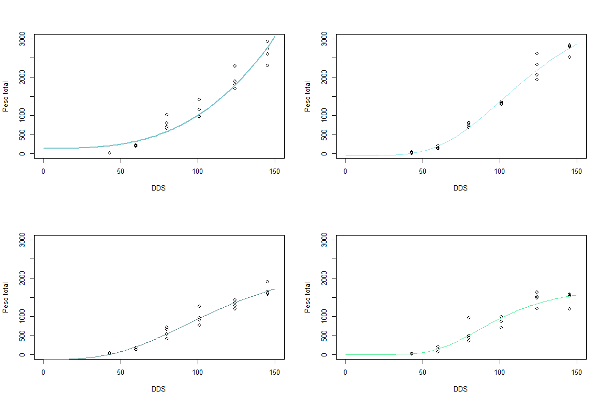<!-- -->

``` r
par(mfrow=c(1,1))

plot(PESO_TOTAL_102~DDS, data=masa_seca_102, xlim=c(0,150), ylim=c(0,3000),
     xlab="DDS", ylab="Peso total (g)")
lines(DDS_LEVELS, Cuadratica(DDS_LEVELS, y0_100_102, a_100_102),
      lty=1, col="cadetblue3", lwd=2)
lines(DDS_LEVELS, Gompertz(DDS_LEVELS, y0_66_102, ymax_66_102, k_66_102, lag_66_102),
      lty=1, col="cadetblue2", lwd = 2)
lines(DDS_LEVELS, Gompertz(DDS_LEVELS, y0_33_102, ymax_33_102, k_33_102, lag_33_102),
      lty=1, col="cadetblue4", lwd = 2)
lines(DDS_LEVELS, Gompertz(DDS_LEVELS, y0_0_102, ymax_0_102, k_0_102, lag_0_102),
      lty=1, col="seagreen2", lwd = 2)
legend("topleft", legend=c("100% Fertilización", "66% Fertilización", "33% Fertilización", "0% Fertilización"), lwd = 3, col = c("cadetblue3","cadetblue2","cadetblue4","seagreen2"))
```

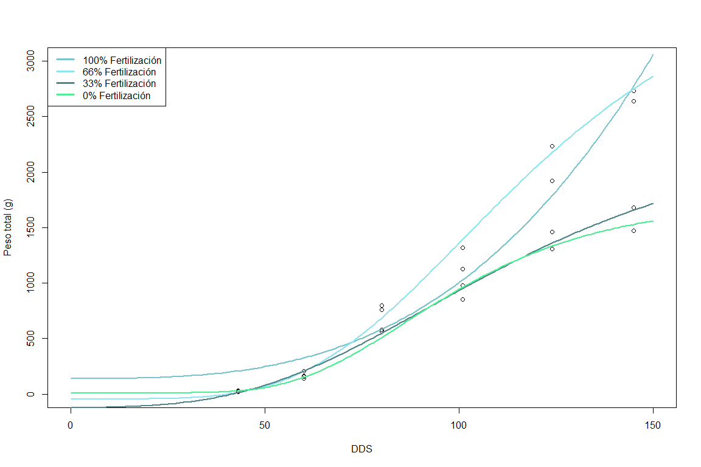<!-- -->

``` r
pesos_savia_100_102 <- Cuadratica(c(36,45,53,61,70,78,84,91,98,105,115),y0_100_102,a_100_102)
DDS_100_102 <- c(36,45,53,61,70,78,84,91,98,105,115)
TRATAMIENTO_100_102 <- rep("100% Fertilización",11)
Tabla_pesos_savia_100_102 <- data.frame(pesos_savia_100_102,DDS_100_102,TRATAMIENTO_100_102)
Tabla_pesos_savia_100_102
```

    ##    pesos_savia_100_102 DDS_100_102 TRATAMIENTO_100_102
    ## 1             180.0256          36  100% Fertilización
    ## 2             218.4927          45  100% Fertilización
    ## 3             268.4501          53  100% Fertilización
    ## 4             336.0126          61  100% Fertilización
    ## 5             436.3728          70  100% Fertilización
    ## 6             550.1695          78  100% Fertilización
    ## 7             652.3749          84  100% Fertilización
    ## 8             791.5300          91  100% Fertilización
    ## 9             953.8283          98  100% Fertilización
    ## 10           1141.0499         105  100% Fertilización
    ## 11           1455.2730         115  100% Fertilización

``` r
pesos_savia_66_102 <- Gompertz(c(36,45,53,61,70,78,84,91,98,105,115),y0_66_102,ymax_66_102,k_66_102,lag_66_102)
DDS_66_102 <- c(36,45,53,61,70,78,84,91,98,105,115)
TRATAMIENTO_66_102 <- rep("66% Fertilización",11)
Tabla_pesos_savia_66_102 <- data.frame(pesos_savia_66_102,DDS_66_102,TRATAMIENTO_66_102)
Tabla_pesos_savia_66_102
```

    ##    pesos_savia_66_102 DDS_66_102 TRATAMIENTO_66_102
    ## 1           -18.36093         36  66% Fertilización
    ## 2            27.29990         45  66% Fertilización
    ## 3           103.12089         53  66% Fertilización
    ## 4           221.66948         61  66% Fertilización
    ## 5           410.82682         70  66% Fertilización
    ## 6           625.52981         78  66% Fertilización
    ## 7           810.19444         84  66% Fertilización
    ## 8          1044.04849         91  66% Fertilización
    ## 9          1289.56362         98  66% Fertilización
    ## 10         1538.41722        105  66% Fertilización
    ## 11         1885.52322        115  66% Fertilización

``` r
pesos_savia_33_102 <- Gompertz(c(36,45,53,61,70,78,84,91,98,105,115),y0_33_102,ymax_33_102,k_33_102,lag_33_102)
DDS_33_102 <- c(36,45,53,61,70,78,84,91,98,105,115)
TRATAMIENTO_33_102 <- rep("33% Fertilización",11)
Tabla_pesos_savia_33_102 <- data.frame(pesos_savia_33_102,DDS_33_102,TRATAMIENTO_33_102)
Tabla_pesos_savia_33_102
```

    ##    pesos_savia_33_102 DDS_33_102 TRATAMIENTO_33_102
    ## 1           -39.20201         36  33% Fertilización
    ## 2            30.30834         45  33% Fertilización
    ## 3           115.78214         53  33% Fertilización
    ## 4           223.12919         61  33% Fertilización
    ## 5           366.62264         70  33% Fertilización
    ## 6           509.50459         78  33% Fertilización
    ## 7           622.84645         84  33% Fertilización
    ## 8           758.43565         91  33% Fertilización
    ## 9           894.44442         98  33% Fertilización
    ## 10         1027.94633        105  33% Fertilización
    ## 11         1209.72932        115  33% Fertilización

``` r
pesos_savia_0_102 <- Gompertz(c(36,45,53,61,70,78,84,91,98,105,115),y0_0_102,ymax_0_102,k_0_102,lag_0_102)
DDS_0_102 <- c(36,45,53,61,70,78,84,91,98,105,115)
TRATAMIENTO_0_102 <- rep("0% Fertilización",11)
Tabla_pesos_savia_0_102 <- data.frame(pesos_savia_0_102,DDS_0_102,TRATAMIENTO_0_102)
Tabla_pesos_savia_0_102
```

    ##    pesos_savia_0_102 DDS_0_102 TRATAMIENTO_0_102
    ## 1           15.47156        36  0% Fertilización
    ## 2           35.14470        45  0% Fertilización
    ## 3           80.47700        53  0% Fertilización
    ## 4          164.08212        61  0% Fertilización
    ## 5          306.45962        70  0% Fertilización
    ## 6          466.36300        78  0% Fertilización
    ## 7          597.54201        84  0% Fertilización
    ## 8          752.99450        91  0% Fertilización
    ## 9          902.68763        98  0% Fertilización
    ## 10        1040.45009       105  0% Fertilización
    ## 11        1210.16723       115  0% Fertilización

# 3) PESO SECO V.S. CONTENIDO EN SAVIA

En este apartado, se realizará el modelamiento del comportamiento de
nutientes en sabia, de acuerdo con los datos obtenidos a partir del
modelo de gompertz para la acumulación de masa seca. Igualmente, se
realiza independiente para cada elemento y variedad, con el fin de tener
claridad sobre la información.

## NO3

### CPI 1

Iniciamos generando los dataframes requeridos, concatenando la
infromación ya modelada a partir de la función de gompertz, con los
datos preexistentes sobre contenido en savia.

``` r
mccain_savia_0_1 <- mccain_savia %>%
  filter(Variedad =="CIP 1", Tratamiento =="0% Fertilización")%>%
  group_by(DDS,Variedad,Tratamiento)%>%
  summarise(NO3 = mean(NO3, na.rm=T))

Tabla_0_1 <- cbind(mccain_savia_0_1$Variedad,Tabla_pesos_savia_0_1, mccain_savia_0_1$NO3)
colnames(Tabla_0_1) <- c('Variedad','Peso','DDS','Tratamiento','NO3')

mccain_savia_33_1 <- mccain_savia %>%
  filter(Variedad =="CIP 1", Tratamiento =="33% Fertilización")%>%
  group_by(DDS,Variedad,Tratamiento)%>%
  summarise(NO3 = mean(NO3, na.rm=T))

Tabla_33_1 <- cbind(mccain_savia_33_1$Variedad,Tabla_pesos_savia_33_1, mccain_savia_33_1$NO3)
colnames(Tabla_33_1) <- c('Variedad','Peso','DDS','Tratamiento','NO3')

mccain_savia_66_1 <- mccain_savia %>%
  filter(Variedad =="CIP 1", Tratamiento =="66% Fertilización")%>%
  group_by(DDS,Variedad,Tratamiento)%>%
  summarise(NO3 = mean(NO3, na.rm=T))

Tabla_66_1 <- cbind(mccain_savia_66_1$Variedad,Tabla_pesos_savia_66_1, mccain_savia_66_1$NO3)
colnames(Tabla_66_1) <- c('Variedad','Peso','DDS','Tratamiento','NO3')

mccain_savia_100_1 <- mccain_savia %>%
  filter(Variedad =="CIP 1", Tratamiento =="100% Fertilización")%>%
  group_by(DDS,Variedad,Tratamiento)%>%
  summarise(NO3 = mean(NO3, na.rm=T))

Tabla_100_1 <- cbind(mccain_savia_100_1$Variedad,Tabla_pesos_savia_100_1, mccain_savia_100_1$NO3)
colnames(Tabla_100_1) <- c('Variedad','Peso','DDS','Tratamiento','NO3')

Tabla_1 <- rbind(Tabla_0_1,Tabla_33_1, Tabla_66_1, Tabla_100_1)

head(Tabla_1)
```

    ##   Variedad      Peso DDS      Tratamiento      NO3
    ## 1    CIP 1  11.63301  36 0% Fertilización 9900.000
    ## 2    CIP 1  29.33399  45 0% Fertilización 4483.333
    ## 3    CIP 1  78.23070  53 0% Fertilización 6450.000
    ## 4    CIP 1 174.60043  61 0% Fertilización 5841.667
    ## 5    CIP 1 338.34740  70 0% Fertilización 6583.333
    ## 6    CIP 1 514.08931  78 0% Fertilización 6008.333

### CIP 39

``` r
mccain_savia_0_39 <- mccain_savia %>%
  filter(Variedad =="CIP 39", Tratamiento =="0% Fertilización")%>%
  group_by(DDS,Variedad,Tratamiento)%>%
  summarise(NO3 = mean(NO3, na.rm=T))

Tabla_0_39 <- cbind(mccain_savia_0_39$Variedad,Tabla_pesos_savia_0_39, mccain_savia_0_39$NO3)
colnames(Tabla_0_39) <- c('Variedad','Peso','DDS','Tratamiento','NO3')

mccain_savia_33_39 <- mccain_savia %>%
  filter(Variedad =="CIP 39", Tratamiento =="33% Fertilización")%>%
  group_by(DDS,Variedad,Tratamiento)%>%
  summarise(NO3 = mean(NO3, na.rm=T))

Tabla_33_39 <- cbind(mccain_savia_33_39$Variedad,Tabla_pesos_savia_33_39, mccain_savia_33_39$NO3)
colnames(Tabla_33_39) <- c('Variedad','Peso','DDS','Tratamiento','NO3')

mccain_savia_66_39 <- mccain_savia %>%
  filter(Variedad =="CIP 39", Tratamiento =="66% Fertilización")%>%
  group_by(DDS,Variedad,Tratamiento)%>%
  summarise(NO3 = mean(NO3, na.rm=T))

Tabla_66_39 <- cbind(mccain_savia_66_39$Variedad,Tabla_pesos_savia_66_39, mccain_savia_66_39$NO3)
colnames(Tabla_66_39) <- c('Variedad','Peso','DDS','Tratamiento','NO3')

mccain_savia_100_39 <- mccain_savia %>%
  filter(Variedad =="CIP 39", Tratamiento =="100% Fertilización")%>%
  group_by(DDS,Variedad,Tratamiento)%>%
  summarise(NO3 = mean(NO3, na.rm=T))

Tabla_100_39 <- cbind(mccain_savia_100_39$Variedad,Tabla_pesos_savia_100_39, mccain_savia_100_39$NO3)
colnames(Tabla_100_39) <- c('Variedad','Peso','DDS','Tratamiento','NO3')

Tabla_39 <- rbind(Tabla_0_39,Tabla_33_39, Tabla_66_39, Tabla_100_39)

head(Tabla_39)
```

    ##   Variedad      Peso DDS      Tratamiento      NO3
    ## 1   CIP 39  42.13947  36 0% Fertilización 9825.000
    ## 2   CIP 39  44.23686  45 0% Fertilización 8166.667
    ## 3   CIP 39  58.02055  53 0% Fertilización 8325.000
    ## 4   CIP 39 105.96620  61 0% Fertilización 8125.000
    ## 5   CIP 39 227.29861  70 0% Fertilización 6316.667
    ## 6   CIP 39 394.48995  78 0% Fertilización 7858.333

### CIP 102

``` r
mccain_savia_0_102 <- mccain_savia %>%
  filter(Variedad =="CIP 102", Tratamiento =="0% Fertilización")%>%
  group_by(DDS,Variedad,Tratamiento)%>%
  summarise(NO3 = mean(NO3, na.rm=T))

Tabla_0_102 <- cbind(mccain_savia_0_102$Variedad,Tabla_pesos_savia_0_102, mccain_savia_0_102$NO3)
colnames(Tabla_0_102) <- c('Variedad','Peso','DDS','Tratamiento','NO3')

mccain_savia_33_102 <- mccain_savia %>%
  filter(Variedad =="CIP 102", Tratamiento =="33% Fertilización")%>%
  group_by(DDS,Variedad,Tratamiento)%>%
  summarise(NO3 = mean(NO3, na.rm=T))

Tabla_33_102 <- cbind(mccain_savia_33_102$Variedad,Tabla_pesos_savia_33_102, mccain_savia_33_102$NO3)
colnames(Tabla_33_102) <- c('Variedad','Peso','DDS','Tratamiento','NO3')

mccain_savia_66_102 <- mccain_savia %>%
  filter(Variedad =="CIP 102", Tratamiento =="66% Fertilización")%>%
  group_by(DDS,Variedad,Tratamiento)%>%
  summarise(NO3 = mean(NO3, na.rm=T))

Tabla_66_102 <- cbind(mccain_savia_66_102$Variedad,Tabla_pesos_savia_66_102, mccain_savia_66_102$NO3)
colnames(Tabla_66_102) <- c('Variedad','Peso','DDS','Tratamiento','NO3')

mccain_savia_100_102 <- mccain_savia %>%
  filter(Variedad =="CIP 102", Tratamiento =="100% Fertilización")%>%
  group_by(DDS,Variedad,Tratamiento)%>%
  summarise(NO3 = mean(NO3, na.rm=T))

Tabla_100_102 <- cbind(mccain_savia_100_102$Variedad,Tabla_pesos_savia_100_102, mccain_savia_100_102$NO3)
colnames(Tabla_100_102) <- c('Variedad','Peso','DDS','Tratamiento','NO3')

Tabla_102 <- rbind(Tabla_0_102,Tabla_33_102, Tabla_66_102, Tabla_100_102)

head(Tabla_102)
```

    ##   Variedad      Peso DDS      Tratamiento      NO3
    ## 1  CIP 102  15.47156  36 0% Fertilización 9750.000
    ## 2  CIP 102  35.14470  45 0% Fertilización 5816.667
    ## 3  CIP 102  80.47700  53 0% Fertilización 7075.000
    ## 4  CIP 102 164.08212  61 0% Fertilización 6266.667
    ## 5  CIP 102 306.45962  70 0% Fertilización 5491.667
    ## 6  CIP 102 466.36300  78 0% Fertilización 3816.667

Así, ya podemos generar gráficos, presentando información del
comportamiento de nutrientes, y la acumulación de biomasa.

### Gráficos

``` r
NO3CPI1 <-  Tabla_1%>%
  group_by(DDS,Tratamiento)%>%
  summarise(NITRATO=mean(NO3,na.rm=T),
            PESO=Peso,
            TRATAMIENTO=Tratamiento,
            SE=sd(NO3,na.rm=T)/sqrt(length(complete.cases(NO3))))

ggplot(NO3CPI1,aes(x=PESO, y=NITRATO, group = TRATAMIENTO, colour =TRATAMIENTO)) + 
  geom_line(size = 1)  +
  scale_y_continuous(breaks=seq(0,10000,500))+
  scale_x_continuous(breaks=seq(0,2000,200))+
  labs(title="Nitrato en savia", subtitle="Representación gráfica de valores obtenidos mediante modelamiento",caption="Variedad 1", x="Peso seco (g)", y="Contenido de nitrato (ppm)")+
  geom_point( size=2, fill="white") +
  scale_color_manual(values=c("seagreen2","cadetblue3","cadetblue4","cadetblue2"))+
  tema
```

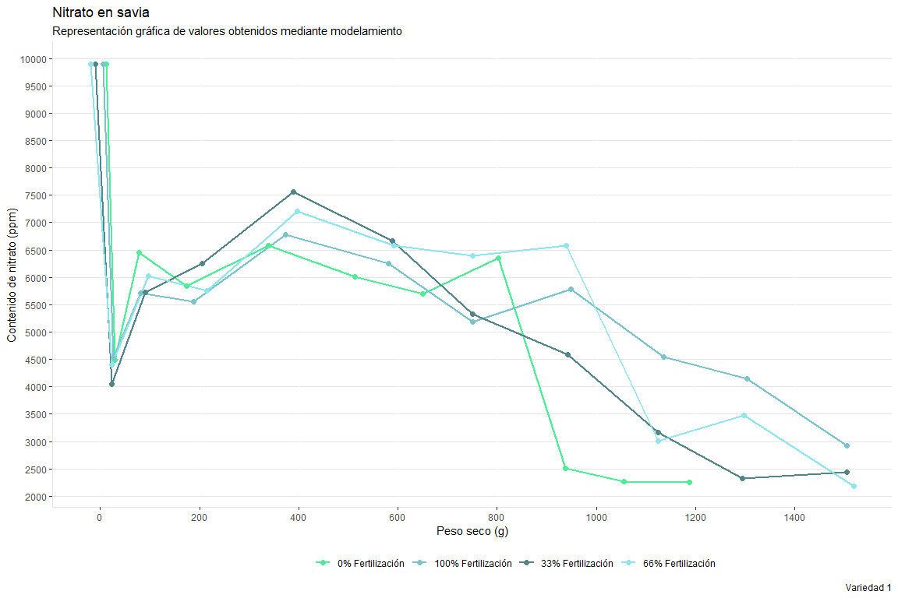<!-- -->

``` r
NO3CPI39 <-  Tabla_39%>%
  group_by(DDS,Tratamiento)%>%
  summarise(NITRATO=mean(NO3,na.rm=T),
            PESO=Peso,
            TRATAMIENTO=Tratamiento,
            SE=sd(NO3,na.rm=T)/sqrt(length(complete.cases(NO3))))

ggplot(NO3CPI39,aes(x=PESO, y=NITRATO, group = TRATAMIENTO, colour =TRATAMIENTO)) + 
  geom_line(size = 1)  +
  scale_y_continuous(breaks=seq(0,10000,500))+
  scale_x_continuous(breaks=seq(0,2000,200))+
  labs(title="Nitrato en savia", subtitle="Representación gráfica de valores obtenidos mediante modelamiento",caption="Variedad 39", x="Peso seco (g)", y="Contenido de nitrato (ppm)")+
  geom_point( size=2, fill="white") +
  scale_color_manual(values=c("seagreen2","cadetblue3","cadetblue4","cadetblue2"))+
  tema
```

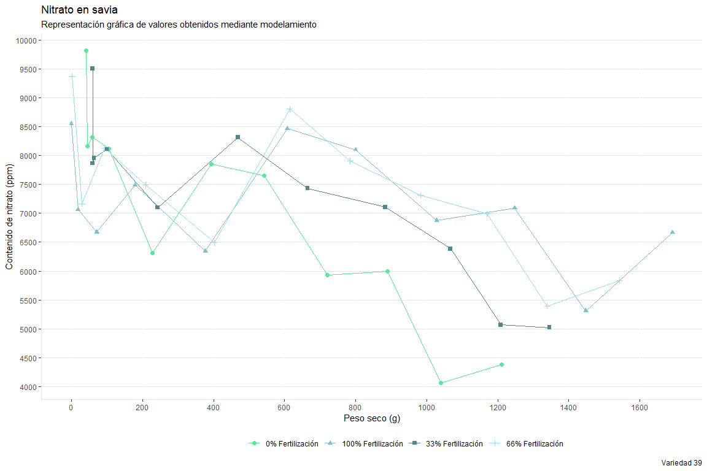<!-- -->

``` r
NO3CPI102 <-  Tabla_102%>%
  group_by(DDS,Tratamiento)%>%
  summarise(NITRATO=mean(NO3,na.rm=T),
            PESO=Peso,
            TRATAMIENTO=Tratamiento,
            SE=sd(NO3,na.rm=T)/sqrt(length(complete.cases(NO3))))

ggplot(NO3CPI102,aes(x=PESO, y=NITRATO, group = TRATAMIENTO, colour =TRATAMIENTO)) + 
  geom_line(size = 1)  +
  scale_y_continuous(breaks=seq(0,10000,500))+
  scale_x_continuous(breaks=seq(0,2000,200))+
  labs(title="Nitrato en savia", subtitle="Representación gráfica de valores obtenidos mediante modelamiento",caption="Variedad 102", x="Peso seco (g)", y="Contenido de nitrato (ppm)")+
  geom_point( size=2, fill="white") +
  scale_color_manual(values=c("seagreen2","cadetblue3","cadetblue4","cadetblue2"))+
  tema
```

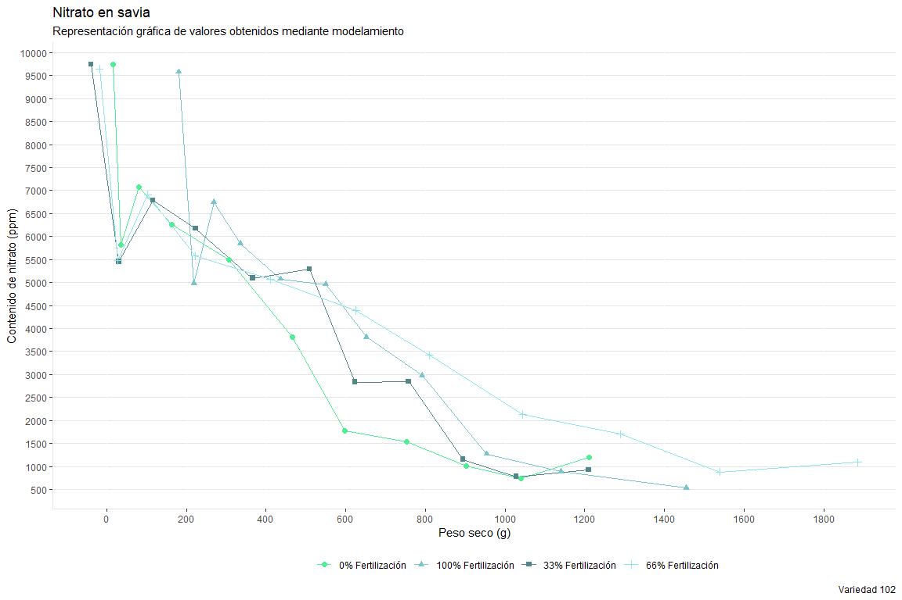<!-- -->

Este procedimiento se realiza para los otros dos nutrientes analizados.

## Ca

### CPI 1

``` r
mccain_savia_0_1 <- mccain_savia %>%
  filter(Variedad =="CIP 1", Tratamiento =="0% Fertilización")%>%
  group_by(DDS,Variedad,Tratamiento)%>%
  summarise(Ca = mean(Ca, na.rm=T))

Tabla_0_1 <- cbind(mccain_savia_0_1$Variedad,Tabla_pesos_savia_0_1, mccain_savia_0_1$Ca)
colnames(Tabla_0_1) <- c('Variedad','Peso','DDS','Tratamiento','Ca')

mccain_savia_33_1 <- mccain_savia %>%
  filter(Variedad =="CIP 1", Tratamiento =="33% Fertilización")%>%
  group_by(DDS,Variedad,Tratamiento)%>%
  summarise(Ca = mean(Ca, na.rm=T))

Tabla_33_1 <- cbind(mccain_savia_33_1$Variedad,Tabla_pesos_savia_33_1, mccain_savia_33_1$Ca)
colnames(Tabla_33_1) <- c('Variedad','Peso','DDS','Tratamiento','Ca')

mccain_savia_66_1 <- mccain_savia %>%
  filter(Variedad =="CIP 1", Tratamiento =="66% Fertilización")%>%
  group_by(DDS,Variedad,Tratamiento)%>%
  summarise(Ca = mean(Ca, na.rm=T))

Tabla_66_1 <- cbind(mccain_savia_66_1$Variedad,Tabla_pesos_savia_66_1, mccain_savia_66_1$Ca)
colnames(Tabla_66_1) <- c('Variedad','Peso','DDS','Tratamiento','Ca')

mccain_savia_100_1 <- mccain_savia %>%
  filter(Variedad =="CIP 1", Tratamiento =="100% Fertilización")%>%
  group_by(DDS,Variedad,Tratamiento)%>%
  summarise(Ca = mean(Ca, na.rm=T))

Tabla_100_1 <- cbind(mccain_savia_100_1$Variedad,Tabla_pesos_savia_100_1, mccain_savia_100_1$Ca)
colnames(Tabla_100_1) <- c('Variedad','Peso','DDS','Tratamiento','Ca')

Tabla_1 <- rbind(Tabla_0_1,Tabla_33_1, Tabla_66_1, Tabla_100_1)

head(Tabla_1)
```

    ##   Variedad      Peso DDS      Tratamiento       Ca
    ## 1    CIP 1  11.63301  36 0% Fertilización 8.833333
    ## 2    CIP 1  29.33399  45 0% Fertilización 4.083333
    ## 3    CIP 1  78.23070  53 0% Fertilización 4.000000
    ## 4    CIP 1 174.60043  61 0% Fertilización 4.000000
    ## 5    CIP 1 338.34740  70 0% Fertilización 4.000000
    ## 6    CIP 1 514.08931  78 0% Fertilización 4.000000

### CIP 39

``` r
mccain_savia_0_39 <- mccain_savia %>%
  filter(Variedad =="CIP 39", Tratamiento =="0% Fertilización")%>%
  group_by(DDS,Variedad,Tratamiento)%>%
  summarise(Ca = mean(Ca, na.rm=T))

Tabla_0_39 <- cbind(mccain_savia_0_39$Variedad,Tabla_pesos_savia_0_39, mccain_savia_0_39$Ca)
colnames(Tabla_0_39) <- c('Variedad','Peso','DDS','Tratamiento','Ca')

mccain_savia_33_39 <- mccain_savia %>%
  filter(Variedad =="CIP 39", Tratamiento =="33% Fertilización")%>%
  group_by(DDS,Variedad,Tratamiento)%>%
  summarise(Ca = mean(Ca, na.rm=T))

Tabla_33_39 <- cbind(mccain_savia_33_39$Variedad,Tabla_pesos_savia_33_39, mccain_savia_33_39$Ca)
colnames(Tabla_33_39) <- c('Variedad','Peso','DDS','Tratamiento','Ca')

mccain_savia_66_39 <- mccain_savia %>%
  filter(Variedad =="CIP 39", Tratamiento =="66% Fertilización")%>%
  group_by(DDS,Variedad,Tratamiento)%>%
  summarise(Ca = mean(Ca, na.rm=T))

Tabla_66_39 <- cbind(mccain_savia_66_39$Variedad,Tabla_pesos_savia_66_39, mccain_savia_66_39$Ca)
colnames(Tabla_66_39) <- c('Variedad','Peso','DDS','Tratamiento','Ca')

mccain_savia_100_39 <- mccain_savia %>%
  filter(Variedad =="CIP 39", Tratamiento =="100% Fertilización")%>%
  group_by(DDS,Variedad,Tratamiento)%>%
  summarise(Ca = mean(Ca, na.rm=T))

Tabla_100_39 <- cbind(mccain_savia_100_39$Variedad,Tabla_pesos_savia_100_39, mccain_savia_100_39$Ca)
colnames(Tabla_100_39) <- c('Variedad','Peso','DDS','Tratamiento','Ca')

Tabla_39 <- rbind(Tabla_0_39,Tabla_33_39, Tabla_66_39, Tabla_100_39)

head(Tabla_39)
```

    ##   Variedad      Peso DDS      Tratamiento        Ca
    ## 1   CIP 39  42.13947  36 0% Fertilización 12.166667
    ## 2   CIP 39  44.23686  45 0% Fertilización  6.416667
    ## 3   CIP 39  58.02055  53 0% Fertilización  4.916667
    ## 4   CIP 39 105.96620  61 0% Fertilización  4.000000
    ## 5   CIP 39 227.29861  70 0% Fertilización  4.000000
    ## 6   CIP 39 394.48995  78 0% Fertilización  4.000000

### CIP 102

``` r
mccain_savia_0_102 <- mccain_savia %>%
  filter(Variedad =="CIP 102", Tratamiento =="0% Fertilización")%>%
  group_by(DDS,Variedad,Tratamiento)%>%
  summarise(Ca = mean(Ca, na.rm=T))

Tabla_0_102 <- cbind(mccain_savia_0_102$Variedad,Tabla_pesos_savia_0_102, mccain_savia_0_102$Ca)
colnames(Tabla_0_102) <- c('Variedad','Peso','DDS','Tratamiento','Ca')

mccain_savia_33_102 <- mccain_savia %>%
  filter(Variedad =="CIP 102", Tratamiento =="33% Fertilización")%>%
  group_by(DDS,Variedad,Tratamiento)%>%
  summarise(Ca = mean(Ca, na.rm=T))

Tabla_33_102 <- cbind(mccain_savia_33_102$Variedad,Tabla_pesos_savia_33_102, mccain_savia_33_102$Ca)
colnames(Tabla_33_102) <- c('Variedad','Peso','DDS','Tratamiento','Ca')

mccain_savia_66_102 <- mccain_savia %>%
  filter(Variedad =="CIP 102", Tratamiento =="66% Fertilización")%>%
  group_by(DDS,Variedad,Tratamiento)%>%
  summarise(Ca = mean(Ca, na.rm=T))

Tabla_66_102 <- cbind(mccain_savia_66_102$Variedad,Tabla_pesos_savia_66_102, mccain_savia_66_102$Ca)
colnames(Tabla_66_102) <- c('Variedad','Peso','DDS','Tratamiento','Ca')

mccain_savia_100_102 <- mccain_savia %>%
  filter(Variedad =="CIP 102", Tratamiento =="100% Fertilización")%>%
  group_by(DDS,Variedad,Tratamiento)%>%
  summarise(Ca = mean(Ca, na.rm=T))

Tabla_100_102 <- cbind(mccain_savia_100_102$Variedad,Tabla_pesos_savia_100_102, mccain_savia_100_102$Ca)
colnames(Tabla_100_102) <- c('Variedad','Peso','DDS','Tratamiento','Ca')

Tabla_102 <- rbind(Tabla_0_102,Tabla_33_102, Tabla_66_102, Tabla_100_102)

head(Tabla_102)
```

    ##   Variedad      Peso DDS      Tratamiento Ca
    ## 1  CIP 102  15.47156  36 0% Fertilización  4
    ## 2  CIP 102  35.14470  45 0% Fertilización  4
    ## 3  CIP 102  80.47700  53 0% Fertilización  4
    ## 4  CIP 102 164.08212  61 0% Fertilización  4
    ## 5  CIP 102 306.45962  70 0% Fertilización  4
    ## 6  CIP 102 466.36300  78 0% Fertilización  4

### Gráficos

``` r
CaCPI1 <-  Tabla_1%>%
  group_by(DDS,Tratamiento)%>%
  summarise(CALCIO=mean(Ca,na.rm=T),
            PESO=Peso,
            TRATAMIENTO=Tratamiento,
            SE=sd(Ca,na.rm=T)/sqrt(length(complete.cases(Ca))))

ggplot(CaCPI1,aes(x=PESO, y=CALCIO, group = TRATAMIENTO, colour =TRATAMIENTO)) + 
  labs(title="Calcio en savia", subtitle="Representación gráfica de valores obtenidos mediante modelamiento",caption="Variedad 1", x="Peso seco (g)", y="Contenido de calcio (ppm)")+
  geom_line(size = 1)  +
  scale_y_continuous(breaks=seq(0,20,1))+
  scale_x_continuous(breaks=seq(0,2000,200))+
  geom_point( size=2, fill="white") +
  scale_color_manual(values=c("seagreen2","cadetblue3","cadetblue4","cadetblue2"))+
  tema
```

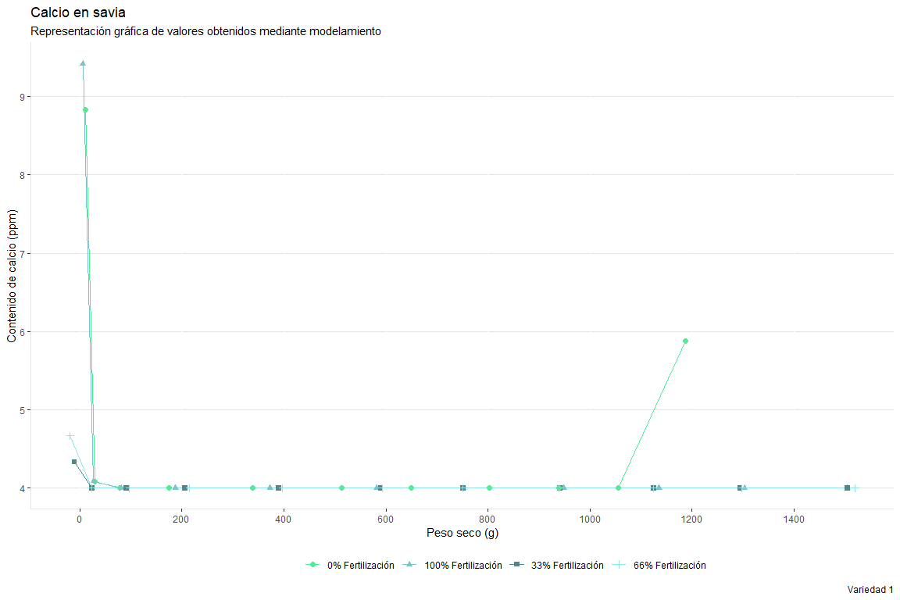<!-- -->

``` r
CaCPI39 <-  Tabla_39%>%
  group_by(DDS,Tratamiento)%>%
  summarise(CALCIO=mean(Ca,na.rm=T),
            PESO=Peso,
            TRATAMIENTO=Tratamiento,
            SE=sd(Ca,na.rm=T)/sqrt(length(complete.cases(Ca))))

ggplot(CaCPI39,aes(x=PESO, y=CALCIO, group = TRATAMIENTO, colour =TRATAMIENTO)) + 
  labs(title="Calcio en savia", subtitle="Representación gráfica de valores obtenidos mediante modelamiento",caption="Variedad 39", x="Peso seco (g)", y="Contenido de calcio (ppm)")+
  geom_line(size = 1)  +
  scale_y_continuous(breaks=seq(0,20,2))+
  scale_x_continuous(breaks=seq(0,152000,200))+
  geom_point( size=2, fill="white") +
  scale_color_manual(values=c("seagreen2","cadetblue3","cadetblue4","cadetblue2"))+
  tema
```

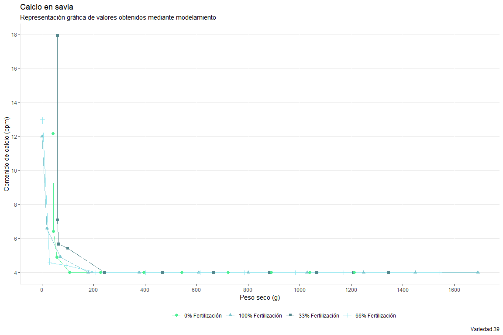<!-- -->

``` r
CaCPI102 <-  Tabla_102%>%
  group_by(DDS,Tratamiento)%>%
  summarise(CALCIO=mean(Ca,na.rm=T),
            PESO=Peso,
            TRATAMIENTO=Tratamiento,
            SE=sd(Ca,na.rm=T)/sqrt(length(complete.cases(Ca))))

ggplot(CaCPI102,aes(x=PESO, y=CALCIO, group = TRATAMIENTO, colour =TRATAMIENTO)) + 
  geom_line(size = 1)  +
  scale_y_continuous(breaks=seq(0,5,0.01))+
  scale_x_continuous(breaks=seq(0,2000,200))+
  labs(title="Calcio en savia", subtitle="Representación gráfica de valores obtenidos mediante modelamiento",caption="Variedad 102", x="Peso seco (g)", y="Contenido de calcio (ppm)")+
  geom_point( size=2, fill="white") +
  scale_color_manual(values=c("seagreen2","cadetblue3","cadetblue4","cadetblue2"))+
  tema
```

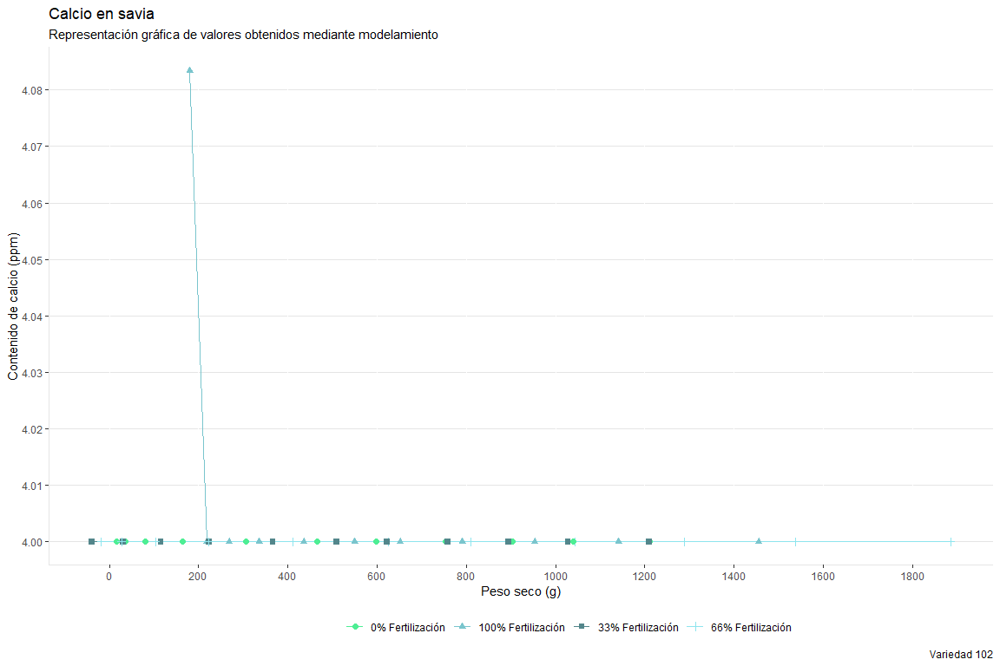<!-- -->

## K

### CPI 1

``` r
mccain_savia_0_1 <- mccain_savia %>%
  filter(Variedad =="CIP 1", Tratamiento =="0% Fertilización")%>%
  group_by(DDS,Variedad,Tratamiento)%>%
  summarise(K = mean(K, na.rm=T))

Tabla_0_1 <- cbind(mccain_savia_0_1$Variedad,Tabla_pesos_savia_0_1, mccain_savia_0_1$K)
colnames(Tabla_0_1) <- c('Variedad','Peso','DDS','Tratamiento','K')

mccain_savia_33_1 <- mccain_savia %>%
  filter(Variedad =="CIP 1", Tratamiento =="33% Fertilización")%>%
  group_by(DDS,Variedad,Tratamiento)%>%
  summarise(K = mean(K, na.rm=T))

Tabla_33_1 <- cbind(mccain_savia_33_1$Variedad,Tabla_pesos_savia_33_1, mccain_savia_33_1$K)
colnames(Tabla_33_1) <- c('Variedad','Peso','DDS','Tratamiento','K')

mccain_savia_66_1 <- mccain_savia %>%
  filter(Variedad =="CIP 1", Tratamiento =="66% Fertilización")%>%
  group_by(DDS,Variedad,Tratamiento)%>%
  summarise(K = mean(K, na.rm=T))

Tabla_66_1 <- cbind(mccain_savia_66_1$Variedad,Tabla_pesos_savia_66_1, mccain_savia_66_1$K)
colnames(Tabla_66_1) <- c('Variedad','Peso','DDS','Tratamiento','K')

mccain_savia_100_1 <- mccain_savia %>%
  filter(Variedad =="CIP 1", Tratamiento =="100% Fertilización")%>%
  group_by(DDS,Variedad,Tratamiento)%>%
  summarise(K = mean(K, na.rm=T))

Tabla_100_1 <- cbind(mccain_savia_100_1$Variedad,Tabla_pesos_savia_100_1, mccain_savia_100_1$K)
colnames(Tabla_100_1) <- c('Variedad','Peso','DDS','Tratamiento','K')

Tabla_1 <- rbind(Tabla_0_1,Tabla_33_1, Tabla_66_1, Tabla_100_1)

head(Tabla_1)
```

    ##   Variedad      Peso DDS      Tratamiento        K
    ## 1    CIP 1  11.63301  36 0% Fertilización 5508.333
    ## 2    CIP 1  29.33399  45 0% Fertilización 5375.000
    ## 3    CIP 1  78.23070  53 0% Fertilización 7966.667
    ## 4    CIP 1 174.60043  61 0% Fertilización 7625.000
    ## 5    CIP 1 338.34740  70 0% Fertilización 6191.667
    ## 6    CIP 1 514.08931  78 0% Fertilización 6183.333

### CIP 39

``` r
mccain_savia_0_39 <- mccain_savia %>%
  filter(Variedad =="CIP 39", Tratamiento =="0% Fertilización")%>%
  group_by(DDS,Variedad,Tratamiento)%>%
  summarise(K = mean(K, na.rm=T))

Tabla_0_39 <- cbind(mccain_savia_0_39$Variedad,Tabla_pesos_savia_0_39, mccain_savia_0_39$K)
colnames(Tabla_0_39) <- c('Variedad','Peso','DDS','Tratamiento','K')

mccain_savia_33_39 <- mccain_savia %>%
  filter(Variedad =="CIP 39", Tratamiento =="33% Fertilización")%>%
  group_by(DDS,Variedad,Tratamiento)%>%
  summarise(K = mean(K, na.rm=T))

Tabla_33_39 <- cbind(mccain_savia_33_39$Variedad,Tabla_pesos_savia_33_39, mccain_savia_33_39$K)
colnames(Tabla_33_39) <- c('Variedad','Peso','DDS','Tratamiento','K')

mccain_savia_66_39 <- mccain_savia %>%
  filter(Variedad =="CIP 39", Tratamiento =="66% Fertilización")%>%
  group_by(DDS,Variedad,Tratamiento)%>%
  summarise(K = mean(K, na.rm=T))

Tabla_66_39 <- cbind(mccain_savia_66_39$Variedad,Tabla_pesos_savia_66_39, mccain_savia_66_39$K)
colnames(Tabla_66_39) <- c('Variedad','Peso','DDS','Tratamiento','K')

mccain_savia_100_39 <- mccain_savia %>%
  filter(Variedad =="CIP 39", Tratamiento =="100% Fertilización")%>%
  group_by(DDS,Variedad,Tratamiento)%>%
  summarise(K = mean(K, na.rm=T))

Tabla_100_39 <- cbind(mccain_savia_100_39$Variedad,Tabla_pesos_savia_100_39, mccain_savia_100_39$K)
colnames(Tabla_100_39) <- c('Variedad','Peso','DDS','Tratamiento','K')

Tabla_39 <- rbind(Tabla_0_39,Tabla_33_39, Tabla_66_39, Tabla_100_39)

head(Tabla_39)
```

    ##   Variedad      Peso DDS      Tratamiento        K
    ## 1   CIP 39  42.13947  36 0% Fertilización 4483.333
    ## 2   CIP 39  44.23686  45 0% Fertilización 5041.667
    ## 3   CIP 39  58.02055  53 0% Fertilización 7508.333
    ## 4   CIP 39 105.96620  61 0% Fertilización 6966.667
    ## 5   CIP 39 227.29861  70 0% Fertilización 6250.000
    ## 6   CIP 39 394.48995  78 0% Fertilización 5900.000

### CIP 102

``` r
mccain_savia_0_102 <- mccain_savia %>%
  filter(Variedad =="CIP 102", Tratamiento =="0% Fertilización")%>%
  group_by(DDS,Variedad,Tratamiento)%>%
  summarise(K = mean(K, na.rm=T))

Tabla_0_102 <- cbind(mccain_savia_0_102$Variedad,Tabla_pesos_savia_0_102, mccain_savia_0_102$K)
colnames(Tabla_0_102) <- c('Variedad','Peso','DDS','Tratamiento','K')

mccain_savia_33_102 <- mccain_savia %>%
  filter(Variedad =="CIP 1", Tratamiento =="33% Fertilización")%>%
  group_by(DDS,Variedad,Tratamiento)%>%
  summarise(K = mean(K, na.rm=T))

Tabla_33_102 <- cbind(mccain_savia_33_102$Variedad,Tabla_pesos_savia_33_102, mccain_savia_33_102$K)
colnames(Tabla_33_102) <- c('Variedad','Peso','DDS','Tratamiento','K')

mccain_savia_66_102 <- mccain_savia %>%
  filter(Variedad =="CIP 102", Tratamiento =="66% Fertilización")%>%
  group_by(DDS,Variedad,Tratamiento)%>%
  summarise(K = mean(K, na.rm=T))

Tabla_66_102 <- cbind(mccain_savia_66_102$Variedad,Tabla_pesos_savia_66_102, mccain_savia_66_102$K)
colnames(Tabla_66_102) <- c('Variedad','Peso','DDS','Tratamiento','K')

mccain_savia_100_102 <- mccain_savia %>%
  filter(Variedad =="CIP 102", Tratamiento =="100% Fertilización")%>%
  group_by(DDS,Variedad,Tratamiento)%>%
  summarise(K = mean(K, na.rm=T))

Tabla_100_102 <- cbind(mccain_savia_100_102$Variedad,Tabla_pesos_savia_100_102, mccain_savia_100_102$K)
colnames(Tabla_100_102) <- c('Variedad','Peso','DDS','Tratamiento','K')

Tabla_102 <- rbind(Tabla_0_102,Tabla_33_102, Tabla_66_102, Tabla_100_102)

head(Tabla_102)
```

    ##   Variedad      Peso DDS      Tratamiento        K
    ## 1  CIP 102  15.47156  36 0% Fertilización 5800.000
    ## 2  CIP 102  35.14470  45 0% Fertilización 5433.333
    ## 3  CIP 102  80.47700  53 0% Fertilización 8208.333
    ## 4  CIP 102 164.08212  61 0% Fertilización 7175.000
    ## 5  CIP 102 306.45962  70 0% Fertilización 6480.000
    ## 6  CIP 102 466.36300  78 0% Fertilización 6033.333

### Gráficos

``` r
KCPI1 <-  Tabla_1%>%
  group_by(DDS,Tratamiento)%>%
  summarise(POTASIO=mean(K,na.rm=T),
            PESO=Peso,
            TRATAMIENTO=Tratamiento,
            SE=sd(K,na.rm=T)/sqrt(length(complete.cases(K))))

ggplot(KCPI1,aes(x=PESO, y=POTASIO, group = TRATAMIENTO, colour =TRATAMIENTO)) + 
  geom_line(size = 1)  +
  scale_y_continuous(breaks=seq(0,10000,500))+
  scale_x_continuous(breaks=seq(0,2000,200))+
  labs(title="Potasio en savia", subtitle="Representación gráfica de valores obtenidos mediante modelamiento",caption="Variedad 1", x="Peso seco (g)", y="Contenido de potasio (ppm)")+
  geom_point( size=2, fill="white") +
  scale_color_manual(values=c("seagreen2","cadetblue3","cadetblue4","cadetblue2"))+
  tema
```

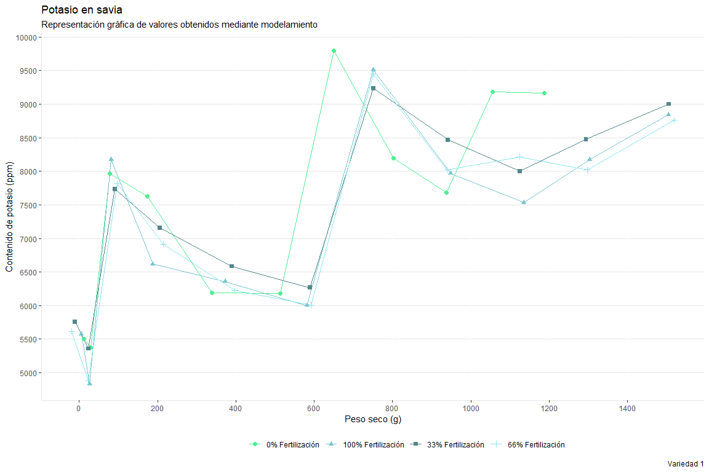<!-- -->

``` r
KCPI39 <-  Tabla_39%>%
  group_by(DDS,Tratamiento)%>%
  summarise(POTASIO=mean(K,na.rm=T),
            PESO=Peso,
            TRATAMIENTO=Tratamiento,
            SE=sd(K,na.rm=T)/sqrt(length(complete.cases(K))))

ggplot(KCPI39,aes(x=PESO, y=POTASIO, group = TRATAMIENTO, colour =TRATAMIENTO)) + 
  geom_line(size = 1)  +
  scale_y_continuous(breaks=seq(0,10000,500))+
  scale_x_continuous(breaks=seq(0,2000,200))+
  labs(title="Potasio en savia", subtitle="Representación gráfica de valores obtenidos mediante modelamiento",caption="Variedad 39", x="Peso seco (g)", y="Contenido de potasio (ppm)")+
  geom_point( size=2, fill="white") +
  scale_color_manual(values=c("seagreen2","cadetblue3","cadetblue4","cadetblue2"))+
  tema
```

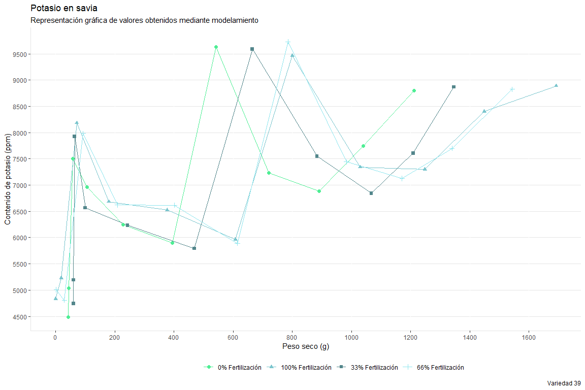<!-- -->

``` r
KCPI102 <-  Tabla_102%>%
  group_by(DDS,Tratamiento)%>%
  summarise(POTASIO=mean(K,na.rm=T),
            PESO=Peso,
            TRATAMIENTO=Tratamiento,
            SE=sd(K,na.rm=T)/sqrt(length(complete.cases(K))))

ggplot(KCPI102,aes(x=PESO, y=POTASIO, group = TRATAMIENTO, colour =TRATAMIENTO)) + 
  geom_line(size = 1)  +
  scale_y_continuous(breaks=seq(0,10000,500))+
  scale_x_continuous(breaks=seq(0,2000,200))+
  labs(title="Potasio en savia", subtitle="Representación gráfica de valores obtenidos mediante modelamiento",caption="Variedad 102", x="Peso seco (g)", y="Contenido de potasio (ppm)")+
  geom_point( size=2, fill="white") +
  scale_color_manual(values=c("seagreen2","cadetblue3","cadetblue4","cadetblue2"))+
  tema
```

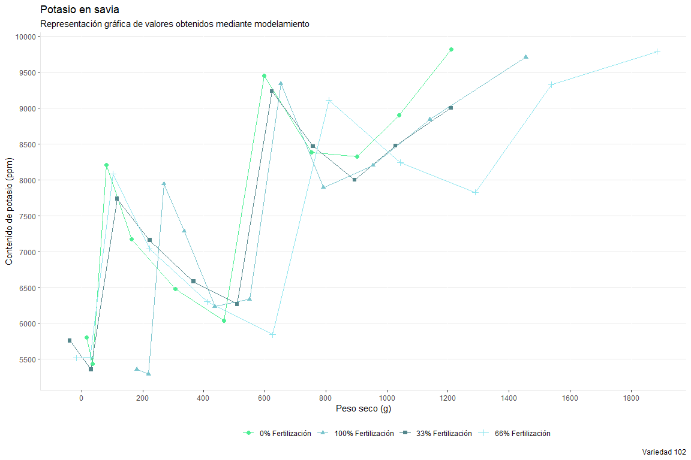<!-- -->

# 4) MODELO RENDIMIENTO

En este apartado, se realiza el mismo procedimiento utilizado en el
apartado número dos, pero orientado al rendimiento del cultivo.

## VARIEDAD 1

``` r
library(dplyr)

masa_seca_1 <- datos_masa_seca %>% 
  filter(VARIEDAD=="1")%>%
  group_by(DDS,TRATAMIENTO.)%>%
  summarise(REND_TUB_TON_HA=mean(REND_TUB_TON_HA,na.rm = T),
            DDS=DDS,
            TRATAMIENTO=TRATAMIENTO.)


ggplot() + geom_point(data=masa_seca_1, aes(x=DDS, y = REND_TUB_TON_HA, group = TRATAMIENTO., colour = TRATAMIENTO.)) + 
  xlab("DDS") + 
  ylab("RENDIMIENTO TOTAL") + 
  ggtitle("") +
  tema
```

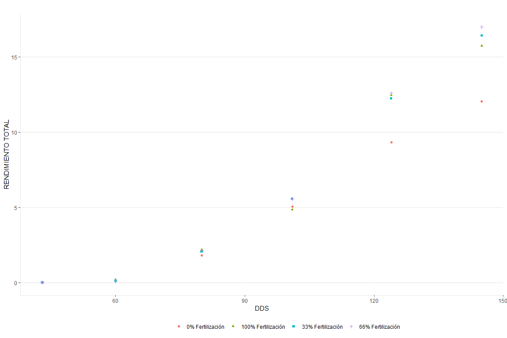<!-- -->

``` r
Gompertz <- function(x, y0, ymax, k, lag){
  result<- y0 + ymax*exp(-exp(k*(lag-x)/(ymax-y0) + 1))
  return(result)
}

masa_seca_100_1 <- datos_masa_seca %>%
  filter(VARIEDAD =="1",TRATAMIENTO.=="100% Fertilización")%>%
  group_by(DDS, TRATAMIENTO.)%>%
  summarise(REND_TUB_TON_HA_100_1=REND_TUB_TON_HA,
            DDS_100_1=DDS,
            TRATAMIENTO=TRATAMIENTO.)

Gomp_100_1 <- nls(REND_TUB_TON_HA_100_1 ~ Gompertz(DDS_100_1, y0, ymax, k, lag),
             data=masa_seca_100_1,
             start = list(y0=1, ymax=30, k=0.1, lag=1))

masa_seca_66_1 <- datos_masa_seca %>%
  filter(VARIEDAD =="1",TRATAMIENTO.=="66% Fertilización")%>%
  group_by(DDS, TRATAMIENTO.)%>%
  summarise(REND_TUB_TON_HA_66_1=REND_TUB_TON_HA,
            DDS_66_1=DDS,
            TRATAMIENTO=TRATAMIENTO.)

Gomp_66_1 <- nls(REND_TUB_TON_HA_66_1 ~ Gompertz(DDS_66_1, y0, ymax, k, lag),
             data=masa_seca_66_1,
             start = list(y0=1, ymax=30, k=0.1, lag=1))

masa_seca_33_1 <- datos_masa_seca %>%
  filter(VARIEDAD =="1",TRATAMIENTO.=="33% Fertilización")%>%
  group_by(DDS, TRATAMIENTO.)%>%
  summarise(REND_TUB_TON_HA_33_1=REND_TUB_TON_HA,
            DDS_33_1=DDS,
            TRATAMIENTO=TRATAMIENTO.)

Gomp_33_1 <- nls(REND_TUB_TON_HA_33_1 ~ Gompertz(DDS_33_1, y0, ymax, k, lag),
             data=masa_seca_33_1,
             start = list(y0=1, ymax=30, k=0.1, lag=1))

masa_seca_0_1 <- datos_masa_seca %>%
  filter(VARIEDAD =="1",TRATAMIENTO.=="0% Fertilización")%>%
  group_by(DDS, TRATAMIENTO.)%>%
  summarise(REND_TUB_TON_HA_0_1=REND_TUB_TON_HA,
            DDS_0_1=DDS,
            TRATAMIENTO=TRATAMIENTO.)

Gomp_0_1 <- nls(REND_TUB_TON_HA_0_1 ~ Gompertz(DDS_0_1, y0, ymax, k, lag),
             data=masa_seca_0_1,
             start = list(y0=1, ymax=30, k=0.1, lag=1))
```

``` r
coefs_100_1 <- coef(Gomp_100_1)
y0_100_1 = coefs_100_1[1]
ymax_100_1=coefs_100_1[2]
k_100_1=coefs_100_1[3]
lag_100_1=coefs_100_1[4]

coefs_100_1
```

    ##         y0       ymax          k        lag 
    ##  0.2348967 20.7593653  0.7388606 81.3775571

``` r
coefs_66_1 <- coef(Gomp_66_1)
y0_66_1 = coefs_66_1[1]
ymax_66_1=coefs_66_1[2]
k_66_1=coefs_66_1[3]
lag_66_1=coefs_66_1[4]

coefs_66_1
```

    ##          y0        ymax           k         lag 
    ##  0.02503215 24.97694964  0.75190394 79.64812022

``` r
coefs_33_1 <- coef(Gomp_33_1)
y0_33_1 = coefs_33_1[1]
ymax_33_1=coefs_33_1[2]
k_33_1=coefs_33_1[3]
lag_33_1=coefs_33_1[4]

coefs_33_1
```

    ##          y0        ymax           k         lag 
    ##  0.02323588 23.75983940  0.72270347 78.95595244

``` r
coefs_0_1 <- coef(Gomp_0_1)
y0_0_1 = coefs_0_1[1]
ymax_0_1= coefs_0_1[2]
k_0_1 = coefs_0_1[3]
lag_0_1 = coefs_0_1[4]

coefs_0_1
```

    ##          y0        ymax           k         lag 
    ## -0.02763788 15.90154172  0.51167620 73.54360709

``` r
summary(Gomp_100_1)
```

    ## 
    ## Formula: REND_TUB_TON_HA_100_1 ~ Gompertz(DDS_100_1, y0, ymax, k, lag)
    ## 
    ## Parameters:
    ##      Estimate Std. Error t value Pr(>|t|)    
    ## y0    0.23490    0.40669   0.578     0.57    
    ## ymax 20.75937    3.27729   6.334 3.50e-06 ***
    ## k     0.73886    0.06868  10.757 9.14e-10 ***
    ## lag  81.37756    3.66195  22.222 1.43e-15 ***
    ## ---
    ## Signif. codes:  0 '***' 0.001 '**' 0.01 '*' 0.05 '.' 0.1 ' ' 1
    ## 
    ## Residual standard error: 1.092 on 20 degrees of freedom
    ## 
    ## Number of iterations to convergence: 16 
    ## Achieved convergence tolerance: 5.712e-06

``` r
summary(Gomp_66_1)
```

    ## 
    ## Formula: REND_TUB_TON_HA_66_1 ~ Gompertz(DDS_66_1, y0, ymax, k, lag)
    ## 
    ## Parameters:
    ##      Estimate Std. Error t value Pr(>|t|)    
    ## y0    0.02503    0.44086   0.057    0.955    
    ## ymax 24.97695    4.78982   5.215 4.21e-05 ***
    ## k     0.75190    0.05253  14.314 5.69e-12 ***
    ## lag  79.64812    3.53101  22.557 1.07e-15 ***
    ## ---
    ## Signif. codes:  0 '***' 0.001 '**' 0.01 '*' 0.05 '.' 0.1 ' ' 1
    ## 
    ## Residual standard error: 1.073 on 20 degrees of freedom
    ## 
    ## Number of iterations to convergence: 10 
    ## Achieved convergence tolerance: 7.764e-06

``` r
summary(Gomp_33_1)
```

    ## 
    ## Formula: REND_TUB_TON_HA_33_1 ~ Gompertz(DDS_33_1, y0, ymax, k, lag)
    ## 
    ## Parameters:
    ##      Estimate Std. Error t value Pr(>|t|)    
    ## y0    0.02324    0.61208   0.038  0.97009    
    ## ymax 23.75984    6.26816   3.791  0.00115 ** 
    ## k     0.72270    0.07387   9.784 4.56e-09 ***
    ## lag  78.95595    5.10579  15.464 1.37e-12 ***
    ## ---
    ## Signif. codes:  0 '***' 0.001 '**' 0.01 '*' 0.05 '.' 0.1 ' ' 1
    ## 
    ## Residual standard error: 1.481 on 20 degrees of freedom
    ## 
    ## Number of iterations to convergence: 11 
    ## Achieved convergence tolerance: 1.474e-06

``` r
summary(Gomp_0_1)
```

    ## 
    ## Formula: REND_TUB_TON_HA_0_1 ~ Gompertz(DDS_0_1, y0, ymax, k, lag)
    ## 
    ## Parameters:
    ##      Estimate Std. Error t value Pr(>|t|)    
    ## y0   -0.02764    0.54037  -0.051 0.959716    
    ## ymax 15.90154    3.73366   4.259 0.000384 ***
    ## k     0.51168    0.06684   7.656 2.29e-07 ***
    ## lag  73.54361    6.34027  11.599 2.47e-10 ***
    ## ---
    ## Signif. codes:  0 '***' 0.001 '**' 0.01 '*' 0.05 '.' 0.1 ' ' 1
    ## 
    ## Residual standard error: 1.22 on 20 degrees of freedom
    ## 
    ## Number of iterations to convergence: 11 
    ## Achieved convergence tolerance: 1.332e-06

``` r
DDS_LEVELS <- seq(0,150,by=1)

par(mfrow=c(2,2))

pred <- predict(Gomp_100_1, list(x=DDS_LEVELS))
plot(REND_TUB_TON_HA_100_1~DDS_100_1, data=masa_seca_100_1, xlim=c(0,150), ylim=c(0,25),
     xlab="DDS", ylab="RENDIMIENTO total")
lines(DDS_LEVELS, Gompertz(DDS_LEVELS, y0_100_1, ymax_100_1, k_100_1, lag_100_1),
      lty=1, col="cadetblue3", lwd = 2)

pred <- predict(Gomp_66_1, list(x=DDS_LEVELS))
plot(REND_TUB_TON_HA_66_1~DDS_66_1, data=masa_seca_66_1, xlim=c(0,150), ylim=c(0,25),
     xlab="DDS", ylab="RENDIMIENTO total")
lines(DDS_LEVELS, Gompertz(DDS_LEVELS, y0_66_1, ymax_66_1, k_66_1, lag_66_1),
      lty=1, col="cadetblue2", lwd=2)

pred <- predict(Gomp_33_1, list(x=DDS_LEVELS))
plot(REND_TUB_TON_HA_33_1~DDS_33_1, data=masa_seca_33_1, xlim=c(0,150), ylim=c(0,25),
     xlab="DDS", ylab="RENDIMIENTO total")
lines(DDS_LEVELS, Gompertz(DDS_LEVELS, y0_33_1, ymax_33_1, k_33_1, lag_33_1),
      lty=1, col="cadetblue4", lwd=2)

pred <- predict(Gomp_0_1, list(x=DDS_LEVELS))
plot(REND_TUB_TON_HA_0_1~DDS_0_1, data=masa_seca_0_1, xlim=c(0,150), ylim=c(0,25),
     xlab="DDS", ylab="RENDIMIENTO total")
lines(DDS_LEVELS, Gompertz(DDS_LEVELS, y0_0_1, ymax_0_1, k_0_1, lag_0_1),
      lty=1, col="seagreen2", lwd=2)
```

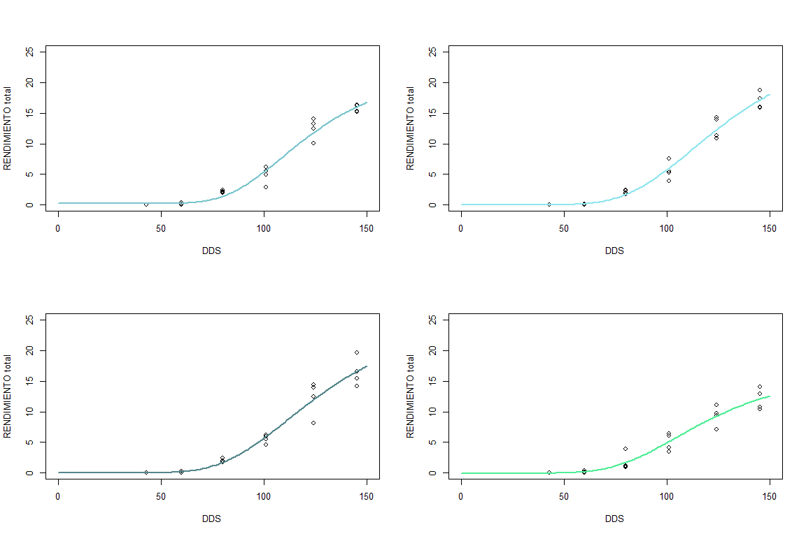<!-- -->

``` r
par(mfrow=c(1,1))

plot(REND_TUB_TON_HA~DDS, data=masa_seca_1, xlim=c(0,150), ylim=c(0,25),
     xlab="DDS", ylab="Rendimiento total (ton/ha)")
lines(DDS_LEVELS, Gompertz(DDS_LEVELS, y0_66_1, ymax_66_1, k_66_1, lag_66_1),
      lty=1, col="cadetblue2", lwd=2)
lines(DDS_LEVELS, Gompertz(DDS_LEVELS, y0_100_1, ymax_100_1, k_100_1, lag_100_1),
      lty=1, col="cadetblue3", lwd=2)
lines(DDS_LEVELS, Gompertz(DDS_LEVELS, y0_33_1, ymax_33_1, k_33_1, lag_33_1),
      lty=1, col="cadetblue4", lwd=2)
lines(DDS_LEVELS, Gompertz(DDS_LEVELS, y0_0_1, ymax_0_1, k_0_1, lag_0_1),
      lty=1, col="seagreen2", lwd=2)
legend("topleft", legend=c("100% Fertilización", "66% Fertilización", "33% Fertilización", "0% Fertilización"), lwd = 3, col = c("cadetblue3","cadetblue2","cadetblue4", "seagreen2"))
```

<!-- -->

``` r
RENDIMIENTOs_savia_100_1 <- Gompertz(c(36,45,53,61,70,78,84,91,98,105,115),y0_100_1,ymax_100_1,k_100_1,lag_100_1)
DDS_100_1 <- c(36,45,53,61,70,78,84,91,98,105,115)
TRATAMIENTO_100_1 <- rep("100% Fertilización",11)
Tabla_RENDIMIENTOs_savia_100_1 <- data.frame(RENDIMIENTOs_savia_100_1,DDS_100_1,TRATAMIENTO_100_1)
Tabla_RENDIMIENTOs_savia_100_1
```

    ##    RENDIMIENTOs_savia_100_1 DDS_100_1  TRATAMIENTO_100_1
    ## 1                 0.2349154        36 100% Fertilización
    ## 2                 0.2357755        45 100% Fertilización
    ## 3                 0.2458171        53 100% Fertilización
    ## 4                 0.3071310        61 100% Fertilización
    ## 5                 0.5809228        70 100% Fertilización
    ## 6                 1.1988333        78 100% Fertilización
    ## 7                 1.9848607        84 100% Fertilización
    ## 8                 3.2709101        91 100% Fertilización
    ## 9                 4.8937589        98 100% Fertilización
    ## 10                6.7336475       105 100% Fertilización
    ## 11                9.4672769       115 100% Fertilización

``` r
RENDIMIENTOs_savia_66_1 <- Gompertz(c(36,45,53,61,70,78,84,91,98,105,115),y0_66_1,ymax_66_1,k_66_1,lag_66_1)
DDS_66_1 <- c(36,45,53,61,70,78,84,91,98,105,115)
TRATAMIENTO_66_1 <- rep("66% Fertilización",11)
Tabla_RENDIMIENTOs_savia_66_1 <- data.frame(RENDIMIENTOs_savia_66_1,DDS_66_1,TRATAMIENTO_66_1)
Tabla_RENDIMIENTOs_savia_66_1
```

    ##    RENDIMIENTOs_savia_66_1 DDS_66_1  TRATAMIENTO_66_1
    ## 1               0.02602992       36 66% Fertilización
    ## 2               0.03609483       45 66% Fertilización
    ## 3               0.08287783       53 66% Fertilización
    ## 4               0.23725236       61 66% Fertilización
    ## 5               0.68371471       70 66% Fertilización
    ## 6               1.46016932       78 66% Fertilización
    ## 7               2.32699498       84 66% Fertilización
    ## 8               3.64758507       91 66% Fertilización
    ## 9               5.25479888       98 66% Fertilización
    ## 10              7.06584712      105 66% Fertilización
    ## 11              9.81310651      115 66% Fertilización

``` r
RENDIMIENTOs_savia_33_1 <- Gompertz(c(36,45,53,61,70,78,84,91,98,105,115),y0_33_1,ymax_33_1,k_33_1,lag_33_1)
DDS_33_1 <- c(36,45,53,61,70,78,84,91,98,105,115)
TRATAMIENTO_33_1 <- rep("33% Fertilización",11)
Tabla_RENDIMIENTOs_savia_33_1 <- data.frame(RENDIMIENTOs_savia_33_1,DDS_33_1,TRATAMIENTO_33_1)
Tabla_RENDIMIENTOs_savia_33_1
```

    ##    RENDIMIENTOs_savia_33_1 DDS_33_1  TRATAMIENTO_33_1
    ## 1               0.02425890       36 33% Fertilización
    ## 2               0.03462087       45 33% Fertilización
    ## 3               0.08265696       53 33% Fertilización
    ## 4               0.24021444       61 33% Fertilización
    ## 5               0.69194117       70 33% Fertilización
    ## 6               1.47015249       78 33% Fertilización
    ## 7               2.33196997       84 33% Fertilización
    ## 8               3.63495822       91 33% Fertilización
    ## 9               5.20827147       98 33% Fertilización
    ## 10              6.96782063      105 33% Fertilización
    ## 11              9.61425326      115 33% Fertilización

``` r
RENDIMIENTOs_savia_0_1 <- Gompertz(c(36,45,53,61,70,78,84,91,98,105,115),y0_0_1,ymax_0_1,k_0_1,lag_0_1)
DDS_0_1 <- c(36,45,53,61,70,78,84,91,98,105,115)
TRATAMIENTO_0_1 <- rep("0% Fertilización",11)
Tabla_RENDIMIENTOs_savia_0_1 <- data.frame(RENDIMIENTOs_savia_0_1,DDS_0_1,TRATAMIENTO_0_1)
Tabla_RENDIMIENTOs_savia_0_1
```

    ##    RENDIMIENTOs_savia_0_1 DDS_0_1  TRATAMIENTO_0_1
    ## 1            -0.025824691      36 0% Fertilización
    ## 2            -0.009921534      45 0% Fertilización
    ## 3             0.055075669      53 0% Fertilización
    ## 4             0.244713328      61 0% Fertilización
    ## 5             0.728464325      70 0% Fertilización
    ## 6             1.480209275      78 0% Fertilización
    ## 7             2.251130886      84 0% Fertilización
    ## 8             3.342140467      91 0% Fertilización
    ## 9             4.578001866      98 0% Fertilización
    ## 10            5.883286437     105 0% Fertilización
    ## 11            7.730052676     115 0% Fertilización

## VARIEDAD 39

``` r
masa_seca_39 <- datos_masa_seca %>% 
  filter(VARIEDAD=="39")%>%
  group_by(DDS,TRATAMIENTO.)%>%
  summarise(REND_TUB_TON_HA_39=mean(REND_TUB_TON_HA,na.rm = T),
            DDS_39=DDS,
            TRATAMIENTO_39=TRATAMIENTO.)

ggplot() + geom_point(data=masa_seca_39, aes(x=DDS, y = REND_TUB_TON_HA_39, group = TRATAMIENTO., colour = TRATAMIENTO.)) + 
  xlab("DDS") + 
  ylab("RENDIMIENTO TOTAL") + 
  ggtitle("") +
  tema
```

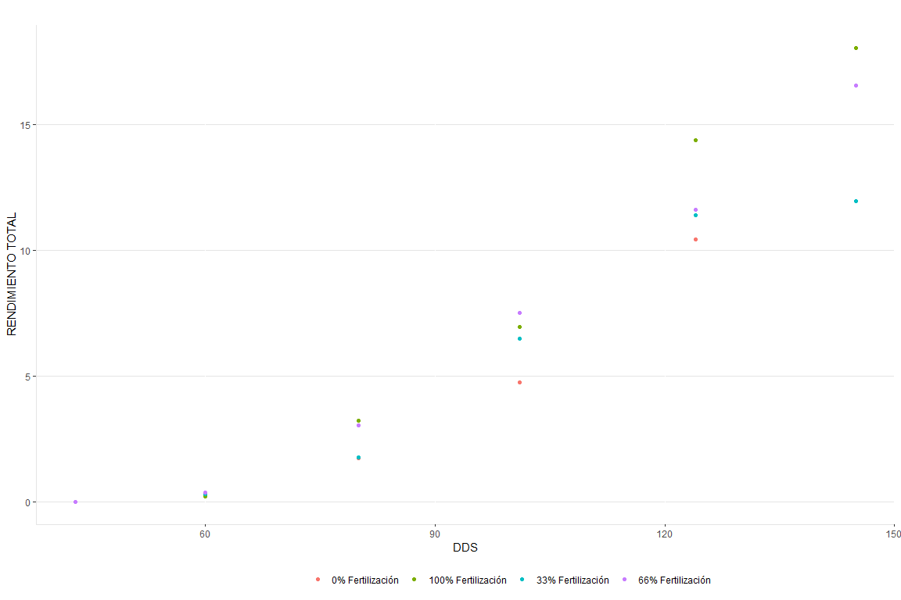<!-- -->

``` r
Gompertz <- function(x, y0, ymax, k, lag){
  result<- y0 + ymax*exp(-exp(k*(lag-x)/(ymax-y0) + 1))
  return(result)
}

masa_seca_100_39 <- datos_masa_seca %>%
  filter(VARIEDAD =="39",TRATAMIENTO.=="100% Fertilización")%>%
  group_by(DDS, TRATAMIENTO.)%>%
  summarise(REND_TUB_TON_HA_100_39=REND_TUB_TON_HA,
            DDS_100_39=DDS,
            TRATAMIENTO_39=TRATAMIENTO.)
```

    ## `summarise()` has grouped output by 'DDS', 'TRATAMIENTO.'. You can override
    ## using the `.groups` argument.

``` r
Gomp_100_39 <- nls(REND_TUB_TON_HA_100_39 ~ Gompertz(DDS_100_39, y0, ymax, k, lag),
             data=masa_seca_100_39,
             start = list(y0=1, ymax=25, k=0.1, lag=1))

masa_seca_66_39 <- datos_masa_seca %>%
  filter(VARIEDAD =="39",TRATAMIENTO.=="66% Fertilización")%>%
  group_by(DDS, TRATAMIENTO.)%>%
  summarise(REND_TUB_TON_HA_66_39=REND_TUB_TON_HA,
            DDS_66_39=DDS,
            TRATAMIENTO_39=TRATAMIENTO.)
```

    ## `summarise()` has grouped output by 'DDS', 'TRATAMIENTO.'. You can override
    ## using the `.groups` argument.

``` r
Gomp_66_39 <- nls(REND_TUB_TON_HA_66_39 ~ Gompertz(DDS_66_39, y0, ymax, k, lag),
             data=masa_seca_66_39,
             start = list(y0=1, ymax=25, k=0.1, lag=1))

masa_seca_33_39 <- datos_masa_seca %>%
  filter(VARIEDAD =="39",TRATAMIENTO.=="33% Fertilización")%>%
  group_by(DDS, TRATAMIENTO.)%>%
  summarise(REND_TUB_TON_HA_33_39=REND_TUB_TON_HA,
            DDS_33_39=DDS,
            TRATAMIENTO_39=TRATAMIENTO.)
```

    ## `summarise()` has grouped output by 'DDS', 'TRATAMIENTO.'. You can override
    ## using the `.groups` argument.

``` r
Gomp_33_39 <- nls(REND_TUB_TON_HA_33_39 ~ Gompertz(DDS_33_39, y0, ymax, k, lag),
             data=masa_seca_33_39,
             start = list(y0=1, ymax=25, k=0.1, lag=1))

masa_seca_0_39 <- datos_masa_seca %>%
  filter(VARIEDAD =="39",TRATAMIENTO.=="0% Fertilización")%>%
  group_by(DDS, TRATAMIENTO.)%>%
  summarise(REND_TUB_TON_HA_0_39=REND_TUB_TON_HA,
            DDS_0_39=DDS,
            TRATAMIENTO_39=TRATAMIENTO.)
```

    ## `summarise()` has grouped output by 'DDS', 'TRATAMIENTO.'. You can override
    ## using the `.groups` argument.

``` r
Gomp_0_39 <- nls(REND_TUB_TON_HA_0_39 ~ Gompertz(DDS_0_39, y0, ymax, k, lag),
             data=masa_seca_0_39,
             start = list(y0=1, ymax=25, k=0.1, lag=1))
```

``` r
coefs_100_39 <- coef(Gomp_100_39)
y0_100_39 = coefs_100_39[1]
ymax_100_39=coefs_100_39[2]
k_100_39=coefs_100_39[3]
lag_100_39=coefs_100_39[4]

coefs_100_39
```

    ##          y0        ymax           k         lag 
    ## -0.03644458 25.19312800  0.75193017 73.27101615

``` r
coefs_66_39 <- coef(Gomp_66_39)
y0_66_39 = coefs_66_39[1]
ymax_66_39=coefs_66_39[2]
k_66_39=coefs_66_39[3]
lag_66_39=coefs_66_39[4]

coefs_66_39
```

    ##         y0       ymax          k        lag 
    ## -0.5449435 28.6477236  0.6124301 66.8188130

``` r
coefs_33_39 <- coef(Gomp_33_39)
y0_33_39 = coefs_33_39[1]
ymax_33_39=coefs_33_39[2]
k_33_39=coefs_33_39[3]
lag_33_39=coefs_33_39[4]

coefs_33_39
```

    ##         y0       ymax          k        lag 
    ##  0.1990685 12.6724917  0.7281092 76.5748444

``` r
coefs_0_39 <- coef(Gomp_0_39)
y0_0_39 = coefs_0_39[1]
ymax_0_39=coefs_0_39[2]
k_0_39=coefs_0_39[3]
lag_0_39=coefs_0_39[4]

coefs_0_39
```

    ##         y0       ymax          k        lag 
    ##  0.2484313 13.7663784  0.6070375 78.8750925

``` r
summary(Gomp_100_39)
```

    ## 
    ## Formula: REND_TUB_TON_HA_100_39 ~ Gompertz(DDS_100_39, y0, ymax, k, lag)
    ## 
    ## Parameters:
    ##      Estimate Std. Error t value Pr(>|t|)    
    ## y0   -0.03644    0.35528  -0.103    0.919    
    ## ymax 25.19313    2.81915   8.936 2.02e-08 ***
    ## k     0.75193    0.03739  20.111 9.72e-15 ***
    ## lag  73.27102    2.71074  27.030  < 2e-16 ***
    ## ---
    ## Signif. codes:  0 '***' 0.001 '**' 0.01 '*' 0.05 '.' 0.1 ' ' 1
    ## 
    ## Residual standard error: 0.7612 on 20 degrees of freedom
    ## 
    ## Number of iterations to convergence: 13 
    ## Achieved convergence tolerance: 2.365e-06

``` r
summary(Gomp_66_39)
```

    ## 
    ## Formula: REND_TUB_TON_HA_66_39 ~ Gompertz(DDS_66_39, y0, ymax, k, lag)
    ## 
    ## Parameters:
    ##      Estimate Std. Error t value Pr(>|t|)    
    ## y0   -0.54494    0.72629  -0.750  0.46180    
    ## ymax 28.64772    7.65524   3.742  0.00128 ** 
    ## k     0.61243    0.02788  21.971 1.78e-15 ***
    ## lag  66.81881    4.96009  13.471 1.72e-11 ***
    ## ---
    ## Signif. codes:  0 '***' 0.001 '**' 0.01 '*' 0.05 '.' 0.1 ' ' 1
    ## 
    ## Residual standard error: 0.8846 on 20 degrees of freedom
    ## 
    ## Number of iterations to convergence: 11 
    ## Achieved convergence tolerance: 2.208e-06

``` r
summary(Gomp_33_39)
```

    ## 
    ## Formula: REND_TUB_TON_HA_33_39 ~ Gompertz(DDS_33_39, y0, ymax, k, lag)
    ## 
    ## Parameters:
    ##      Estimate Std. Error t value Pr(>|t|)    
    ## y0    0.19907    0.22870    0.87    0.394    
    ## ymax 12.67249    0.57073   22.20 1.45e-15 ***
    ## k     0.72811    0.06361   11.45 3.12e-10 ***
    ## lag  76.57484    2.26106   33.87  < 2e-16 ***
    ## ---
    ## Signif. codes:  0 '***' 0.001 '**' 0.01 '*' 0.05 '.' 0.1 ' ' 1
    ## 
    ## Residual standard error: 0.6394 on 20 degrees of freedom
    ## 
    ## Number of iterations to convergence: 14 
    ## Achieved convergence tolerance: 3.8e-06

``` r
summary(Gomp_0_39)
```

    ## 
    ## Formula: REND_TUB_TON_HA_0_39 ~ Gompertz(DDS_0_39, y0, ymax, k, lag)
    ## 
    ## Parameters:
    ##      Estimate Std. Error t value Pr(>|t|)    
    ## y0    0.24843    0.29800   0.834    0.414    
    ## ymax 13.76638    1.31901  10.437 1.53e-09 ***
    ## k     0.60704    0.06603   9.193 1.28e-08 ***
    ## lag  78.87509    3.47930  22.670 9.75e-16 ***
    ## ---
    ## Signif. codes:  0 '***' 0.001 '**' 0.01 '*' 0.05 '.' 0.1 ' ' 1
    ## 
    ## Residual standard error: 0.8211 on 20 degrees of freedom
    ## 
    ## Number of iterations to convergence: 14 
    ## Achieved convergence tolerance: 2.523e-06

``` r
DDS_LEVELS <- seq(0,150,by=1)

par(mfrow=c(2,2))

pred <- predict(Gomp_100_39, list(x=DDS_LEVELS))
plot(REND_TUB_TON_HA_100_39~DDS_100_39, data=masa_seca_100_39, xlim=c(0,150), ylim=c(0,25),
     xlab="DDS", ylab="RENDIMIENTO total")
lines(DDS_LEVELS, Gompertz(DDS_LEVELS, y0_100_39, ymax_100_39, k_100_39, lag_100_39),
      lty=1, col="cadetblue3", lwd=2)

pred <- predict(Gomp_66_39, list(x=DDS_LEVELS))
plot(REND_TUB_TON_HA_66_39~DDS_66_39, data=masa_seca_66_39, xlim=c(0,150), ylim=c(0,25),
     xlab="DDS", ylab="RENDIMIENTO total")
lines(DDS_LEVELS, Gompertz(DDS_LEVELS, y0_66_39, ymax_66_39, k_66_39, lag_66_39),
      lty=1, col="cadetblue2", lwd=2)

pred <- predict(Gomp_33_39, list(x=DDS_LEVELS))
plot(REND_TUB_TON_HA_33_39~DDS_33_39, data=masa_seca_33_39, xlim=c(0,150), ylim=c(0,25),
     xlab="DDS", ylab="RENDIMIENTO total")
lines(DDS_LEVELS, Gompertz(DDS_LEVELS, y0_33_39, ymax_33_39, k_33_39, lag_33_39),
      lty=1, col="cadetblue4", lwd=2)

pred <- predict(Gomp_0_39, list(x=DDS_LEVELS))
plot(REND_TUB_TON_HA_0_39~DDS_0_39, data=masa_seca_0_39, xlim=c(0,150), ylim=c(0,25),
     xlab="DDS", ylab="RENDIMIENTO total")
lines(DDS_LEVELS, Gompertz(DDS_LEVELS, y0_0_39, ymax_0_39, k_0_39, lag_0_39),
      lty=1, col="seagreen2", lwd=2)
```

<!-- -->

``` r
par(mfrow=c(1,1))

plot(REND_TUB_TON_HA_39~DDS_39, data=masa_seca_39, xlim=c(0,150), ylim=c(0,25),
     xlab="DDS", ylab="Rendimiento total")
lines(DDS_LEVELS, Gompertz(DDS_LEVELS, y0_66_39, ymax_66_39, k_66_39, lag_66_39),
      lty=1, col="cadetblue2", lwd=2)
lines(DDS_LEVELS, Gompertz(DDS_LEVELS, y0_100_39, ymax_100_39, k_100_39, lag_100_39),
      lty=1, col="cadetblue3", lwd=2)
lines(DDS_LEVELS, Gompertz(DDS_LEVELS, y0_33_39, ymax_33_39, k_33_39, lag_33_39),
      lty=1, col="cadetblue4", lwd=2)
lines(DDS_LEVELS, Gompertz(DDS_LEVELS, y0_0_39, ymax_0_39, k_0_39, lag_0_39),
      lty=1, col="seagreen2", lwd=2)
legend("topleft", legend=c("100% Fertilización", "66% Fertilización", "33% Fertilización", "0% Fertilización"), lwd = 3, col = c("cadetblue3","cadetblue2","cadetblue4", "seagreen2"))
```

<!-- -->

``` r
RENDIMIENTOs_savia_100_39 <- Gompertz(c(36,45,53,61,70,78,84,91,98,105,115),y0_100_39,ymax_100_39,k_100_39,lag_100_39)
DDS_100_39 <- c(36,45,53,61,70,78,84,91,98,105,115)
TRATAMIENTO_100_39 <- rep("100% Fertilización",11)
Tabla_RENDIMIENTOs_savia_100_39 <- data.frame(RENDIMIENTOs_savia_100_39,DDS_100_39,TRATAMIENTO_100_39)
Tabla_RENDIMIENTOs_savia_100_39
```

    ##    RENDIMIENTOs_savia_100_39 DDS_100_39 TRATAMIENTO_100_39
    ## 1               -0.029894866         36 100% Fertilización
    ## 2                0.009230284         45 100% Fertilización
    ## 3                0.137843175         53 100% Fertilización
    ## 4                0.464144229         61 100% Fertilización
    ## 5                1.222083449         70 100% Fertilización
    ## 6                2.340062505         78 100% Fertilización
    ## 7                3.461665179         84 100% Fertilización
    ## 8                5.036862561         91 100% Fertilización
    ## 9                6.823906844         98 100% Fertilización
    ## 10               8.727988993        105 100% Fertilización
    ## 11              11.469060604        115 100% Fertilización

``` r
RENDIMIENTOs_savia_66_39 <- Gompertz(c(36,45,53,61,70,78,84,91,98,105,115),y0_66_39,ymax_66_39,k_66_39,lag_66_39)
DDS_66_39 <- c(36,45,53,61,70,78,84,91,98,105,115)
TRATAMIENTO_66_39 <- rep("66% Fertilización",11)
Tabla_RENDIMIENTOs_savia_66_39 <- data.frame(RENDIMIENTOs_savia_66_39,DDS_66_39,TRATAMIENTO_66_39)
Tabla_RENDIMIENTOs_savia_66_39
```

    ##    RENDIMIENTOs_savia_66_39 DDS_66_39 TRATAMIENTO_66_39
    ## 1                -0.3851617        36 66% Fertilización
    ## 2                -0.1547617        45 66% Fertilización
    ## 3                 0.2128366        53 66% Fertilización
    ## 4                 0.7833060        61 66% Fertilización
    ## 5                 1.7081029        70 66% Fertilización
    ## 6                 2.7923270        78 66% Fertilización
    ## 7                 3.7585709        84 66% Fertilización
    ## 8                 5.0302998        91 66% Fertilización
    ## 9                 6.4268967        98 66% Fertilización
    ## 10                7.9111834       105 66% Fertilización
    ## 11               10.1076608       115 66% Fertilización

``` r
RENDIMIENTOs_savia_33_39 <- Gompertz(c(36,45,53,61,70,78,84,91,98,105,115),y0_33_39,ymax_33_39,k_33_39,lag_33_39)
DDS_33_39 <- c(36,45,53,61,70,78,84,91,98,105,115)
TRATAMIENTO_33_39 <- rep("33% Fertilización",11)
Tabla_RENDIMIENTOs_savia_33_39 <- data.frame(RENDIMIENTOs_savia_33_39,DDS_33_39,TRATAMIENTO_33_39)
Tabla_RENDIMIENTOs_savia_33_39
```

    ##    RENDIMIENTOs_savia_33_39 DDS_33_39 TRATAMIENTO_33_39
    ## 1                 0.1990685        36 33% Fertilización
    ## 2                 0.1990689        45 33% Fertilización
    ## 3                 0.1993367        53 33% Fertilización
    ## 4                 0.2139460        61 33% Fertilización
    ## 5                 0.4335049        70 33% Fertilización
    ## 6                 1.2379411        78 33% Fertilización
    ## 7                 2.3744780        84 33% Fertilización
    ## 8                 4.1277790        91 33% Fertilización
    ## 9                 6.0181175        98 33% Fertilización
    ## 10                7.7539831       105 33% Fertilización
    ## 11                9.6954627       115 33% Fertilización

``` r
RENDIMIENTOs_savia_0_39 <- Gompertz(c(36,45,53,61,70,78,84,91,98,105,115),y0_0_39,ymax_0_39,k_0_39,lag_0_39)
DDS_0_39 <- c(36,45,53,61,70,78,84,91,98,105,115)
TRATAMIENTO_0_39 <- rep("0% Fertilización",11)
Tabla_RENDIMIENTOs_savia_0_39 <- data.frame(RENDIMIENTOs_savia_0_39,DDS_0_39,TRATAMIENTO_0_39)
Tabla_RENDIMIENTOs_savia_0_39
```

    ##    RENDIMIENTOs_savia_0_39 DDS_0_39 TRATAMIENTO_0_39
    ## 1                0.2484315       36 0% Fertilización
    ## 2                0.2484856       45 0% Fertilización
    ## 3                0.2507522       53 0% Fertilización
    ## 4                0.2803753       61 0% Fertilización
    ## 5                0.4884411       70 0% Fertilización
    ## 6                1.0630792       78 0% Fertilización
    ## 7                1.8368896       84 0% Fertilización
    ## 8                3.0925084       91 0% Fertilización
    ## 9                4.6002849       98 0% Fertilización
    ## 10               6.1855946      105 0% Fertilización
    ## 11               8.2968957      115 0% Fertilización

## VARIEDAD 102

``` r
masa_seca_102 <- datos_masa_seca %>% 
  filter(VARIEDAD=="102")%>%
  group_by(DDS,TRATAMIENTO.)%>%
  summarise(REND_TUB_TON_HA_102=mean(REND_TUB_TON_HA,na.rm = T),
            DDS_102=DDS,
            TRATAMIENTO_102=TRATAMIENTO.)

ggplot() + geom_point(data=masa_seca_102, aes(x=DDS_102, y = REND_TUB_TON_HA_102, group = TRATAMIENTO., colour = TRATAMIENTO.)) + 
  xlab("DDS") + 
  ylab("RENDIMIENTO TOTAL") + 
  ggtitle("") +
  tema
```

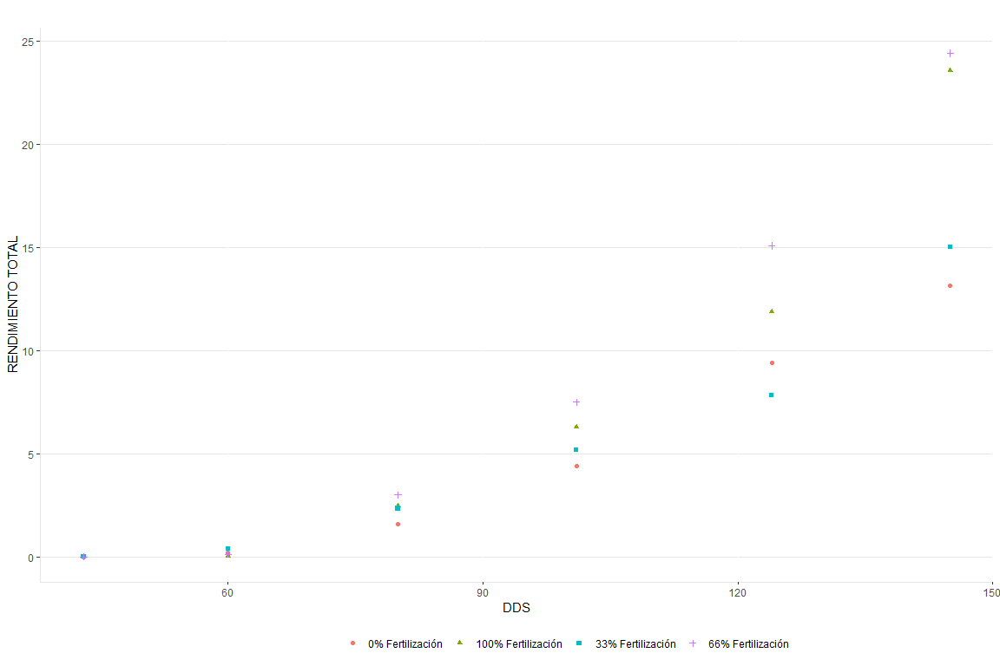<!-- -->

``` r
Cuadratica <- function(x,y0,a){
  result<- (y0 + a*x^3)
  return(result)
}

masa_seca_100_102 <- datos_masa_seca %>%
  filter(VARIEDAD =="102",TRATAMIENTO.=="100% Fertilización")%>%
  group_by(DDS, TRATAMIENTO.)%>%
  summarise(REND_TUB_TON_HA_100_102=REND_TUB_TON_HA,
            DDS_100_102=DDS,
            TRATAMIENTO_102=TRATAMIENTO.)

Cuad_100_102 <- nls(REND_TUB_TON_HA_100_102~Cuadratica(DDS_100_102,y0,a),
             data=masa_seca_100_102,
             start = list(y0=0,a=1))

masa_seca_66_102 <- datos_masa_seca %>%
  filter(VARIEDAD =="102",TRATAMIENTO.=="66% Fertilización")%>%
  group_by(DDS, TRATAMIENTO.)%>%
  summarise(REND_TUB_TON_HA_66_102=REND_TUB_TON_HA,
            DDS_66_102=DDS,
            TRATAMIENTO=TRATAMIENTO.)

Cuad_66_102 <- nls(REND_TUB_TON_HA_66_102~Cuadratica(DDS_66_102,y0,a),
             data=masa_seca_66_102,
             start = list(y0=0,a=1))

masa_seca_33_102 <- datos_masa_seca %>%
  filter(VARIEDAD =="102",TRATAMIENTO.=="33% Fertilización")%>%
  group_by(DDS, TRATAMIENTO.)%>%
  summarise(REND_TUB_TON_HA_33_102=REND_TUB_TON_HA,
            DDS_33_102=DDS,
            TRATAMIENTO_102=TRATAMIENTO.)

Cuad_33_102 <- nls(REND_TUB_TON_HA_33_102~Cuadratica(DDS_33_102,y0,a),
             data=masa_seca_33_102,
             start = list(y0=0,a=1))

masa_seca_0_102 <- datos_masa_seca %>%
  filter(VARIEDAD =="102",TRATAMIENTO.=="0% Fertilización")%>%
  group_by(DDS, TRATAMIENTO.)%>%
  summarise(REND_TUB_TON_HA_0_102=REND_TUB_TON_HA,
            DDS_0_102=DDS,
            TRATAMIENTO_102=TRATAMIENTO.)

Cuad_0_102 <- nls(REND_TUB_TON_HA_0_102~Cuadratica(DDS_0_102,y0,a),
             data=masa_seca_0_102,
             start = list(y0=0,a=1))
```

``` r
coefs_100_102 <- coef(Cuad_100_102)
y0_100_102 = coefs_100_102[1]
a_100_102=coefs_100_102[2]

coefs_100_102
```

    ##            y0             a 
    ## -1.545410e+00  7.882621e-06

``` r
coefs_66_102 <- coef(Cuad_66_102)
y0_66_102 = coefs_66_102[1]
a_66_102=coefs_66_102[2]

coefs_66_102
```

    ##            y0             a 
    ## -1.180355e+00  8.416356e-06

``` r
coefs_33_102 <- coef(Cuad_33_102)
y0_33_102 = coefs_33_102[1]
a_33_102=coefs_33_102[2]

coefs_33_102
```

    ##            y0             a 
    ## -4.453981e-01  4.915011e-06

``` r
coefs_0_102 <- coef(Cuad_0_102)
y0_0_102 = coefs_0_102[1]
a_0_102=coefs_0_102[2]

coefs_0_102
```

    ##            y0             a 
    ## -4.980364e-01  4.663884e-06

``` r
summary(Cuad_100_102)
```

    ## 
    ## Formula: REND_TUB_TON_HA_100_102 ~ Cuadratica(DDS_100_102, y0, a)
    ## 
    ## Parameters:
    ##      Estimate Std. Error t value Pr(>|t|)    
    ## y0 -1.545e+00  4.510e-01  -3.427  0.00241 ** 
    ## a   7.883e-06  2.920e-07  26.991  < 2e-16 ***
    ## ---
    ## Signif. codes:  0 '***' 0.001 '**' 0.01 '*' 0.05 '.' 0.1 ' ' 1
    ## 
    ## Residual standard error: 1.502 on 22 degrees of freedom
    ## 
    ## Number of iterations to convergence: 1 
    ## Achieved convergence tolerance: 2.011e-09

``` r
summary(Cuad_66_102)
```

    ## 
    ## Formula: REND_TUB_TON_HA_66_102 ~ Cuadratica(DDS_66_102, y0, a)
    ## 
    ## Parameters:
    ##      Estimate Std. Error t value Pr(>|t|)    
    ## y0 -1.180e+00  2.859e-01  -4.128 0.000441 ***
    ## a   8.416e-06  1.852e-07  45.450  < 2e-16 ***
    ## ---
    ## Signif. codes:  0 '***' 0.001 '**' 0.01 '*' 0.05 '.' 0.1 ' ' 1
    ## 
    ## Residual standard error: 0.9525 on 22 degrees of freedom
    ## 
    ## Number of iterations to convergence: 1 
    ## Achieved convergence tolerance: 4.672e-09

``` r
summary(Cuad_33_102)
```

    ## 
    ## Formula: REND_TUB_TON_HA_33_102 ~ Cuadratica(DDS_33_102, y0, a)
    ## 
    ## Parameters:
    ##      Estimate Std. Error t value Pr(>|t|)    
    ## y0 -4.454e-01  2.762e-01  -1.613    0.121    
    ## a   4.915e-06  1.789e-07  27.480   <2e-16 ***
    ## ---
    ## Signif. codes:  0 '***' 0.001 '**' 0.01 '*' 0.05 '.' 0.1 ' ' 1
    ## 
    ## Residual standard error: 0.92 on 22 degrees of freedom
    ## 
    ## Number of iterations to convergence: 1 
    ## Achieved convergence tolerance: 2.466e-08

``` r
summary(Cuad_0_102)
```

    ## 
    ## Formula: REND_TUB_TON_HA_0_102 ~ Cuadratica(DDS_0_102, y0, a)
    ## 
    ## Parameters:
    ##      Estimate Std. Error t value Pr(>|t|)    
    ## y0 -4.980e-01  3.167e-01  -1.572     0.13    
    ## a   4.664e-06  2.051e-07  22.737   <2e-16 ***
    ## ---
    ## Signif. codes:  0 '***' 0.001 '**' 0.01 '*' 0.05 '.' 0.1 ' ' 1
    ## 
    ## Residual standard error: 1.055 on 22 degrees of freedom
    ## 
    ## Number of iterations to convergence: 1 
    ## Achieved convergence tolerance: 9.802e-09

``` r
DDS_LEVELS <- seq(0,150,by=1)

par(mfrow=c(2,2))

pred <- predict(Cuad_100_102, list(x=DDS_LEVELS))
plot(REND_TUB_TON_HA_100_102~DDS_100_102, data=masa_seca_100_102, xlim=c(0,150), ylim=c(0,30),
     xlab="DDS", ylab="RENDIMIENTO total")
lines(DDS_LEVELS, Cuadratica(DDS_LEVELS, y0_100_102, a_100_102),
      lty=1, col="cadetblue3", lwd=2)

pred <- predict(Cuad_66_102, list(x=DDS_LEVELS))
plot(REND_TUB_TON_HA_66_102~DDS_66_102, data=masa_seca_66_102, xlim=c(0,150), ylim=c(0,30),
     xlab="DDS", ylab="RENDIMIENTO total")
lines(DDS_LEVELS, Cuadratica(DDS_LEVELS, y0_66_102, a_66_102),
      lty=1, col="cadetblue2", lwd=2)

pred <- predict(Cuad_33_102, list(x=DDS_LEVELS))
plot(REND_TUB_TON_HA_33_102~DDS_33_102, data=masa_seca_33_102, xlim=c(0,150), ylim=c(0,30),
     xlab="DDS", ylab="RENDIMIENTO total")
lines(DDS_LEVELS, Cuadratica(DDS_LEVELS, y0_33_102, a_33_102),
      lty=1, col="cadetblue4", lwd=2)

pred <- predict(Cuad_0_102, list(x=DDS_LEVELS))
plot(REND_TUB_TON_HA_0_102~DDS_0_102, data=masa_seca_0_102, xlim=c(0,150), ylim=c(0,25),
     xlab="DDS", ylab="RENDIMIENTO total")
lines(DDS_LEVELS, Cuadratica(DDS_LEVELS, y0_0_102, a_0_102),
      lty=1, col="seagreen2", lwd=2)
```

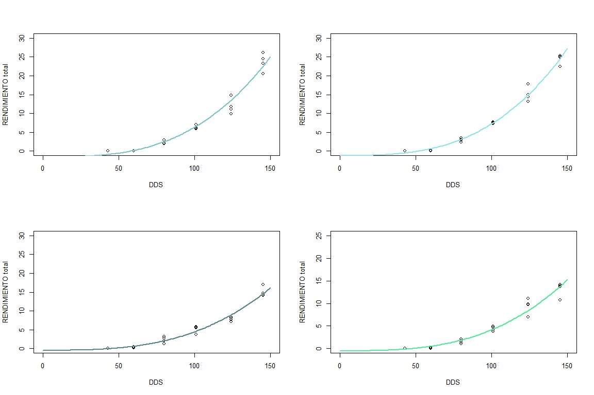<!-- -->

``` r
par(mfrow=c(1,1))

plot(REND_TUB_TON_HA_102~DDS_102, data=masa_seca_102, xlim=c(0,150), ylim=c(0,25),
     xlab="DDS", ylab="Rendimiento total (ton/ha)")
lines(DDS_LEVELS, Cuadratica(DDS_LEVELS, y0_66_102, a_66_102),
      lty=1, col="cadetblue2", lwd=2)
lines(DDS_LEVELS, Cuadratica(DDS_LEVELS, y0_100_102, a_100_102),
      lty=1, col="cadetblue3", lwd=2)
lines(DDS_LEVELS, Cuadratica(DDS_LEVELS, y0_33_102, a_33_102),
      lty=1, col="cadetblue4", lwd=2)
lines(DDS_LEVELS, Cuadratica(DDS_LEVELS, y0_0_102, a_0_102),
      lty=1, col="seagreen2", lwd=2)
legend("topleft", legend=c("100% Fertilización", "66% Fertilización", "33% Fertilización", "0% Fertilización"), lwd = 3, col = c("cadetblue3","cadetblue2","cadetblue4", "seagreen2"))
```

<!-- -->

``` r
RENDIMIENTOs_savia_100_102 <-Cuadratica(c(36,45,53,61,70,78,84,91,98,105,115),y0_100_102,a_100_102)
DDS_100_102 <- c(36,45,53,61,70,78,84,91,98,105,115)
TRATAMIENTO_100_102 <- rep("100% Fertilización",11)
Tabla_RENDIMIENTOs_savia_100_102 <- data.frame(RENDIMIENTOs_savia_100_102,DDS_100_102,TRATAMIENTO_100_102)
Tabla_RENDIMIENTOs_savia_100_102
```

    ##    RENDIMIENTOs_savia_100_102 DDS_100_102 TRATAMIENTO_100_102
    ## 1                  -1.1776381          36  100% Fertilización
    ## 2                  -0.8271059          45  100% Fertilización
    ## 3                  -0.3718688          53  100% Fertilización
    ## 4                   0.2437954          61  100% Fertilización
    ## 5                   1.1583292          70  100% Fertilización
    ## 6                   2.1953037          78  100% Fertilización
    ## 7                   3.1266511          84  100% Fertilización
    ## 8                   4.3947046          91  100% Fertilización
    ## 9                   5.8736498          98  100% Fertilización
    ## 10                  7.5797090         105  100% Fertilización
    ## 11                 10.4430709         115  100% Fertilización

``` r
RENDIMIENTOs_savia_66_102 <- Cuadratica(c(36,45,53,61,70,78,84,91,98,105,115),y0_66_102,a_66_102)
DDS_66_102 <- c(36,45,53,61,70,78,84,91,98,105,115)
TRATAMIENTO_66_102 <- rep("66% Fertilización",11)
Tabla_RENDIMIENTOs_savia_66_102 <- data.frame(RENDIMIENTOs_savia_66_102,DDS_66_102,TRATAMIENTO_66_102)
Tabla_RENDIMIENTOs_savia_66_102
```

    ##    RENDIMIENTOs_savia_66_102 DDS_66_102 TRATAMIENTO_66_102
    ## 1                -0.78768127         36  66% Fertilización
    ## 2                -0.41341432         45  66% Fertilización
    ## 3                 0.07264709         53  66% Fertilización
    ## 4                 0.72999819         61  66% Fertilización
    ## 5                 1.70645543         70  66% Fertilización
    ## 6                 2.81364394         78  66% Fertilización
    ## 7                 3.80805327         84  66% Fertilización
    ## 8                 5.16196727         91  66% Fertilización
    ## 9                 6.74105246         98  66% Fertilización
    ## 10                8.56262971        105  66% Fertilización
    ## 11               11.61987114        115  66% Fertilización

``` r
RENDIMIENTOs_savia_33_102 <- Cuadratica(c(36,45,53,61,70,78,84,91,98,105,115),y0_33_102,a_33_102)
DDS_33_102 <- c(36,45,53,61,70,78,84,91,98,105,115)
TRATAMIENTO_33_102 <- rep("33% Fertilización",11)
Tabla_RENDIMIENTOs_savia_33_102 <- data.frame(RENDIMIENTOs_savia_33_102,DDS_33_102,TRATAMIENTO_33_102)
Tabla_RENDIMIENTOs_savia_33_102
```

    ##    RENDIMIENTOs_savia_33_102 DDS_33_102 TRATAMIENTO_33_102
    ## 1               -0.216083409         36  33% Fertilización
    ## 2                0.002482194         45  33% Fertilización
    ## 3                0.286333882         53  33% Fertilización
    ## 4                0.670215865         61  33% Fertilización
    ## 5                1.240450472         70  33% Fertilización
    ## 6                1.887029937         78  33% Fertilización
    ## 7                2.467748261         84  33% Fertilización
    ## 8                3.258411260         91  33% Fertilización
    ## 9                4.180570451         98  33% Fertilización
    ## 10               5.244340925        105  33% Fertilización
    ## 11               7.029718500        115  33% Fertilización

``` r
RENDIMIENTOs_savia_0_102 <- Gompertz(c(36,45,53,61,70,78,84,91,98,105,115),y0_0_39,ymax_0_39,k_0_39,lag_0_39)
DDS_0_102 <- c(36,45,53,61,70,78,84,91,98,105,115)
TRATAMIENTO_0_102 <- rep("0% Fertilización",11)
Tabla_RENDIMIENTOs_savia_0_102 <- data.frame(RENDIMIENTOs_savia_0_102,DDS_0_102,TRATAMIENTO_0_102)
Tabla_RENDIMIENTOs_savia_0_102
```

    ##    RENDIMIENTOs_savia_0_102 DDS_0_102 TRATAMIENTO_0_102
    ## 1                 0.2484315        36  0% Fertilización
    ## 2                 0.2484856        45  0% Fertilización
    ## 3                 0.2507522        53  0% Fertilización
    ## 4                 0.2803753        61  0% Fertilización
    ## 5                 0.4884411        70  0% Fertilización
    ## 6                 1.0630792        78  0% Fertilización
    ## 7                 1.8368896        84  0% Fertilización
    ## 8                 3.0925084        91  0% Fertilización
    ## 9                 4.6002849        98  0% Fertilización
    ## 10                6.1855946       105  0% Fertilización
    ## 11                8.2968957       115  0% Fertilización

# 5) RENDIMIENTO V.S. CONTENIDO EN SAVIA

En este apartado, se realiza el mismo procedimiento utilizado en el
apartado número tres, pero orientado al rendimiento del cultivo.

## NO3

### CPI 1

``` r
library(dplyr)

mccain_savia_0_1 <- mccain_savia %>%
  filter(Variedad =="CIP 1", Tratamiento =="100% Fertilización")%>%
  group_by(DDS,Variedad,Tratamiento)%>%
  summarise(NO3 = mean(NO3, na.rm=T))

Tabla_0_1 <- cbind(mccain_savia_0_1$Variedad,Tabla_RENDIMIENTOs_savia_0_1, mccain_savia_0_1$NO3)
colnames(Tabla_0_1) <- c('Variedad','RENDIMIENTO','DDS','Tratamiento','NO3')

mccain_savia_33_1 <- mccain_savia %>%
  filter(Variedad =="CIP 1", Tratamiento =="33% Fertilización")%>%
  group_by(DDS,Variedad,Tratamiento)%>%
  summarise(NO3 = mean(NO3, na.rm=T))

Tabla_33_1 <- cbind(mccain_savia_33_1$Variedad,Tabla_RENDIMIENTOs_savia_33_1, mccain_savia_33_1$NO3)
colnames(Tabla_33_1) <- c('Variedad','RENDIMIENTO','DDS','Tratamiento','NO3')

mccain_savia_66_1 <- mccain_savia %>%
  filter(Variedad =="CIP 1", Tratamiento =="66% Fertilización")%>%
  group_by(DDS,Variedad,Tratamiento)%>%
  summarise(NO3 = mean(NO3, na.rm=T))

Tabla_66_1 <- cbind(mccain_savia_66_1$Variedad,Tabla_RENDIMIENTOs_savia_66_1, mccain_savia_66_1$NO3)
colnames(Tabla_66_1) <- c('Variedad','RENDIMIENTO','DDS','Tratamiento','NO3')

mccain_savia_100_1 <- mccain_savia %>%
  filter(Variedad =="CIP 1", Tratamiento =="100% Fertilización")%>%
  group_by(DDS,Variedad,Tratamiento)%>%
  summarise(NO3 = mean(NO3, na.rm=T))

Tabla_100_1 <- cbind(mccain_savia_100_1$Variedad,Tabla_RENDIMIENTOs_savia_100_1, mccain_savia_100_1$NO3)
colnames(Tabla_100_1) <- c('Variedad','RENDIMIENTO','DDS','Tratamiento','NO3')

Tabla_1 <- rbind(Tabla_0_1,Tabla_33_1, Tabla_66_1, Tabla_100_1)

head(Tabla_1)
```

    ##   Variedad  RENDIMIENTO DDS      Tratamiento      NO3
    ## 1    CIP 1 -0.025824691  36 0% Fertilización 9900.000
    ## 2    CIP 1 -0.009921534  45 0% Fertilización 4525.000
    ## 3    CIP 1  0.055075669  53 0% Fertilización 5708.333
    ## 4    CIP 1  0.244713328  61 0% Fertilización 5550.000
    ## 5    CIP 1  0.728464325  70 0% Fertilización 6775.000
    ## 6    CIP 1  1.480209275  78 0% Fertilización 6258.333

### CIP 39

``` r
mccain_savia_0_39 <- mccain_savia %>%
  filter(Variedad =="CIP 39", Tratamiento =="33% Fertilización")%>%
  group_by(DDS,Variedad,Tratamiento)%>%
  summarise(NO3 = mean(NO3, na.rm=T))

Tabla_0_39 <- cbind(mccain_savia_0_39$Variedad,Tabla_RENDIMIENTOs_savia_0_39, mccain_savia_0_39$NO3)
colnames(Tabla_0_39) <- c('Variedad','RENDIMIENTO','DDS','Tratamiento','NO3')

mccain_savia_33_39 <- mccain_savia %>%
  filter(Variedad =="CIP 39", Tratamiento =="33% Fertilización")%>%
  group_by(DDS,Variedad,Tratamiento)%>%
  summarise(NO3 = mean(NO3, na.rm=T))

Tabla_33_39 <- cbind(mccain_savia_33_39$Variedad,Tabla_RENDIMIENTOs_savia_33_39, mccain_savia_33_39$NO3)
colnames(Tabla_33_39) <- c('Variedad','RENDIMIENTO','DDS','Tratamiento','NO3')

mccain_savia_66_39 <- mccain_savia %>%
  filter(Variedad =="CIP 39", Tratamiento =="66% Fertilización")%>%
  group_by(DDS,Variedad,Tratamiento)%>%
  summarise(NO3 = mean(NO3, na.rm=T))

Tabla_66_39 <- cbind(mccain_savia_66_39$Variedad,Tabla_RENDIMIENTOs_savia_66_39, mccain_savia_66_39$NO3)
colnames(Tabla_66_39) <- c('Variedad','RENDIMIENTO','DDS','Tratamiento','NO3')

mccain_savia_100_39 <- mccain_savia %>%
  filter(Variedad =="CIP 39", Tratamiento =="100% Fertilización")%>%
  group_by(DDS,Variedad,Tratamiento)%>%
  summarise(NO3 = mean(NO3, na.rm=T))

Tabla_100_39 <- cbind(mccain_savia_100_39$Variedad,Tabla_RENDIMIENTOs_savia_100_39, mccain_savia_100_39$NO3)
colnames(Tabla_100_39) <- c('Variedad','RENDIMIENTO','DDS','Tratamiento','NO3')

Tabla_39 <- rbind(Tabla_0_39,Tabla_33_39, Tabla_66_39, Tabla_100_39)

head(Tabla_39)
```

    ##   Variedad RENDIMIENTO DDS      Tratamiento      NO3
    ## 1   CIP 39   0.2484315  36 0% Fertilización 9508.333
    ## 2   CIP 39   0.2484856  45 0% Fertilización 7866.667
    ## 3   CIP 39   0.2507522  53 0% Fertilización 7958.333
    ## 4   CIP 39   0.2803753  61 0% Fertilización 8108.333
    ## 5   CIP 39   0.4884411  70 0% Fertilización 7100.000
    ## 6   CIP 39   1.0630792  78 0% Fertilización 8316.667

### CIP 102

``` r
mccain_savia_0_102 <- mccain_savia %>%
  filter(Variedad =="CIP 102", Tratamiento =="0% Fertilización")%>%
  group_by(DDS,Variedad,Tratamiento)%>%
  summarise(NO3 = mean(NO3, na.rm=T))

Tabla_0_102 <- cbind(mccain_savia_0_102$Variedad,Tabla_RENDIMIENTOs_savia_0_102, mccain_savia_0_102$NO3)
colnames(Tabla_0_102) <- c('Variedad','RENDIMIENTO','DDS','Tratamiento','NO3')

mccain_savia_33_102 <- mccain_savia %>%
  filter(Variedad =="CIP 102", Tratamiento =="33% Fertilización")%>%
  group_by(DDS,Variedad,Tratamiento)%>%
  summarise(NO3 = mean(NO3, na.rm=T))

Tabla_33_102 <- cbind(mccain_savia_33_102$Variedad,Tabla_RENDIMIENTOs_savia_33_102, mccain_savia_33_102$NO3)
colnames(Tabla_33_102) <- c('Variedad','RENDIMIENTO','DDS','Tratamiento','NO3')

mccain_savia_66_102 <- mccain_savia %>%
  filter(Variedad =="CIP 102", Tratamiento =="66% Fertilización")%>%
  group_by(DDS,Variedad,Tratamiento)%>%
  summarise(NO3 = mean(NO3, na.rm=T))

Tabla_66_102 <- cbind(mccain_savia_66_102$Variedad,Tabla_RENDIMIENTOs_savia_66_102, mccain_savia_66_102$NO3)
colnames(Tabla_66_102) <- c('Variedad','RENDIMIENTO','DDS','Tratamiento','NO3')

mccain_savia_100_102 <- mccain_savia %>%
  filter(Variedad =="CIP 102", Tratamiento =="100% Fertilización")%>%
  group_by(DDS,Variedad,Tratamiento)%>%
  summarise(NO3 = mean(NO3, na.rm=T))

Tabla_100_102 <- cbind(mccain_savia_100_102$Variedad,Tabla_RENDIMIENTOs_savia_100_102, mccain_savia_100_102$NO3)
colnames(Tabla_100_102) <- c('Variedad','RENDIMIENTO','DDS','Tratamiento','NO3')

Tabla_102 <- rbind(Tabla_0_102,Tabla_33_102, Tabla_66_102, Tabla_100_102)

head(Tabla_102)
```

    ##   Variedad RENDIMIENTO DDS      Tratamiento      NO3
    ## 1  CIP 102   0.2484315  36 0% Fertilización 9750.000
    ## 2  CIP 102   0.2484856  45 0% Fertilización 5816.667
    ## 3  CIP 102   0.2507522  53 0% Fertilización 7075.000
    ## 4  CIP 102   0.2803753  61 0% Fertilización 6266.667
    ## 5  CIP 102   0.4884411  70 0% Fertilización 5491.667
    ## 6  CIP 102   1.0630792  78 0% Fertilización 3816.667

### Gráficos

``` r
NO3CPI1 <-  Tabla_1%>%
  group_by(DDS,Tratamiento)%>%
  summarise(NITRATO=mean(NO3,na.rm=T),
            RENDIMIENTO=RENDIMIENTO,
            TRATAMIENTO=Tratamiento,
            SE=sd(NO3,na.rm=T)/sqrt(length(complete.cases(NO3))))

ggplot(NO3CPI1,aes(x=RENDIMIENTO, y=NITRATO, group = TRATAMIENTO, colour =TRATAMIENTO)) + 
  geom_line(size = 1)  +
  scale_y_continuous(breaks=seq(0,10000,500))+
  scale_x_continuous(breaks=seq(0,13,1))+
  labs(title="Nitrato en savia", subtitle="Representación gráfica de valores obtenidos mediante modelamiento",caption="Variedad 1", x="Rendimiento (ton/ha)", y="Contenido de nitrato (ppm)")+
  geom_point( size=2, fill="white") +
  scale_color_manual(values=c("seagreen2","cadetblue3","cadetblue4","cadetblue2"))+
  tema
```

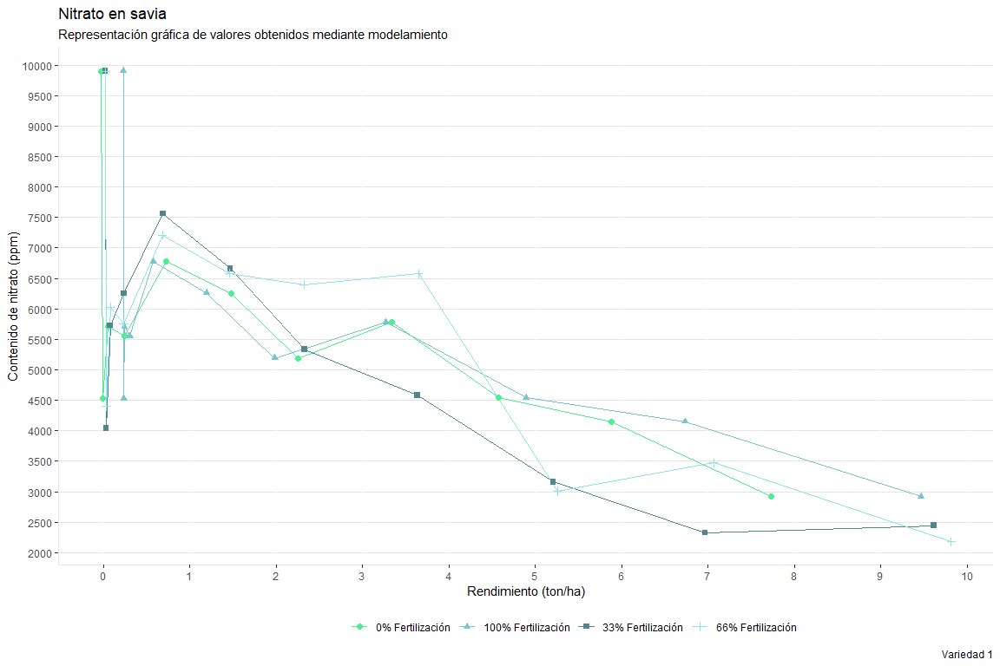<!-- -->

``` r
NO3CPI39 <-  Tabla_39%>%
  group_by(DDS,Tratamiento)%>%
  summarise(NITRATO=mean(NO3,na.rm=T),
            RENDIMIENTO=RENDIMIENTO,
            TRATAMIENTO=Tratamiento,
            SE=sd(NO3,na.rm=T)/sqrt(length(complete.cases(NO3))))

ggplot(NO3CPI39,aes(x=RENDIMIENTO, y=NITRATO, group = TRATAMIENTO, colour =TRATAMIENTO)) + 
  geom_line(size = 1)  +
  scale_y_continuous(breaks=seq(0,10000,500))+
  scale_x_continuous(breaks=seq(0,13,1))+
  labs(title="Nitrato en savia", subtitle="Representación gráfica de valores obtenidos mediante modelamiento",caption="Variedad 39", x="Rendimiento (ton/ha)", y="Contenido de nitrato (ppm)")+
  geom_point( size=2, fill="white") +
  scale_color_manual(values=c("seagreen2","cadetblue3","cadetblue4","cadetblue2"))+
  tema
```

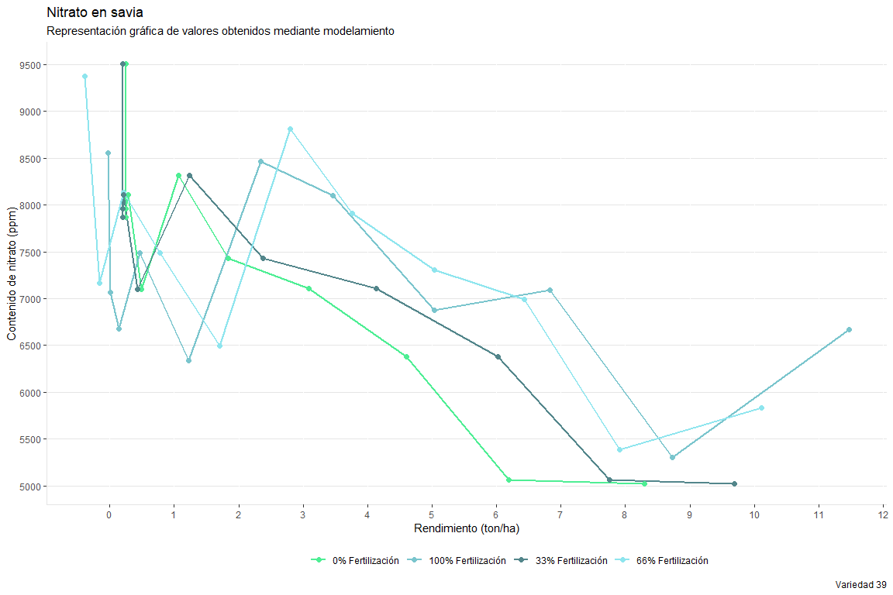<!-- -->

``` r
NO3CPI102 <-  Tabla_102%>%
  group_by(DDS,Tratamiento)%>%
  summarise(NITRATO=mean(NO3,na.rm=T),
            RENDIMIENTO=RENDIMIENTO,
            TRATAMIENTO=Tratamiento,
            SE=sd(NO3,na.rm=T)/sqrt(length(complete.cases(NO3))))

ggplot(NO3CPI102,aes(x=RENDIMIENTO, y=NITRATO, group = TRATAMIENTO, colour =TRATAMIENTO)) + 
  geom_line(size = 1)  +
  scale_y_continuous(breaks=seq(0,10000,500))+
  scale_x_continuous(breaks=seq(0,13,1))+
  labs(title="Nitrato en savia", subtitle="Representación gráfica de valores obtenidos mediante modelamiento",caption="Variedad 102", x="Rendimiento (ton/ha)", y="Contenido de nitrato (ppm)")+
  geom_point( size=2, fill="white") +
  scale_color_manual(values=c("seagreen2","cadetblue3","cadetblue4","cadetblue2"))+
  tema
```

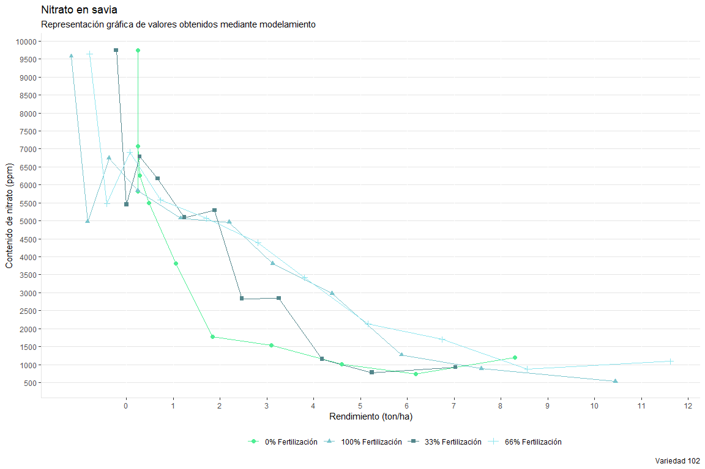<!-- -->

## Ca

### CPI 1

``` r
mccain_savia_0_1 <- mccain_savia %>%
  filter(Variedad =="CIP 1", Tratamiento =="0% Fertilización")%>%
  group_by(DDS,Variedad,Tratamiento)%>%
  summarise(Ca = mean(Ca, na.rm=T))

Tabla_0_1 <- cbind(mccain_savia_0_1$Variedad,Tabla_RENDIMIENTOs_savia_0_1, mccain_savia_0_1$Ca)
colnames(Tabla_0_1) <- c('Variedad','RENDIMIENTO','DDS','Tratamiento','Ca')

mccain_savia_33_1 <- mccain_savia %>%
  filter(Variedad =="CIP 1", Tratamiento =="33% Fertilización")%>%
  group_by(DDS,Variedad,Tratamiento)%>%
  summarise(Ca = mean(Ca, na.rm=T))

Tabla_33_1 <- cbind(mccain_savia_33_1$Variedad,Tabla_RENDIMIENTOs_savia_33_1, mccain_savia_33_1$Ca)
colnames(Tabla_33_1) <- c('Variedad','RENDIMIENTO','DDS','Tratamiento','Ca')

mccain_savia_66_1 <- mccain_savia %>%
  filter(Variedad =="CIP 1", Tratamiento =="66% Fertilización")%>%
  group_by(DDS,Variedad,Tratamiento)%>%
  summarise(Ca = mean(Ca, na.rm=T))

Tabla_66_1 <- cbind(mccain_savia_66_1$Variedad,Tabla_RENDIMIENTOs_savia_66_1, mccain_savia_66_1$Ca)
colnames(Tabla_66_1) <- c('Variedad','RENDIMIENTO','DDS','Tratamiento','Ca')

mccain_savia_100_1 <- mccain_savia %>%
  filter(Variedad =="CIP 1", Tratamiento =="100% Fertilización")%>%
  group_by(DDS,Variedad,Tratamiento)%>%
  summarise(Ca = mean(Ca, na.rm=T))

Tabla_100_1 <- cbind(mccain_savia_100_1$Variedad,Tabla_RENDIMIENTOs_savia_100_1, mccain_savia_100_1$Ca)
colnames(Tabla_100_1) <- c('Variedad','RENDIMIENTO','DDS','Tratamiento','Ca')

Tabla_1 <- rbind(Tabla_0_1,Tabla_33_1, Tabla_66_1, Tabla_100_1)

head(Tabla_1)
```

    ##   Variedad  RENDIMIENTO DDS      Tratamiento       Ca
    ## 1    CIP 1 -0.025824691  36 0% Fertilización 8.833333
    ## 2    CIP 1 -0.009921534  45 0% Fertilización 4.083333
    ## 3    CIP 1  0.055075669  53 0% Fertilización 4.000000
    ## 4    CIP 1  0.244713328  61 0% Fertilización 4.000000
    ## 5    CIP 1  0.728464325  70 0% Fertilización 4.000000
    ## 6    CIP 1  1.480209275  78 0% Fertilización 4.000000

### CIP 39

``` r
mccain_savia_0_39 <- mccain_savia %>%
  filter(Variedad =="CIP 39", Tratamiento =="0% Fertilización")%>%
  group_by(DDS,Variedad,Tratamiento)%>%
  summarise(Ca = mean(Ca, na.rm=T))

Tabla_0_39 <- cbind(mccain_savia_0_39$Variedad,Tabla_RENDIMIENTOs_savia_0_39, mccain_savia_0_39$Ca)
colnames(Tabla_0_39) <- c('Variedad','RENDIMIENTO','DDS','Tratamiento','Ca')

mccain_savia_33_39 <- mccain_savia %>%
  filter(Variedad =="CIP 39", Tratamiento =="33% Fertilización")%>%
  group_by(DDS,Variedad,Tratamiento)%>%
  summarise(Ca = mean(Ca, na.rm=T))

Tabla_33_39 <- cbind(mccain_savia_33_39$Variedad,Tabla_RENDIMIENTOs_savia_33_39, mccain_savia_33_39$Ca)
colnames(Tabla_33_39) <- c('Variedad','RENDIMIENTO','DDS','Tratamiento','Ca')

mccain_savia_66_39 <- mccain_savia %>%
  filter(Variedad =="CIP 39", Tratamiento =="66% Fertilización")%>%
  group_by(DDS,Variedad,Tratamiento)%>%
  summarise(Ca = mean(Ca, na.rm=T))

Tabla_66_39 <- cbind(mccain_savia_66_39$Variedad,Tabla_RENDIMIENTOs_savia_66_39, mccain_savia_66_39$Ca)
colnames(Tabla_66_39) <- c('Variedad','RENDIMIENTO','DDS','Tratamiento','Ca')

mccain_savia_100_39 <- mccain_savia %>%
  filter(Variedad =="CIP 39", Tratamiento =="100% Fertilización")%>%
  group_by(DDS,Variedad,Tratamiento)%>%
  summarise(Ca = mean(Ca, na.rm=T))

Tabla_100_39 <- cbind(mccain_savia_100_39$Variedad,Tabla_RENDIMIENTOs_savia_100_39, mccain_savia_100_39$Ca)
colnames(Tabla_100_39) <- c('Variedad','RENDIMIENTO','DDS','Tratamiento','Ca')

Tabla_39 <- rbind(Tabla_0_39,Tabla_33_39, Tabla_66_39, Tabla_100_39)

head(Tabla_39)
```

    ##   Variedad RENDIMIENTO DDS      Tratamiento        Ca
    ## 1   CIP 39   0.2484315  36 0% Fertilización 12.166667
    ## 2   CIP 39   0.2484856  45 0% Fertilización  6.416667
    ## 3   CIP 39   0.2507522  53 0% Fertilización  4.916667
    ## 4   CIP 39   0.2803753  61 0% Fertilización  4.000000
    ## 5   CIP 39   0.4884411  70 0% Fertilización  4.000000
    ## 6   CIP 39   1.0630792  78 0% Fertilización  4.000000

### CIP 102

``` r
mccain_savia_0_102 <- mccain_savia %>%
  filter(Variedad =="CIP 102", Tratamiento =="0% Fertilización")%>%
  group_by(DDS,Variedad,Tratamiento)%>%
  summarise(Ca = mean(Ca, na.rm=T))

Tabla_0_102 <- cbind(mccain_savia_0_102$Variedad,Tabla_RENDIMIENTOs_savia_0_102, mccain_savia_0_102$Ca)
colnames(Tabla_0_102) <- c('Variedad','RENDIMIENTO','DDS','Tratamiento','Ca')

mccain_savia_33_102 <- mccain_savia %>%
  filter(Variedad =="CIP 102", Tratamiento =="33% Fertilización")%>%
  group_by(DDS,Variedad,Tratamiento)%>%
  summarise(Ca = mean(Ca, na.rm=T))

Tabla_33_102 <- cbind(mccain_savia_33_102$Variedad,Tabla_RENDIMIENTOs_savia_33_102, mccain_savia_33_102$Ca)
colnames(Tabla_33_102) <- c('Variedad','RENDIMIENTO','DDS','Tratamiento','Ca')

mccain_savia_66_102 <- mccain_savia %>%
  filter(Variedad =="CIP 102", Tratamiento =="66% Fertilización")%>%
  group_by(DDS,Variedad,Tratamiento)%>%
  summarise(Ca = mean(Ca, na.rm=T))

Tabla_66_102 <- cbind(mccain_savia_66_102$Variedad,Tabla_RENDIMIENTOs_savia_66_102, mccain_savia_66_102$Ca)
colnames(Tabla_66_102) <- c('Variedad','RENDIMIENTO','DDS','Tratamiento','Ca')

mccain_savia_100_102 <- mccain_savia %>%
  filter(Variedad =="CIP 102", Tratamiento =="100% Fertilización")%>%
  group_by(DDS,Variedad,Tratamiento)%>%
  summarise(Ca = mean(Ca, na.rm=T))

Tabla_100_102 <- cbind(mccain_savia_100_102$Variedad,Tabla_RENDIMIENTOs_savia_100_102, mccain_savia_100_102$Ca)
colnames(Tabla_100_102) <- c('Variedad','RENDIMIENTO','DDS','Tratamiento','Ca')

Tabla_102 <- rbind(Tabla_0_102,Tabla_33_102, Tabla_66_102, Tabla_100_102)

head(Tabla_102)
```

    ##   Variedad RENDIMIENTO DDS      Tratamiento Ca
    ## 1  CIP 102   0.2484315  36 0% Fertilización  4
    ## 2  CIP 102   0.2484856  45 0% Fertilización  4
    ## 3  CIP 102   0.2507522  53 0% Fertilización  4
    ## 4  CIP 102   0.2803753  61 0% Fertilización  4
    ## 5  CIP 102   0.4884411  70 0% Fertilización  4
    ## 6  CIP 102   1.0630792  78 0% Fertilización  4

### Gráficos

``` r
CaCPI1 <-  Tabla_1%>%
  group_by(DDS,Tratamiento)%>%
  summarise(CALCIO=mean(Ca,na.rm=T),
            RENDIMIENTO=RENDIMIENTO,
            TRATAMIENTO=Tratamiento,
            SE=sd(Ca,na.rm=T)/sqrt(length(complete.cases(Ca))))

ggplot(CaCPI1,aes(x=RENDIMIENTO, y=CALCIO, group = TRATAMIENTO, colour =TRATAMIENTO)) + 
  geom_line(size = 1)  +
  scale_y_continuous(breaks=seq(0,20,1))+
  scale_x_continuous(breaks=seq(0,13,1))+
  labs(title="Calcio en savia", subtitle="Representación gráfica de valores obtenidos mediante modelamiento",caption="Variedad 1", x="Rendimiento (ton/ha)", y="Contenido de calcio (ppm)")+
  geom_point( size=2, fill="white") +
  scale_color_manual(values=c("seagreen2","cadetblue3","cadetblue4","cadetblue2"))+
  tema
```

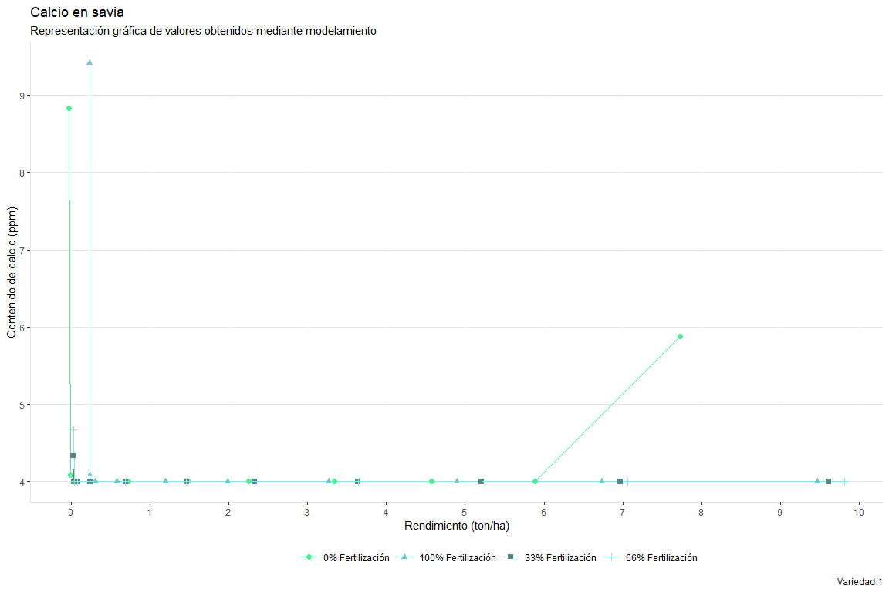<!-- -->

``` r
CaCPI39 <-  Tabla_39%>%
  group_by(DDS,Tratamiento)%>%
  summarise(CALCIO=mean(Ca,na.rm=T),
            RENDIMIENTO=RENDIMIENTO,
            TRATAMIENTO=Tratamiento,
            SE=sd(Ca,na.rm=T)/sqrt(length(complete.cases(Ca))))

ggplot(CaCPI39,aes(x=RENDIMIENTO, y=CALCIO, group = TRATAMIENTO, colour =TRATAMIENTO)) + 
  geom_line(size = 1)  +
  scale_y_continuous(breaks=seq(0,20,2))+
  scale_x_continuous(breaks=seq(0,13,1))+
  labs(title="Calcio en savia", subtitle="Representación gráfica de valores obtenidos mediante modelamiento",caption="Variedad 39", x="Rendimiento (ton/ha)", y="Contenido de calcio (ppm)")+
  geom_point( size=2, fill="white") +
  scale_color_manual(values=c("seagreen2","cadetblue3","cadetblue4","cadetblue2"))+
  tema
```

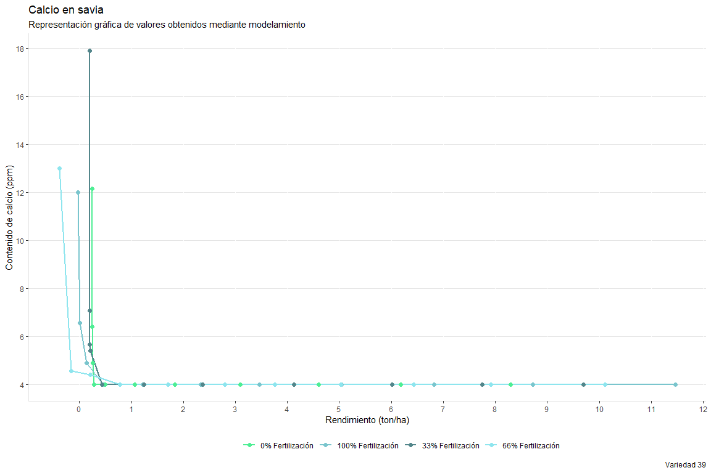<!-- -->

``` r
CaCPI102 <-  Tabla_102%>%
  group_by(DDS,Tratamiento)%>%
  summarise(CALCIO=mean(Ca,na.rm=T),
            RENDIMIENTO=RENDIMIENTO,
            TRATAMIENTO=Tratamiento,
            SE=sd(Ca,na.rm=T)/sqrt(length(complete.cases(Ca))))

ggplot(CaCPI102,aes(x=RENDIMIENTO, y=CALCIO, group = TRATAMIENTO, colour =TRATAMIENTO)) + 
  geom_line(size = 1)  +
  scale_y_continuous(breaks=seq(0,5,0.01))+
  scale_x_continuous(breaks=seq(0,13,1))+
  labs(title="Calcio en savia", subtitle="Representación gráfica de valores obtenidos mediante modelamiento",caption="Variedad 102", x="Rendimiento (ton/ha)", y="Contenido de calcio (ppm)")+
  geom_point( size=2, fill="white") +
  scale_color_manual(values=c("seagreen2","cadetblue3","cadetblue4","cadetblue2"))+
  tema
```

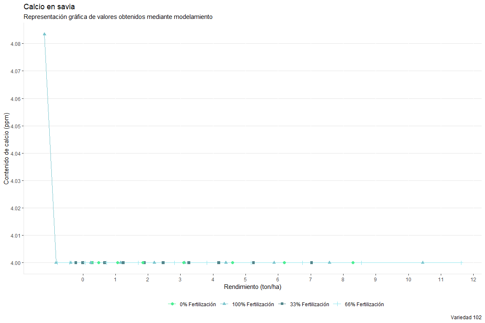<!-- -->

## K

### CPI 1

``` r
mccain_savia_0_1 <- mccain_savia %>%
  filter(Variedad =="CIP 1", Tratamiento =="0% Fertilización")%>%
  group_by(DDS,Variedad,Tratamiento)%>%
  summarise(K = mean(K, na.rm=T))

Tabla_0_1 <- cbind(mccain_savia_0_1$Variedad,Tabla_RENDIMIENTOs_savia_0_1, mccain_savia_0_1$K)
colnames(Tabla_0_1) <- c('Variedad','RENDIMIENTO','DDS','Tratamiento','K')

mccain_savia_33_1 <- mccain_savia %>%
  filter(Variedad =="CIP 1", Tratamiento =="33% Fertilización")%>%
  group_by(DDS,Variedad,Tratamiento)%>%
  summarise(K = mean(K, na.rm=T))

Tabla_33_1 <- cbind(mccain_savia_33_1$Variedad,Tabla_RENDIMIENTOs_savia_33_1, mccain_savia_33_1$K)
colnames(Tabla_33_1) <- c('Variedad','RENDIMIENTO','DDS','Tratamiento','K')

mccain_savia_66_1 <- mccain_savia %>%
  filter(Variedad =="CIP 1", Tratamiento =="66% Fertilización")%>%
  group_by(DDS,Variedad,Tratamiento)%>%
  summarise(K = mean(K, na.rm=T))

Tabla_66_1 <- cbind(mccain_savia_66_1$Variedad,Tabla_RENDIMIENTOs_savia_66_1, mccain_savia_66_1$K)
colnames(Tabla_66_1) <- c('Variedad','RENDIMIENTO','DDS','Tratamiento','K')

mccain_savia_100_1 <- mccain_savia %>%
  filter(Variedad =="CIP 1", Tratamiento =="100% Fertilización")%>%
  group_by(DDS,Variedad,Tratamiento)%>%
  summarise(K = mean(K, na.rm=T))

Tabla_100_1 <- cbind(mccain_savia_100_1$Variedad,Tabla_RENDIMIENTOs_savia_100_1, mccain_savia_100_1$K)
colnames(Tabla_100_1) <- c('Variedad','RENDIMIENTO','DDS','Tratamiento','K')

Tabla_1 <- rbind(Tabla_0_1,Tabla_33_1, Tabla_66_1, Tabla_100_1)

head(Tabla_1)
```

    ##   Variedad  RENDIMIENTO DDS      Tratamiento        K
    ## 1    CIP 1 -0.025824691  36 0% Fertilización 5508.333
    ## 2    CIP 1 -0.009921534  45 0% Fertilización 5375.000
    ## 3    CIP 1  0.055075669  53 0% Fertilización 7966.667
    ## 4    CIP 1  0.244713328  61 0% Fertilización 7625.000
    ## 5    CIP 1  0.728464325  70 0% Fertilización 6191.667
    ## 6    CIP 1  1.480209275  78 0% Fertilización 6183.333

### CIP 39

``` r
mccain_savia_0_39 <- mccain_savia %>%
  filter(Variedad =="CIP 39", Tratamiento =="0% Fertilización")%>%
  group_by(DDS,Variedad,Tratamiento)%>%
  summarise(K = mean(K, na.rm=T))

Tabla_0_39 <- cbind(mccain_savia_0_39$Variedad,Tabla_RENDIMIENTOs_savia_0_39, mccain_savia_0_39$K)
colnames(Tabla_0_39) <- c('Variedad','RENDIMIENTO','DDS','Tratamiento','K')

mccain_savia_33_39 <- mccain_savia %>%
  filter(Variedad =="CIP 39", Tratamiento =="33% Fertilización")%>%
  group_by(DDS,Variedad,Tratamiento)%>%
  summarise(K = mean(K, na.rm=T))

Tabla_33_39 <- cbind(mccain_savia_33_39$Variedad,Tabla_RENDIMIENTOs_savia_33_39, mccain_savia_33_39$K)
colnames(Tabla_33_39) <- c('Variedad','RENDIMIENTO','DDS','Tratamiento','K')

mccain_savia_66_39 <- mccain_savia %>%
  filter(Variedad =="CIP 39", Tratamiento =="66% Fertilización")%>%
  group_by(DDS,Variedad,Tratamiento)%>%
  summarise(K = mean(K, na.rm=T))

Tabla_66_39 <- cbind(mccain_savia_66_39$Variedad,Tabla_RENDIMIENTOs_savia_66_39, mccain_savia_66_39$K)
colnames(Tabla_66_39) <- c('Variedad','RENDIMIENTO','DDS','Tratamiento','K')

mccain_savia_100_39 <- mccain_savia %>%
  filter(Variedad =="CIP 39", Tratamiento =="100% Fertilización")%>%
  group_by(DDS,Variedad,Tratamiento)%>%
  summarise(K = mean(K, na.rm=T))

Tabla_100_39 <- cbind(mccain_savia_100_39$Variedad,Tabla_RENDIMIENTOs_savia_100_39, mccain_savia_100_39$K)
colnames(Tabla_100_39) <- c('Variedad','RENDIMIENTO','DDS','Tratamiento','K')

Tabla_39 <- rbind(Tabla_0_39,Tabla_33_39, Tabla_66_39, Tabla_100_39)

head(Tabla_39)
```

    ##   Variedad RENDIMIENTO DDS      Tratamiento        K
    ## 1   CIP 39   0.2484315  36 0% Fertilización 4483.333
    ## 2   CIP 39   0.2484856  45 0% Fertilización 5041.667
    ## 3   CIP 39   0.2507522  53 0% Fertilización 7508.333
    ## 4   CIP 39   0.2803753  61 0% Fertilización 6966.667
    ## 5   CIP 39   0.4884411  70 0% Fertilización 6250.000
    ## 6   CIP 39   1.0630792  78 0% Fertilización 5900.000

### CIP 102

``` r
mccain_savia_0_102 <- mccain_savia %>%
  filter(Variedad =="CIP 102", Tratamiento =="0% Fertilización")%>%
  group_by(DDS,Variedad,Tratamiento)%>%
  summarise(K = mean(K, na.rm=T))

Tabla_0_102 <- cbind(mccain_savia_0_102$Variedad,Tabla_RENDIMIENTOs_savia_0_102, mccain_savia_0_102$K)
colnames(Tabla_0_102) <- c('Variedad','RENDIMIENTO','DDS','Tratamiento','K')

mccain_savia_33_102 <- mccain_savia %>%
  filter(Variedad =="CIP 102", Tratamiento =="33% Fertilización")%>%
  group_by(DDS,Variedad,Tratamiento)%>%
  summarise(K = mean(K, na.rm=T))

Tabla_33_102 <- cbind(mccain_savia_33_102$Variedad,Tabla_RENDIMIENTOs_savia_33_102, mccain_savia_33_102$K)
colnames(Tabla_33_102) <- c('Variedad','RENDIMIENTO','DDS','Tratamiento','K')

mccain_savia_66_102 <- mccain_savia %>%
  filter(Variedad =="CIP 102", Tratamiento =="66% Fertilización")%>%
  group_by(DDS,Variedad,Tratamiento)%>%
  summarise(K = mean(K, na.rm=T))

Tabla_66_102 <- cbind(mccain_savia_66_102$Variedad,Tabla_RENDIMIENTOs_savia_66_102, mccain_savia_66_102$K)
colnames(Tabla_66_102) <- c('Variedad','RENDIMIENTO','DDS','Tratamiento','K')

mccain_savia_100_102 <- mccain_savia %>%
  filter(Variedad =="CIP 102", Tratamiento =="100% Fertilización")%>%
  group_by(DDS,Variedad,Tratamiento)%>%
  summarise(K = mean(K, na.rm=T))

Tabla_100_102 <- cbind(mccain_savia_100_102$Variedad,Tabla_RENDIMIENTOs_savia_100_102, mccain_savia_100_102$K)
colnames(Tabla_100_102) <- c('Variedad','RENDIMIENTO','DDS','Tratamiento','K')

Tabla_102 <- rbind(Tabla_0_102, Tabla_33_102, Tabla_66_102, Tabla_100_102)

head(Tabla_102)
```

    ##   Variedad RENDIMIENTO DDS      Tratamiento        K
    ## 1  CIP 102   0.2484315  36 0% Fertilización 5800.000
    ## 2  CIP 102   0.2484856  45 0% Fertilización 5433.333
    ## 3  CIP 102   0.2507522  53 0% Fertilización 8208.333
    ## 4  CIP 102   0.2803753  61 0% Fertilización 7175.000
    ## 5  CIP 102   0.4884411  70 0% Fertilización 6480.000
    ## 6  CIP 102   1.0630792  78 0% Fertilización 6033.333

### Gráficos

``` r
KCPI1 <-  Tabla_1%>%
  group_by(DDS,Tratamiento)%>%
  summarise(POTASIO=mean(K,na.rm=T),
            RENDIMIENTO=RENDIMIENTO,
            TRATAMIENTO=Tratamiento,
            SE=sd(K,na.rm=T)/sqrt(length(complete.cases(K))))

ggplot(KCPI1,aes(x=RENDIMIENTO, y=POTASIO, group = TRATAMIENTO, colour =TRATAMIENTO)) + 
  geom_line(size = 1)  +
  scale_y_continuous(breaks=seq(0,10000,500))+
  scale_x_continuous(breaks=seq(0,13,1))+
  labs(title="Potasio en savia", subtitle="Representación gráfica de valores obtenidos mediante modelamiento",caption="Variedad 1", x="Rendimiento (ton/ha)", y="Contenido de potasio (ppm)")+
  geom_point( size=2, fill="white") +
  scale_color_manual(values=c("seagreen2","cadetblue3","cadetblue4","cadetblue2"))+
  tema
```

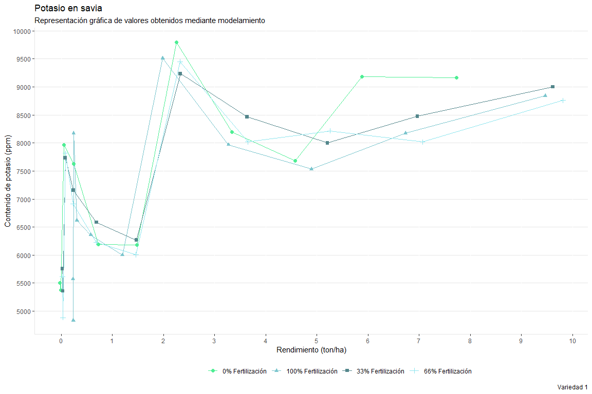<!-- -->

``` r
KCPI39 <-  Tabla_39%>%
  group_by(DDS,Tratamiento)%>%
  summarise(POTASIO=mean(K,na.rm=T),
            RENDIMIENTO=RENDIMIENTO,
            TRATAMIENTO=Tratamiento,
            SE=sd(K,na.rm=T)/sqrt(length(complete.cases(K))))

ggplot(KCPI39,aes(x=RENDIMIENTO, y=POTASIO, group = TRATAMIENTO, colour =TRATAMIENTO)) + 
  geom_line(size = 1)  +
  scale_y_continuous(breaks=seq(0,10000,500))+
  scale_x_continuous(breaks=seq(0,13,1))+
  labs(title="Potasio en savia", subtitle="Representación gráfica de valores obtenidos mediante modelamiento",caption="Variedad 39", x="Rendimiento (ton/ha)", y="Contenido de potasio (ppm)")+
  geom_point( size=2, fill="white") +
  scale_color_manual(values=c("seagreen2","cadetblue3","cadetblue4","cadetblue2"))+
  tema
```

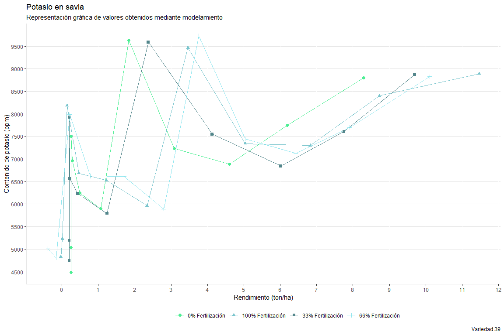<!-- -->

``` r
KCPI102 <-  Tabla_102%>%
  group_by(DDS,Tratamiento)%>%
  summarise(POTASIO=mean(K,na.rm=T),
            RENDIMIENTO=RENDIMIENTO,
            TRATAMIENTO=Tratamiento,
            SE=sd(K,na.rm=T)/sqrt(length(complete.cases(K))))

ggplot(KCPI102,aes(x=RENDIMIENTO, y=POTASIO, group = TRATAMIENTO, colour =TRATAMIENTO)) + 
  geom_line(size = 1)  +
  scale_y_continuous(breaks=seq(0,10000,500))+
  scale_x_continuous(breaks=seq(0,13,1))+
  labs(title="Potasio en savia", subtitle="Representación gráfica de valores obtenidos mediante modelamiento",caption="Variedad 102", x="Rendimiento (ton/ha)", y="Contenido de potasio (ppm)")+
  geom_point( size=2, fill="white") +
  scale_color_manual(values=c("seagreen2","cadetblue3","cadetblue4","cadetblue2"))+
  tema
```

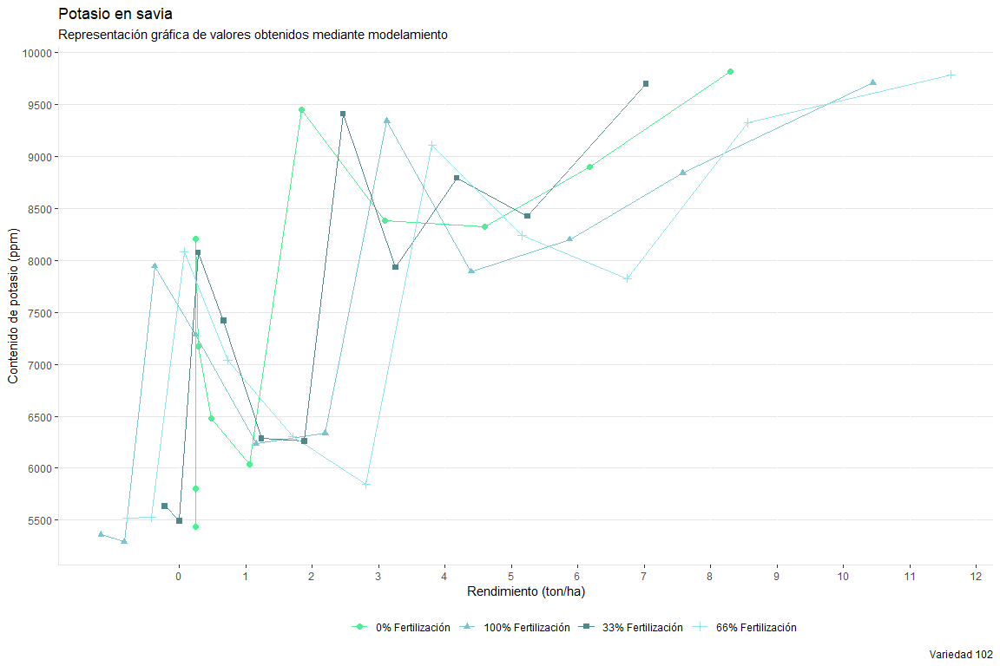<!-- -->

De esta forma, hemos logrado correlacionar la información existente de
un cultivo, segmentada temporalmente, implementando técnicas de análisis
exploratorio de datos, manejo de dataframes y modelamiento de
información.
