Análisis de contenido de nutrientes en savia, y su relación con el
rendimiento en plantas de Solnum tuberosum
================
true

``` r
knitr::opts_chunk$set(fig.width=12, fig.height=8)
```

``` r
setwd("C:/Users/david/OneDrive/Escritorio/Personal/R")
```

### 1) CONTENIDO EN SAVIA EN EL TIEMPO

``` r
library(readxl)
mccain_savia <- read_excel("C:/Users/david/OneDrive/Escritorio/Personal/R/mccain_savia.xlsx")
head(mccain_savia)
```

    ## # A tibble: 6 × 11
    ##   Fecha               Variedad   DDS Muest…¹ Trata…² Repet…³ Muestra    Ca     K
    ##   <dttm>              <chr>    <dbl>   <dbl> <chr>     <dbl>   <dbl> <dbl> <dbl>
    ## 1 2021-10-16 00:00:00 CIP 1       36       1 100% F…       1       1     4  5500
    ## 2 2021-10-16 00:00:00 CIP 1       36       1 100% F…       1       2     4  5800
    ## 3 2021-10-16 00:00:00 CIP 1       36       1 100% F…       1       3     8  5600
    ## 4 2021-10-16 00:00:00 CIP 1       36       1 100% F…       2       1    23  5700
    ## 5 2021-10-16 00:00:00 CIP 1       36       1 100% F…       2       2    17  5800
    ## 6 2021-10-16 00:00:00 CIP 1       36       1 100% F…       2       3    32  5700
    ## # … with 2 more variables: NO3 <dbl>, MATERIA_SECA <lgl>, and abbreviated
    ## #   variable names ¹​Muestreo, ²​Tratamiento, ³​Repetición

Inicialmente, se realiza un análisis exploratorio del dataframe
utilizado, para tener claridad sobre las variables a implementar
posteriormente.

``` r
names(mccain_savia)
```

    ##  [1] "Fecha"        "Variedad"     "DDS"          "Muestreo"     "Tratamiento" 
    ##  [6] "Repetición"   "Muestra"      "Ca"           "K"            "NO3"         
    ## [11] "MATERIA_SECA"

``` r
library(ggplot2)

tema <-   theme(legend.position="bottom",panel.background = element_rect(fill = NA),panel.grid.major.y = element_line(colour = "grey90"),legend.key = element_rect(fill = "white"),axis.line = element_line(colour = "grey90"),legend.title = element_text(colour = "white"))
```

### ELMENTOS EN SAVIA

``` r
library(dplyr)
```

    ## 
    ## Attaching package: 'dplyr'

    ## The following objects are masked from 'package:stats':
    ## 
    ##     filter, lag

    ## The following objects are masked from 'package:base':
    ## 
    ##     intersect, setdiff, setequal, union

``` r
# Define una función para simplificar el proceso de creación de gráficos
crear_grafico <- function(datos, variedad, variable) {
  nombre_variable <- as.character(substitute(variable))  # Obtener el nombre de la variable
  
  datos %>%
    filter(Variedad == variedad) %>%
    group_by(DDS, Tratamiento) %>%
    summarise(Variable = mean({{variable}}, na.rm = TRUE),
              DDS = DDS,
              TRATAMIENTO = Tratamiento,
              SE = sd({{variable}}, na.rm = TRUE) / sqrt(sum({{variable}}))) %>%
    ggplot(aes(x = DDS, y = Variable, group = TRATAMIENTO, colour = TRATAMIENTO, shape = TRATAMIENTO)) +
    geom_errorbar(aes(ymin = Variable - 2 * SE, ymax = Variable + 2 * SE), width = 1) +
    geom_line(size = 0.5) +
    scale_y_continuous(breaks = seq(0, 10000, 500)) +
    scale_x_continuous(breaks = seq(0, 150, 15)) +
    labs(title = paste(nombre_variable, "en savia - Variedad", variedad),
         subtitle = paste("Representación gráfica de medias para la variedad", variedad),
         caption = paste("Variedad", variedad),
         x = "DDS", y = paste("Contenido de", nombre_variable, "(ppm)")) +
    geom_point(size = 2, fill = "white") +
    scale_color_manual(values = c("seagreen2", "cadetblue3", "cadetblue4", "cadetblue2")) +
    tema
}

# Llamar a la función para cada variedad
grafico_variedad_1_NO3 <- crear_grafico(mccain_savia, "CIP 1", NO3)
```

    ## `summarise()` has grouped output by 'DDS', 'Tratamiento'. You can override
    ## using the `.groups` argument.

    ## Warning: Using `size` aesthetic for lines was deprecated in ggplot2 3.4.0.
    ## ℹ Please use `linewidth` instead.

``` r
grafico_variedad_1_K <- crear_grafico(mccain_savia, "CIP 1", K)
```

    ## `summarise()` has grouped output by 'DDS', 'Tratamiento'. You can override
    ## using the `.groups` argument.

``` r
grafico_variedad_1_Ca <- crear_grafico(mccain_savia, "CIP 1", Ca)
```

    ## `summarise()` has grouped output by 'DDS', 'Tratamiento'. You can override
    ## using the `.groups` argument.

``` r
grafico_variedad_39_NO3 <- crear_grafico(mccain_savia, "CIP 39", NO3)
```

    ## `summarise()` has grouped output by 'DDS', 'Tratamiento'. You can override
    ## using the `.groups` argument.

``` r
grafico_variedad_39_K <- crear_grafico(mccain_savia, "CIP 39", K)
```

    ## `summarise()` has grouped output by 'DDS', 'Tratamiento'. You can override
    ## using the `.groups` argument.

``` r
grafico_variedad_39_Ca <- crear_grafico(mccain_savia, "CIP 39", Ca)
```

    ## `summarise()` has grouped output by 'DDS', 'Tratamiento'. You can override
    ## using the `.groups` argument.

``` r
grafico_variedad_102_NO3 <- crear_grafico(mccain_savia, "CIP 102", NO3)
```

    ## `summarise()` has grouped output by 'DDS', 'Tratamiento'. You can override
    ## using the `.groups` argument.

``` r
grafico_variedad_102_K <- crear_grafico(mccain_savia, "CIP 102", K)
```

    ## `summarise()` has grouped output by 'DDS', 'Tratamiento'. You can override
    ## using the `.groups` argument.

``` r
grafico_variedad_102_Ca <- crear_grafico(mccain_savia, "CIP 102", Ca)
```

    ## `summarise()` has grouped output by 'DDS', 'Tratamiento'. You can override
    ## using the `.groups` argument.

``` r
grafico_variedad_1_NO3
```

<!-- -->

``` r
grafico_variedad_1_K
```

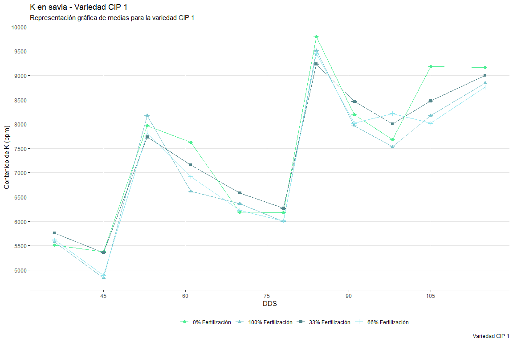<!-- -->

``` r
grafico_variedad_1_Ca
```

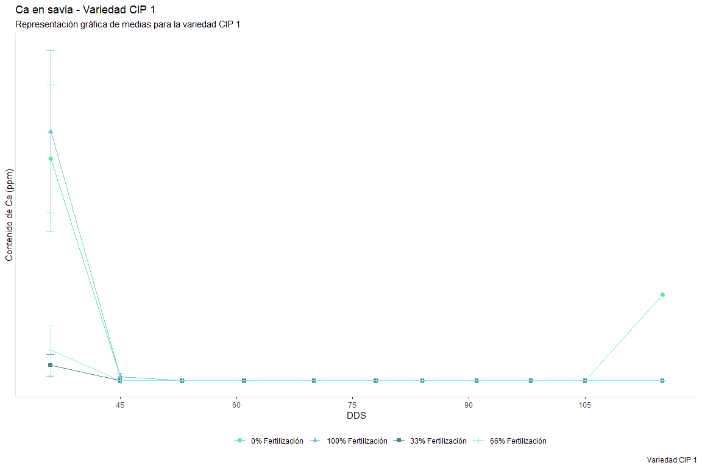<!-- -->

``` r
grafico_variedad_39_NO3
```

<!-- -->

``` r
grafico_variedad_39_K
```

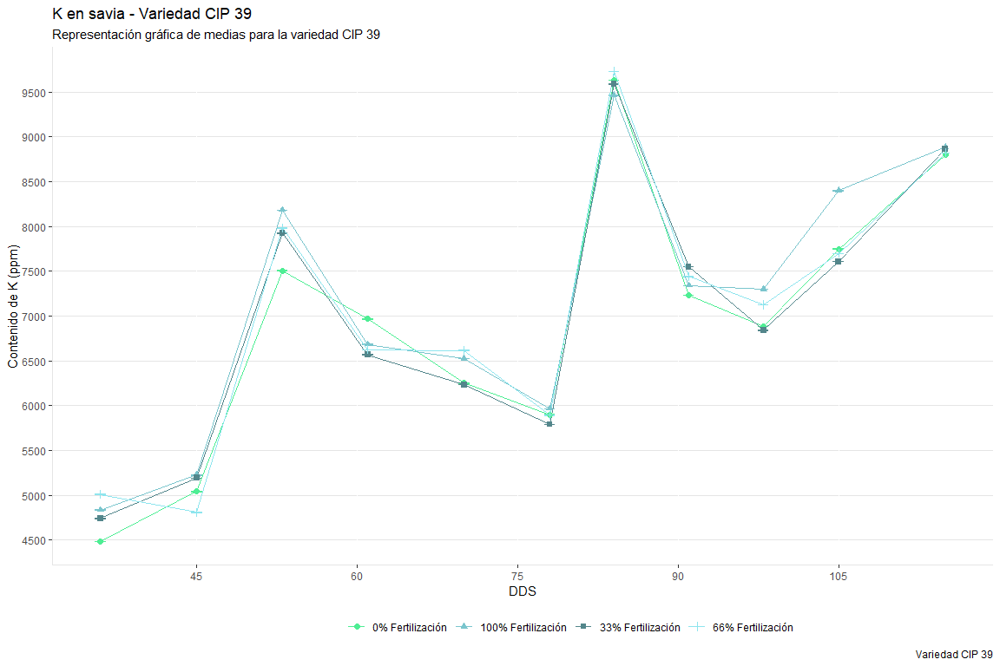<!-- -->

``` r
grafico_variedad_39_Ca
```

<!-- -->

``` r
grafico_variedad_102_NO3
```

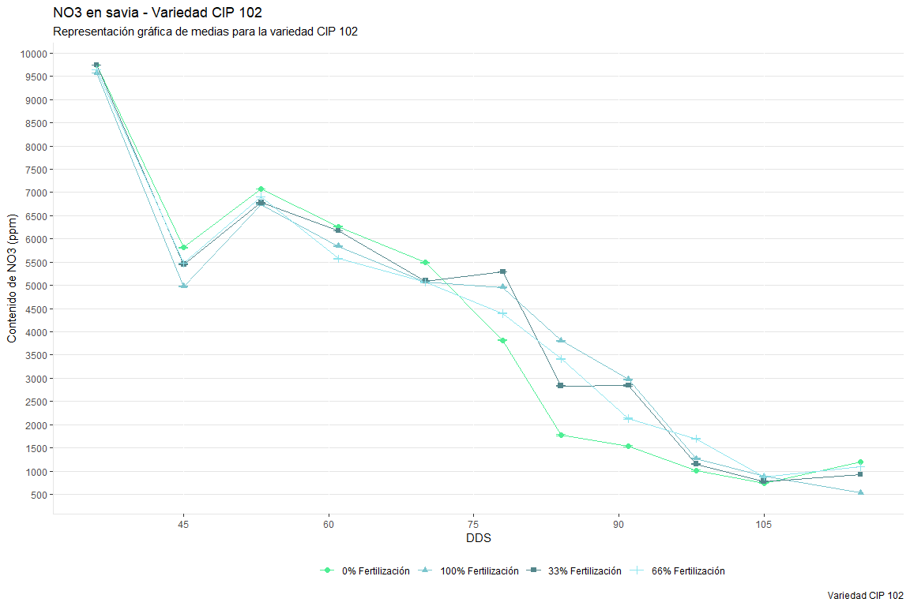<!-- -->

``` r
grafico_variedad_102_K
```

<!-- -->

``` r
grafico_variedad_102_Ca
```

<!-- -->

### 2) MODELO PESOS SECOS

``` r
library(readxl)
datos_masa_seca <- read_excel("C:/Users/david/OneDrive/Escritorio/Personal/R/masa_seca.xlsx")
head(datos_masa_seca)
```

    ## # A tibble: 6 × 9
    ##   VARIEDAD TRATAMIENTO.      DDS REPET…¹ PESO_…² PESO_…³ PESO_…⁴ PROPO…⁵ REND_…⁶
    ##      <dbl> <chr>           <dbl>   <dbl>   <dbl>   <dbl>   <dbl>   <dbl>   <dbl>
    ## 1        1 100% Fertiliza…    43       1    16.9    4.22   0.151  0       0     
    ## 2        1 100% Fertiliza…    43       2    30      7.5    0.268  0       0     
    ## 3        1 100% Fertiliza…    43       3    15.8    3.96   0.141  0       0     
    ## 4        1 100% Fertiliza…    43       4    30.2    7.56   0.270  0       0     
    ## 5        1 100% Fertiliza…    60       1    73.0   18.3    0.652  0.0305  0.0199
    ## 6        1 100% Fertiliza…    60       2   229.    57.1    2.04   0.218   0.444 
    ## # … with abbreviated variable names ¹​REPETICION, ²​PESO_TOTAL, ³​PESO_UNIDAD,
    ## #   ⁴​`PESO_HA _(TON_HA)`, ⁵​PROPORCION_TUB, ⁶​REND_TUB_TON_HA

``` r
names(datos_masa_seca)
```

    ## [1] "VARIEDAD"          "TRATAMIENTO."      "DDS"              
    ## [4] "REPETICION"        "PESO_TOTAL"        "PESO_UNIDAD"      
    ## [7] "PESO_HA _(TON_HA)" "PROPORCION_TUB"    "REND_TUB_TON_HA"

### VARIEDAD 1

``` r
library(dplyr)

masa_seca_1 <- datos_masa_seca %>% 
  filter(VARIEDAD=="1")%>%
  group_by(DDS,TRATAMIENTO.)%>%
  summarise(PESO_TOTAL=mean(PESO_TOTAL,na.rm = T),
            DDS=DDS,
            TRATAMIENTO=TRATAMIENTO.)
```

    ## `summarise()` has grouped output by 'DDS', 'TRATAMIENTO.'. You can override
    ## using the `.groups` argument.

``` r
ggplot() + geom_point(data=masa_seca_1, aes(x=DDS, y = PESO_TOTAL, group = TRATAMIENTO., colour = TRATAMIENTO.)) + 
  xlab("DDS") + 
  ylab("PESO TOTAL") + 
  ggtitle("") +
  tema
```

<!-- -->

``` r
Gompertz <- function(x, y0, ymax, k, lag){
  result<- y0 + ymax*exp(-exp(k*(lag-x)/(ymax-y0) + 1))
  return(result)
}

masa_seca_100_1 <- datos_masa_seca %>%
  filter(VARIEDAD =="1",TRATAMIENTO.=="100% Fertilización")%>%
  group_by(DDS, TRATAMIENTO.)%>%
  summarise(PESO_TOTAL_100_1=PESO_TOTAL,
            DDS_100_1=DDS,
            TRATAMIENTO=TRATAMIENTO.)
```

    ## `summarise()` has grouped output by 'DDS', 'TRATAMIENTO.'. You can override
    ## using the `.groups` argument.

``` r
Gomp_100_1 <- nls(PESO_TOTAL_100_1 ~ Gompertz(DDS_100_1, y0, ymax, k, lag),
             data=masa_seca_100_1,
             start = list(y0=15, ymax=2500, k=10, lag=1))

masa_seca_66_1 <- datos_masa_seca %>%
  filter(VARIEDAD =="1",TRATAMIENTO.=="66% Fertilización")%>%
  group_by(DDS, TRATAMIENTO.)%>%
  summarise(PESO_TOTAL_66_1=PESO_TOTAL,
            DDS_66_1=DDS,
            TRATAMIENTO=TRATAMIENTO.)
```

    ## `summarise()` has grouped output by 'DDS', 'TRATAMIENTO.'. You can override
    ## using the `.groups` argument.

``` r
Gomp_66_1 <- nls(PESO_TOTAL_66_1 ~ Gompertz(DDS_66_1, y0, ymax, k, lag),
             data=masa_seca_66_1,
             start = list(y0=31, ymax=2100, k=15, lag=1))

masa_seca_33_1 <- datos_masa_seca %>%
  filter(VARIEDAD =="1",TRATAMIENTO.=="33% Fertilización")%>%
  group_by(DDS, TRATAMIENTO.)%>%
  summarise(PESO_TOTAL_33_1=PESO_TOTAL,
            DDS_33_1=DDS,
            TRATAMIENTO=TRATAMIENTO.)
```

    ## `summarise()` has grouped output by 'DDS', 'TRATAMIENTO.'. You can override
    ## using the `.groups` argument.

``` r
Gomp_33_1 <- nls(PESO_TOTAL_33_1 ~ Gompertz(DDS_33_1, y0, ymax, k, lag),
             data=masa_seca_33_1,
             start = list(y0=21, ymax=2200, k=15, lag=1))

masa_seca_0_1 <- datos_masa_seca %>%
  filter(VARIEDAD =="1",TRATAMIENTO.=="0% Fertilización")%>%
  group_by(DDS, TRATAMIENTO.)%>%
  summarise(PESO_TOTAL_0_1=PESO_TOTAL,
            DDS_0_1=DDS,
            TRATAMIENTO=TRATAMIENTO.)
```

    ## `summarise()` has grouped output by 'DDS', 'TRATAMIENTO.'. You can override
    ## using the `.groups` argument.

``` r
Gomp_0_1 <- nls(PESO_TOTAL_0_1 ~ Gompertz(DDS_0_1, y0, ymax, k, lag),
             data=masa_seca_0_1,
             start = list(y0=-7, ymax=1700, k=10, lag=1))
```

``` r
coefs_100_1 <- coef(Gomp_100_1)
y0_100_1 = coefs_100_1[1]
ymax_100_1=coefs_100_1[2]
k_100_1=coefs_100_1[3]
lag_100_1=coefs_100_1[4]

coefs_100_1
```

    ##          y0        ymax           k         lag 
    ##    1.387849 2057.881732   77.494638   57.722265

``` r
coefs_66_1 <- coef(Gomp_66_1)
y0_66_1 = coefs_66_1[1]
ymax_66_1=coefs_66_1[2]
k_66_1=coefs_66_1[3]
lag_66_1=coefs_66_1[4]

coefs_66_1
```

    ##         y0       ymax          k        lag 
    ##  -38.24123 2387.35844   74.54711   54.75422

``` r
coefs_33_1 <- coef(Gomp_33_1)
y0_33_1 = coefs_33_1[1]
ymax_33_1=coefs_33_1[2]
k_33_1=coefs_33_1[3]
lag_33_1=coefs_33_1[4]

coefs_33_1
```

    ##         y0       ymax          k        lag 
    ##  -21.89891 2218.96587   75.02687   55.70686

``` r
coefs_0_1 <- coef(Gomp_0_1)
y0_0_1 = coefs_0_1[1]
ymax_0_1= coefs_0_1[2]
k_0_1 = coefs_0_1[3]
lag_0_1 = coefs_0_1[4]

coefs_0_1
```

    ##          y0        ymax           k         lag 
    ##    8.705103 1482.380971   61.599052   55.830652

``` r
DDS_LEVELS <- seq(0,150,by=1)

par(mfrow=c(2,2))

pred <- predict(Gomp_100_1, list(x=DDS_LEVELS))
plot(PESO_TOTAL_100_1~DDS_100_1, data=masa_seca_100_1, xlim=c(0,150), ylim=c(0,2600),
     xlab="DDS", ylab="Peso total (g)")
lines(DDS_LEVELS, Gompertz(DDS_LEVELS, y0_100_1, ymax_100_1, k_100_1, lag_100_1),
      lty=1, col="cadetblue3", lwd = 2)

pred <- predict(Gomp_66_1, list(x=DDS_LEVELS))
plot(PESO_TOTAL_66_1~DDS_66_1, data=masa_seca_66_1, xlim=c(0,150), ylim=c(0,2600),
     xlab="DDS", ylab="Peso total (g)")
lines(DDS_LEVELS, Gompertz(DDS_LEVELS, y0_66_1, ymax_66_1, k_66_1, lag_66_1),
      lty=1, col="cadetblue2", lwd = 2)

pred <- predict(Gomp_33_1, list(x=DDS_LEVELS))
plot(PESO_TOTAL_33_1~DDS_33_1, data=masa_seca_33_1, xlim=c(0,150), ylim=c(0,2600),
     xlab="DDS", ylab="Peso total (g)")
lines(DDS_LEVELS, Gompertz(DDS_LEVELS, y0_33_1, ymax_33_1, k_33_1, lag_33_1),
      lty=1, col="cadetblue4", lwd = 2)

pred <- predict(Gomp_0_1, list(x=DDS_LEVELS))
plot(PESO_TOTAL_0_1~DDS_0_1, data=masa_seca_0_1, xlim=c(0,150), ylim=c(0,2600),
     xlab="DDS", ylab="Peso total (g)")
lines(DDS_LEVELS, Gompertz(DDS_LEVELS, y0_0_1, ymax_0_1, k_0_1, lag_0_1),
      lty=1, col="seagreen2", lwd = 2)
```

<!-- -->

``` r
par(mfrow=c(1,1))

plot(PESO_TOTAL~DDS, data=masa_seca_1, xlim=c(0,150), ylim=c(0,2600),
     xlab="DDS", ylab="Peso total (g)")
lines(DDS_LEVELS, Gompertz(DDS_LEVELS, y0_100_1, ymax_100_1, k_100_1, lag_100_1),
      lty=1, col="cadetblue3", lwd = 2)
lines(DDS_LEVELS, Gompertz(DDS_LEVELS, y0_66_1, ymax_66_1, k_66_1, lag_66_1),
      lty=1, col="cadetblue2", lwd = 2)
lines(DDS_LEVELS, Gompertz(DDS_LEVELS, y0_33_1, ymax_33_1, k_33_1, lag_33_1),
      lty=1, col="cadetblue4", lwd = 2)
lines(DDS_LEVELS, Gompertz(DDS_LEVELS, y0_0_1, ymax_0_1, k_0_1, lag_0_1),
      lty=1, col="seagreen2", lwd = 2)
legend("topleft",legend=c("100% Fertilización", "66% Fertilización", "33% Fertilización", "0% Fertilización"), lwd = 3, col = c("cadetblue3","cadetblue2","cadetblue4","seagreen2"))
```

<!-- -->

``` r
pesos_savia_100_1 <- Gompertz(c(36,45,53,61,70,78,84,91,98,105,115),y0_100_1,ymax_100_1,k_100_1,lag_100_1)
DDS_100_1 <- c(36,45,53,61,70,78,84,91,98,105,115)
TRATAMIENTO_100_1 <- rep("100% Fertilización",11)
Tabla_pesos_savia_100_1 <- data.frame(pesos_savia_100_1,DDS_100_1,TRATAMIENTO_100_1)
Tabla_pesos_savia_100_1
```

    ##    pesos_savia_100_1 DDS_100_1  TRATAMIENTO_100_1
    ## 1           5.721753        36 100% Fertilización
    ## 2          26.897839        45 100% Fertilización
    ## 3          81.363913        53 100% Fertilización
    ## 4         187.619445        61 100% Fertilización
    ## 5         373.049929        70 100% Fertilización
    ## 6         581.612147        78 100% Fertilización
    ## 7         751.037173        84 100% Fertilización
    ## 8         948.807045        91 100% Fertilización
    ## 9        1135.484281        98 100% Fertilización
    ## 10       1303.498509       105 100% Fertilización
    ## 11       1504.723028       115 100% Fertilización

``` r
pesos_savia_66_1 <- Gompertz(c(36,45,53,61,70,78,84,91,98,105,115),y0_66_1,ymax_66_1,k_66_1,lag_66_1)
DDS_66_1 <- c(36,45,53,61,70,78,84,91,98,105,115)
TRATAMIENTO_66_1 <- rep("66% Fertilización",11)
Tabla_pesos_savia_66_1 <- data.frame(pesos_savia_66_1,DDS_66_1,TRATAMIENTO_66_1)
Tabla_pesos_savia_66_1
```

    ##    pesos_savia_66_1 DDS_66_1  TRATAMIENTO_66_1
    ## 1         -19.31557       36 66% Fertilización
    ## 2          22.67193       45 66% Fertilización
    ## 3          97.27439       53 66% Fertilización
    ## 4         215.02064       61 66% Fertilización
    ## 5         397.28500       70 66% Fertilización
    ## 6         592.82700       78 66% Fertilización
    ## 7         751.31563       84 66% Fertilización
    ## 8         939.89405       91 66% Fertilización
    ## 9        1124.30361       98 66% Fertilización
    ## 10       1298.04933      105 66% Fertilización
    ## 11       1519.81605      115 66% Fertilización

``` r
pesos_savia_33_1 <- Gompertz(c(36,45,53,61,70,78,84,91,98,105,115),y0_33_1,ymax_33_1,k_33_1,lag_33_1)
DDS_33_1 <- c(36,45,53,61,70,78,84,91,98,105,115)
TRATAMIENTO_33_1 <- rep("33% Fertilización",11)
Tabla_pesos_savia_33_1 <- data.frame(pesos_savia_33_1,DDS_33_1,TRATAMIENTO_33_1)
Tabla_pesos_savia_33_1
```

    ##    pesos_savia_33_1 DDS_33_1  TRATAMIENTO_33_1
    ## 1         -10.35121       36 33% Fertilización
    ## 2          23.45632       45 33% Fertilización
    ## 3          91.24389       53 33% Fertilización
    ## 4         205.78932       61 33% Fertilización
    ## 5         389.81583       70 33% Fertilización
    ## 6         589.73987       78 33% Fertilización
    ## 7         751.40417       84 33% Fertilización
    ## 8         941.92559       91 33% Fertilización
    ## 9        1125.36260       98 33% Fertilización
    ## 10       1294.89657      105 33% Fertilización
    ## 11       1505.67225      115 33% Fertilización

``` r
pesos_savia_0_1 <- Gompertz(c(36,45,53,61,70,78,84,91,98,105,115),y0_0_1,ymax_0_1,k_0_1,lag_0_1)
DDS_0_1 <- c(36,45,53,61,70,78,84,91,98,105,115)
TRATAMIENTO_0_1 <- rep("0% Fertilización",11)
Tabla_pesos_savia_0_1 <- data.frame(pesos_savia_0_1,DDS_0_1,TRATAMIENTO_0_1)
Tabla_pesos_savia_0_1
```

    ##    pesos_savia_0_1 DDS_0_1  TRATAMIENTO_0_1
    ## 1         11.63301      36 0% Fertilización
    ## 2         29.33399      45 0% Fertilización
    ## 3         78.23070      53 0% Fertilización
    ## 4        174.60043      61 0% Fertilización
    ## 5        338.34740      70 0% Fertilización
    ## 6        514.08931      78 0% Fertilización
    ## 7        650.33807      84 0% Fertilización
    ## 8        802.19661      91 0% Fertilización
    ## 9        938.51624      98 0% Fertilización
    ## 10      1055.30552     105 0% Fertilización
    ## 11      1187.47471     115 0% Fertilización

### VARIEDAD 39

``` r
masa_seca_39 <- datos_masa_seca %>% 
  filter(VARIEDAD=="39")%>%
  group_by(DDS,TRATAMIENTO.)%>%
  summarise(PESO_TOTAL_39=mean(PESO_TOTAL,na.rm = T),
            DDS_39=DDS,
            TRATAMIENTO_39=TRATAMIENTO.)
```

    ## `summarise()` has grouped output by 'DDS', 'TRATAMIENTO.'. You can override
    ## using the `.groups` argument.

``` r
ggplot() + geom_point(data=masa_seca_39, aes(x=DDS, y = PESO_TOTAL_39, group = TRATAMIENTO., colour = TRATAMIENTO.)) + 
  xlab("DDS") + 
  ylab("PESO TOTAL") + 
  ggtitle("") +
  tema
```

<!-- -->

``` r
Gompertz <- function(x, y0, ymax, k, lag){
  result<- y0 + ymax*exp(-exp(k*(lag-x)/(ymax-y0) + 1))
  return(result)
}

masa_seca_100_39 <- datos_masa_seca %>%
  filter(VARIEDAD =="39",TRATAMIENTO.=="100% Fertilización")%>%
  group_by(DDS, TRATAMIENTO.)%>%
  summarise(PESO_TOTAL_100_39=PESO_TOTAL,
            DDS_100_39=DDS,
            TRATAMIENTO_39=TRATAMIENTO.)
```

    ## `summarise()` has grouped output by 'DDS', 'TRATAMIENTO.'. You can override
    ## using the `.groups` argument.

``` r
Gomp_100_39 <- nls(PESO_TOTAL_100_39 ~ Gompertz(DDS_100_39, y0, ymax, k, lag),
             data=masa_seca_100_39,
             start = list(y0=20, ymax=2500, k=15, lag=1))

masa_seca_66_39 <- datos_masa_seca %>%
  filter(VARIEDAD =="39",TRATAMIENTO.=="66% Fertilización")%>%
  group_by(DDS, TRATAMIENTO.)%>%
  summarise(PESO_TOTAL_66_39=PESO_TOTAL,
            DDS_66_39=DDS,
            TRATAMIENTO_39=TRATAMIENTO.)
```

    ## `summarise()` has grouped output by 'DDS', 'TRATAMIENTO.'. You can override
    ## using the `.groups` argument.

``` r
Gomp_66_39 <- nls(PESO_TOTAL_66_39 ~ Gompertz(DDS_66_39, y0, ymax, k, lag),
             data=masa_seca_66_39,
             start = list(y0=27, ymax=2000, k=15, lag=1))

masa_seca_33_39 <- datos_masa_seca %>%
  filter(VARIEDAD =="39",TRATAMIENTO.=="33% Fertilización")%>%
  group_by(DDS, TRATAMIENTO.)%>%
  summarise(PESO_TOTAL_33_39=PESO_TOTAL,
            DDS_33_39=DDS,
            TRATAMIENTO_39=TRATAMIENTO.)
```

    ## `summarise()` has grouped output by 'DDS', 'TRATAMIENTO.'. You can override
    ## using the `.groups` argument.

``` r
Gomp_33_39 <- nls(PESO_TOTAL_33_39 ~ Gompertz(DDS_33_39, y0, ymax, k, lag),
             data=masa_seca_33_39,
             start = list(y0=15, ymax=1500, k=15, lag=1))

masa_seca_0_39 <- datos_masa_seca %>%
  filter(VARIEDAD =="39",TRATAMIENTO.=="0% Fertilización")%>%
  group_by(DDS, TRATAMIENTO.)%>%
  summarise(PESO_TOTAL_0_39=PESO_TOTAL,
            DDS_0_39=DDS,
            TRATAMIENTO_39=TRATAMIENTO.)
```

    ## `summarise()` has grouped output by 'DDS', 'TRATAMIENTO.'. You can override
    ## using the `.groups` argument.

``` r
Gomp_0_39 <- nls(PESO_TOTAL_0_39 ~ Gompertz(DDS_0_39, y0, ymax, k, lag),
             data=masa_seca_0_39,
             start = list(y0=10, ymax=1400, k=15, lag=1))
```

``` r
coefs_100_39 <- coef(Gomp_100_39)
y0_100_39 = coefs_100_39[1]
ymax_100_39=coefs_100_39[2]
k_100_39=coefs_100_39[3]
lag_100_39=coefs_100_39[4]

coefs_100_39
```

    ##          y0        ymax           k         lag 
    ##   -3.604808 2387.514898   89.275503   59.498652

``` r
coefs_66_39 <- coef(Gomp_66_39)
y0_66_39 = coefs_66_39[1]
ymax_66_39=coefs_66_39[2]
k_66_39=coefs_66_39[3]
lag_66_39=coefs_66_39[4]

coefs_66_39
```

    ##          y0        ymax           k         lag 
    ##   -5.314855 2133.045759   78.100622   56.431156

``` r
coefs_33_39 <- coef(Gomp_33_39)
y0_33_39 = coefs_33_39[1]
ymax_33_39=coefs_33_39[2]
k_33_39=coefs_33_39[3]
lag_33_39=coefs_33_39[4]

coefs_33_39
```

    ##         y0       ymax          k        lag 
    ##   59.90541 1470.75563   85.96584   65.63933

``` r
coefs_0_39 <- coef(Gomp_0_39)
y0_0_39 = coefs_0_39[1]
ymax_0_39=coefs_0_39[2]
k_0_39=coefs_0_39[3]
lag_0_39=coefs_0_39[4]

coefs_0_39
```

    ##         y0       ymax          k        lag 
    ##   42.05877 1542.08124   67.81940   64.49388

``` r
DDS_LEVELS <- seq(0,150,by=1)

par(mfrow=c(2,2))

pred <- predict(Gomp_100_39, list(x=DDS_LEVELS))
plot(PESO_TOTAL_100_39~DDS_100_39, data=masa_seca_100_39, xlim=c(0,150), ylim=c(0,3000),
     xlab="DDS", ylab="Peso total")
lines(DDS_LEVELS, Gompertz(DDS_LEVELS, y0_100_39, ymax_100_39, k_100_39, lag_100_39),
      lty=1, col="cadetblue3", lwd = 2)

pred <- predict(Gomp_66_39, list(x=DDS_LEVELS))
plot(PESO_TOTAL_66_39~DDS_66_39, data=masa_seca_66_39, xlim=c(0,150), ylim=c(0,3000),
     xlab="DDS", ylab="Peso total")
lines(DDS_LEVELS, Gompertz(DDS_LEVELS, y0_66_39, ymax_66_39, k_66_39, lag_66_39),
      lty=1, col="cadetblue2", lwd = 2)

pred <- predict(Gomp_33_39, list(x=DDS_LEVELS))
plot(PESO_TOTAL_33_39~DDS_33_39, data=masa_seca_33_39, xlim=c(0,150), ylim=c(0,3000),
     xlab="DDS", ylab="Peso total")
lines(DDS_LEVELS, Gompertz(DDS_LEVELS, y0_33_39, ymax_33_39, k_33_39, lag_33_39),
      lty=1, col="cadetblue4", lwd = 2)

pred <- predict(Gomp_0_39, list(x=DDS_LEVELS))
plot(PESO_TOTAL_0_39~DDS_0_39, data=masa_seca_0_39, xlim=c(0,150), ylim=c(0,3000),
     xlab="DDS", ylab="Peso total")
lines(DDS_LEVELS, Gompertz(DDS_LEVELS, y0_0_39, ymax_0_39, k_0_39, lag_0_39),
      lty=1, col="seagreen2", lwd = 2)
```

<!-- -->

``` r
par(mfrow=c(1,1))

plot(PESO_TOTAL_39~DDS, data=masa_seca_39, xlim=c(0,150), ylim=c(0,3000),
     xlab="DDS", ylab="Peso total (g)")
lines(DDS_LEVELS, Gompertz(DDS_LEVELS, y0_100_39, ymax_100_39, k_100_39, lag_100_39),
      lty=1, col="cadetblue3", lwd = 2)
lines(DDS_LEVELS, Gompertz(DDS_LEVELS, y0_66_39, ymax_66_39, k_66_39, lag_66_39),
      lty=1, col="cadetblue2", lwd = 2)
lines(DDS_LEVELS, Gompertz(DDS_LEVELS, y0_33_39, ymax_33_39, k_33_39, lag_33_39),
      lty=1, col="cadetblue4", lwd = 2)
lines(DDS_LEVELS, Gompertz(DDS_LEVELS, y0_0_39, ymax_0_39, k_0_39, lag_0_39),
      lty=1, col="seagreen2", lwd = 2)
legend("topleft", legend=c("100% Fertilización", "66% Fertilización", "33% Fertilización", "0% Fertilización"), lwd = 3, col = c("cadetblue3","cadetblue2","cadetblue4","seagreen2"))
```

<!-- -->

``` r
pesos_savia_100_39 <- Gompertz(c(36,45,53,61,70,78,84,91,98,105,115),y0_100_39,ymax_100_39,k_100_39,lag_100_39)
DDS_100_39 <- c(36,45,53,61,70,78,84,91,98,105,115)
TRATAMIENTO_100_39 <- rep("100% Fertilización",11)
Tabla_pesos_savia_100_39 <- data.frame(pesos_savia_100_39,DDS_100_39,TRATAMIENTO_100_39)
Tabla_pesos_savia_100_39
```

    ##    pesos_savia_100_39 DDS_100_39 TRATAMIENTO_100_39
    ## 1          -0.1428543         36 100% Fertilización
    ## 2          18.7542208         45 100% Fertilización
    ## 3          71.0799227         53 100% Fertilización
    ## 4         179.1064577         61 100% Fertilización
    ## 5         376.8636375         70 100% Fertilización
    ## 6         607.7237456         78 100% Fertilización
    ## 7         799.9629919         84 100% Fertilización
    ## 8        1028.6597073         91 100% Fertilización
    ## 9        1248.2202203         98 100% Fertilización
    ## 10       1448.6200148        105 100% Fertilización
    ## 11       1691.9380392        115 100% Fertilización

``` r
pesos_savia_66_39 <- Gompertz(c(36,45,53,61,70,78,84,91,98,105,115),y0_66_39,ymax_66_39,k_66_39,lag_66_39)
DDS_66_39 <- c(36,45,53,61,70,78,84,91,98,105,115)
TRATAMIENTO_66_39 <- rep("66% Fertilización",11)
Tabla_pesos_savia_66_39 <- data.frame(pesos_savia_66_39,DDS_66_39,TRATAMIENTO_66_39)
Tabla_pesos_savia_66_39
```

    ##    pesos_savia_66_39 DDS_66_39 TRATAMIENTO_66_39
    ## 1           1.591339        36 66% Fertilización
    ## 2          29.099953        45 66% Fertilización
    ## 3          92.601063        53 66% Fertilización
    ## 4         208.433519        61 66% Fertilización
    ## 5         401.877776        70 66% Fertilización
    ## 6         614.162484        78 66% Fertilización
    ## 7         784.813714        84 66% Fertilización
    ## 8         983.236115        91 66% Fertilización
    ## 9        1170.528075        98 66% Fertilización
    ## 10       1339.618095       105 66% Fertilización
    ## 11       1543.450806       115 66% Fertilización

``` r
pesos_savia_33_39 <- Gompertz(c(36,45,53,61,70,78,84,91,98,105,115),y0_33_39,ymax_33_39,k_33_39,lag_33_39)
DDS_33_39 <- c(36,45,53,61,70,78,84,91,98,105,115)
TRATAMIENTO_33_39 <- rep("33% Fertilización",11)
Tabla_pesos_savia_33_39 <- data.frame(pesos_savia_33_39,DDS_33_39,TRATAMIENTO_33_39)
Tabla_pesos_savia_33_39
```

    ##    pesos_savia_33_39 DDS_33_39 TRATAMIENTO_33_39
    ## 1           59.90550        36 33% Fertilización
    ## 2           60.00908        45 33% Fertilización
    ## 3           64.05024        53 33% Fertilización
    ## 4           99.83936        61 33% Fertilización
    ## 5          242.91105        70 33% Fertilización
    ## 6          468.84052        78 33% Fertilización
    ## 7          665.07134        84 33% Fertilización
    ## 8          883.64050        91 33% Fertilización
    ## 9         1067.30697        98 33% Fertilización
    ## 10        1208.75965       105 33% Fertilización
    ## 11        1345.82126       115 33% Fertilización

``` r
pesos_savia_0_39 <- Gompertz(c(36,45,53,61,70,78,84,91,98,105,115),y0_0_39,ymax_0_39,k_0_39,lag_0_39)
DDS_0_39 <- c(36,45,53,61,70,78,84,91,98,105,115)
TRATAMIENTO_0_39 <- rep("0% Fertilización",11)
Tabla_pesos_savia_0_39 <- data.frame(pesos_savia_0_39,DDS_0_39,TRATAMIENTO_0_39)
Tabla_pesos_savia_0_39
```

    ##    pesos_savia_0_39 DDS_0_39 TRATAMIENTO_0_39
    ## 1          42.13947       36 0% Fertilización
    ## 2          44.23686       45 0% Fertilización
    ## 3          58.02055       53 0% Fertilización
    ## 4         105.96620       61 0% Fertilización
    ## 5         227.29861       70 0% Fertilización
    ## 6         394.48995       78 0% Fertilización
    ## 7         542.52947       84 0% Fertilización
    ## 8         721.21251       91 0% Fertilización
    ## 9         890.43157       98 0% Fertilización
    ## 10       1039.74334      105 0% Fertilización
    ## 11       1210.96189      115 0% Fertilización

### VARIEDAD 102

``` r
masa_seca_102 <- datos_masa_seca %>% 
  filter(VARIEDAD=="102")%>%
  group_by(DDS,TRATAMIENTO.)%>%
  summarise(PESO_TOTAL_102=mean(PESO_TOTAL,na.rm = T),
            DDS_102=DDS,
            TRATAMIENTO_102=TRATAMIENTO.)
```

    ## `summarise()` has grouped output by 'DDS', 'TRATAMIENTO.'. You can override
    ## using the `.groups` argument.

``` r
ggplot() + geom_point(data=masa_seca_102, aes(x=DDS_102, y = PESO_TOTAL_102, group = TRATAMIENTO., colour = TRATAMIENTO.)) + 
  xlab("DDS") + 
  ylab("PESO TOTAL") + 
  ylim(c(0,3000))
```

<!-- -->

``` r
  ggtitle("") +
  tema
```

    ## NULL

``` r
Gompertz <- function(x, y0, ymax, k, lag){
  result<- y0 + ymax*exp(-exp(k*(lag-x)/(ymax-y0) + 1))
  return(result)
}

masa_seca_100_102 <- datos_masa_seca %>%
  filter(VARIEDAD =="102",TRATAMIENTO.=="100% Fertilización")%>%
  group_by(DDS, TRATAMIENTO.)%>%
  summarise(PESO_TOTAL_100_102=PESO_TOTAL,
            DDS_100_102=DDS,
            TRATAMIENTO_102=TRATAMIENTO.)
```

    ## `summarise()` has grouped output by 'DDS', 'TRATAMIENTO.'. You can override
    ## using the `.groups` argument.

``` r
Gomp_100_102 <- lm(PESO_TOTAL_100_102~DDS_100_102,
             data=masa_seca_100_102)

masa_seca_66_102 <- datos_masa_seca %>%
  filter(VARIEDAD =="102",TRATAMIENTO.=="66% Fertilización")%>%
  group_by(DDS, TRATAMIENTO.)%>%
  summarise(PESO_TOTAL_66_102=PESO_TOTAL,
            DDS_66_102=DDS,
            TRATAMIENTO=TRATAMIENTO.)
```

    ## `summarise()` has grouped output by 'DDS', 'TRATAMIENTO.'. You can override
    ## using the `.groups` argument.

``` r
Gomp_66_102 <- nls(PESO_TOTAL_66_102 ~ Gompertz(DDS_66_102, y0, ymax, k, lag),
             data=masa_seca_66_102,
             start = list(y0=20, ymax=3000, k=15, lag=1))

masa_seca_33_102 <- datos_masa_seca %>%
  filter(VARIEDAD =="102",TRATAMIENTO.=="33% Fertilización")%>%
  group_by(DDS, TRATAMIENTO.)%>%
  summarise(PESO_TOTAL_33_102=PESO_TOTAL,
            DDS_33_102=DDS,
            TRATAMIENTO_102=TRATAMIENTO.)
```

    ## `summarise()` has grouped output by 'DDS', 'TRATAMIENTO.'. You can override
    ## using the `.groups` argument.

``` r
Gomp_33_102 <- nls(PESO_TOTAL_33_102 ~ Gompertz(DDS_33_102, y0, ymax, k, lag),
             data=masa_seca_33_102,
             start = list(y0=0, ymax=2200, k=15, lag=1))

masa_seca_0_102 <- datos_masa_seca %>%
  filter(VARIEDAD =="102",TRATAMIENTO.=="0% Fertilización")%>%
  group_by(DDS, TRATAMIENTO.)%>%
  summarise(PESO_TOTAL_0_102=PESO_TOTAL,
            DDS_0_102=DDS,
            TRATAMIENTO_102=TRATAMIENTO.)
```

    ## `summarise()` has grouped output by 'DDS', 'TRATAMIENTO.'. You can override
    ## using the `.groups` argument.

``` r
Gomp_0_102 <- nls(PESO_TOTAL_0_102 ~ Gompertz(DDS_0_102, y0, ymax, k, lag),
             data=masa_seca_0_102,
             start = list(y0=20, ymax=1700, k=10, lag=1))
```

``` r
coefs_100_102 <- coef(Gomp_100_102)
b_100_102 = coefs_100_102[1]
m_100_102=coefs_100_102[2]

coefs_100_102
```

    ## (Intercept) DDS_100_102 
    ## -1258.36217    25.79455

``` r
coefs_66_102 <- coef(Gomp_66_102)
y0_66_102 = coefs_66_102[1]
ymax_66_102=coefs_66_102[2]
k_66_102=coefs_66_102[3]
lag_66_102=coefs_66_102[4]

coefs_66_102
```

    ##         y0       ymax          k        lag 
    ##  -45.17498 3912.93466   97.88158   60.50751

``` r
coefs_33_102 <- coef(Gomp_33_102)
y0_33_102 = coefs_33_102[1]
ymax_33_102=coefs_33_102[2]
k_33_102=coefs_33_102[3]
lag_33_102=coefs_33_102[4]

coefs_33_102
```

    ##         y0       ymax          k        lag 
    ## -125.14429 2446.64138   55.65718   45.63894

``` r
coefs_0_102 <- coef(Gomp_0_102)
y0_0_102 = coefs_0_102[1]
ymax_0_102=coefs_0_102[2]
k_0_102=coefs_0_102[3]
lag_0_102=coefs_0_102[4]

coefs_0_102
```

    ##         y0       ymax          k        lag 
    ##   10.36070 1723.15044   60.21911   57.65603

``` r
DDS_LEVELS <- seq(0,150,by=1)

par(mfrow=c(2,2))

plot(PESO_TOTAL_100_102~DDS_100_102, data=masa_seca_100_102, xlim=c(0,150), ylim=c(0,3000),
     xlab="DDS", ylab="Peso total")
abline(Gomp_100_102, col = "cadetblue3")

pred <- predict(Gomp_66_102, list(x=DDS_LEVELS))
plot(PESO_TOTAL_66_102~DDS_66_102, data=masa_seca_66_102, xlim=c(0,150), ylim=c(0,3000),
     xlab="DDS", ylab="Peso total")
lines(DDS_LEVELS, Gompertz(DDS_LEVELS, y0_66_102, ymax_66_102, k_66_102, lag_66_102),
      lty=1, col="cadetblue2")

pred <- predict(Gomp_33_102, list(x=DDS_LEVELS))
plot(PESO_TOTAL_33_102~DDS_33_102, data=masa_seca_33_102, xlim=c(0,150), ylim=c(0,3000),
     xlab="DDS", ylab="Peso total")
lines(DDS_LEVELS, Gompertz(DDS_LEVELS, y0_33_102, ymax_33_102, k_33_102, lag_33_102),
      lty=1, col="cadetblue4")

pred <- predict(Gomp_0_102, list(x=DDS_LEVELS))
plot(PESO_TOTAL_0_102~DDS_0_102, data=masa_seca_0_102, xlim=c(0,150), ylim=c(0,3000),
     xlab="DDS", ylab="Peso total")
lines(DDS_LEVELS, Gompertz(DDS_LEVELS, y0_0_102, ymax_0_102, k_0_102, lag_0_102),
      lty=1, col="seagreen2")
```

<!-- -->

``` r
par(mfrow=c(1,1))

plot(PESO_TOTAL_102~DDS, data=masa_seca_102, xlim=c(0,150), ylim=c(0,3000),
     xlab="DDS", ylab="Peso total (g)")
abline(Gomp_100_102, col = "cadetblue3", lwd = 2)
lines(DDS_LEVELS, Gompertz(DDS_LEVELS, y0_66_102, ymax_66_102, k_66_102, lag_66_102),
      lty=1, col="cadetblue2", lwd = 2)
lines(DDS_LEVELS, Gompertz(DDS_LEVELS, y0_33_102, ymax_33_102, k_33_102, lag_33_102),
      lty=1, col="cadetblue4", lwd = 2)
lines(DDS_LEVELS, Gompertz(DDS_LEVELS, y0_0_102, ymax_0_102, k_0_102, lag_0_102),
      lty=1, col="seagreen2", lwd = 2)
legend("topleft", legend=c("100% Fertilización", "66% Fertilización", "33% Fertilización", "0% Fertilización"), lwd = 3, col = c("cadetblue3","cadetblue2","cadetblue4","seagreen2"))
```

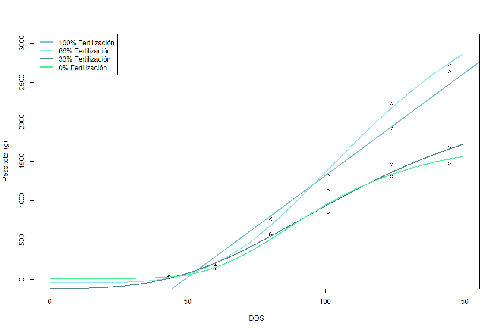<!-- -->

``` r
pesos_savia_100_102 <- 25.79*(c(36,45,53,61,70,78,84,91,98,105,115))-1258.36
DDS_100_102 <- c(36,45,53,61,70,78,84,91,98,105,115)
TRATAMIENTO_100_102 <- rep("100% Fertilización",11)
Tabla_pesos_savia_100_102 <- data.frame(pesos_savia_100_102,DDS_100_102,TRATAMIENTO_100_102)
Tabla_pesos_savia_100_102
```

    ##    pesos_savia_100_102 DDS_100_102 TRATAMIENTO_100_102
    ## 1              -329.92          36  100% Fertilización
    ## 2               -97.81          45  100% Fertilización
    ## 3               108.51          53  100% Fertilización
    ## 4               314.83          61  100% Fertilización
    ## 5               546.94          70  100% Fertilización
    ## 6               753.26          78  100% Fertilización
    ## 7               908.00          84  100% Fertilización
    ## 8              1088.53          91  100% Fertilización
    ## 9              1269.06          98  100% Fertilización
    ## 10             1449.59         105  100% Fertilización
    ## 11             1707.49         115  100% Fertilización

``` r
pesos_savia_66_102 <- Gompertz(c(36,45,53,61,70,78,84,91,98,105,115),y0_66_102,ymax_66_102,k_66_102,lag_66_102)
DDS_66_102 <- c(36,45,53,61,70,78,84,91,98,105,115)
TRATAMIENTO_66_102 <- rep("66% Fertilización",11)
Tabla_pesos_savia_66_102 <- data.frame(pesos_savia_66_102,DDS_66_102,TRATAMIENTO_66_102)
Tabla_pesos_savia_66_102
```

    ##    pesos_savia_66_102 DDS_66_102 TRATAMIENTO_66_102
    ## 1           -18.36093         36  66% Fertilización
    ## 2            27.29990         45  66% Fertilización
    ## 3           103.12089         53  66% Fertilización
    ## 4           221.66948         61  66% Fertilización
    ## 5           410.82682         70  66% Fertilización
    ## 6           625.52981         78  66% Fertilización
    ## 7           810.19444         84  66% Fertilización
    ## 8          1044.04849         91  66% Fertilización
    ## 9          1289.56362         98  66% Fertilización
    ## 10         1538.41722        105  66% Fertilización
    ## 11         1885.52322        115  66% Fertilización

``` r
pesos_savia_33_102 <- Gompertz(c(36,45,53,61,70,78,84,91,98,105,115),y0_33_102,ymax_33_102,k_33_102,lag_33_102)
DDS_33_102 <- c(36,45,53,61,70,78,84,91,98,105,115)
TRATAMIENTO_33_102 <- rep("33% Fertilización",11)
Tabla_pesos_savia_33_102 <- data.frame(pesos_savia_33_102,DDS_33_102,TRATAMIENTO_33_102)
Tabla_pesos_savia_33_102
```

    ##    pesos_savia_33_102 DDS_33_102 TRATAMIENTO_33_102
    ## 1           -39.20201         36  33% Fertilización
    ## 2            30.30834         45  33% Fertilización
    ## 3           115.78214         53  33% Fertilización
    ## 4           223.12919         61  33% Fertilización
    ## 5           366.62264         70  33% Fertilización
    ## 6           509.50459         78  33% Fertilización
    ## 7           622.84645         84  33% Fertilización
    ## 8           758.43565         91  33% Fertilización
    ## 9           894.44442         98  33% Fertilización
    ## 10         1027.94633        105  33% Fertilización
    ## 11         1209.72932        115  33% Fertilización

``` r
pesos_savia_0_102 <- Gompertz(c(36,45,53,61,70,78,84,91,98,105,115),y0_0_102,ymax_0_102,k_0_102,lag_0_102)
DDS_0_102 <- c(36,45,53,61,70,78,84,91,98,105,115)
TRATAMIENTO_0_102 <- rep("0% Fertilización",11)
Tabla_pesos_savia_0_102 <- data.frame(pesos_savia_0_102,DDS_0_102,TRATAMIENTO_0_102)
Tabla_pesos_savia_0_102
```

    ##    pesos_savia_0_102 DDS_0_102 TRATAMIENTO_0_102
    ## 1           15.47156        36  0% Fertilización
    ## 2           35.14470        45  0% Fertilización
    ## 3           80.47700        53  0% Fertilización
    ## 4          164.08212        61  0% Fertilización
    ## 5          306.45962        70  0% Fertilización
    ## 6          466.36300        78  0% Fertilización
    ## 7          597.54201        84  0% Fertilización
    ## 8          752.99450        91  0% Fertilización
    ## 9          902.68763        98  0% Fertilización
    ## 10        1040.45009       105  0% Fertilización
    ## 11        1210.16723       115  0% Fertilización

### 3) PESO SECO V.S. CONTENIDO EN SAVIA

# NO3

# CPI 1

``` r
mccain_savia_0_1 <- mccain_savia %>%
  filter(Variedad =="CIP 1", Tratamiento =="0% Fertilización")%>%
  group_by(DDS,Variedad,Tratamiento)%>%
  summarise(NO3 = mean(NO3, na.rm=T))
```

    ## `summarise()` has grouped output by 'DDS', 'Variedad'. You can override using
    ## the `.groups` argument.

``` r
Tabla_0_1 <- cbind(mccain_savia_0_1$Variedad,Tabla_pesos_savia_0_1, mccain_savia_0_1$NO3)
colnames(Tabla_0_1) <- c('Variedad','Peso','DDS','Tratamiento','NO3')

mccain_savia_33_1 <- mccain_savia %>%
  filter(Variedad =="CIP 1", Tratamiento =="33% Fertilización")%>%
  group_by(DDS,Variedad,Tratamiento)%>%
  summarise(NO3 = mean(NO3, na.rm=T))
```

    ## `summarise()` has grouped output by 'DDS', 'Variedad'. You can override using
    ## the `.groups` argument.

``` r
Tabla_33_1 <- cbind(mccain_savia_33_1$Variedad,Tabla_pesos_savia_33_1, mccain_savia_33_1$NO3)
colnames(Tabla_33_1) <- c('Variedad','Peso','DDS','Tratamiento','NO3')

mccain_savia_66_1 <- mccain_savia %>%
  filter(Variedad =="CIP 1", Tratamiento =="66% Fertilización")%>%
  group_by(DDS,Variedad,Tratamiento)%>%
  summarise(NO3 = mean(NO3, na.rm=T))
```

    ## `summarise()` has grouped output by 'DDS', 'Variedad'. You can override using
    ## the `.groups` argument.

``` r
Tabla_66_1 <- cbind(mccain_savia_66_1$Variedad,Tabla_pesos_savia_66_1, mccain_savia_66_1$NO3)
colnames(Tabla_66_1) <- c('Variedad','Peso','DDS','Tratamiento','NO3')

mccain_savia_100_1 <- mccain_savia %>%
  filter(Variedad =="CIP 1", Tratamiento =="100% Fertilización")%>%
  group_by(DDS,Variedad,Tratamiento)%>%
  summarise(NO3 = mean(NO3, na.rm=T))
```

    ## `summarise()` has grouped output by 'DDS', 'Variedad'. You can override using
    ## the `.groups` argument.

``` r
Tabla_100_1 <- cbind(mccain_savia_100_1$Variedad,Tabla_pesos_savia_100_1, mccain_savia_100_1$NO3)
colnames(Tabla_100_1) <- c('Variedad','Peso','DDS','Tratamiento','NO3')

Tabla_1 <- rbind(Tabla_0_1,Tabla_33_1, Tabla_66_1, Tabla_100_1)

Tabla_1
```

    ##    Variedad        Peso DDS        Tratamiento      NO3
    ## 1     CIP 1   11.633014  36   0% Fertilización 9900.000
    ## 2     CIP 1   29.333988  45   0% Fertilización 4483.333
    ## 3     CIP 1   78.230695  53   0% Fertilización 6450.000
    ## 4     CIP 1  174.600433  61   0% Fertilización 5841.667
    ## 5     CIP 1  338.347401  70   0% Fertilización 6583.333
    ## 6     CIP 1  514.089312  78   0% Fertilización 6008.333
    ## 7     CIP 1  650.338071  84   0% Fertilización 5700.000
    ## 8     CIP 1  802.196612  91   0% Fertilización 6358.333
    ## 9     CIP 1  938.516243  98   0% Fertilización 2508.333
    ## 10    CIP 1 1055.305518 105   0% Fertilización 2266.667
    ## 11    CIP 1 1187.474711 115   0% Fertilización 2250.000
    ## 12    CIP 1  -10.351211  36  33% Fertilización 9900.000
    ## 13    CIP 1   23.456322  45  33% Fertilización 4041.667
    ## 14    CIP 1   91.243887  53  33% Fertilización 5725.000
    ## 15    CIP 1  205.789319  61  33% Fertilización 6250.000
    ## 16    CIP 1  389.815829  70  33% Fertilización 7558.333
    ## 17    CIP 1  589.739866  78  33% Fertilización 6658.333
    ## 18    CIP 1  751.404170  84  33% Fertilización 5333.333
    ## 19    CIP 1  941.925588  91  33% Fertilización 4583.333
    ## 20    CIP 1 1125.362599  98  33% Fertilización 3158.333
    ## 21    CIP 1 1294.896575 105  33% Fertilización 2325.000
    ## 22    CIP 1 1505.672254 115  33% Fertilización 2444.444
    ## 23    CIP 1  -19.315572  36  66% Fertilización 9900.000
    ## 24    CIP 1   22.671929  45  66% Fertilización 4400.000
    ## 25    CIP 1   97.274387  53  66% Fertilización 6025.000
    ## 26    CIP 1  215.020641  61  66% Fertilización 5758.333
    ## 27    CIP 1  397.285003  70  66% Fertilización 7208.333
    ## 28    CIP 1  592.827004  78  66% Fertilización 6583.333
    ## 29    CIP 1  751.315634  84  66% Fertilización 6391.667
    ## 30    CIP 1  939.894055  91  66% Fertilización 6575.000
    ## 31    CIP 1 1124.303615  98  66% Fertilización 3008.333
    ## 32    CIP 1 1298.049325 105  66% Fertilización 3475.000
    ## 33    CIP 1 1519.816049 115  66% Fertilización 2180.000
    ## 34    CIP 1    5.721753  36 100% Fertilización 9900.000
    ## 35    CIP 1   26.897839  45 100% Fertilización 4525.000
    ## 36    CIP 1   81.363913  53 100% Fertilización 5708.333
    ## 37    CIP 1  187.619445  61 100% Fertilización 5550.000
    ## 38    CIP 1  373.049929  70 100% Fertilización 6775.000
    ## 39    CIP 1  581.612147  78 100% Fertilización 6258.333
    ## 40    CIP 1  751.037173  84 100% Fertilización 5191.667
    ## 41    CIP 1  948.807045  91 100% Fertilización 5783.333
    ## 42    CIP 1 1135.484281  98 100% Fertilización 4541.667
    ## 43    CIP 1 1303.498509 105 100% Fertilización 4150.000
    ## 44    CIP 1 1504.723028 115 100% Fertilización 2922.222

# CIP 39

``` r
mccain_savia_0_39 <- mccain_savia %>%
  filter(Variedad =="CIP 39", Tratamiento =="0% Fertilización")%>%
  group_by(DDS,Variedad,Tratamiento)%>%
  summarise(NO3 = mean(NO3, na.rm=T))
```

    ## `summarise()` has grouped output by 'DDS', 'Variedad'. You can override using
    ## the `.groups` argument.

``` r
Tabla_0_39 <- cbind(mccain_savia_0_39$Variedad,Tabla_pesos_savia_0_39, mccain_savia_0_39$NO3)
colnames(Tabla_0_39) <- c('Variedad','Peso','DDS','Tratamiento','NO3')

mccain_savia_33_39 <- mccain_savia %>%
  filter(Variedad =="CIP 39", Tratamiento =="33% Fertilización")%>%
  group_by(DDS,Variedad,Tratamiento)%>%
  summarise(NO3 = mean(NO3, na.rm=T))
```

    ## `summarise()` has grouped output by 'DDS', 'Variedad'. You can override using
    ## the `.groups` argument.

``` r
Tabla_33_39 <- cbind(mccain_savia_33_39$Variedad,Tabla_pesos_savia_33_39, mccain_savia_33_39$NO3)
colnames(Tabla_33_39) <- c('Variedad','Peso','DDS','Tratamiento','NO3')

mccain_savia_66_39 <- mccain_savia %>%
  filter(Variedad =="CIP 39", Tratamiento =="66% Fertilización")%>%
  group_by(DDS,Variedad,Tratamiento)%>%
  summarise(NO3 = mean(NO3, na.rm=T))
```

    ## `summarise()` has grouped output by 'DDS', 'Variedad'. You can override using
    ## the `.groups` argument.

``` r
Tabla_66_39 <- cbind(mccain_savia_66_39$Variedad,Tabla_pesos_savia_66_39, mccain_savia_66_39$NO3)
colnames(Tabla_66_39) <- c('Variedad','Peso','DDS','Tratamiento','NO3')

mccain_savia_100_39 <- mccain_savia %>%
  filter(Variedad =="CIP 39", Tratamiento =="100% Fertilización")%>%
  group_by(DDS,Variedad,Tratamiento)%>%
  summarise(NO3 = mean(NO3, na.rm=T))
```

    ## `summarise()` has grouped output by 'DDS', 'Variedad'. You can override using
    ## the `.groups` argument.

``` r
Tabla_100_39 <- cbind(mccain_savia_100_39$Variedad,Tabla_pesos_savia_100_39, mccain_savia_100_39$NO3)
colnames(Tabla_100_39) <- c('Variedad','Peso','DDS','Tratamiento','NO3')

Tabla_39 <- rbind(Tabla_0_39,Tabla_33_39, Tabla_66_39, Tabla_100_39)

Tabla_39
```

    ##    Variedad         Peso DDS        Tratamiento      NO3
    ## 1    CIP 39   42.1394663  36   0% Fertilización 9825.000
    ## 2    CIP 39   44.2368570  45   0% Fertilización 8166.667
    ## 3    CIP 39   58.0205521  53   0% Fertilización 8325.000
    ## 4    CIP 39  105.9662014  61   0% Fertilización 8125.000
    ## 5    CIP 39  227.2986097  70   0% Fertilización 6316.667
    ## 6    CIP 39  394.4899459  78   0% Fertilización 7858.333
    ## 7    CIP 39  542.5294729  84   0% Fertilización 7650.000
    ## 8    CIP 39  721.2125136  91   0% Fertilización 5933.333
    ## 9    CIP 39  890.4315709  98   0% Fertilización 6000.000
    ## 10   CIP 39 1039.7433434 105   0% Fertilización 4058.333
    ## 11   CIP 39 1210.9618919 115   0% Fertilización 4375.000
    ## 12   CIP 39   59.9055045  36  33% Fertilización 9508.333
    ## 13   CIP 39   60.0090792  45  33% Fertilización 7866.667
    ## 14   CIP 39   64.0502374  53  33% Fertilización 7958.333
    ## 15   CIP 39   99.8393649  61  33% Fertilización 8108.333
    ## 16   CIP 39  242.9110476  70  33% Fertilización 7100.000
    ## 17   CIP 39  468.8405151  78  33% Fertilización 8316.667
    ## 18   CIP 39  665.0713449  84  33% Fertilización 7433.333
    ## 19   CIP 39  883.6405011  91  33% Fertilización 7108.333
    ## 20   CIP 39 1067.3069660  98  33% Fertilización 6383.333
    ## 21   CIP 39 1208.7596488 105  33% Fertilización 5066.667
    ## 22   CIP 39 1345.8212611 115  33% Fertilización 5022.222
    ## 23   CIP 39    1.5913392  36  66% Fertilización 9375.000
    ## 24   CIP 39   29.0999531  45  66% Fertilización 7166.667
    ## 25   CIP 39   92.6010633  53  66% Fertilización 8133.333
    ## 26   CIP 39  208.4335186  61  66% Fertilización 7491.667
    ## 27   CIP 39  401.8777758  70  66% Fertilización 6491.667
    ## 28   CIP 39  614.1624844  78  66% Fertilización 8808.333
    ## 29   CIP 39  784.8137143  84  66% Fertilización 7908.333
    ## 30   CIP 39  983.2361155  91  66% Fertilización 7308.333
    ## 31   CIP 39 1170.5280754  98  66% Fertilización 6991.667
    ## 32   CIP 39 1339.6180951 105  66% Fertilización 5391.667
    ## 33   CIP 39 1543.4508064 115  66% Fertilización 5837.500
    ## 34   CIP 39   -0.1428543  36 100% Fertilización 8550.000
    ## 35   CIP 39   18.7542208  45 100% Fertilización 7066.667
    ## 36   CIP 39   71.0799227  53 100% Fertilización 6675.000
    ## 37   CIP 39  179.1064577  61 100% Fertilización 7491.667
    ## 38   CIP 39  376.8636375  70 100% Fertilización 6341.667
    ## 39   CIP 39  607.7237456  78 100% Fertilización 8466.667
    ## 40   CIP 39  799.9629919  84 100% Fertilización 8100.000
    ## 41   CIP 39 1028.6597073  91 100% Fertilización 6875.000
    ## 42   CIP 39 1248.2202203  98 100% Fertilización 7091.667
    ## 43   CIP 39 1448.6200148 105 100% Fertilización 5308.333
    ## 44   CIP 39 1691.9380392 115 100% Fertilización 6666.667

# CIP 102

``` r
mccain_savia_0_102 <- mccain_savia %>%
  filter(Variedad =="CIP 102", Tratamiento =="0% Fertilización")%>%
  group_by(DDS,Variedad,Tratamiento)%>%
  summarise(NO3 = mean(NO3, na.rm=T))
```

    ## `summarise()` has grouped output by 'DDS', 'Variedad'. You can override using
    ## the `.groups` argument.

``` r
Tabla_0_102 <- cbind(mccain_savia_0_102$Variedad,Tabla_pesos_savia_0_102, mccain_savia_0_102$NO3)
colnames(Tabla_0_102) <- c('Variedad','Peso','DDS','Tratamiento','NO3')

mccain_savia_33_102 <- mccain_savia %>%
  filter(Variedad =="CIP 102", Tratamiento =="33% Fertilización")%>%
  group_by(DDS,Variedad,Tratamiento)%>%
  summarise(NO3 = mean(NO3, na.rm=T))
```

    ## `summarise()` has grouped output by 'DDS', 'Variedad'. You can override using
    ## the `.groups` argument.

``` r
Tabla_33_102 <- cbind(mccain_savia_33_102$Variedad,Tabla_pesos_savia_33_102, mccain_savia_33_102$NO3)
colnames(Tabla_33_102) <- c('Variedad','Peso','DDS','Tratamiento','NO3')

mccain_savia_66_102 <- mccain_savia %>%
  filter(Variedad =="CIP 102", Tratamiento =="66% Fertilización")%>%
  group_by(DDS,Variedad,Tratamiento)%>%
  summarise(NO3 = mean(NO3, na.rm=T))
```

    ## `summarise()` has grouped output by 'DDS', 'Variedad'. You can override using
    ## the `.groups` argument.

``` r
Tabla_66_102 <- cbind(mccain_savia_66_102$Variedad,Tabla_pesos_savia_66_102, mccain_savia_66_102$NO3)
colnames(Tabla_66_102) <- c('Variedad','Peso','DDS','Tratamiento','NO3')

mccain_savia_100_102 <- mccain_savia %>%
  filter(Variedad =="CIP 102", Tratamiento =="100% Fertilización")%>%
  group_by(DDS,Variedad,Tratamiento)%>%
  summarise(NO3 = mean(NO3, na.rm=T))
```

    ## `summarise()` has grouped output by 'DDS', 'Variedad'. You can override using
    ## the `.groups` argument.

``` r
Tabla_100_102 <- cbind(mccain_savia_100_102$Variedad,Tabla_pesos_savia_100_102, mccain_savia_100_102$NO3)
colnames(Tabla_100_102) <- c('Variedad','Peso','DDS','Tratamiento','NO3')

Tabla_102 <- rbind(Tabla_0_102,Tabla_33_102, Tabla_66_102, Tabla_100_102)

Tabla_102
```

    ##    Variedad       Peso DDS        Tratamiento       NO3
    ## 1   CIP 102   15.47156  36   0% Fertilización 9750.0000
    ## 2   CIP 102   35.14470  45   0% Fertilización 5816.6667
    ## 3   CIP 102   80.47700  53   0% Fertilización 7075.0000
    ## 4   CIP 102  164.08212  61   0% Fertilización 6266.6667
    ## 5   CIP 102  306.45962  70   0% Fertilización 5491.6667
    ## 6   CIP 102  466.36300  78   0% Fertilización 3816.6667
    ## 7   CIP 102  597.54201  84   0% Fertilización 1775.0000
    ## 8   CIP 102  752.99450  91   0% Fertilización 1533.3333
    ## 9   CIP 102  902.68763  98   0% Fertilización 1010.8333
    ## 10  CIP 102 1040.45009 105   0% Fertilización  745.0000
    ## 11  CIP 102 1210.16723 115   0% Fertilización 1197.7778
    ## 12  CIP 102  -39.20201  36  33% Fertilización 9741.6667
    ## 13  CIP 102   30.30834  45  33% Fertilización 5450.0000
    ## 14  CIP 102  115.78214  53  33% Fertilización 6783.3333
    ## 15  CIP 102  223.12919  61  33% Fertilización 6175.0000
    ## 16  CIP 102  366.62264  70  33% Fertilización 5091.6667
    ## 17  CIP 102  509.50459  78  33% Fertilización 5291.6667
    ## 18  CIP 102  622.84645  84  33% Fertilización 2833.3333
    ## 19  CIP 102  758.43565  91  33% Fertilización 2841.6667
    ## 20  CIP 102  894.44442  98  33% Fertilización 1150.8333
    ## 21  CIP 102 1027.94633 105  33% Fertilización  779.1667
    ## 22  CIP 102 1209.72932 115  33% Fertilización  924.0000
    ## 23  CIP 102  -18.36093  36  66% Fertilización 9641.6667
    ## 24  CIP 102   27.29990  45  66% Fertilización 5475.0000
    ## 25  CIP 102  103.12089  53  66% Fertilización 6908.3333
    ## 26  CIP 102  221.66948  61  66% Fertilización 5575.0000
    ## 27  CIP 102  410.82682  70  66% Fertilización 5066.6667
    ## 28  CIP 102  625.52981  78  66% Fertilización 4391.6667
    ## 29  CIP 102  810.19444  84  66% Fertilización 3416.6667
    ## 30  CIP 102 1044.04849  91  66% Fertilización 2133.3333
    ## 31  CIP 102 1289.56362  98  66% Fertilización 1697.5000
    ## 32  CIP 102 1538.41722 105  66% Fertilización  876.6667
    ## 33  CIP 102 1885.52322 115  66% Fertilización 1086.2500
    ## 34  CIP 102 -329.92000  36 100% Fertilización 9575.0000
    ## 35  CIP 102  -97.81000  45 100% Fertilización 4975.0000
    ## 36  CIP 102  108.51000  53 100% Fertilización 6741.6667
    ## 37  CIP 102  314.83000  61 100% Fertilización 5841.6667
    ## 38  CIP 102  546.94000  70 100% Fertilización 5075.0000
    ## 39  CIP 102  753.26000  78 100% Fertilización 4958.3333
    ## 40  CIP 102  908.00000  84 100% Fertilización 3808.3333
    ## 41  CIP 102 1088.53000  91 100% Fertilización 2975.0000
    ## 42  CIP 102 1269.06000  98 100% Fertilización 1266.6667
    ## 43  CIP 102 1449.59000 105 100% Fertilización  888.3333
    ## 44  CIP 102 1707.49000 115 100% Fertilización  529.0909

# Gráficos

``` r
NO3CPI1 <-  Tabla_1%>%
  group_by(DDS,Tratamiento)%>%
  summarise(NITRATO=mean(NO3,na.rm=T),
            PESO=Peso,
            TRATAMIENTO=Tratamiento,
            SE=sd(NO3,na.rm=T)/sqrt(length(complete.cases(NO3))))
```

    ## `summarise()` has grouped output by 'DDS'. You can override using the `.groups`
    ## argument.

``` r
ggplot(NO3CPI1,aes(x=PESO, y=NITRATO, group = TRATAMIENTO, colour =TRATAMIENTO)) + 
  geom_line(size = 1)  +
  scale_y_continuous(breaks=seq(0,10000,500))+
  scale_x_continuous(breaks=seq(0,2000,200))+
  labs(title="Nitrato en savia", subtitle="Representación gráfica de valores obtenidos mediante modelamiento",caption="Variedad 1", x="Peso seco (g)", y="Contenido de nitrato (ppm)")+
  geom_point( size=2, fill="white") +
  scale_color_manual(values=c("seagreen2","cadetblue3","cadetblue4","cadetblue2"))+
  tema
```

<!-- -->

``` r
NO3CPI39 <-  Tabla_39%>%
  group_by(DDS,Tratamiento)%>%
  summarise(NITRATO=mean(NO3,na.rm=T),
            PESO=Peso,
            TRATAMIENTO=Tratamiento,
            SE=sd(NO3,na.rm=T)/sqrt(length(complete.cases(NO3))))
```

    ## `summarise()` has grouped output by 'DDS'. You can override using the `.groups`
    ## argument.

``` r
ggplot(NO3CPI39,aes(x=PESO, y=NITRATO, group = TRATAMIENTO, colour =TRATAMIENTO)) + 
  geom_line(size = 1)  +
  scale_y_continuous(breaks=seq(0,10000,500))+
  scale_x_continuous(breaks=seq(0,2000,200))+
  labs(title="Nitrato en savia", subtitle="Representación gráfica de valores obtenidos mediante modelamiento",caption="Variedad 39", x="Peso seco (g)", y="Contenido de nitrato (ppm)")+
  geom_point( size=2, fill="white") +
  scale_color_manual(values=c("seagreen2","cadetblue3","cadetblue4","cadetblue2"))+
  tema
```

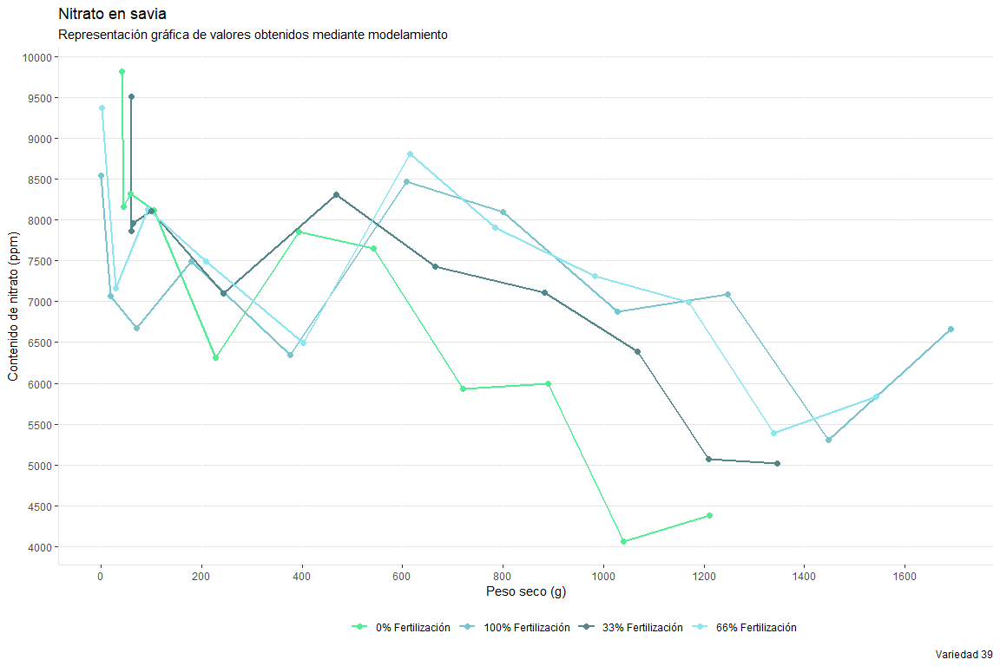<!-- -->

``` r
NO3CPI102 <-  Tabla_102%>%
  group_by(DDS,Tratamiento)%>%
  summarise(NITRATO=mean(NO3,na.rm=T),
            PESO=Peso,
            TRATAMIENTO=Tratamiento,
            SE=sd(NO3,na.rm=T)/sqrt(length(complete.cases(NO3))))
```

    ## `summarise()` has grouped output by 'DDS'. You can override using the `.groups`
    ## argument.

``` r
ggplot(NO3CPI102,aes(x=PESO, y=NITRATO, group = TRATAMIENTO, colour =TRATAMIENTO)) + 
  geom_line(size = 1)  +
  scale_y_continuous(breaks=seq(0,10000,500))+
  scale_x_continuous(breaks=seq(0,2000,200))+
  labs(title="Nitrato en savia", subtitle="Representación gráfica de valores obtenidos mediante modelamiento",caption="Variedad 102", x="Peso seco (g)", y="Contenido de nitrato (ppm)")+
  geom_point( size=2, fill="white") +
  scale_color_manual(values=c("seagreen2","cadetblue3","cadetblue4","cadetblue2"))+
  tema
```

<!-- -->

# Ca

# CPI 1

``` r
mccain_savia_0_1 <- mccain_savia %>%
  filter(Variedad =="CIP 1", Tratamiento =="0% Fertilización")%>%
  group_by(DDS,Variedad,Tratamiento)%>%
  summarise(Ca = mean(Ca, na.rm=T))
```

    ## `summarise()` has grouped output by 'DDS', 'Variedad'. You can override using
    ## the `.groups` argument.

``` r
Tabla_0_1 <- cbind(mccain_savia_0_1$Variedad,Tabla_pesos_savia_0_1, mccain_savia_0_1$Ca)
colnames(Tabla_0_1) <- c('Variedad','Peso','DDS','Tratamiento','Ca')

mccain_savia_33_1 <- mccain_savia %>%
  filter(Variedad =="CIP 1", Tratamiento =="33% Fertilización")%>%
  group_by(DDS,Variedad,Tratamiento)%>%
  summarise(Ca = mean(Ca, na.rm=T))
```

    ## `summarise()` has grouped output by 'DDS', 'Variedad'. You can override using
    ## the `.groups` argument.

``` r
Tabla_33_1 <- cbind(mccain_savia_33_1$Variedad,Tabla_pesos_savia_33_1, mccain_savia_33_1$Ca)
colnames(Tabla_33_1) <- c('Variedad','Peso','DDS','Tratamiento','Ca')

mccain_savia_66_1 <- mccain_savia %>%
  filter(Variedad =="CIP 1", Tratamiento =="66% Fertilización")%>%
  group_by(DDS,Variedad,Tratamiento)%>%
  summarise(Ca = mean(Ca, na.rm=T))
```

    ## `summarise()` has grouped output by 'DDS', 'Variedad'. You can override using
    ## the `.groups` argument.

``` r
Tabla_66_1 <- cbind(mccain_savia_66_1$Variedad,Tabla_pesos_savia_66_1, mccain_savia_66_1$Ca)
colnames(Tabla_66_1) <- c('Variedad','Peso','DDS','Tratamiento','Ca')

mccain_savia_100_1 <- mccain_savia %>%
  filter(Variedad =="CIP 1", Tratamiento =="100% Fertilización")%>%
  group_by(DDS,Variedad,Tratamiento)%>%
  summarise(Ca = mean(Ca, na.rm=T))
```

    ## `summarise()` has grouped output by 'DDS', 'Variedad'. You can override using
    ## the `.groups` argument.

``` r
Tabla_100_1 <- cbind(mccain_savia_100_1$Variedad,Tabla_pesos_savia_100_1, mccain_savia_100_1$Ca)
colnames(Tabla_100_1) <- c('Variedad','Peso','DDS','Tratamiento','Ca')

Tabla_1 <- rbind(Tabla_0_1,Tabla_33_1, Tabla_66_1, Tabla_100_1)

Tabla_1
```

    ##    Variedad        Peso DDS        Tratamiento       Ca
    ## 1     CIP 1   11.633014  36   0% Fertilización 8.833333
    ## 2     CIP 1   29.333988  45   0% Fertilización 4.083333
    ## 3     CIP 1   78.230695  53   0% Fertilización 4.000000
    ## 4     CIP 1  174.600433  61   0% Fertilización 4.000000
    ## 5     CIP 1  338.347401  70   0% Fertilización 4.000000
    ## 6     CIP 1  514.089312  78   0% Fertilización 4.000000
    ## 7     CIP 1  650.338071  84   0% Fertilización 4.000000
    ## 8     CIP 1  802.196612  91   0% Fertilización 4.000000
    ## 9     CIP 1  938.516243  98   0% Fertilización 4.000000
    ## 10    CIP 1 1055.305518 105   0% Fertilización 4.000000
    ## 11    CIP 1 1187.474711 115   0% Fertilización 5.875000
    ## 12    CIP 1  -10.351211  36  33% Fertilización 4.333333
    ## 13    CIP 1   23.456322  45  33% Fertilización 4.000000
    ## 14    CIP 1   91.243887  53  33% Fertilización 4.000000
    ## 15    CIP 1  205.789319  61  33% Fertilización 4.000000
    ## 16    CIP 1  389.815829  70  33% Fertilización 4.000000
    ## 17    CIP 1  589.739866  78  33% Fertilización 4.000000
    ## 18    CIP 1  751.404170  84  33% Fertilización 4.000000
    ## 19    CIP 1  941.925588  91  33% Fertilización 4.000000
    ## 20    CIP 1 1125.362599  98  33% Fertilización 4.000000
    ## 21    CIP 1 1294.896575 105  33% Fertilización 4.000000
    ## 22    CIP 1 1505.672254 115  33% Fertilización 4.000000
    ## 23    CIP 1  -19.315572  36  66% Fertilización 4.666667
    ## 24    CIP 1   22.671929  45  66% Fertilización 4.000000
    ## 25    CIP 1   97.274387  53  66% Fertilización 4.000000
    ## 26    CIP 1  215.020641  61  66% Fertilización 4.000000
    ## 27    CIP 1  397.285003  70  66% Fertilización 4.000000
    ## 28    CIP 1  592.827004  78  66% Fertilización 4.000000
    ## 29    CIP 1  751.315634  84  66% Fertilización 4.000000
    ## 30    CIP 1  939.894055  91  66% Fertilización 4.000000
    ## 31    CIP 1 1124.303615  98  66% Fertilización 4.000000
    ## 32    CIP 1 1298.049325 105  66% Fertilización 4.000000
    ## 33    CIP 1 1519.816049 115  66% Fertilización 4.000000
    ## 34    CIP 1    5.721753  36 100% Fertilización 9.416667
    ## 35    CIP 1   26.897839  45 100% Fertilización 4.083333
    ## 36    CIP 1   81.363913  53 100% Fertilización 4.000000
    ## 37    CIP 1  187.619445  61 100% Fertilización 4.000000
    ## 38    CIP 1  373.049929  70 100% Fertilización 4.000000
    ## 39    CIP 1  581.612147  78 100% Fertilización 4.000000
    ## 40    CIP 1  751.037173  84 100% Fertilización 4.000000
    ## 41    CIP 1  948.807045  91 100% Fertilización 4.000000
    ## 42    CIP 1 1135.484281  98 100% Fertilización 4.000000
    ## 43    CIP 1 1303.498509 105 100% Fertilización 4.000000
    ## 44    CIP 1 1504.723028 115 100% Fertilización 4.000000

# CIP 39

``` r
mccain_savia_0_39 <- mccain_savia %>%
  filter(Variedad =="CIP 39", Tratamiento =="0% Fertilización")%>%
  group_by(DDS,Variedad,Tratamiento)%>%
  summarise(Ca = mean(Ca, na.rm=T))
```

    ## `summarise()` has grouped output by 'DDS', 'Variedad'. You can override using
    ## the `.groups` argument.

``` r
Tabla_0_39 <- cbind(mccain_savia_0_39$Variedad,Tabla_pesos_savia_0_39, mccain_savia_0_39$Ca)
colnames(Tabla_0_39) <- c('Variedad','Peso','DDS','Tratamiento','Ca')

mccain_savia_33_39 <- mccain_savia %>%
  filter(Variedad =="CIP 39", Tratamiento =="33% Fertilización")%>%
  group_by(DDS,Variedad,Tratamiento)%>%
  summarise(Ca = mean(Ca, na.rm=T))
```

    ## `summarise()` has grouped output by 'DDS', 'Variedad'. You can override using
    ## the `.groups` argument.

``` r
Tabla_33_39 <- cbind(mccain_savia_33_39$Variedad,Tabla_pesos_savia_33_39, mccain_savia_33_39$Ca)
colnames(Tabla_33_39) <- c('Variedad','Peso','DDS','Tratamiento','Ca')

mccain_savia_66_39 <- mccain_savia %>%
  filter(Variedad =="CIP 39", Tratamiento =="66% Fertilización")%>%
  group_by(DDS,Variedad,Tratamiento)%>%
  summarise(Ca = mean(Ca, na.rm=T))
```

    ## `summarise()` has grouped output by 'DDS', 'Variedad'. You can override using
    ## the `.groups` argument.

``` r
Tabla_66_39 <- cbind(mccain_savia_66_39$Variedad,Tabla_pesos_savia_66_39, mccain_savia_66_39$Ca)
colnames(Tabla_66_39) <- c('Variedad','Peso','DDS','Tratamiento','Ca')

mccain_savia_100_39 <- mccain_savia %>%
  filter(Variedad =="CIP 39", Tratamiento =="100% Fertilización")%>%
  group_by(DDS,Variedad,Tratamiento)%>%
  summarise(Ca = mean(Ca, na.rm=T))
```

    ## `summarise()` has grouped output by 'DDS', 'Variedad'. You can override using
    ## the `.groups` argument.

``` r
Tabla_100_39 <- cbind(mccain_savia_100_39$Variedad,Tabla_pesos_savia_100_39, mccain_savia_100_39$Ca)
colnames(Tabla_100_39) <- c('Variedad','Peso','DDS','Tratamiento','Ca')

Tabla_39 <- rbind(Tabla_0_39,Tabla_33_39, Tabla_66_39, Tabla_100_39)

Tabla_39
```

    ##    Variedad         Peso DDS        Tratamiento        Ca
    ## 1    CIP 39   42.1394663  36   0% Fertilización 12.166667
    ## 2    CIP 39   44.2368570  45   0% Fertilización  6.416667
    ## 3    CIP 39   58.0205521  53   0% Fertilización  4.916667
    ## 4    CIP 39  105.9662014  61   0% Fertilización  4.000000
    ## 5    CIP 39  227.2986097  70   0% Fertilización  4.000000
    ## 6    CIP 39  394.4899459  78   0% Fertilización  4.000000
    ## 7    CIP 39  542.5294729  84   0% Fertilización  4.000000
    ## 8    CIP 39  721.2125136  91   0% Fertilización  4.000000
    ## 9    CIP 39  890.4315709  98   0% Fertilización  4.000000
    ## 10   CIP 39 1039.7433434 105   0% Fertilización  4.000000
    ## 11   CIP 39 1210.9618919 115   0% Fertilización  4.000000
    ## 12   CIP 39   59.9055045  36  33% Fertilización 17.916667
    ## 13   CIP 39   60.0090792  45  33% Fertilización  7.083333
    ## 14   CIP 39   64.0502374  53  33% Fertilización  5.666667
    ## 15   CIP 39   99.8393649  61  33% Fertilización  5.416667
    ## 16   CIP 39  242.9110476  70  33% Fertilización  4.000000
    ## 17   CIP 39  468.8405151  78  33% Fertilización  4.000000
    ## 18   CIP 39  665.0713449  84  33% Fertilización  4.000000
    ## 19   CIP 39  883.6405011  91  33% Fertilización  4.000000
    ## 20   CIP 39 1067.3069660  98  33% Fertilización  4.000000
    ## 21   CIP 39 1208.7596488 105  33% Fertilización  4.000000
    ## 22   CIP 39 1345.8212611 115  33% Fertilización  4.000000
    ## 23   CIP 39    1.5913392  36  66% Fertilización 13.000000
    ## 24   CIP 39   29.0999531  45  66% Fertilización  4.583333
    ## 25   CIP 39   92.6010633  53  66% Fertilización  4.416667
    ## 26   CIP 39  208.4335186  61  66% Fertilización  4.000000
    ## 27   CIP 39  401.8777758  70  66% Fertilización  4.000000
    ## 28   CIP 39  614.1624844  78  66% Fertilización  4.000000
    ## 29   CIP 39  784.8137143  84  66% Fertilización  4.000000
    ## 30   CIP 39  983.2361155  91  66% Fertilización  4.000000
    ## 31   CIP 39 1170.5280754  98  66% Fertilización  4.000000
    ## 32   CIP 39 1339.6180951 105  66% Fertilización  4.000000
    ## 33   CIP 39 1543.4508064 115  66% Fertilización  4.000000
    ## 34   CIP 39   -0.1428543  36 100% Fertilización 12.000000
    ## 35   CIP 39   18.7542208  45 100% Fertilización  6.583333
    ## 36   CIP 39   71.0799227  53 100% Fertilización  4.916667
    ## 37   CIP 39  179.1064577  61 100% Fertilización  4.000000
    ## 38   CIP 39  376.8636375  70 100% Fertilización  4.000000
    ## 39   CIP 39  607.7237456  78 100% Fertilización  4.000000
    ## 40   CIP 39  799.9629919  84 100% Fertilización  4.000000
    ## 41   CIP 39 1028.6597073  91 100% Fertilización  4.000000
    ## 42   CIP 39 1248.2202203  98 100% Fertilización  4.000000
    ## 43   CIP 39 1448.6200148 105 100% Fertilización  4.000000
    ## 44   CIP 39 1691.9380392 115 100% Fertilización  4.000000

# CIP 102

``` r
mccain_savia_0_102 <- mccain_savia %>%
  filter(Variedad =="CIP 102", Tratamiento =="0% Fertilización")%>%
  group_by(DDS,Variedad,Tratamiento)%>%
  summarise(Ca = mean(Ca, na.rm=T))
```

    ## `summarise()` has grouped output by 'DDS', 'Variedad'. You can override using
    ## the `.groups` argument.

``` r
Tabla_0_102 <- cbind(mccain_savia_0_102$Variedad,Tabla_pesos_savia_0_102, mccain_savia_0_102$Ca)
colnames(Tabla_0_102) <- c('Variedad','Peso','DDS','Tratamiento','Ca')

mccain_savia_33_102 <- mccain_savia %>%
  filter(Variedad =="CIP 102", Tratamiento =="33% Fertilización")%>%
  group_by(DDS,Variedad,Tratamiento)%>%
  summarise(Ca = mean(Ca, na.rm=T))
```

    ## `summarise()` has grouped output by 'DDS', 'Variedad'. You can override using
    ## the `.groups` argument.

``` r
Tabla_33_102 <- cbind(mccain_savia_33_102$Variedad,Tabla_pesos_savia_33_102, mccain_savia_33_102$Ca)
colnames(Tabla_33_102) <- c('Variedad','Peso','DDS','Tratamiento','Ca')

mccain_savia_66_102 <- mccain_savia %>%
  filter(Variedad =="CIP 102", Tratamiento =="66% Fertilización")%>%
  group_by(DDS,Variedad,Tratamiento)%>%
  summarise(Ca = mean(Ca, na.rm=T))
```

    ## `summarise()` has grouped output by 'DDS', 'Variedad'. You can override using
    ## the `.groups` argument.

``` r
Tabla_66_102 <- cbind(mccain_savia_66_102$Variedad,Tabla_pesos_savia_66_102, mccain_savia_66_102$Ca)
colnames(Tabla_66_102) <- c('Variedad','Peso','DDS','Tratamiento','Ca')

mccain_savia_100_102 <- mccain_savia %>%
  filter(Variedad =="CIP 102", Tratamiento =="100% Fertilización")%>%
  group_by(DDS,Variedad,Tratamiento)%>%
  summarise(Ca = mean(Ca, na.rm=T))
```

    ## `summarise()` has grouped output by 'DDS', 'Variedad'. You can override using
    ## the `.groups` argument.

``` r
Tabla_100_102 <- cbind(mccain_savia_100_102$Variedad,Tabla_pesos_savia_100_102, mccain_savia_100_102$Ca)
colnames(Tabla_100_102) <- c('Variedad','Peso','DDS','Tratamiento','Ca')

Tabla_102 <- rbind(Tabla_0_102,Tabla_33_102, Tabla_66_102, Tabla_100_102)

Tabla_102
```

    ##    Variedad       Peso DDS        Tratamiento       Ca
    ## 1   CIP 102   15.47156  36   0% Fertilización 4.000000
    ## 2   CIP 102   35.14470  45   0% Fertilización 4.000000
    ## 3   CIP 102   80.47700  53   0% Fertilización 4.000000
    ## 4   CIP 102  164.08212  61   0% Fertilización 4.000000
    ## 5   CIP 102  306.45962  70   0% Fertilización 4.000000
    ## 6   CIP 102  466.36300  78   0% Fertilización 4.000000
    ## 7   CIP 102  597.54201  84   0% Fertilización 4.000000
    ## 8   CIP 102  752.99450  91   0% Fertilización 4.000000
    ## 9   CIP 102  902.68763  98   0% Fertilización 4.000000
    ## 10  CIP 102 1040.45009 105   0% Fertilización 4.000000
    ## 11  CIP 102 1210.16723 115   0% Fertilización 4.000000
    ## 12  CIP 102  -39.20201  36  33% Fertilización 4.000000
    ## 13  CIP 102   30.30834  45  33% Fertilización 4.000000
    ## 14  CIP 102  115.78214  53  33% Fertilización 4.000000
    ## 15  CIP 102  223.12919  61  33% Fertilización 4.000000
    ## 16  CIP 102  366.62264  70  33% Fertilización 4.000000
    ## 17  CIP 102  509.50459  78  33% Fertilización 4.000000
    ## 18  CIP 102  622.84645  84  33% Fertilización 4.000000
    ## 19  CIP 102  758.43565  91  33% Fertilización 4.000000
    ## 20  CIP 102  894.44442  98  33% Fertilización 4.000000
    ## 21  CIP 102 1027.94633 105  33% Fertilización 4.000000
    ## 22  CIP 102 1209.72932 115  33% Fertilización 4.000000
    ## 23  CIP 102  -18.36093  36  66% Fertilización 4.000000
    ## 24  CIP 102   27.29990  45  66% Fertilización 4.000000
    ## 25  CIP 102  103.12089  53  66% Fertilización 4.000000
    ## 26  CIP 102  221.66948  61  66% Fertilización 4.000000
    ## 27  CIP 102  410.82682  70  66% Fertilización 4.000000
    ## 28  CIP 102  625.52981  78  66% Fertilización 4.000000
    ## 29  CIP 102  810.19444  84  66% Fertilización 4.000000
    ## 30  CIP 102 1044.04849  91  66% Fertilización 4.000000
    ## 31  CIP 102 1289.56362  98  66% Fertilización 4.000000
    ## 32  CIP 102 1538.41722 105  66% Fertilización 4.000000
    ## 33  CIP 102 1885.52322 115  66% Fertilización 4.000000
    ## 34  CIP 102 -329.92000  36 100% Fertilización 4.083333
    ## 35  CIP 102  -97.81000  45 100% Fertilización 4.000000
    ## 36  CIP 102  108.51000  53 100% Fertilización 4.000000
    ## 37  CIP 102  314.83000  61 100% Fertilización 4.000000
    ## 38  CIP 102  546.94000  70 100% Fertilización 4.000000
    ## 39  CIP 102  753.26000  78 100% Fertilización 4.000000
    ## 40  CIP 102  908.00000  84 100% Fertilización 4.000000
    ## 41  CIP 102 1088.53000  91 100% Fertilización 4.000000
    ## 42  CIP 102 1269.06000  98 100% Fertilización 4.000000
    ## 43  CIP 102 1449.59000 105 100% Fertilización 4.000000
    ## 44  CIP 102 1707.49000 115 100% Fertilización 4.000000

# Gráficos

``` r
CaCPI1 <-  Tabla_1%>%
  group_by(DDS,Tratamiento)%>%
  summarise(CALCIO=mean(Ca,na.rm=T),
            PESO=Peso,
            TRATAMIENTO=Tratamiento,
            SE=sd(Ca,na.rm=T)/sqrt(length(complete.cases(Ca))))
```

    ## `summarise()` has grouped output by 'DDS'. You can override using the `.groups`
    ## argument.

``` r
ggplot(CaCPI1,aes(x=PESO, y=CALCIO, group = TRATAMIENTO, colour =TRATAMIENTO)) + 
  labs(title="Calcio en savia", subtitle="Representación gráfica de valores obtenidos mediante modelamiento",caption="Variedad 1", x="Peso seco (g)", y="Contenido de calcio (ppm)")+
  geom_line(size = 1)  +
  scale_y_continuous(breaks=seq(0,20,1))+
  scale_x_continuous(breaks=seq(0,2000,200))+
  geom_point( size=2, fill="white") +
  scale_color_manual(values=c("seagreen2","cadetblue3","cadetblue4","cadetblue2"))+
  tema
```

<!-- -->

``` r
CaCPI39 <-  Tabla_39%>%
  group_by(DDS,Tratamiento)%>%
  summarise(CALCIO=mean(Ca,na.rm=T),
            PESO=Peso,
            TRATAMIENTO=Tratamiento,
            SE=sd(Ca,na.rm=T)/sqrt(length(complete.cases(Ca))))
```

    ## `summarise()` has grouped output by 'DDS'. You can override using the `.groups`
    ## argument.

``` r
ggplot(CaCPI39,aes(x=PESO, y=CALCIO, group = TRATAMIENTO, colour =TRATAMIENTO)) + 
  labs(title="Calcio en savia", subtitle="Representación gráfica de valores obtenidos mediante modelamiento",caption="Variedad 39", x="Peso seco (g)", y="Contenido de calcio (ppm)")+
  geom_line(size = 1)  +
  scale_y_continuous(breaks=seq(0,20,2))+
  scale_x_continuous(breaks=seq(0,152000,200))+
  geom_point( size=2, fill="white") +
  scale_color_manual(values=c("seagreen2","cadetblue3","cadetblue4","cadetblue2"))+
  tema
```

<!-- -->

``` r
CaCPI102 <-  Tabla_102%>%
  group_by(DDS,Tratamiento)%>%
  summarise(CALCIO=mean(Ca,na.rm=T),
            PESO=Peso,
            TRATAMIENTO=Tratamiento,
            SE=sd(Ca,na.rm=T)/sqrt(length(complete.cases(Ca))))
```

    ## `summarise()` has grouped output by 'DDS'. You can override using the `.groups`
    ## argument.

``` r
ggplot(CaCPI102,aes(x=PESO, y=CALCIO, group = TRATAMIENTO, colour =TRATAMIENTO)) + 
  geom_line(size = 1)  +
  scale_y_continuous(breaks=seq(0,5,0.01))+
  scale_x_continuous(breaks=seq(0,2000,200))+
  labs(title="Calcio en savia", subtitle="Representación gráfica de valores obtenidos mediante modelamiento",caption="Variedad 102", x="Peso seco (g)", y="Contenido de calcio (ppm)")+
  geom_point( size=2, fill="white") +
  scale_color_manual(values=c("seagreen2","cadetblue3","cadetblue4","cadetblue2"))+
  tema
```

<!-- -->

# K

# CPI 1

``` r
mccain_savia_0_1 <- mccain_savia %>%
  filter(Variedad =="CIP 1", Tratamiento =="0% Fertilización")%>%
  group_by(DDS,Variedad,Tratamiento)%>%
  summarise(K = mean(K, na.rm=T))
```

    ## `summarise()` has grouped output by 'DDS', 'Variedad'. You can override using
    ## the `.groups` argument.

``` r
Tabla_0_1 <- cbind(mccain_savia_0_1$Variedad,Tabla_pesos_savia_0_1, mccain_savia_0_1$K)
colnames(Tabla_0_1) <- c('Variedad','Peso','DDS','Tratamiento','K')

mccain_savia_33_1 <- mccain_savia %>%
  filter(Variedad =="CIP 1", Tratamiento =="33% Fertilización")%>%
  group_by(DDS,Variedad,Tratamiento)%>%
  summarise(K = mean(K, na.rm=T))
```

    ## `summarise()` has grouped output by 'DDS', 'Variedad'. You can override using
    ## the `.groups` argument.

``` r
Tabla_33_1 <- cbind(mccain_savia_33_1$Variedad,Tabla_pesos_savia_33_1, mccain_savia_33_1$K)
colnames(Tabla_33_1) <- c('Variedad','Peso','DDS','Tratamiento','K')

mccain_savia_66_1 <- mccain_savia %>%
  filter(Variedad =="CIP 1", Tratamiento =="66% Fertilización")%>%
  group_by(DDS,Variedad,Tratamiento)%>%
  summarise(K = mean(K, na.rm=T))
```

    ## `summarise()` has grouped output by 'DDS', 'Variedad'. You can override using
    ## the `.groups` argument.

``` r
Tabla_66_1 <- cbind(mccain_savia_66_1$Variedad,Tabla_pesos_savia_66_1, mccain_savia_66_1$K)
colnames(Tabla_66_1) <- c('Variedad','Peso','DDS','Tratamiento','K')

mccain_savia_100_1 <- mccain_savia %>%
  filter(Variedad =="CIP 1", Tratamiento =="100% Fertilización")%>%
  group_by(DDS,Variedad,Tratamiento)%>%
  summarise(K = mean(K, na.rm=T))
```

    ## `summarise()` has grouped output by 'DDS', 'Variedad'. You can override using
    ## the `.groups` argument.

``` r
Tabla_100_1 <- cbind(mccain_savia_100_1$Variedad,Tabla_pesos_savia_100_1, mccain_savia_100_1$K)
colnames(Tabla_100_1) <- c('Variedad','Peso','DDS','Tratamiento','K')

Tabla_1 <- rbind(Tabla_0_1,Tabla_33_1, Tabla_66_1, Tabla_100_1)

Tabla_1
```

    ##    Variedad        Peso DDS        Tratamiento        K
    ## 1     CIP 1   11.633014  36   0% Fertilización 5508.333
    ## 2     CIP 1   29.333988  45   0% Fertilización 5375.000
    ## 3     CIP 1   78.230695  53   0% Fertilización 7966.667
    ## 4     CIP 1  174.600433  61   0% Fertilización 7625.000
    ## 5     CIP 1  338.347401  70   0% Fertilización 6191.667
    ## 6     CIP 1  514.089312  78   0% Fertilización 6183.333
    ## 7     CIP 1  650.338071  84   0% Fertilización 9800.000
    ## 8     CIP 1  802.196612  91   0% Fertilización 8191.667
    ## 9     CIP 1  938.516243  98   0% Fertilización 7683.333
    ## 10    CIP 1 1055.305518 105   0% Fertilización 9183.333
    ## 11    CIP 1 1187.474711 115   0% Fertilización 9162.500
    ## 12    CIP 1  -10.351211  36  33% Fertilización 5758.333
    ## 13    CIP 1   23.456322  45  33% Fertilización 5358.333
    ## 14    CIP 1   91.243887  53  33% Fertilización 7733.333
    ## 15    CIP 1  205.789319  61  33% Fertilización 7158.333
    ## 16    CIP 1  389.815829  70  33% Fertilización 6583.333
    ## 17    CIP 1  589.739866  78  33% Fertilización 6266.667
    ## 18    CIP 1  751.404170  84  33% Fertilización 9233.333
    ## 19    CIP 1  941.925588  91  33% Fertilización 8466.667
    ## 20    CIP 1 1125.362599  98  33% Fertilización 8000.000
    ## 21    CIP 1 1294.896575 105  33% Fertilización 8475.000
    ## 22    CIP 1 1505.672254 115  33% Fertilización 9000.000
    ## 23    CIP 1  -19.315572  36  66% Fertilización 5616.667
    ## 24    CIP 1   22.671929  45  66% Fertilización 4883.333
    ## 25    CIP 1   97.274387  53  66% Fertilización 7816.667
    ## 26    CIP 1  215.020641  61  66% Fertilización 6916.667
    ## 27    CIP 1  397.285003  70  66% Fertilización 6225.000
    ## 28    CIP 1  592.827004  78  66% Fertilización 6008.333
    ## 29    CIP 1  751.315634  84  66% Fertilización 9450.000
    ## 30    CIP 1  939.894055  91  66% Fertilización 8016.667
    ## 31    CIP 1 1124.303615  98  66% Fertilización 8216.667
    ## 32    CIP 1 1298.049325 105  66% Fertilización 8016.667
    ## 33    CIP 1 1519.816049 115  66% Fertilización 8760.000
    ## 34    CIP 1    5.721753  36 100% Fertilización 5575.000
    ## 35    CIP 1   26.897839  45 100% Fertilización 4833.333
    ## 36    CIP 1   81.363913  53 100% Fertilización 8175.000
    ## 37    CIP 1  187.619445  61 100% Fertilización 6616.667
    ## 38    CIP 1  373.049929  70 100% Fertilización 6358.333
    ## 39    CIP 1  581.612147  78 100% Fertilización 6000.000
    ## 40    CIP 1  751.037173  84 100% Fertilización 9508.333
    ## 41    CIP 1  948.807045  91 100% Fertilización 7966.667
    ## 42    CIP 1 1135.484281  98 100% Fertilización 7533.333
    ## 43    CIP 1 1303.498509 105 100% Fertilización 8175.000
    ## 44    CIP 1 1504.723028 115 100% Fertilización 8844.444

# CIP 39

``` r
mccain_savia_0_39 <- mccain_savia %>%
  filter(Variedad =="CIP 39", Tratamiento =="0% Fertilización")%>%
  group_by(DDS,Variedad,Tratamiento)%>%
  summarise(K = mean(K, na.rm=T))
```

    ## `summarise()` has grouped output by 'DDS', 'Variedad'. You can override using
    ## the `.groups` argument.

``` r
Tabla_0_39 <- cbind(mccain_savia_0_39$Variedad,Tabla_pesos_savia_0_39, mccain_savia_0_39$K)
colnames(Tabla_0_39) <- c('Variedad','Peso','DDS','Tratamiento','K')

mccain_savia_33_39 <- mccain_savia %>%
  filter(Variedad =="CIP 39", Tratamiento =="33% Fertilización")%>%
  group_by(DDS,Variedad,Tratamiento)%>%
  summarise(K = mean(K, na.rm=T))
```

    ## `summarise()` has grouped output by 'DDS', 'Variedad'. You can override using
    ## the `.groups` argument.

``` r
Tabla_33_39 <- cbind(mccain_savia_33_39$Variedad,Tabla_pesos_savia_33_39, mccain_savia_33_39$K)
colnames(Tabla_33_39) <- c('Variedad','Peso','DDS','Tratamiento','K')

mccain_savia_66_39 <- mccain_savia %>%
  filter(Variedad =="CIP 39", Tratamiento =="66% Fertilización")%>%
  group_by(DDS,Variedad,Tratamiento)%>%
  summarise(K = mean(K, na.rm=T))
```

    ## `summarise()` has grouped output by 'DDS', 'Variedad'. You can override using
    ## the `.groups` argument.

``` r
Tabla_66_39 <- cbind(mccain_savia_66_39$Variedad,Tabla_pesos_savia_66_39, mccain_savia_66_39$K)
colnames(Tabla_66_39) <- c('Variedad','Peso','DDS','Tratamiento','K')

mccain_savia_100_39 <- mccain_savia %>%
  filter(Variedad =="CIP 39", Tratamiento =="100% Fertilización")%>%
  group_by(DDS,Variedad,Tratamiento)%>%
  summarise(K = mean(K, na.rm=T))
```

    ## `summarise()` has grouped output by 'DDS', 'Variedad'. You can override using
    ## the `.groups` argument.

``` r
Tabla_100_39 <- cbind(mccain_savia_100_39$Variedad,Tabla_pesos_savia_100_39, mccain_savia_100_39$K)
colnames(Tabla_100_39) <- c('Variedad','Peso','DDS','Tratamiento','K')

Tabla_39 <- rbind(Tabla_0_39,Tabla_33_39, Tabla_66_39, Tabla_100_39)

Tabla_39
```

    ##    Variedad         Peso DDS        Tratamiento        K
    ## 1    CIP 39   42.1394663  36   0% Fertilización 4483.333
    ## 2    CIP 39   44.2368570  45   0% Fertilización 5041.667
    ## 3    CIP 39   58.0205521  53   0% Fertilización 7508.333
    ## 4    CIP 39  105.9662014  61   0% Fertilización 6966.667
    ## 5    CIP 39  227.2986097  70   0% Fertilización 6250.000
    ## 6    CIP 39  394.4899459  78   0% Fertilización 5900.000
    ## 7    CIP 39  542.5294729  84   0% Fertilización 9633.333
    ## 8    CIP 39  721.2125136  91   0% Fertilización 7233.333
    ## 9    CIP 39  890.4315709  98   0% Fertilización 6883.333
    ## 10   CIP 39 1039.7433434 105   0% Fertilización 7750.000
    ## 11   CIP 39 1210.9618919 115   0% Fertilización 8800.000
    ## 12   CIP 39   59.9055045  36  33% Fertilización 4741.667
    ## 13   CIP 39   60.0090792  45  33% Fertilización 5191.667
    ## 14   CIP 39   64.0502374  53  33% Fertilización 7925.000
    ## 15   CIP 39   99.8393649  61  33% Fertilización 6566.667
    ## 16   CIP 39  242.9110476  70  33% Fertilización 6233.333
    ## 17   CIP 39  468.8405151  78  33% Fertilización 5791.667
    ## 18   CIP 39  665.0713449  84  33% Fertilización 9591.667
    ## 19   CIP 39  883.6405011  91  33% Fertilización 7550.000
    ## 20   CIP 39 1067.3069660  98  33% Fertilización 6841.667
    ## 21   CIP 39 1208.7596488 105  33% Fertilización 7608.333
    ## 22   CIP 39 1345.8212611 115  33% Fertilización 8866.667
    ## 23   CIP 39    1.5913392  36  66% Fertilización 5008.333
    ## 24   CIP 39   29.0999531  45  66% Fertilización 4808.333
    ## 25   CIP 39   92.6010633  53  66% Fertilización 7983.333
    ## 26   CIP 39  208.4335186  61  66% Fertilización 6625.000
    ## 27   CIP 39  401.8777758  70  66% Fertilización 6616.667
    ## 28   CIP 39  614.1624844  78  66% Fertilización 5891.667
    ## 29   CIP 39  784.8137143  84  66% Fertilización 9733.333
    ## 30   CIP 39  983.2361155  91  66% Fertilización 7441.667
    ## 31   CIP 39 1170.5280754  98  66% Fertilización 7125.000
    ## 32   CIP 39 1339.6180951 105  66% Fertilización 7700.000
    ## 33   CIP 39 1543.4508064 115  66% Fertilización 8825.000
    ## 34   CIP 39   -0.1428543  36 100% Fertilización 4833.333
    ## 35   CIP 39   18.7542208  45 100% Fertilización 5225.000
    ## 36   CIP 39   71.0799227  53 100% Fertilización 8183.333
    ## 37   CIP 39  179.1064577  61 100% Fertilización 6683.333
    ## 38   CIP 39  376.8636375  70 100% Fertilización 6525.000
    ## 39   CIP 39  607.7237456  78 100% Fertilización 5966.667
    ## 40   CIP 39  799.9629919  84 100% Fertilización 9466.667
    ## 41   CIP 39 1028.6597073  91 100% Fertilización 7341.667
    ## 42   CIP 39 1248.2202203  98 100% Fertilización 7300.000
    ## 43   CIP 39 1448.6200148 105 100% Fertilización 8400.000
    ## 44   CIP 39 1691.9380392 115 100% Fertilización 8888.889

# CIP 102

``` r
mccain_savia_0_102 <- mccain_savia %>%
  filter(Variedad =="CIP 102", Tratamiento =="0% Fertilización")%>%
  group_by(DDS,Variedad,Tratamiento)%>%
  summarise(K = mean(K, na.rm=T))
```

    ## `summarise()` has grouped output by 'DDS', 'Variedad'. You can override using
    ## the `.groups` argument.

``` r
Tabla_0_102 <- cbind(mccain_savia_0_102$Variedad,Tabla_pesos_savia_0_102, mccain_savia_0_102$K)
colnames(Tabla_0_102) <- c('Variedad','Peso','DDS','Tratamiento','K')

mccain_savia_33_102 <- mccain_savia %>%
  filter(Variedad =="CIP 1", Tratamiento =="33% Fertilización")%>%
  group_by(DDS,Variedad,Tratamiento)%>%
  summarise(K = mean(K, na.rm=T))
```

    ## `summarise()` has grouped output by 'DDS', 'Variedad'. You can override using
    ## the `.groups` argument.

``` r
Tabla_33_102 <- cbind(mccain_savia_33_102$Variedad,Tabla_pesos_savia_33_102, mccain_savia_33_102$K)
colnames(Tabla_33_102) <- c('Variedad','Peso','DDS','Tratamiento','K')

mccain_savia_66_102 <- mccain_savia %>%
  filter(Variedad =="CIP 102", Tratamiento =="66% Fertilización")%>%
  group_by(DDS,Variedad,Tratamiento)%>%
  summarise(K = mean(K, na.rm=T))
```

    ## `summarise()` has grouped output by 'DDS', 'Variedad'. You can override using
    ## the `.groups` argument.

``` r
Tabla_66_102 <- cbind(mccain_savia_66_102$Variedad,Tabla_pesos_savia_66_102, mccain_savia_66_102$K)
colnames(Tabla_66_102) <- c('Variedad','Peso','DDS','Tratamiento','K')

mccain_savia_100_102 <- mccain_savia %>%
  filter(Variedad =="CIP 102", Tratamiento =="100% Fertilización")%>%
  group_by(DDS,Variedad,Tratamiento)%>%
  summarise(K = mean(K, na.rm=T))
```

    ## `summarise()` has grouped output by 'DDS', 'Variedad'. You can override using
    ## the `.groups` argument.

``` r
Tabla_100_102 <- cbind(mccain_savia_100_102$Variedad,Tabla_pesos_savia_100_102, mccain_savia_100_102$K)
colnames(Tabla_100_102) <- c('Variedad','Peso','DDS','Tratamiento','K')

Tabla_102 <- rbind(Tabla_0_102,Tabla_33_102, Tabla_66_102, Tabla_100_102)

Tabla_102
```

    ##    Variedad       Peso DDS        Tratamiento        K
    ## 1   CIP 102   15.47156  36   0% Fertilización 5800.000
    ## 2   CIP 102   35.14470  45   0% Fertilización 5433.333
    ## 3   CIP 102   80.47700  53   0% Fertilización 8208.333
    ## 4   CIP 102  164.08212  61   0% Fertilización 7175.000
    ## 5   CIP 102  306.45962  70   0% Fertilización 6480.000
    ## 6   CIP 102  466.36300  78   0% Fertilización 6033.333
    ## 7   CIP 102  597.54201  84   0% Fertilización 9450.000
    ## 8   CIP 102  752.99450  91   0% Fertilización 8383.333
    ## 9   CIP 102  902.68763  98   0% Fertilización 8325.000
    ## 10  CIP 102 1040.45009 105   0% Fertilización 8900.000
    ## 11  CIP 102 1210.16723 115   0% Fertilización 9822.222
    ## 12    CIP 1  -39.20201  36  33% Fertilización 5758.333
    ## 13    CIP 1   30.30834  45  33% Fertilización 5358.333
    ## 14    CIP 1  115.78214  53  33% Fertilización 7733.333
    ## 15    CIP 1  223.12919  61  33% Fertilización 7158.333
    ## 16    CIP 1  366.62264  70  33% Fertilización 6583.333
    ## 17    CIP 1  509.50459  78  33% Fertilización 6266.667
    ## 18    CIP 1  622.84645  84  33% Fertilización 9233.333
    ## 19    CIP 1  758.43565  91  33% Fertilización 8466.667
    ## 20    CIP 1  894.44442  98  33% Fertilización 8000.000
    ## 21    CIP 1 1027.94633 105  33% Fertilización 8475.000
    ## 22    CIP 1 1209.72932 115  33% Fertilización 9000.000
    ## 23  CIP 102  -18.36093  36  66% Fertilización 5516.667
    ## 24  CIP 102   27.29990  45  66% Fertilización 5525.000
    ## 25  CIP 102  103.12089  53  66% Fertilización 8083.333
    ## 26  CIP 102  221.66948  61  66% Fertilización 7041.667
    ## 27  CIP 102  410.82682  70  66% Fertilización 6300.000
    ## 28  CIP 102  625.52981  78  66% Fertilización 5841.667
    ## 29  CIP 102  810.19444  84  66% Fertilización 9108.333
    ## 30  CIP 102 1044.04849  91  66% Fertilización 8241.667
    ## 31  CIP 102 1289.56362  98  66% Fertilización 7825.000
    ## 32  CIP 102 1538.41722 105  66% Fertilización 9325.000
    ## 33  CIP 102 1885.52322 115  66% Fertilización 9787.500
    ## 34  CIP 102 -329.92000  36 100% Fertilización 5358.333
    ## 35  CIP 102  -97.81000  45 100% Fertilización 5291.667
    ## 36  CIP 102  108.51000  53 100% Fertilización 7941.667
    ## 37  CIP 102  314.83000  61 100% Fertilización 7283.333
    ## 38  CIP 102  546.94000  70 100% Fertilización 6233.333
    ## 39  CIP 102  753.26000  78 100% Fertilización 6333.333
    ## 40  CIP 102  908.00000  84 100% Fertilización 9341.667
    ## 41  CIP 102 1088.53000  91 100% Fertilización 7891.667
    ## 42  CIP 102 1269.06000  98 100% Fertilización 8200.000
    ## 43  CIP 102 1449.59000 105 100% Fertilización 8841.583
    ## 44  CIP 102 1707.49000 115 100% Fertilización 9709.091

# Gráficos

``` r
KCPI1 <-  Tabla_1%>%
  group_by(DDS,Tratamiento)%>%
  summarise(POTASIO=mean(K,na.rm=T),
            PESO=Peso,
            TRATAMIENTO=Tratamiento,
            SE=sd(K,na.rm=T)/sqrt(length(complete.cases(K))))
```

    ## `summarise()` has grouped output by 'DDS'. You can override using the `.groups`
    ## argument.

``` r
ggplot(KCPI1,aes(x=PESO, y=POTASIO, group = TRATAMIENTO, colour =TRATAMIENTO)) + 
  geom_line(size = 1)  +
  scale_y_continuous(breaks=seq(0,10000,500))+
  scale_x_continuous(breaks=seq(0,2000,200))+
  labs(title="Potasio en savia", subtitle="Representación gráfica de valores obtenidos mediante modelamiento",caption="Variedad 1", x="Peso seco (g)", y="Contenido de potasio (ppm)")+
  geom_point( size=2, fill="white") +
  scale_color_manual(values=c("seagreen2","cadetblue3","cadetblue4","cadetblue2"))+
  tema
```

<!-- -->

``` r
KCPI39 <-  Tabla_39%>%
  group_by(DDS,Tratamiento)%>%
  summarise(POTASIO=mean(K,na.rm=T),
            PESO=Peso,
            TRATAMIENTO=Tratamiento,
            SE=sd(K,na.rm=T)/sqrt(length(complete.cases(K))))
```

    ## `summarise()` has grouped output by 'DDS'. You can override using the `.groups`
    ## argument.

``` r
ggplot(KCPI39,aes(x=PESO, y=POTASIO, group = TRATAMIENTO, colour =TRATAMIENTO)) + 
  geom_line(size = 1)  +
  scale_y_continuous(breaks=seq(0,10000,500))+
  scale_x_continuous(breaks=seq(0,2000,200))+
  labs(title="Potasio en savia", subtitle="Representación gráfica de valores obtenidos mediante modelamiento",caption="Variedad 39", x="Peso seco (g)", y="Contenido de potasio (ppm)")+
  geom_point( size=2, fill="white") +
  scale_color_manual(values=c("seagreen2","cadetblue3","cadetblue4","cadetblue2"))+
  tema
```

<!-- -->

``` r
KCPI102 <-  Tabla_102%>%
  group_by(DDS,Tratamiento)%>%
  summarise(POTASIO=mean(K,na.rm=T),
            PESO=Peso,
            TRATAMIENTO=Tratamiento,
            SE=sd(K,na.rm=T)/sqrt(length(complete.cases(K))))
```

    ## `summarise()` has grouped output by 'DDS'. You can override using the `.groups`
    ## argument.

``` r
ggplot(KCPI102,aes(x=PESO, y=POTASIO, group = TRATAMIENTO, colour =TRATAMIENTO)) + 
  geom_line(size = 1)  +
  scale_y_continuous(breaks=seq(0,10000,500))+
  scale_x_continuous(breaks=seq(0,2000,200))+
  labs(title="Potasio en savia", subtitle="Representación gráfica de valores obtenidos mediante modelamiento",caption="Variedad 102", x="Peso seco (g)", y="Contenido de potasio (ppm)")+
  geom_point( size=2, fill="white") +
  scale_color_manual(values=c("seagreen2","cadetblue3","cadetblue4","cadetblue2"))+
  tema
```

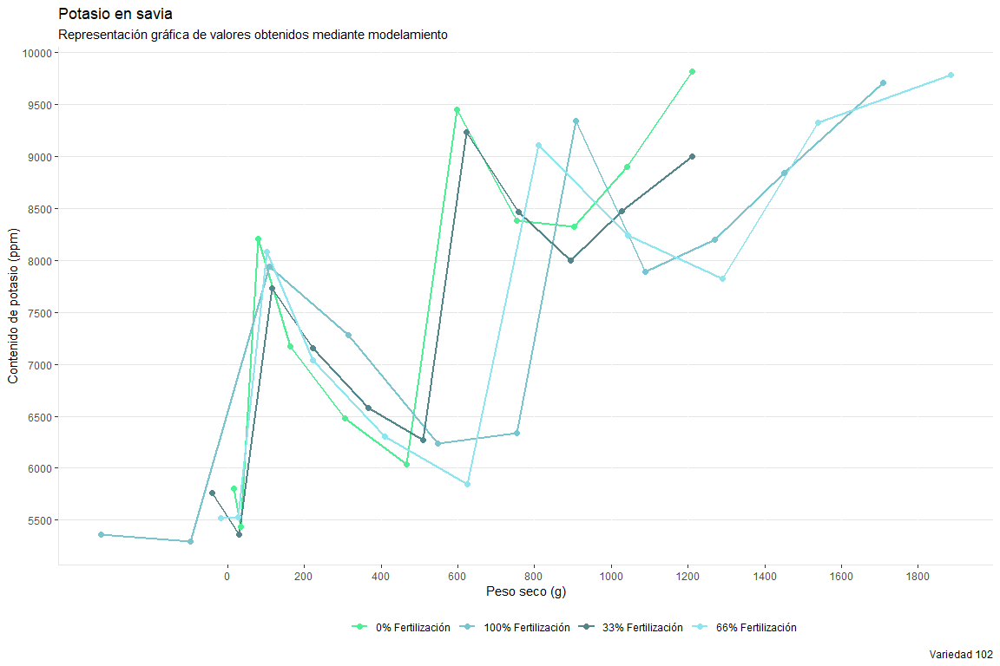<!-- -->

### 4) MODELO RENDIMIENTO

### VARIEDAD 1

``` r
library(dplyr)

masa_seca_1 <- datos_masa_seca %>% 
  filter(VARIEDAD=="1")%>%
  group_by(DDS,TRATAMIENTO.)%>%
  summarise(REND_TUB_TON_HA=mean(REND_TUB_TON_HA,na.rm = T),
            DDS=DDS,
            TRATAMIENTO=TRATAMIENTO.)
```

    ## `summarise()` has grouped output by 'DDS', 'TRATAMIENTO.'. You can override
    ## using the `.groups` argument.

``` r
ggplot() + geom_point(data=masa_seca_1, aes(x=DDS, y = REND_TUB_TON_HA, group = TRATAMIENTO., colour = TRATAMIENTO.)) + 
  xlab("DDS") + 
  ylab("RENDIMIENTO TOTAL") + 
  ggtitle("") +
  tema
```

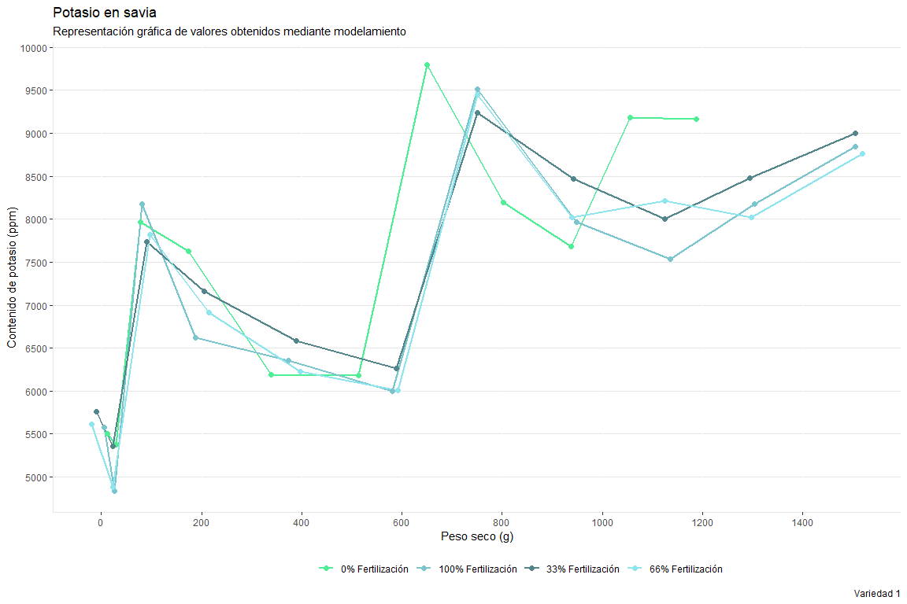<!-- -->

``` r
Gompertz <- function(x, y0, ymax, k, lag){
  result<- y0 + ymax*exp(-exp(k*(lag-x)/(ymax-y0) + 1))
  return(result)
}

masa_seca_100_1 <- datos_masa_seca %>%
  filter(VARIEDAD =="1",TRATAMIENTO.=="100% Fertilización")%>%
  group_by(DDS, TRATAMIENTO.)%>%
  summarise(REND_TUB_TON_HA_100_1=REND_TUB_TON_HA,
            DDS_100_1=DDS,
            TRATAMIENTO=TRATAMIENTO.)
```

    ## `summarise()` has grouped output by 'DDS', 'TRATAMIENTO.'. You can override
    ## using the `.groups` argument.

``` r
Gomp_100_1 <- nls(REND_TUB_TON_HA_100_1 ~ Gompertz(DDS_100_1, y0, ymax, k, lag),
             data=masa_seca_100_1,
             start = list(y0=1, ymax=30, k=0.1, lag=1))

masa_seca_66_1 <- datos_masa_seca %>%
  filter(VARIEDAD =="1",TRATAMIENTO.=="66% Fertilización")%>%
  group_by(DDS, TRATAMIENTO.)%>%
  summarise(REND_TUB_TON_HA_66_1=REND_TUB_TON_HA,
            DDS_66_1=DDS,
            TRATAMIENTO=TRATAMIENTO.)
```

    ## `summarise()` has grouped output by 'DDS', 'TRATAMIENTO.'. You can override
    ## using the `.groups` argument.

``` r
Gomp_66_1 <- nls(REND_TUB_TON_HA_66_1 ~ Gompertz(DDS_66_1, y0, ymax, k, lag),
             data=masa_seca_66_1,
             start = list(y0=1, ymax=30, k=0.1, lag=1))

masa_seca_33_1 <- datos_masa_seca %>%
  filter(VARIEDAD =="1",TRATAMIENTO.=="33% Fertilización")%>%
  group_by(DDS, TRATAMIENTO.)%>%
  summarise(REND_TUB_TON_HA_33_1=REND_TUB_TON_HA,
            DDS_33_1=DDS,
            TRATAMIENTO=TRATAMIENTO.)
```

    ## `summarise()` has grouped output by 'DDS', 'TRATAMIENTO.'. You can override
    ## using the `.groups` argument.

``` r
Gomp_33_1 <- nls(REND_TUB_TON_HA_33_1 ~ Gompertz(DDS_33_1, y0, ymax, k, lag),
             data=masa_seca_33_1,
             start = list(y0=1, ymax=30, k=0.1, lag=1))

masa_seca_0_1 <- datos_masa_seca %>%
  filter(VARIEDAD =="1",TRATAMIENTO.=="0% Fertilización")%>%
  group_by(DDS, TRATAMIENTO.)%>%
  summarise(REND_TUB_TON_HA_0_1=REND_TUB_TON_HA,
            DDS_0_1=DDS,
            TRATAMIENTO=TRATAMIENTO.)
```

    ## `summarise()` has grouped output by 'DDS', 'TRATAMIENTO.'. You can override
    ## using the `.groups` argument.

``` r
Gomp_0_1 <- nls(REND_TUB_TON_HA_0_1 ~ Gompertz(DDS_0_1, y0, ymax, k, lag),
             data=masa_seca_0_1,
             start = list(y0=1, ymax=30, k=0.1, lag=1))
```

``` r
coefs_100_1 <- coef(Gomp_100_1)
y0_100_1 = coefs_100_1[1]
ymax_100_1=coefs_100_1[2]
k_100_1=coefs_100_1[3]
lag_100_1=coefs_100_1[4]

coefs_100_1
```

    ##         y0       ymax          k        lag 
    ##  0.2348967 20.7593653  0.7388606 81.3775571

``` r
coefs_66_1 <- coef(Gomp_66_1)
y0_66_1 = coefs_66_1[1]
ymax_66_1=coefs_66_1[2]
k_66_1=coefs_66_1[3]
lag_66_1=coefs_66_1[4]

coefs_66_1
```

    ##          y0        ymax           k         lag 
    ##  0.02503215 24.97694964  0.75190394 79.64812022

``` r
coefs_33_1 <- coef(Gomp_33_1)
y0_33_1 = coefs_33_1[1]
ymax_33_1=coefs_33_1[2]
k_33_1=coefs_33_1[3]
lag_33_1=coefs_33_1[4]

coefs_33_1
```

    ##          y0        ymax           k         lag 
    ##  0.02323588 23.75983940  0.72270347 78.95595244

``` r
coefs_0_1 <- coef(Gomp_0_1)
y0_0_1 = coefs_0_1[1]
ymax_0_1= coefs_0_1[2]
k_0_1 = coefs_0_1[3]
lag_0_1 = coefs_0_1[4]

coefs_0_1
```

    ##          y0        ymax           k         lag 
    ## -0.02763788 15.90154172  0.51167620 73.54360709

``` r
DDS_LEVELS <- seq(0,150,by=1)

par(mfrow=c(2,2))

pred <- predict(Gomp_100_1, list(x=DDS_LEVELS))
plot(REND_TUB_TON_HA_100_1~DDS_100_1, data=masa_seca_100_1, xlim=c(0,150), ylim=c(0,25),
     xlab="DDS", ylab="RENDIMIENTO total")
lines(DDS_LEVELS, Gompertz(DDS_LEVELS, y0_100_1, ymax_100_1, k_100_1, lag_100_1),
      lty=1, col="cadetblue3", lwd = 2)

pred <- predict(Gomp_66_1, list(x=DDS_LEVELS))
plot(REND_TUB_TON_HA_66_1~DDS_66_1, data=masa_seca_66_1, xlim=c(0,150), ylim=c(0,25),
     xlab="DDS", ylab="RENDIMIENTO total")
lines(DDS_LEVELS, Gompertz(DDS_LEVELS, y0_66_1, ymax_66_1, k_66_1, lag_66_1),
      lty=1, col="cadetblue2", lwd=2)

pred <- predict(Gomp_33_1, list(x=DDS_LEVELS))
plot(REND_TUB_TON_HA_33_1~DDS_33_1, data=masa_seca_33_1, xlim=c(0,150), ylim=c(0,25),
     xlab="DDS", ylab="RENDIMIENTO total")
lines(DDS_LEVELS, Gompertz(DDS_LEVELS, y0_33_1, ymax_33_1, k_33_1, lag_33_1),
      lty=1, col="cadetblue4", lwd=2)

pred <- predict(Gomp_0_1, list(x=DDS_LEVELS))
plot(REND_TUB_TON_HA_0_1~DDS_0_1, data=masa_seca_0_1, xlim=c(0,150), ylim=c(0,25),
     xlab="DDS", ylab="RENDIMIENTO total")
lines(DDS_LEVELS, Gompertz(DDS_LEVELS, y0_0_1, ymax_0_1, k_0_1, lag_0_1),
      lty=1, col="seagreen2", lwd=2)
```

<!-- -->

``` r
par(mfrow=c(1,1))

plot(REND_TUB_TON_HA~DDS, data=masa_seca_1, xlim=c(0,150), ylim=c(0,25),
     xlab="DDS", ylab="Rendimiento total (ton/ha)")
lines(DDS_LEVELS, Gompertz(DDS_LEVELS, y0_66_1, ymax_66_1, k_66_1, lag_66_1),
      lty=1, col="cadetblue2", lwd=2)
lines(DDS_LEVELS, Gompertz(DDS_LEVELS, y0_100_1, ymax_100_1, k_100_1, lag_100_1),
      lty=1, col="cadetblue3", lwd=2)
lines(DDS_LEVELS, Gompertz(DDS_LEVELS, y0_33_1, ymax_33_1, k_33_1, lag_33_1),
      lty=1, col="cadetblue4", lwd=2)
lines(DDS_LEVELS, Gompertz(DDS_LEVELS, y0_0_1, ymax_0_1, k_0_1, lag_0_1),
      lty=1, col="seagreen2", lwd=2)
legend("topleft", legend=c("100% Fertilización", "66% Fertilización", "33% Fertilización", "0% Fertilización"), lwd = 3, col = c("cadetblue3","cadetblue2","cadetblue4", "seagreen2"))
```

<!-- -->

``` r
RENDIMIENTOs_savia_100_1 <- Gompertz(c(36,45,53,61,70,78,84,91,98,105,115),y0_100_1,ymax_100_1,k_100_1,lag_100_1)
DDS_100_1 <- c(36,45,53,61,70,78,84,91,98,105,115)
TRATAMIENTO_100_1 <- rep("100% Fertilización",11)
Tabla_RENDIMIENTOs_savia_100_1 <- data.frame(RENDIMIENTOs_savia_100_1,DDS_100_1,TRATAMIENTO_100_1)
Tabla_RENDIMIENTOs_savia_100_1
```

    ##    RENDIMIENTOs_savia_100_1 DDS_100_1  TRATAMIENTO_100_1
    ## 1                 0.2349154        36 100% Fertilización
    ## 2                 0.2357755        45 100% Fertilización
    ## 3                 0.2458171        53 100% Fertilización
    ## 4                 0.3071310        61 100% Fertilización
    ## 5                 0.5809228        70 100% Fertilización
    ## 6                 1.1988333        78 100% Fertilización
    ## 7                 1.9848607        84 100% Fertilización
    ## 8                 3.2709101        91 100% Fertilización
    ## 9                 4.8937589        98 100% Fertilización
    ## 10                6.7336475       105 100% Fertilización
    ## 11                9.4672769       115 100% Fertilización

``` r
RENDIMIENTOs_savia_66_1 <- Gompertz(c(36,45,53,61,70,78,84,91,98,105,115),y0_66_1,ymax_66_1,k_66_1,lag_66_1)
DDS_66_1 <- c(36,45,53,61,70,78,84,91,98,105,115)
TRATAMIENTO_66_1 <- rep("66% Fertilización",11)
Tabla_RENDIMIENTOs_savia_66_1 <- data.frame(RENDIMIENTOs_savia_66_1,DDS_66_1,TRATAMIENTO_66_1)
Tabla_RENDIMIENTOs_savia_66_1
```

    ##    RENDIMIENTOs_savia_66_1 DDS_66_1  TRATAMIENTO_66_1
    ## 1               0.02602992       36 66% Fertilización
    ## 2               0.03609483       45 66% Fertilización
    ## 3               0.08287783       53 66% Fertilización
    ## 4               0.23725236       61 66% Fertilización
    ## 5               0.68371471       70 66% Fertilización
    ## 6               1.46016932       78 66% Fertilización
    ## 7               2.32699498       84 66% Fertilización
    ## 8               3.64758507       91 66% Fertilización
    ## 9               5.25479888       98 66% Fertilización
    ## 10              7.06584712      105 66% Fertilización
    ## 11              9.81310651      115 66% Fertilización

``` r
RENDIMIENTOs_savia_33_1 <- Gompertz(c(36,45,53,61,70,78,84,91,98,105,115),y0_33_1,ymax_33_1,k_33_1,lag_33_1)
DDS_33_1 <- c(36,45,53,61,70,78,84,91,98,105,115)
TRATAMIENTO_33_1 <- rep("33% Fertilización",11)
Tabla_RENDIMIENTOs_savia_33_1 <- data.frame(RENDIMIENTOs_savia_33_1,DDS_33_1,TRATAMIENTO_33_1)
Tabla_RENDIMIENTOs_savia_33_1
```

    ##    RENDIMIENTOs_savia_33_1 DDS_33_1  TRATAMIENTO_33_1
    ## 1               0.02425890       36 33% Fertilización
    ## 2               0.03462087       45 33% Fertilización
    ## 3               0.08265696       53 33% Fertilización
    ## 4               0.24021444       61 33% Fertilización
    ## 5               0.69194117       70 33% Fertilización
    ## 6               1.47015249       78 33% Fertilización
    ## 7               2.33196997       84 33% Fertilización
    ## 8               3.63495822       91 33% Fertilización
    ## 9               5.20827147       98 33% Fertilización
    ## 10              6.96782063      105 33% Fertilización
    ## 11              9.61425326      115 33% Fertilización

``` r
RENDIMIENTOs_savia_0_1 <- Gompertz(c(36,45,53,61,70,78,84,91,98,105,115),y0_0_1,ymax_0_1,k_0_1,lag_0_1)
DDS_0_1 <- c(36,45,53,61,70,78,84,91,98,105,115)
TRATAMIENTO_0_1 <- rep("0% Fertilización",11)
Tabla_RENDIMIENTOs_savia_0_1 <- data.frame(RENDIMIENTOs_savia_0_1,DDS_0_1,TRATAMIENTO_0_1)
Tabla_RENDIMIENTOs_savia_0_1
```

    ##    RENDIMIENTOs_savia_0_1 DDS_0_1  TRATAMIENTO_0_1
    ## 1            -0.025824691      36 0% Fertilización
    ## 2            -0.009921534      45 0% Fertilización
    ## 3             0.055075669      53 0% Fertilización
    ## 4             0.244713328      61 0% Fertilización
    ## 5             0.728464325      70 0% Fertilización
    ## 6             1.480209275      78 0% Fertilización
    ## 7             2.251130886      84 0% Fertilización
    ## 8             3.342140467      91 0% Fertilización
    ## 9             4.578001866      98 0% Fertilización
    ## 10            5.883286437     105 0% Fertilización
    ## 11            7.730052676     115 0% Fertilización

### VARIEDAD 39

``` r
masa_seca_39 <- datos_masa_seca %>% 
  filter(VARIEDAD=="39")%>%
  group_by(DDS,TRATAMIENTO.)%>%
  summarise(REND_TUB_TON_HA_39=mean(REND_TUB_TON_HA,na.rm = T),
            DDS_39=DDS,
            TRATAMIENTO_39=TRATAMIENTO.)
```

    ## `summarise()` has grouped output by 'DDS', 'TRATAMIENTO.'. You can override
    ## using the `.groups` argument.

``` r
ggplot() + geom_point(data=masa_seca_39, aes(x=DDS, y = REND_TUB_TON_HA_39, group = TRATAMIENTO., colour = TRATAMIENTO.)) + 
  xlab("DDS") + 
  ylab("RENDIMIENTO TOTAL") + 
  ggtitle("") +
  tema
```

<!-- -->

``` r
Gompertz <- function(x, y0, ymax, k, lag){
  result<- y0 + ymax*exp(-exp(k*(lag-x)/(ymax-y0) + 1))
  return(result)
}

masa_seca_100_39 <- datos_masa_seca %>%
  filter(VARIEDAD =="39",TRATAMIENTO.=="100% Fertilización")%>%
  group_by(DDS, TRATAMIENTO.)%>%
  summarise(REND_TUB_TON_HA_100_39=REND_TUB_TON_HA,
            DDS_100_39=DDS,
            TRATAMIENTO_39=TRATAMIENTO.)
```

    ## `summarise()` has grouped output by 'DDS', 'TRATAMIENTO.'. You can override
    ## using the `.groups` argument.

``` r
Gomp_100_39 <- nls(REND_TUB_TON_HA_100_39 ~ Gompertz(DDS_100_39, y0, ymax, k, lag),
             data=masa_seca_100_39,
             start = list(y0=1, ymax=25, k=0.1, lag=1))

masa_seca_66_39 <- datos_masa_seca %>%
  filter(VARIEDAD =="39",TRATAMIENTO.=="66% Fertilización")%>%
  group_by(DDS, TRATAMIENTO.)%>%
  summarise(REND_TUB_TON_HA_66_39=REND_TUB_TON_HA,
            DDS_66_39=DDS,
            TRATAMIENTO_39=TRATAMIENTO.)
```

    ## `summarise()` has grouped output by 'DDS', 'TRATAMIENTO.'. You can override
    ## using the `.groups` argument.

``` r
Gomp_66_39 <- nls(REND_TUB_TON_HA_66_39 ~ Gompertz(DDS_66_39, y0, ymax, k, lag),
             data=masa_seca_66_39,
             start = list(y0=1, ymax=25, k=0.1, lag=1))

masa_seca_33_39 <- datos_masa_seca %>%
  filter(VARIEDAD =="39",TRATAMIENTO.=="33% Fertilización")%>%
  group_by(DDS, TRATAMIENTO.)%>%
  summarise(REND_TUB_TON_HA_33_39=REND_TUB_TON_HA,
            DDS_33_39=DDS,
            TRATAMIENTO_39=TRATAMIENTO.)
```

    ## `summarise()` has grouped output by 'DDS', 'TRATAMIENTO.'. You can override
    ## using the `.groups` argument.

``` r
Gomp_33_39 <- nls(REND_TUB_TON_HA_33_39 ~ Gompertz(DDS_33_39, y0, ymax, k, lag),
             data=masa_seca_33_39,
             start = list(y0=1, ymax=25, k=0.1, lag=1))

masa_seca_0_39 <- datos_masa_seca %>%
  filter(VARIEDAD =="39",TRATAMIENTO.=="0% Fertilización")%>%
  group_by(DDS, TRATAMIENTO.)%>%
  summarise(REND_TUB_TON_HA_0_39=REND_TUB_TON_HA,
            DDS_0_39=DDS,
            TRATAMIENTO_39=TRATAMIENTO.)
```

    ## `summarise()` has grouped output by 'DDS', 'TRATAMIENTO.'. You can override
    ## using the `.groups` argument.

``` r
Gomp_0_39 <- nls(REND_TUB_TON_HA_0_39 ~ Gompertz(DDS_0_39, y0, ymax, k, lag),
             data=masa_seca_0_39,
             start = list(y0=1, ymax=25, k=0.1, lag=1))
```

``` r
coefs_100_39 <- coef(Gomp_100_39)
y0_100_39 = coefs_100_39[1]
ymax_100_39=coefs_100_39[2]
k_100_39=coefs_100_39[3]
lag_100_39=coefs_100_39[4]

coefs_100_39
```

    ##          y0        ymax           k         lag 
    ## -0.03644458 25.19312800  0.75193017 73.27101615

``` r
coefs_66_39 <- coef(Gomp_66_39)
y0_66_39 = coefs_66_39[1]
ymax_66_39=coefs_66_39[2]
k_66_39=coefs_66_39[3]
lag_66_39=coefs_66_39[4]

coefs_66_39
```

    ##         y0       ymax          k        lag 
    ## -0.5449435 28.6477236  0.6124301 66.8188130

``` r
coefs_33_39 <- coef(Gomp_33_39)
y0_33_39 = coefs_33_39[1]
ymax_33_39=coefs_33_39[2]
k_33_39=coefs_33_39[3]
lag_33_39=coefs_33_39[4]

coefs_33_39
```

    ##         y0       ymax          k        lag 
    ##  0.1990685 12.6724917  0.7281092 76.5748444

``` r
coefs_0_39 <- coef(Gomp_0_39)
y0_0_39 = coefs_0_39[1]
ymax_0_39=coefs_0_39[2]
k_0_39=coefs_0_39[3]
lag_0_39=coefs_0_39[4]

coefs_0_39
```

    ##         y0       ymax          k        lag 
    ##  0.2484313 13.7663784  0.6070375 78.8750925

``` r
DDS_LEVELS <- seq(0,150,by=1)

par(mfrow=c(2,2))

pred <- predict(Gomp_100_39, list(x=DDS_LEVELS))
plot(REND_TUB_TON_HA_100_39~DDS_100_39, data=masa_seca_100_39, xlim=c(0,150), ylim=c(0,25),
     xlab="DDS", ylab="RENDIMIENTO total")
lines(DDS_LEVELS, Gompertz(DDS_LEVELS, y0_100_39, ymax_100_39, k_100_39, lag_100_39),
      lty=1, col="cadetblue3", lwd=2)

pred <- predict(Gomp_66_39, list(x=DDS_LEVELS))
plot(REND_TUB_TON_HA_66_39~DDS_66_39, data=masa_seca_66_39, xlim=c(0,150), ylim=c(0,25),
     xlab="DDS", ylab="RENDIMIENTO total")
lines(DDS_LEVELS, Gompertz(DDS_LEVELS, y0_66_39, ymax_66_39, k_66_39, lag_66_39),
      lty=1, col="cadetblue2", lwd=2)

pred <- predict(Gomp_33_39, list(x=DDS_LEVELS))
plot(REND_TUB_TON_HA_33_39~DDS_33_39, data=masa_seca_33_39, xlim=c(0,150), ylim=c(0,25),
     xlab="DDS", ylab="RENDIMIENTO total")
lines(DDS_LEVELS, Gompertz(DDS_LEVELS, y0_33_39, ymax_33_39, k_33_39, lag_33_39),
      lty=1, col="cadetblue4", lwd=2)

pred <- predict(Gomp_0_39, list(x=DDS_LEVELS))
plot(REND_TUB_TON_HA_0_39~DDS_0_39, data=masa_seca_0_39, xlim=c(0,150), ylim=c(0,25),
     xlab="DDS", ylab="RENDIMIENTO total")
lines(DDS_LEVELS, Gompertz(DDS_LEVELS, y0_0_39, ymax_0_39, k_0_39, lag_0_39),
      lty=1, col="seagreen2", lwd=2)
```

<!-- -->

``` r
par(mfrow=c(1,1))

plot(REND_TUB_TON_HA_39~DDS_39, data=masa_seca_39, xlim=c(0,150), ylim=c(0,25),
     xlab="DDS", ylab="Rendimiento total")
lines(DDS_LEVELS, Gompertz(DDS_LEVELS, y0_66_39, ymax_66_39, k_66_39, lag_66_39),
      lty=1, col="cadetblue2", lwd=2)
lines(DDS_LEVELS, Gompertz(DDS_LEVELS, y0_100_39, ymax_100_39, k_100_39, lag_100_39),
      lty=1, col="cadetblue3", lwd=2)
lines(DDS_LEVELS, Gompertz(DDS_LEVELS, y0_33_39, ymax_33_39, k_33_39, lag_33_39),
      lty=1, col="cadetblue4", lwd=2)
lines(DDS_LEVELS, Gompertz(DDS_LEVELS, y0_0_39, ymax_0_39, k_0_39, lag_0_39),
      lty=1, col="seagreen2", lwd=2)
legend("topleft", legend=c("100% Fertilización", "66% Fertilización", "33% Fertilización", "0% Fertilización"), lwd = 3, col = c("cadetblue3","cadetblue2","cadetblue4", "seagreen2"))
```

<!-- -->

``` r
RENDIMIENTOs_savia_100_39 <- Gompertz(c(36,45,53,61,70,78,84,91,98,105,115),y0_100_39,ymax_100_39,k_100_39,lag_100_39)
DDS_100_39 <- c(36,45,53,61,70,78,84,91,98,105,115)
TRATAMIENTO_100_39 <- rep("100% Fertilización",11)
Tabla_RENDIMIENTOs_savia_100_39 <- data.frame(RENDIMIENTOs_savia_100_39,DDS_100_39,TRATAMIENTO_100_39)
Tabla_RENDIMIENTOs_savia_100_39
```

    ##    RENDIMIENTOs_savia_100_39 DDS_100_39 TRATAMIENTO_100_39
    ## 1               -0.029894866         36 100% Fertilización
    ## 2                0.009230284         45 100% Fertilización
    ## 3                0.137843175         53 100% Fertilización
    ## 4                0.464144229         61 100% Fertilización
    ## 5                1.222083449         70 100% Fertilización
    ## 6                2.340062505         78 100% Fertilización
    ## 7                3.461665179         84 100% Fertilización
    ## 8                5.036862561         91 100% Fertilización
    ## 9                6.823906844         98 100% Fertilización
    ## 10               8.727988993        105 100% Fertilización
    ## 11              11.469060604        115 100% Fertilización

``` r
RENDIMIENTOs_savia_66_39 <- Gompertz(c(36,45,53,61,70,78,84,91,98,105,115),y0_66_39,ymax_66_39,k_66_39,lag_66_39)
DDS_66_39 <- c(36,45,53,61,70,78,84,91,98,105,115)
TRATAMIENTO_66_39 <- rep("66% Fertilización",11)
Tabla_RENDIMIENTOs_savia_66_39 <- data.frame(RENDIMIENTOs_savia_66_39,DDS_66_39,TRATAMIENTO_66_39)
Tabla_RENDIMIENTOs_savia_66_39
```

    ##    RENDIMIENTOs_savia_66_39 DDS_66_39 TRATAMIENTO_66_39
    ## 1                -0.3851617        36 66% Fertilización
    ## 2                -0.1547617        45 66% Fertilización
    ## 3                 0.2128366        53 66% Fertilización
    ## 4                 0.7833060        61 66% Fertilización
    ## 5                 1.7081029        70 66% Fertilización
    ## 6                 2.7923270        78 66% Fertilización
    ## 7                 3.7585709        84 66% Fertilización
    ## 8                 5.0302998        91 66% Fertilización
    ## 9                 6.4268967        98 66% Fertilización
    ## 10                7.9111834       105 66% Fertilización
    ## 11               10.1076608       115 66% Fertilización

``` r
RENDIMIENTOs_savia_33_39 <- Gompertz(c(36,45,53,61,70,78,84,91,98,105,115),y0_33_39,ymax_33_39,k_33_39,lag_33_39)
DDS_33_39 <- c(36,45,53,61,70,78,84,91,98,105,115)
TRATAMIENTO_33_39 <- rep("33% Fertilización",11)
Tabla_RENDIMIENTOs_savia_33_39 <- data.frame(RENDIMIENTOs_savia_33_39,DDS_33_39,TRATAMIENTO_33_39)
Tabla_RENDIMIENTOs_savia_33_39
```

    ##    RENDIMIENTOs_savia_33_39 DDS_33_39 TRATAMIENTO_33_39
    ## 1                 0.1990685        36 33% Fertilización
    ## 2                 0.1990689        45 33% Fertilización
    ## 3                 0.1993367        53 33% Fertilización
    ## 4                 0.2139460        61 33% Fertilización
    ## 5                 0.4335049        70 33% Fertilización
    ## 6                 1.2379411        78 33% Fertilización
    ## 7                 2.3744780        84 33% Fertilización
    ## 8                 4.1277790        91 33% Fertilización
    ## 9                 6.0181175        98 33% Fertilización
    ## 10                7.7539831       105 33% Fertilización
    ## 11                9.6954627       115 33% Fertilización

``` r
RENDIMIENTOs_savia_0_39 <- Gompertz(c(36,45,53,61,70,78,84,91,98,105,115),y0_0_39,ymax_0_39,k_0_39,lag_0_39)
DDS_0_39 <- c(36,45,53,61,70,78,84,91,98,105,115)
TRATAMIENTO_0_39 <- rep("0% Fertilización",11)
Tabla_RENDIMIENTOs_savia_0_39 <- data.frame(RENDIMIENTOs_savia_0_39,DDS_0_39,TRATAMIENTO_0_39)
Tabla_RENDIMIENTOs_savia_0_39
```

    ##    RENDIMIENTOs_savia_0_39 DDS_0_39 TRATAMIENTO_0_39
    ## 1                0.2484315       36 0% Fertilización
    ## 2                0.2484856       45 0% Fertilización
    ## 3                0.2507522       53 0% Fertilización
    ## 4                0.2803753       61 0% Fertilización
    ## 5                0.4884411       70 0% Fertilización
    ## 6                1.0630792       78 0% Fertilización
    ## 7                1.8368896       84 0% Fertilización
    ## 8                3.0925084       91 0% Fertilización
    ## 9                4.6002849       98 0% Fertilización
    ## 10               6.1855946      105 0% Fertilización
    ## 11               8.2968957      115 0% Fertilización

### VARIEDAD 102

``` r
masa_seca_102 <- datos_masa_seca %>% 
  filter(VARIEDAD=="102")%>%
  group_by(DDS,TRATAMIENTO.)%>%
  summarise(REND_TUB_TON_HA_102=mean(REND_TUB_TON_HA,na.rm = T),
            DDS_102=DDS,
            TRATAMIENTO_102=TRATAMIENTO.)
```

    ## `summarise()` has grouped output by 'DDS', 'TRATAMIENTO.'. You can override
    ## using the `.groups` argument.

``` r
masa_seca_102
```

    ## # A tibble: 96 × 5
    ## # Groups:   DDS, TRATAMIENTO. [24]
    ##      DDS TRATAMIENTO.       REND_TUB_TON_HA_102 DDS_102 TRATAMIENTO_102   
    ##    <dbl> <chr>                            <dbl>   <dbl> <chr>             
    ##  1    43 0% Fertilización                     0      43 0% Fertilización  
    ##  2    43 0% Fertilización                     0      43 0% Fertilización  
    ##  3    43 0% Fertilización                     0      43 0% Fertilización  
    ##  4    43 0% Fertilización                     0      43 0% Fertilización  
    ##  5    43 100% Fertilización                   0      43 100% Fertilización
    ##  6    43 100% Fertilización                   0      43 100% Fertilización
    ##  7    43 100% Fertilización                   0      43 100% Fertilización
    ##  8    43 100% Fertilización                   0      43 100% Fertilización
    ##  9    43 33% Fertilización                    0      43 33% Fertilización 
    ## 10    43 33% Fertilización                    0      43 33% Fertilización 
    ## # … with 86 more rows

``` r
ggplot() + geom_point(data=masa_seca_102, aes(x=DDS_102, y = REND_TUB_TON_HA_102, group = TRATAMIENTO., colour = TRATAMIENTO.)) + 
  xlab("DDS") + 
  ylab("RENDIMIENTO TOTAL") + 
  ggtitle("") +
  tema
```

<!-- -->

``` r
Cuadratica <- function(x,y0,a){
  result<- (y0 + a*x^2)
  return(result)
}

masa_seca_100_102 <- datos_masa_seca %>%
  filter(VARIEDAD =="102",TRATAMIENTO.=="100% Fertilización")%>%
  group_by(DDS, TRATAMIENTO.)%>%
  summarise(REND_TUB_TON_HA_100_102=REND_TUB_TON_HA,
            DDS_100_102=DDS,
            TRATAMIENTO_102=TRATAMIENTO.)
```

    ## `summarise()` has grouped output by 'DDS', 'TRATAMIENTO.'. You can override
    ## using the `.groups` argument.

``` r
Cuad_100_102 <- nls(REND_TUB_TON_HA_100_102~Cuadratica(DDS_100_102,y0,a),
             data=masa_seca_100_102,
             start = list(y0=0,a=1))

masa_seca_66_102 <- datos_masa_seca %>%
  filter(VARIEDAD =="102",TRATAMIENTO.=="66% Fertilización")%>%
  group_by(DDS, TRATAMIENTO.)%>%
  summarise(REND_TUB_TON_HA_66_102=REND_TUB_TON_HA,
            DDS_66_102=DDS,
            TRATAMIENTO=TRATAMIENTO.)
```

    ## `summarise()` has grouped output by 'DDS', 'TRATAMIENTO.'. You can override
    ## using the `.groups` argument.

``` r
Cuad_66_102 <- nls(REND_TUB_TON_HA_66_102~Cuadratica(DDS_66_102,y0,a),
             data=masa_seca_66_102,
             start = list(y0=0,a=1))

masa_seca_33_102 <- datos_masa_seca %>%
  filter(VARIEDAD =="102",TRATAMIENTO.=="33% Fertilización")%>%
  group_by(DDS, TRATAMIENTO.)%>%
  summarise(REND_TUB_TON_HA_33_102=REND_TUB_TON_HA,
            DDS_33_102=DDS,
            TRATAMIENTO_102=TRATAMIENTO.)
```

    ## `summarise()` has grouped output by 'DDS', 'TRATAMIENTO.'. You can override
    ## using the `.groups` argument.

``` r
Cuad_33_102 <- nls(REND_TUB_TON_HA_33_102~Cuadratica(DDS_33_102,y0,a),
             data=masa_seca_33_102,
             start = list(y0=0,a=1))

masa_seca_0_102 <- datos_masa_seca %>%
  filter(VARIEDAD =="102",TRATAMIENTO.=="0% Fertilización")%>%
  group_by(DDS, TRATAMIENTO.)%>%
  summarise(REND_TUB_TON_HA_0_102=REND_TUB_TON_HA,
            DDS_0_102=DDS,
            TRATAMIENTO_102=TRATAMIENTO.)
```

    ## `summarise()` has grouped output by 'DDS', 'TRATAMIENTO.'. You can override
    ## using the `.groups` argument.

``` r
Cuad_0_102 <- nls(REND_TUB_TON_HA_0_102~Cuadratica(DDS_0_102,y0,a),
             data=masa_seca_0_102,
             start = list(y0=0,a=1))
```

``` r
coefs_100_102 <- coef(Cuad_100_102)
y0_100_102 = coefs_100_102[1]
a_100_102=coefs_100_102[2]

coefs_100_102
```

    ##           y0            a 
    ## -4.405376227  0.001209678

``` r
coefs_66_102 <- coef(Cuad_66_102)
y0_66_102 = coefs_66_102[1]
a_66_102=coefs_66_102[2]

coefs_66_102
```

    ##          y0           a 
    ## -4.35772929  0.00130429

``` r
coefs_33_102 <- coef(Cuad_33_102)
y0_33_102 = coefs_33_102[1]
a_33_102=coefs_33_102[2]

coefs_33_102
```

    ##            y0             a 
    ## -2.2917532537  0.0007607411

``` r
coefs_0_102 <- coef(Cuad_0_102)
y0_0_102 = coefs_0_102[1]
a_0_102=coefs_0_102[2]

coefs_0_102
```

    ##            y0             a 
    ## -2.3039743251  0.0007274068

``` r
DDS_LEVELS <- seq(0,150,by=1)

par(mfrow=c(2,2))

pred <- predict(Cuad_100_102, list(x=DDS_LEVELS))
plot(REND_TUB_TON_HA_100_102~DDS_100_102, data=masa_seca_100_102, xlim=c(0,150), ylim=c(0,30),
     xlab="DDS", ylab="RENDIMIENTO total")
lines(DDS_LEVELS, Cuadratica(DDS_LEVELS, y0_100_102, a_100_102),
      lty=1, col="cadetblue3", lwd=2)

pred <- predict(Cuad_66_102, list(x=DDS_LEVELS))
plot(REND_TUB_TON_HA_66_102~DDS_66_102, data=masa_seca_66_102, xlim=c(0,150), ylim=c(0,30),
     xlab="DDS", ylab="RENDIMIENTO total")
lines(DDS_LEVELS, Cuadratica(DDS_LEVELS, y0_66_102, a_66_102),
      lty=1, col="cadetblue2", lwd=2)

pred <- predict(Cuad_33_102, list(x=DDS_LEVELS))
plot(REND_TUB_TON_HA_33_102~DDS_33_102, data=masa_seca_33_102, xlim=c(0,150), ylim=c(0,30),
     xlab="DDS", ylab="RENDIMIENTO total")
lines(DDS_LEVELS, Cuadratica(DDS_LEVELS, y0_33_102, a_33_102),
      lty=1, col="cadetblue4", lwd=2)

pred <- predict(Cuad_0_102, list(x=DDS_LEVELS))
plot(REND_TUB_TON_HA_0_102~DDS_0_102, data=masa_seca_0_102, xlim=c(0,150), ylim=c(0,25),
     xlab="DDS", ylab="RENDIMIENTO total")
lines(DDS_LEVELS, Cuadratica(DDS_LEVELS, y0_0_102, a_0_102),
      lty=1, col="seagreen2", lwd=2)
```

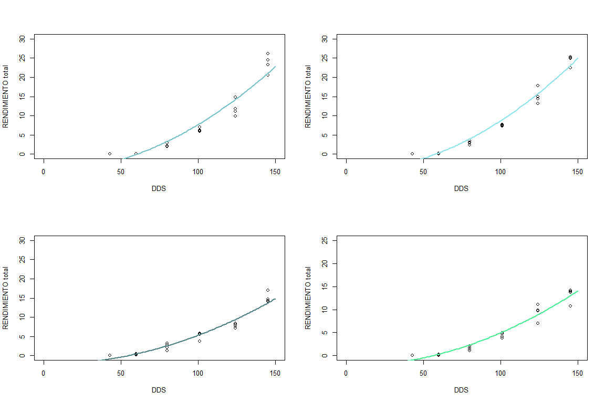<!-- -->

``` r
par(mfrow=c(1,1))

plot(REND_TUB_TON_HA_102~DDS_102, data=masa_seca_102, xlim=c(0,150), ylim=c(0,25),
     xlab="DDS", ylab="Rendimiento total (ton/ha)")
lines(DDS_LEVELS, Cuadratica(DDS_LEVELS, y0_66_102, a_66_102),
      lty=1, col="cadetblue2", lwd=2)
lines(DDS_LEVELS, Cuadratica(DDS_LEVELS, y0_100_102, a_100_102),
      lty=1, col="cadetblue3", lwd=2)
lines(DDS_LEVELS, Cuadratica(DDS_LEVELS, y0_33_102, a_33_102),
      lty=1, col="cadetblue4", lwd=2)
lines(DDS_LEVELS, Cuadratica(DDS_LEVELS, y0_0_102, a_0_102),
      lty=1, col="seagreen2", lwd=2)
legend("topleft", legend=c("100% Fertilización", "66% Fertilización", "33% Fertilización", "0% Fertilización"), lwd = 3, col = c("cadetblue3","cadetblue2","cadetblue4", "seagreen2"))
```

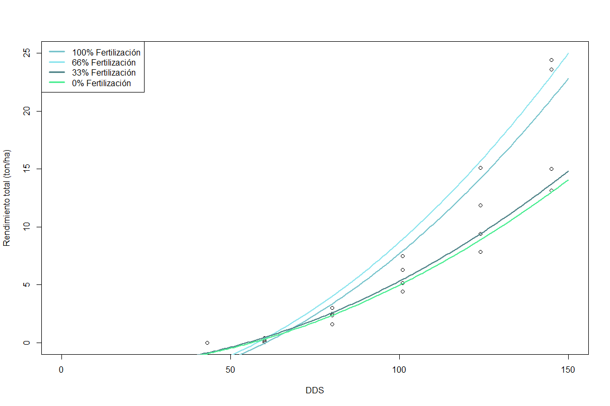<!-- -->

``` r
RENDIMIENTOs_savia_100_102 <-Cuadratica(c(36,45,53,61,70,78,84,91,98,105,115),y0_100_102,a_100_102)
DDS_100_102 <- c(36,45,53,61,70,78,84,91,98,105,115)
TRATAMIENTO_100_102 <- rep("100% Fertilización",11)
Tabla_RENDIMIENTOs_savia_100_102 <- data.frame(RENDIMIENTOs_savia_100_102,DDS_100_102,TRATAMIENTO_100_102)
Tabla_RENDIMIENTOs_savia_100_102
```

    ##    RENDIMIENTOs_savia_100_102 DDS_100_102 TRATAMIENTO_100_102
    ## 1                 -2.83763350          36  100% Fertilización
    ## 2                 -1.95577822          45  100% Fertilización
    ## 3                 -1.00739065          53  100% Fertilización
    ## 4                  0.09583572          61  100% Fertilización
    ## 5                  1.52204611          70  100% Fertilización
    ## 6                  2.95430490          78  100% Fertilización
    ## 7                  4.13011194          84  100% Fertilización
    ## 8                  5.61196752          91  100% Fertilización
    ## 9                  7.21237155          98  100% Fertilización
    ## 10                 8.93132403         105  100% Fertilización
    ## 11                11.59261569         115  100% Fertilización

``` r
RENDIMIENTOs_savia_66_102 <- Cuadratica(c(36,45,53,61,70,78,84,91,98,105,115),y0_66_102,a_66_102)
DDS_66_102 <- c(36,45,53,61,70,78,84,91,98,105,115)
TRATAMIENTO_66_102 <- rep("66% Fertilización",11)
Tabla_RENDIMIENTOs_savia_66_102 <- data.frame(RENDIMIENTOs_savia_66_102,DDS_66_102,TRATAMIENTO_66_102)
Tabla_RENDIMIENTOs_savia_66_102
```

    ##    RENDIMIENTOs_savia_66_102 DDS_66_102 TRATAMIENTO_66_102
    ## 1                 -2.6673699         36  66% Fertilización
    ## 2                 -1.7165427         45  66% Fertilización
    ## 3                 -0.6939796         53  66% Fertilización
    ## 4                  0.4955326         61  66% Fertilización
    ## 5                  2.0332901         70  66% Fertilización
    ## 6                  3.5775690         78  66% Fertilización
    ## 7                  4.8453386         84  66% Fertilización
    ## 8                  6.4430934         91  66% Fertilización
    ## 9                  8.1686687         98  66% Fertilización
    ## 10                10.0220643        105  66% Fertilización
    ## 11                12.8915015        115  66% Fertilización

``` r
RENDIMIENTOs_savia_33_102 <- Cuadratica(c(36,45,53,61,70,78,84,91,98,105,115),y0_33_102,a_33_102)
DDS_33_102 <- c(36,45,53,61,70,78,84,91,98,105,115)
TRATAMIENTO_33_102 <- rep("33% Fertilización",11)
Tabla_RENDIMIENTOs_savia_33_102 <- data.frame(RENDIMIENTOs_savia_33_102,DDS_33_102,TRATAMIENTO_33_102)
Tabla_RENDIMIENTOs_savia_33_102
```

    ##    RENDIMIENTOs_savia_33_102 DDS_33_102 TRATAMIENTO_33_102
    ## 1                 -1.3058328         36  33% Fertilización
    ## 2                 -0.7512525         45  33% Fertilización
    ## 3                 -0.1548315         53  33% Fertilización
    ## 4                  0.5389643         61  33% Fertilización
    ## 5                  1.4358781         70  33% Fertilización
    ## 6                  2.3365955         78  33% Fertilización
    ## 7                  3.0760359         84  33% Fertilización
    ## 8                  4.0079437         91  33% Fertilización
    ## 9                  5.0144042         98  33% Fertilización
    ## 10                 6.0954172        105  33% Fertilización
    ## 11                 7.7690476        115  33% Fertilización

``` r
RENDIMIENTOs_savia_0_102 <- Gompertz(c(36,45,53,61,70,78,84,91,98,105,115),y0_0_39,ymax_0_39,k_0_39,lag_0_39)
DDS_0_102 <- c(36,45,53,61,70,78,84,91,98,105,115)
TRATAMIENTO_0_102 <- rep("0% Fertilización",11)
Tabla_RENDIMIENTOs_savia_0_102 <- data.frame(RENDIMIENTOs_savia_0_102,DDS_0_102,TRATAMIENTO_0_102)
Tabla_RENDIMIENTOs_savia_0_102
```

    ##    RENDIMIENTOs_savia_0_102 DDS_0_102 TRATAMIENTO_0_102
    ## 1                 0.2484315        36  0% Fertilización
    ## 2                 0.2484856        45  0% Fertilización
    ## 3                 0.2507522        53  0% Fertilización
    ## 4                 0.2803753        61  0% Fertilización
    ## 5                 0.4884411        70  0% Fertilización
    ## 6                 1.0630792        78  0% Fertilización
    ## 7                 1.8368896        84  0% Fertilización
    ## 8                 3.0925084        91  0% Fertilización
    ## 9                 4.6002849        98  0% Fertilización
    ## 10                6.1855946       105  0% Fertilización
    ## 11                8.2968957       115  0% Fertilización

### 5) RENDIMIENTO V.S. CONTENIDO EN SAVIA

# NO3

# CPI 1

``` r
library(dplyr)

mccain_savia_0_1 <- mccain_savia %>%
  filter(Variedad =="CIP 1", Tratamiento =="100% Fertilización")%>%
  group_by(DDS,Variedad,Tratamiento)%>%
  summarise(NO3 = mean(NO3, na.rm=T))
```

    ## `summarise()` has grouped output by 'DDS', 'Variedad'. You can override using
    ## the `.groups` argument.

``` r
Tabla_0_1 <- cbind(mccain_savia_0_1$Variedad,Tabla_RENDIMIENTOs_savia_0_1, mccain_savia_0_1$NO3)
colnames(Tabla_0_1) <- c('Variedad','RENDIMIENTO','DDS','Tratamiento','NO3')

mccain_savia_33_1 <- mccain_savia %>%
  filter(Variedad =="CIP 1", Tratamiento =="33% Fertilización")%>%
  group_by(DDS,Variedad,Tratamiento)%>%
  summarise(NO3 = mean(NO3, na.rm=T))
```

    ## `summarise()` has grouped output by 'DDS', 'Variedad'. You can override using
    ## the `.groups` argument.

``` r
Tabla_33_1 <- cbind(mccain_savia_33_1$Variedad,Tabla_RENDIMIENTOs_savia_33_1, mccain_savia_33_1$NO3)
colnames(Tabla_33_1) <- c('Variedad','RENDIMIENTO','DDS','Tratamiento','NO3')

mccain_savia_66_1 <- mccain_savia %>%
  filter(Variedad =="CIP 1", Tratamiento =="66% Fertilización")%>%
  group_by(DDS,Variedad,Tratamiento)%>%
  summarise(NO3 = mean(NO3, na.rm=T))
```

    ## `summarise()` has grouped output by 'DDS', 'Variedad'. You can override using
    ## the `.groups` argument.

``` r
Tabla_66_1 <- cbind(mccain_savia_66_1$Variedad,Tabla_RENDIMIENTOs_savia_66_1, mccain_savia_66_1$NO3)
colnames(Tabla_66_1) <- c('Variedad','RENDIMIENTO','DDS','Tratamiento','NO3')

mccain_savia_100_1 <- mccain_savia %>%
  filter(Variedad =="CIP 1", Tratamiento =="100% Fertilización")%>%
  group_by(DDS,Variedad,Tratamiento)%>%
  summarise(NO3 = mean(NO3, na.rm=T))
```

    ## `summarise()` has grouped output by 'DDS', 'Variedad'. You can override using
    ## the `.groups` argument.

``` r
Tabla_100_1 <- cbind(mccain_savia_100_1$Variedad,Tabla_RENDIMIENTOs_savia_100_1, mccain_savia_100_1$NO3)
colnames(Tabla_100_1) <- c('Variedad','RENDIMIENTO','DDS','Tratamiento','NO3')

Tabla_1 <- rbind(Tabla_0_1,Tabla_33_1, Tabla_66_1, Tabla_100_1)

Tabla_1
```

    ##    Variedad  RENDIMIENTO DDS        Tratamiento      NO3
    ## 1     CIP 1 -0.025824691  36   0% Fertilización 9900.000
    ## 2     CIP 1 -0.009921534  45   0% Fertilización 4525.000
    ## 3     CIP 1  0.055075669  53   0% Fertilización 5708.333
    ## 4     CIP 1  0.244713328  61   0% Fertilización 5550.000
    ## 5     CIP 1  0.728464325  70   0% Fertilización 6775.000
    ## 6     CIP 1  1.480209275  78   0% Fertilización 6258.333
    ## 7     CIP 1  2.251130886  84   0% Fertilización 5191.667
    ## 8     CIP 1  3.342140467  91   0% Fertilización 5783.333
    ## 9     CIP 1  4.578001866  98   0% Fertilización 4541.667
    ## 10    CIP 1  5.883286437 105   0% Fertilización 4150.000
    ## 11    CIP 1  7.730052676 115   0% Fertilización 2922.222
    ## 12    CIP 1  0.024258896  36  33% Fertilización 9900.000
    ## 13    CIP 1  0.034620873  45  33% Fertilización 4041.667
    ## 14    CIP 1  0.082656964  53  33% Fertilización 5725.000
    ## 15    CIP 1  0.240214439  61  33% Fertilización 6250.000
    ## 16    CIP 1  0.691941174  70  33% Fertilización 7558.333
    ## 17    CIP 1  1.470152485  78  33% Fertilización 6658.333
    ## 18    CIP 1  2.331969974  84  33% Fertilización 5333.333
    ## 19    CIP 1  3.634958219  91  33% Fertilización 4583.333
    ## 20    CIP 1  5.208271470  98  33% Fertilización 3158.333
    ## 21    CIP 1  6.967820629 105  33% Fertilización 2325.000
    ## 22    CIP 1  9.614253263 115  33% Fertilización 2444.444
    ## 23    CIP 1  0.026029923  36  66% Fertilización 9900.000
    ## 24    CIP 1  0.036094826  45  66% Fertilización 4400.000
    ## 25    CIP 1  0.082877828  53  66% Fertilización 6025.000
    ## 26    CIP 1  0.237252357  61  66% Fertilización 5758.333
    ## 27    CIP 1  0.683714712  70  66% Fertilización 7208.333
    ## 28    CIP 1  1.460169325  78  66% Fertilización 6583.333
    ## 29    CIP 1  2.326994976  84  66% Fertilización 6391.667
    ## 30    CIP 1  3.647585071  91  66% Fertilización 6575.000
    ## 31    CIP 1  5.254798884  98  66% Fertilización 3008.333
    ## 32    CIP 1  7.065847124 105  66% Fertilización 3475.000
    ## 33    CIP 1  9.813106509 115  66% Fertilización 2180.000
    ## 34    CIP 1  0.234915361  36 100% Fertilización 9900.000
    ## 35    CIP 1  0.235775517  45 100% Fertilización 4525.000
    ## 36    CIP 1  0.245817078  53 100% Fertilización 5708.333
    ## 37    CIP 1  0.307131020  61 100% Fertilización 5550.000
    ## 38    CIP 1  0.580922759  70 100% Fertilización 6775.000
    ## 39    CIP 1  1.198833311  78 100% Fertilización 6258.333
    ## 40    CIP 1  1.984860676  84 100% Fertilización 5191.667
    ## 41    CIP 1  3.270910057  91 100% Fertilización 5783.333
    ## 42    CIP 1  4.893758916  98 100% Fertilización 4541.667
    ## 43    CIP 1  6.733647469 105 100% Fertilización 4150.000
    ## 44    CIP 1  9.467276906 115 100% Fertilización 2922.222

# CIP 39

``` r
mccain_savia_0_39 <- mccain_savia %>%
  filter(Variedad =="CIP 39", Tratamiento =="33% Fertilización")%>%
  group_by(DDS,Variedad,Tratamiento)%>%
  summarise(NO3 = mean(NO3, na.rm=T))
```

    ## `summarise()` has grouped output by 'DDS', 'Variedad'. You can override using
    ## the `.groups` argument.

``` r
Tabla_0_39 <- cbind(mccain_savia_0_39$Variedad,Tabla_RENDIMIENTOs_savia_0_39, mccain_savia_0_39$NO3)
colnames(Tabla_0_39) <- c('Variedad','RENDIMIENTO','DDS','Tratamiento','NO3')

mccain_savia_33_39 <- mccain_savia %>%
  filter(Variedad =="CIP 39", Tratamiento =="33% Fertilización")%>%
  group_by(DDS,Variedad,Tratamiento)%>%
  summarise(NO3 = mean(NO3, na.rm=T))
```

    ## `summarise()` has grouped output by 'DDS', 'Variedad'. You can override using
    ## the `.groups` argument.

``` r
Tabla_33_39 <- cbind(mccain_savia_33_39$Variedad,Tabla_RENDIMIENTOs_savia_33_39, mccain_savia_33_39$NO3)
colnames(Tabla_33_39) <- c('Variedad','RENDIMIENTO','DDS','Tratamiento','NO3')

mccain_savia_66_39 <- mccain_savia %>%
  filter(Variedad =="CIP 39", Tratamiento =="66% Fertilización")%>%
  group_by(DDS,Variedad,Tratamiento)%>%
  summarise(NO3 = mean(NO3, na.rm=T))
```

    ## `summarise()` has grouped output by 'DDS', 'Variedad'. You can override using
    ## the `.groups` argument.

``` r
Tabla_66_39 <- cbind(mccain_savia_66_39$Variedad,Tabla_RENDIMIENTOs_savia_66_39, mccain_savia_66_39$NO3)
colnames(Tabla_66_39) <- c('Variedad','RENDIMIENTO','DDS','Tratamiento','NO3')

mccain_savia_100_39 <- mccain_savia %>%
  filter(Variedad =="CIP 39", Tratamiento =="100% Fertilización")%>%
  group_by(DDS,Variedad,Tratamiento)%>%
  summarise(NO3 = mean(NO3, na.rm=T))
```

    ## `summarise()` has grouped output by 'DDS', 'Variedad'. You can override using
    ## the `.groups` argument.

``` r
Tabla_100_39 <- cbind(mccain_savia_100_39$Variedad,Tabla_RENDIMIENTOs_savia_100_39, mccain_savia_100_39$NO3)
colnames(Tabla_100_39) <- c('Variedad','RENDIMIENTO','DDS','Tratamiento','NO3')

Tabla_39 <- rbind(Tabla_0_39,Tabla_33_39, Tabla_66_39, Tabla_100_39)

Tabla_39
```

    ##    Variedad  RENDIMIENTO DDS        Tratamiento      NO3
    ## 1    CIP 39  0.248431452  36   0% Fertilización 9508.333
    ## 2    CIP 39  0.248485627  45   0% Fertilización 7866.667
    ## 3    CIP 39  0.250752204  53   0% Fertilización 7958.333
    ## 4    CIP 39  0.280375295  61   0% Fertilización 8108.333
    ## 5    CIP 39  0.488441066  70   0% Fertilización 7100.000
    ## 6    CIP 39  1.063079193  78   0% Fertilización 8316.667
    ## 7    CIP 39  1.836889581  84   0% Fertilización 7433.333
    ## 8    CIP 39  3.092508425  91   0% Fertilización 7108.333
    ## 9    CIP 39  4.600284909  98   0% Fertilización 6383.333
    ## 10   CIP 39  6.185594638 105   0% Fertilización 5066.667
    ## 11   CIP 39  8.296895750 115   0% Fertilización 5022.222
    ## 12   CIP 39  0.199068490  36  33% Fertilización 9508.333
    ## 13   CIP 39  0.199068933  45  33% Fertilización 7866.667
    ## 14   CIP 39  0.199336699  53  33% Fertilización 7958.333
    ## 15   CIP 39  0.213946006  61  33% Fertilización 8108.333
    ## 16   CIP 39  0.433504874  70  33% Fertilización 7100.000
    ## 17   CIP 39  1.237941111  78  33% Fertilización 8316.667
    ## 18   CIP 39  2.374477965  84  33% Fertilización 7433.333
    ## 19   CIP 39  4.127779024  91  33% Fertilización 7108.333
    ## 20   CIP 39  6.018117517  98  33% Fertilización 6383.333
    ## 21   CIP 39  7.753983072 105  33% Fertilización 5066.667
    ## 22   CIP 39  9.695462653 115  33% Fertilización 5022.222
    ## 23   CIP 39 -0.385161668  36  66% Fertilización 9375.000
    ## 24   CIP 39 -0.154761674  45  66% Fertilización 7166.667
    ## 25   CIP 39  0.212836561  53  66% Fertilización 8133.333
    ## 26   CIP 39  0.783305964  61  66% Fertilización 7491.667
    ## 27   CIP 39  1.708102905  70  66% Fertilización 6491.667
    ## 28   CIP 39  2.792326971  78  66% Fertilización 8808.333
    ## 29   CIP 39  3.758570905  84  66% Fertilización 7908.333
    ## 30   CIP 39  5.030299825  91  66% Fertilización 7308.333
    ## 31   CIP 39  6.426896736  98  66% Fertilización 6991.667
    ## 32   CIP 39  7.911183412 105  66% Fertilización 5391.667
    ## 33   CIP 39 10.107660753 115  66% Fertilización 5837.500
    ## 34   CIP 39 -0.029894866  36 100% Fertilización 8550.000
    ## 35   CIP 39  0.009230284  45 100% Fertilización 7066.667
    ## 36   CIP 39  0.137843175  53 100% Fertilización 6675.000
    ## 37   CIP 39  0.464144229  61 100% Fertilización 7491.667
    ## 38   CIP 39  1.222083449  70 100% Fertilización 6341.667
    ## 39   CIP 39  2.340062505  78 100% Fertilización 8466.667
    ## 40   CIP 39  3.461665179  84 100% Fertilización 8100.000
    ## 41   CIP 39  5.036862561  91 100% Fertilización 6875.000
    ## 42   CIP 39  6.823906844  98 100% Fertilización 7091.667
    ## 43   CIP 39  8.727988993 105 100% Fertilización 5308.333
    ## 44   CIP 39 11.469060604 115 100% Fertilización 6666.667

# CIP 102

``` r
mccain_savia_0_102 <- mccain_savia %>%
  filter(Variedad =="CIP 102", Tratamiento =="0% Fertilización")%>%
  group_by(DDS,Variedad,Tratamiento)%>%
  summarise(NO3 = mean(NO3, na.rm=T))
```

    ## `summarise()` has grouped output by 'DDS', 'Variedad'. You can override using
    ## the `.groups` argument.

``` r
Tabla_0_102 <- cbind(mccain_savia_0_102$Variedad,Tabla_RENDIMIENTOs_savia_0_102, mccain_savia_0_102$NO3)
colnames(Tabla_0_102) <- c('Variedad','RENDIMIENTO','DDS','Tratamiento','NO3')

mccain_savia_33_102 <- mccain_savia %>%
  filter(Variedad =="CIP 102", Tratamiento =="33% Fertilización")%>%
  group_by(DDS,Variedad,Tratamiento)%>%
  summarise(NO3 = mean(NO3, na.rm=T))
```

    ## `summarise()` has grouped output by 'DDS', 'Variedad'. You can override using
    ## the `.groups` argument.

``` r
Tabla_33_102 <- cbind(mccain_savia_33_102$Variedad,Tabla_RENDIMIENTOs_savia_33_102, mccain_savia_33_102$NO3)
colnames(Tabla_33_102) <- c('Variedad','RENDIMIENTO','DDS','Tratamiento','NO3')

mccain_savia_66_102 <- mccain_savia %>%
  filter(Variedad =="CIP 102", Tratamiento =="66% Fertilización")%>%
  group_by(DDS,Variedad,Tratamiento)%>%
  summarise(NO3 = mean(NO3, na.rm=T))
```

    ## `summarise()` has grouped output by 'DDS', 'Variedad'. You can override using
    ## the `.groups` argument.

``` r
Tabla_66_102 <- cbind(mccain_savia_66_102$Variedad,Tabla_RENDIMIENTOs_savia_66_102, mccain_savia_66_102$NO3)
colnames(Tabla_66_102) <- c('Variedad','RENDIMIENTO','DDS','Tratamiento','NO3')

mccain_savia_100_102 <- mccain_savia %>%
  filter(Variedad =="CIP 102", Tratamiento =="100% Fertilización")%>%
  group_by(DDS,Variedad,Tratamiento)%>%
  summarise(NO3 = mean(NO3, na.rm=T))
```

    ## `summarise()` has grouped output by 'DDS', 'Variedad'. You can override using
    ## the `.groups` argument.

``` r
Tabla_100_102 <- cbind(mccain_savia_100_102$Variedad,Tabla_RENDIMIENTOs_savia_100_102, mccain_savia_100_102$NO3)
colnames(Tabla_100_102) <- c('Variedad','RENDIMIENTO','DDS','Tratamiento','NO3')

Tabla_102 <- rbind(Tabla_0_102,Tabla_33_102, Tabla_66_102, Tabla_100_102)

Tabla_102
```

    ##    Variedad RENDIMIENTO DDS        Tratamiento       NO3
    ## 1   CIP 102  0.24843145  36   0% Fertilización 9750.0000
    ## 2   CIP 102  0.24848563  45   0% Fertilización 5816.6667
    ## 3   CIP 102  0.25075220  53   0% Fertilización 7075.0000
    ## 4   CIP 102  0.28037530  61   0% Fertilización 6266.6667
    ## 5   CIP 102  0.48844107  70   0% Fertilización 5491.6667
    ## 6   CIP 102  1.06307919  78   0% Fertilización 3816.6667
    ## 7   CIP 102  1.83688958  84   0% Fertilización 1775.0000
    ## 8   CIP 102  3.09250843  91   0% Fertilización 1533.3333
    ## 9   CIP 102  4.60028491  98   0% Fertilización 1010.8333
    ## 10  CIP 102  6.18559464 105   0% Fertilización  745.0000
    ## 11  CIP 102  8.29689575 115   0% Fertilización 1197.7778
    ## 12  CIP 102 -1.30583280  36  33% Fertilización 9741.6667
    ## 13  CIP 102 -0.75125255  45  33% Fertilización 5450.0000
    ## 14  CIP 102 -0.15483154  53  33% Fertilización 6783.3333
    ## 15  CIP 102  0.53896434  61  33% Fertilización 6175.0000
    ## 16  CIP 102  1.43587808  70  33% Fertilización 5091.6667
    ## 17  CIP 102  2.33659553  78  33% Fertilización 5291.6667
    ## 18  CIP 102  3.07603587  84  33% Fertilización 2833.3333
    ## 19  CIP 102  4.00794370  91  33% Fertilización 2841.6667
    ## 20  CIP 102  5.01440416  98  33% Fertilización 1150.8333
    ## 21  CIP 102  6.09541725 105  33% Fertilización  779.1667
    ## 22  CIP 102  7.76904764 115  33% Fertilización  924.0000
    ## 23  CIP 102 -2.66736988  36  66% Fertilización 9641.6667
    ## 24  CIP 102 -1.71654272  45  66% Fertilización 5475.0000
    ## 25  CIP 102 -0.69397962  53  66% Fertilización 6908.3333
    ## 26  CIP 102  0.49553256  61  66% Fertilización 5575.0000
    ## 27  CIP 102  2.03329007  70  66% Fertilización 5066.6667
    ## 28  CIP 102  3.57756904  78  66% Fertilización 4391.6667
    ## 29  CIP 102  4.84533859  84  66% Fertilización 3416.6667
    ## 30  CIP 102  6.44309344  91  66% Fertilización 2133.3333
    ## 31  CIP 102  8.16866866  98  66% Fertilización 1697.5000
    ## 32  CIP 102 10.02206428 105  66% Fertilización  876.6667
    ## 33  CIP 102 12.89150155 115  66% Fertilización 1086.2500
    ## 34  CIP 102 -2.83763350  36 100% Fertilización 9575.0000
    ## 35  CIP 102 -1.95577822  45 100% Fertilización 4975.0000
    ## 36  CIP 102 -1.00739065  53 100% Fertilización 6741.6667
    ## 37  CIP 102  0.09583572  61 100% Fertilización 5841.6667
    ## 38  CIP 102  1.52204611  70 100% Fertilización 5075.0000
    ## 39  CIP 102  2.95430490  78 100% Fertilización 4958.3333
    ## 40  CIP 102  4.13011194  84 100% Fertilización 3808.3333
    ## 41  CIP 102  5.61196752  91 100% Fertilización 2975.0000
    ## 42  CIP 102  7.21237155  98 100% Fertilización 1266.6667
    ## 43  CIP 102  8.93132403 105 100% Fertilización  888.3333
    ## 44  CIP 102 11.59261569 115 100% Fertilización  529.0909

# Gráficos

``` r
NO3CPI1 <-  Tabla_1%>%
  group_by(DDS,Tratamiento)%>%
  summarise(NITRATO=mean(NO3,na.rm=T),
            RENDIMIENTO=RENDIMIENTO,
            TRATAMIENTO=Tratamiento,
            SE=sd(NO3,na.rm=T)/sqrt(length(complete.cases(NO3))))
```

    ## `summarise()` has grouped output by 'DDS'. You can override using the `.groups`
    ## argument.

``` r
ggplot(NO3CPI1,aes(x=RENDIMIENTO, y=NITRATO, group = TRATAMIENTO, colour =TRATAMIENTO)) + 
  geom_line(size = 1)  +
  scale_y_continuous(breaks=seq(0,10000,500))+
  scale_x_continuous(breaks=seq(0,13,1))+
  labs(title="Nitrato en savia", subtitle="Representación gráfica de valores obtenidos mediante modelamiento",caption="Variedad 1", x="Rendimiento (ton/ha)", y="Contenido de nitrato (ppm)")+
  geom_point( size=2, fill="white") +
  scale_color_manual(values=c("seagreen2","cadetblue3","cadetblue4","cadetblue2"))+
  tema
```

<!-- -->

``` r
NO3CPI39 <-  Tabla_39%>%
  group_by(DDS,Tratamiento)%>%
  summarise(NITRATO=mean(NO3,na.rm=T),
            RENDIMIENTO=RENDIMIENTO,
            TRATAMIENTO=Tratamiento,
            SE=sd(NO3,na.rm=T)/sqrt(length(complete.cases(NO3))))
```

    ## `summarise()` has grouped output by 'DDS'. You can override using the `.groups`
    ## argument.

``` r
ggplot(NO3CPI39,aes(x=RENDIMIENTO, y=NITRATO, group = TRATAMIENTO, colour =TRATAMIENTO)) + 
  geom_line(size = 1)  +
  scale_y_continuous(breaks=seq(0,10000,500))+
  scale_x_continuous(breaks=seq(0,13,1))+
  labs(title="Nitrato en savia", subtitle="Representación gráfica de valores obtenidos mediante modelamiento",caption="Variedad 39", x="Rendimiento (ton/ha)", y="Contenido de nitrato (ppm)")+
  geom_point( size=2, fill="white") +
  scale_color_manual(values=c("seagreen2","cadetblue3","cadetblue4","cadetblue2"))+
  tema
```

<!-- -->

``` r
NO3CPI102 <-  Tabla_102%>%
  group_by(DDS,Tratamiento)%>%
  summarise(NITRATO=mean(NO3,na.rm=T),
            RENDIMIENTO=RENDIMIENTO,
            TRATAMIENTO=Tratamiento,
            SE=sd(NO3,na.rm=T)/sqrt(length(complete.cases(NO3))))
```

    ## `summarise()` has grouped output by 'DDS'. You can override using the `.groups`
    ## argument.

``` r
ggplot(NO3CPI102,aes(x=RENDIMIENTO, y=NITRATO, group = TRATAMIENTO, colour =TRATAMIENTO)) + 
  geom_line(size = 1)  +
  scale_y_continuous(breaks=seq(0,10000,500))+
  scale_x_continuous(breaks=seq(0,13,1))+
  labs(title="Nitrato en savia", subtitle="Representación gráfica de valores obtenidos mediante modelamiento",caption="Variedad 102", x="Rendimiento (ton/ha)", y="Contenido de nitrato (ppm)")+
  geom_point( size=2, fill="white") +
  scale_color_manual(values=c("seagreen2","cadetblue3","cadetblue4","cadetblue2"))+
  tema
```

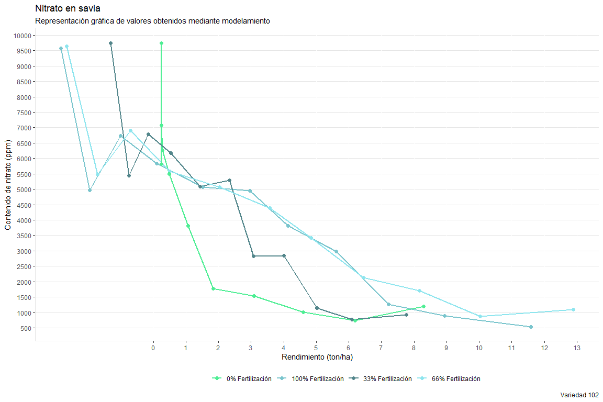<!-- -->

# Ca

# CPI 1

``` r
mccain_savia_0_1 <- mccain_savia %>%
  filter(Variedad =="CIP 1", Tratamiento =="0% Fertilización")%>%
  group_by(DDS,Variedad,Tratamiento)%>%
  summarise(Ca = mean(Ca, na.rm=T))
```

    ## `summarise()` has grouped output by 'DDS', 'Variedad'. You can override using
    ## the `.groups` argument.

``` r
Tabla_0_1 <- cbind(mccain_savia_0_1$Variedad,Tabla_RENDIMIENTOs_savia_0_1, mccain_savia_0_1$Ca)
colnames(Tabla_0_1) <- c('Variedad','RENDIMIENTO','DDS','Tratamiento','Ca')

mccain_savia_33_1 <- mccain_savia %>%
  filter(Variedad =="CIP 1", Tratamiento =="33% Fertilización")%>%
  group_by(DDS,Variedad,Tratamiento)%>%
  summarise(Ca = mean(Ca, na.rm=T))
```

    ## `summarise()` has grouped output by 'DDS', 'Variedad'. You can override using
    ## the `.groups` argument.

``` r
Tabla_33_1 <- cbind(mccain_savia_33_1$Variedad,Tabla_RENDIMIENTOs_savia_33_1, mccain_savia_33_1$Ca)
colnames(Tabla_33_1) <- c('Variedad','RENDIMIENTO','DDS','Tratamiento','Ca')

mccain_savia_66_1 <- mccain_savia %>%
  filter(Variedad =="CIP 1", Tratamiento =="66% Fertilización")%>%
  group_by(DDS,Variedad,Tratamiento)%>%
  summarise(Ca = mean(Ca, na.rm=T))
```

    ## `summarise()` has grouped output by 'DDS', 'Variedad'. You can override using
    ## the `.groups` argument.

``` r
Tabla_66_1 <- cbind(mccain_savia_66_1$Variedad,Tabla_RENDIMIENTOs_savia_66_1, mccain_savia_66_1$Ca)
colnames(Tabla_66_1) <- c('Variedad','RENDIMIENTO','DDS','Tratamiento','Ca')

mccain_savia_100_1 <- mccain_savia %>%
  filter(Variedad =="CIP 1", Tratamiento =="100% Fertilización")%>%
  group_by(DDS,Variedad,Tratamiento)%>%
  summarise(Ca = mean(Ca, na.rm=T))
```

    ## `summarise()` has grouped output by 'DDS', 'Variedad'. You can override using
    ## the `.groups` argument.

``` r
Tabla_100_1 <- cbind(mccain_savia_100_1$Variedad,Tabla_RENDIMIENTOs_savia_100_1, mccain_savia_100_1$Ca)
colnames(Tabla_100_1) <- c('Variedad','RENDIMIENTO','DDS','Tratamiento','Ca')

Tabla_1 <- rbind(Tabla_0_1,Tabla_33_1, Tabla_66_1, Tabla_100_1)

Tabla_1
```

    ##    Variedad  RENDIMIENTO DDS        Tratamiento       Ca
    ## 1     CIP 1 -0.025824691  36   0% Fertilización 8.833333
    ## 2     CIP 1 -0.009921534  45   0% Fertilización 4.083333
    ## 3     CIP 1  0.055075669  53   0% Fertilización 4.000000
    ## 4     CIP 1  0.244713328  61   0% Fertilización 4.000000
    ## 5     CIP 1  0.728464325  70   0% Fertilización 4.000000
    ## 6     CIP 1  1.480209275  78   0% Fertilización 4.000000
    ## 7     CIP 1  2.251130886  84   0% Fertilización 4.000000
    ## 8     CIP 1  3.342140467  91   0% Fertilización 4.000000
    ## 9     CIP 1  4.578001866  98   0% Fertilización 4.000000
    ## 10    CIP 1  5.883286437 105   0% Fertilización 4.000000
    ## 11    CIP 1  7.730052676 115   0% Fertilización 5.875000
    ## 12    CIP 1  0.024258896  36  33% Fertilización 4.333333
    ## 13    CIP 1  0.034620873  45  33% Fertilización 4.000000
    ## 14    CIP 1  0.082656964  53  33% Fertilización 4.000000
    ## 15    CIP 1  0.240214439  61  33% Fertilización 4.000000
    ## 16    CIP 1  0.691941174  70  33% Fertilización 4.000000
    ## 17    CIP 1  1.470152485  78  33% Fertilización 4.000000
    ## 18    CIP 1  2.331969974  84  33% Fertilización 4.000000
    ## 19    CIP 1  3.634958219  91  33% Fertilización 4.000000
    ## 20    CIP 1  5.208271470  98  33% Fertilización 4.000000
    ## 21    CIP 1  6.967820629 105  33% Fertilización 4.000000
    ## 22    CIP 1  9.614253263 115  33% Fertilización 4.000000
    ## 23    CIP 1  0.026029923  36  66% Fertilización 4.666667
    ## 24    CIP 1  0.036094826  45  66% Fertilización 4.000000
    ## 25    CIP 1  0.082877828  53  66% Fertilización 4.000000
    ## 26    CIP 1  0.237252357  61  66% Fertilización 4.000000
    ## 27    CIP 1  0.683714712  70  66% Fertilización 4.000000
    ## 28    CIP 1  1.460169325  78  66% Fertilización 4.000000
    ## 29    CIP 1  2.326994976  84  66% Fertilización 4.000000
    ## 30    CIP 1  3.647585071  91  66% Fertilización 4.000000
    ## 31    CIP 1  5.254798884  98  66% Fertilización 4.000000
    ## 32    CIP 1  7.065847124 105  66% Fertilización 4.000000
    ## 33    CIP 1  9.813106509 115  66% Fertilización 4.000000
    ## 34    CIP 1  0.234915361  36 100% Fertilización 9.416667
    ## 35    CIP 1  0.235775517  45 100% Fertilización 4.083333
    ## 36    CIP 1  0.245817078  53 100% Fertilización 4.000000
    ## 37    CIP 1  0.307131020  61 100% Fertilización 4.000000
    ## 38    CIP 1  0.580922759  70 100% Fertilización 4.000000
    ## 39    CIP 1  1.198833311  78 100% Fertilización 4.000000
    ## 40    CIP 1  1.984860676  84 100% Fertilización 4.000000
    ## 41    CIP 1  3.270910057  91 100% Fertilización 4.000000
    ## 42    CIP 1  4.893758916  98 100% Fertilización 4.000000
    ## 43    CIP 1  6.733647469 105 100% Fertilización 4.000000
    ## 44    CIP 1  9.467276906 115 100% Fertilización 4.000000

# CIP 39

``` r
mccain_savia_0_39 <- mccain_savia %>%
  filter(Variedad =="CIP 39", Tratamiento =="0% Fertilización")%>%
  group_by(DDS,Variedad,Tratamiento)%>%
  summarise(Ca = mean(Ca, na.rm=T))
```

    ## `summarise()` has grouped output by 'DDS', 'Variedad'. You can override using
    ## the `.groups` argument.

``` r
Tabla_0_39 <- cbind(mccain_savia_0_39$Variedad,Tabla_RENDIMIENTOs_savia_0_39, mccain_savia_0_39$Ca)
colnames(Tabla_0_39) <- c('Variedad','RENDIMIENTO','DDS','Tratamiento','Ca')

mccain_savia_33_39 <- mccain_savia %>%
  filter(Variedad =="CIP 39", Tratamiento =="33% Fertilización")%>%
  group_by(DDS,Variedad,Tratamiento)%>%
  summarise(Ca = mean(Ca, na.rm=T))
```

    ## `summarise()` has grouped output by 'DDS', 'Variedad'. You can override using
    ## the `.groups` argument.

``` r
Tabla_33_39 <- cbind(mccain_savia_33_39$Variedad,Tabla_RENDIMIENTOs_savia_33_39, mccain_savia_33_39$Ca)
colnames(Tabla_33_39) <- c('Variedad','RENDIMIENTO','DDS','Tratamiento','Ca')

mccain_savia_66_39 <- mccain_savia %>%
  filter(Variedad =="CIP 39", Tratamiento =="66% Fertilización")%>%
  group_by(DDS,Variedad,Tratamiento)%>%
  summarise(Ca = mean(Ca, na.rm=T))
```

    ## `summarise()` has grouped output by 'DDS', 'Variedad'. You can override using
    ## the `.groups` argument.

``` r
Tabla_66_39 <- cbind(mccain_savia_66_39$Variedad,Tabla_RENDIMIENTOs_savia_66_39, mccain_savia_66_39$Ca)
colnames(Tabla_66_39) <- c('Variedad','RENDIMIENTO','DDS','Tratamiento','Ca')

mccain_savia_100_39 <- mccain_savia %>%
  filter(Variedad =="CIP 39", Tratamiento =="100% Fertilización")%>%
  group_by(DDS,Variedad,Tratamiento)%>%
  summarise(Ca = mean(Ca, na.rm=T))
```

    ## `summarise()` has grouped output by 'DDS', 'Variedad'. You can override using
    ## the `.groups` argument.

``` r
Tabla_100_39 <- cbind(mccain_savia_100_39$Variedad,Tabla_RENDIMIENTOs_savia_100_39, mccain_savia_100_39$Ca)
colnames(Tabla_100_39) <- c('Variedad','RENDIMIENTO','DDS','Tratamiento','Ca')

Tabla_39 <- rbind(Tabla_0_39,Tabla_33_39, Tabla_66_39, Tabla_100_39)

Tabla_39
```

    ##    Variedad  RENDIMIENTO DDS        Tratamiento        Ca
    ## 1    CIP 39  0.248431452  36   0% Fertilización 12.166667
    ## 2    CIP 39  0.248485627  45   0% Fertilización  6.416667
    ## 3    CIP 39  0.250752204  53   0% Fertilización  4.916667
    ## 4    CIP 39  0.280375295  61   0% Fertilización  4.000000
    ## 5    CIP 39  0.488441066  70   0% Fertilización  4.000000
    ## 6    CIP 39  1.063079193  78   0% Fertilización  4.000000
    ## 7    CIP 39  1.836889581  84   0% Fertilización  4.000000
    ## 8    CIP 39  3.092508425  91   0% Fertilización  4.000000
    ## 9    CIP 39  4.600284909  98   0% Fertilización  4.000000
    ## 10   CIP 39  6.185594638 105   0% Fertilización  4.000000
    ## 11   CIP 39  8.296895750 115   0% Fertilización  4.000000
    ## 12   CIP 39  0.199068490  36  33% Fertilización 17.916667
    ## 13   CIP 39  0.199068933  45  33% Fertilización  7.083333
    ## 14   CIP 39  0.199336699  53  33% Fertilización  5.666667
    ## 15   CIP 39  0.213946006  61  33% Fertilización  5.416667
    ## 16   CIP 39  0.433504874  70  33% Fertilización  4.000000
    ## 17   CIP 39  1.237941111  78  33% Fertilización  4.000000
    ## 18   CIP 39  2.374477965  84  33% Fertilización  4.000000
    ## 19   CIP 39  4.127779024  91  33% Fertilización  4.000000
    ## 20   CIP 39  6.018117517  98  33% Fertilización  4.000000
    ## 21   CIP 39  7.753983072 105  33% Fertilización  4.000000
    ## 22   CIP 39  9.695462653 115  33% Fertilización  4.000000
    ## 23   CIP 39 -0.385161668  36  66% Fertilización 13.000000
    ## 24   CIP 39 -0.154761674  45  66% Fertilización  4.583333
    ## 25   CIP 39  0.212836561  53  66% Fertilización  4.416667
    ## 26   CIP 39  0.783305964  61  66% Fertilización  4.000000
    ## 27   CIP 39  1.708102905  70  66% Fertilización  4.000000
    ## 28   CIP 39  2.792326971  78  66% Fertilización  4.000000
    ## 29   CIP 39  3.758570905  84  66% Fertilización  4.000000
    ## 30   CIP 39  5.030299825  91  66% Fertilización  4.000000
    ## 31   CIP 39  6.426896736  98  66% Fertilización  4.000000
    ## 32   CIP 39  7.911183412 105  66% Fertilización  4.000000
    ## 33   CIP 39 10.107660753 115  66% Fertilización  4.000000
    ## 34   CIP 39 -0.029894866  36 100% Fertilización 12.000000
    ## 35   CIP 39  0.009230284  45 100% Fertilización  6.583333
    ## 36   CIP 39  0.137843175  53 100% Fertilización  4.916667
    ## 37   CIP 39  0.464144229  61 100% Fertilización  4.000000
    ## 38   CIP 39  1.222083449  70 100% Fertilización  4.000000
    ## 39   CIP 39  2.340062505  78 100% Fertilización  4.000000
    ## 40   CIP 39  3.461665179  84 100% Fertilización  4.000000
    ## 41   CIP 39  5.036862561  91 100% Fertilización  4.000000
    ## 42   CIP 39  6.823906844  98 100% Fertilización  4.000000
    ## 43   CIP 39  8.727988993 105 100% Fertilización  4.000000
    ## 44   CIP 39 11.469060604 115 100% Fertilización  4.000000

# CIP 102

``` r
mccain_savia_0_102 <- mccain_savia %>%
  filter(Variedad =="CIP 102", Tratamiento =="0% Fertilización")%>%
  group_by(DDS,Variedad,Tratamiento)%>%
  summarise(Ca = mean(Ca, na.rm=T))
```

    ## `summarise()` has grouped output by 'DDS', 'Variedad'. You can override using
    ## the `.groups` argument.

``` r
Tabla_0_102 <- cbind(mccain_savia_0_102$Variedad,Tabla_RENDIMIENTOs_savia_0_102, mccain_savia_0_102$Ca)
colnames(Tabla_0_102) <- c('Variedad','RENDIMIENTO','DDS','Tratamiento','Ca')

mccain_savia_33_102 <- mccain_savia %>%
  filter(Variedad =="CIP 102", Tratamiento =="33% Fertilización")%>%
  group_by(DDS,Variedad,Tratamiento)%>%
  summarise(Ca = mean(Ca, na.rm=T))
```

    ## `summarise()` has grouped output by 'DDS', 'Variedad'. You can override using
    ## the `.groups` argument.

``` r
Tabla_33_102 <- cbind(mccain_savia_33_102$Variedad,Tabla_RENDIMIENTOs_savia_33_102, mccain_savia_33_102$Ca)
colnames(Tabla_33_102) <- c('Variedad','RENDIMIENTO','DDS','Tratamiento','Ca')

mccain_savia_66_102 <- mccain_savia %>%
  filter(Variedad =="CIP 102", Tratamiento =="66% Fertilización")%>%
  group_by(DDS,Variedad,Tratamiento)%>%
  summarise(Ca = mean(Ca, na.rm=T))
```

    ## `summarise()` has grouped output by 'DDS', 'Variedad'. You can override using
    ## the `.groups` argument.

``` r
Tabla_66_102 <- cbind(mccain_savia_66_102$Variedad,Tabla_RENDIMIENTOs_savia_66_102, mccain_savia_66_102$Ca)
colnames(Tabla_66_102) <- c('Variedad','RENDIMIENTO','DDS','Tratamiento','Ca')

mccain_savia_100_102 <- mccain_savia %>%
  filter(Variedad =="CIP 102", Tratamiento =="100% Fertilización")%>%
  group_by(DDS,Variedad,Tratamiento)%>%
  summarise(Ca = mean(Ca, na.rm=T))
```

    ## `summarise()` has grouped output by 'DDS', 'Variedad'. You can override using
    ## the `.groups` argument.

``` r
Tabla_100_102 <- cbind(mccain_savia_100_102$Variedad,Tabla_RENDIMIENTOs_savia_100_102, mccain_savia_100_102$Ca)
colnames(Tabla_100_102) <- c('Variedad','RENDIMIENTO','DDS','Tratamiento','Ca')

Tabla_102 <- rbind(Tabla_0_102,Tabla_33_102, Tabla_66_102, Tabla_100_102)

Tabla_102
```

    ##    Variedad RENDIMIENTO DDS        Tratamiento       Ca
    ## 1   CIP 102  0.24843145  36   0% Fertilización 4.000000
    ## 2   CIP 102  0.24848563  45   0% Fertilización 4.000000
    ## 3   CIP 102  0.25075220  53   0% Fertilización 4.000000
    ## 4   CIP 102  0.28037530  61   0% Fertilización 4.000000
    ## 5   CIP 102  0.48844107  70   0% Fertilización 4.000000
    ## 6   CIP 102  1.06307919  78   0% Fertilización 4.000000
    ## 7   CIP 102  1.83688958  84   0% Fertilización 4.000000
    ## 8   CIP 102  3.09250843  91   0% Fertilización 4.000000
    ## 9   CIP 102  4.60028491  98   0% Fertilización 4.000000
    ## 10  CIP 102  6.18559464 105   0% Fertilización 4.000000
    ## 11  CIP 102  8.29689575 115   0% Fertilización 4.000000
    ## 12  CIP 102 -1.30583280  36  33% Fertilización 4.000000
    ## 13  CIP 102 -0.75125255  45  33% Fertilización 4.000000
    ## 14  CIP 102 -0.15483154  53  33% Fertilización 4.000000
    ## 15  CIP 102  0.53896434  61  33% Fertilización 4.000000
    ## 16  CIP 102  1.43587808  70  33% Fertilización 4.000000
    ## 17  CIP 102  2.33659553  78  33% Fertilización 4.000000
    ## 18  CIP 102  3.07603587  84  33% Fertilización 4.000000
    ## 19  CIP 102  4.00794370  91  33% Fertilización 4.000000
    ## 20  CIP 102  5.01440416  98  33% Fertilización 4.000000
    ## 21  CIP 102  6.09541725 105  33% Fertilización 4.000000
    ## 22  CIP 102  7.76904764 115  33% Fertilización 4.000000
    ## 23  CIP 102 -2.66736988  36  66% Fertilización 4.000000
    ## 24  CIP 102 -1.71654272  45  66% Fertilización 4.000000
    ## 25  CIP 102 -0.69397962  53  66% Fertilización 4.000000
    ## 26  CIP 102  0.49553256  61  66% Fertilización 4.000000
    ## 27  CIP 102  2.03329007  70  66% Fertilización 4.000000
    ## 28  CIP 102  3.57756904  78  66% Fertilización 4.000000
    ## 29  CIP 102  4.84533859  84  66% Fertilización 4.000000
    ## 30  CIP 102  6.44309344  91  66% Fertilización 4.000000
    ## 31  CIP 102  8.16866866  98  66% Fertilización 4.000000
    ## 32  CIP 102 10.02206428 105  66% Fertilización 4.000000
    ## 33  CIP 102 12.89150155 115  66% Fertilización 4.000000
    ## 34  CIP 102 -2.83763350  36 100% Fertilización 4.083333
    ## 35  CIP 102 -1.95577822  45 100% Fertilización 4.000000
    ## 36  CIP 102 -1.00739065  53 100% Fertilización 4.000000
    ## 37  CIP 102  0.09583572  61 100% Fertilización 4.000000
    ## 38  CIP 102  1.52204611  70 100% Fertilización 4.000000
    ## 39  CIP 102  2.95430490  78 100% Fertilización 4.000000
    ## 40  CIP 102  4.13011194  84 100% Fertilización 4.000000
    ## 41  CIP 102  5.61196752  91 100% Fertilización 4.000000
    ## 42  CIP 102  7.21237155  98 100% Fertilización 4.000000
    ## 43  CIP 102  8.93132403 105 100% Fertilización 4.000000
    ## 44  CIP 102 11.59261569 115 100% Fertilización 4.000000

# Gráficos

``` r
CaCPI1 <-  Tabla_1%>%
  group_by(DDS,Tratamiento)%>%
  summarise(CALCIO=mean(Ca,na.rm=T),
            RENDIMIENTO=RENDIMIENTO,
            TRATAMIENTO=Tratamiento,
            SE=sd(Ca,na.rm=T)/sqrt(length(complete.cases(Ca))))
```

    ## `summarise()` has grouped output by 'DDS'. You can override using the `.groups`
    ## argument.

``` r
ggplot(CaCPI1,aes(x=RENDIMIENTO, y=CALCIO, group = TRATAMIENTO, colour =TRATAMIENTO)) + 
  geom_line(size = 1)  +
  scale_y_continuous(breaks=seq(0,20,1))+
  scale_x_continuous(breaks=seq(0,13,1))+
  labs(title="Calcio en savia", subtitle="Representación gráfica de valores obtenidos mediante modelamiento",caption="Variedad 1", x="Rendimiento (ton/ha)", y="Contenido de calcio (ppm)")+
  geom_point( size=2, fill="white") +
  scale_color_manual(values=c("seagreen2","cadetblue3","cadetblue4","cadetblue2"))+
  tema
```

<!-- -->

``` r
CaCPI39 <-  Tabla_39%>%
  group_by(DDS,Tratamiento)%>%
  summarise(CALCIO=mean(Ca,na.rm=T),
            RENDIMIENTO=RENDIMIENTO,
            TRATAMIENTO=Tratamiento,
            SE=sd(Ca,na.rm=T)/sqrt(length(complete.cases(Ca))))
```

    ## `summarise()` has grouped output by 'DDS'. You can override using the `.groups`
    ## argument.

``` r
ggplot(CaCPI39,aes(x=RENDIMIENTO, y=CALCIO, group = TRATAMIENTO, colour =TRATAMIENTO)) + 
  geom_line(size = 1)  +
  scale_y_continuous(breaks=seq(0,20,2))+
  scale_x_continuous(breaks=seq(0,13,1))+
  labs(title="Calcio en savia", subtitle="Representación gráfica de valores obtenidos mediante modelamiento",caption="Variedad 39", x="Rendimiento (ton/ha)", y="Contenido de calcio (ppm)")+
  geom_point( size=2, fill="white") +
  scale_color_manual(values=c("seagreen2","cadetblue3","cadetblue4","cadetblue2"))+
  tema
```

<!-- -->

``` r
CaCPI102 <-  Tabla_102%>%
  group_by(DDS,Tratamiento)%>%
  summarise(CALCIO=mean(Ca,na.rm=T),
            RENDIMIENTO=RENDIMIENTO,
            TRATAMIENTO=Tratamiento,
            SE=sd(Ca,na.rm=T)/sqrt(length(complete.cases(Ca))))
```

    ## `summarise()` has grouped output by 'DDS'. You can override using the `.groups`
    ## argument.

``` r
ggplot(CaCPI102,aes(x=RENDIMIENTO, y=CALCIO, group = TRATAMIENTO, colour =TRATAMIENTO)) + 
  geom_line(size = 1)  +
  scale_y_continuous(breaks=seq(0,5,0.01))+
  scale_x_continuous(breaks=seq(0,13,1))+
  labs(title="Calcio en savia", subtitle="Representación gráfica de valores obtenidos mediante modelamiento",caption="Variedad 102", x="Rendimiento (ton/ha)", y="Contenido de calcio (ppm)")+
  geom_point( size=2, fill="white") +
  scale_color_manual(values=c("seagreen2","cadetblue3","cadetblue4","cadetblue2"))+
  tema
```

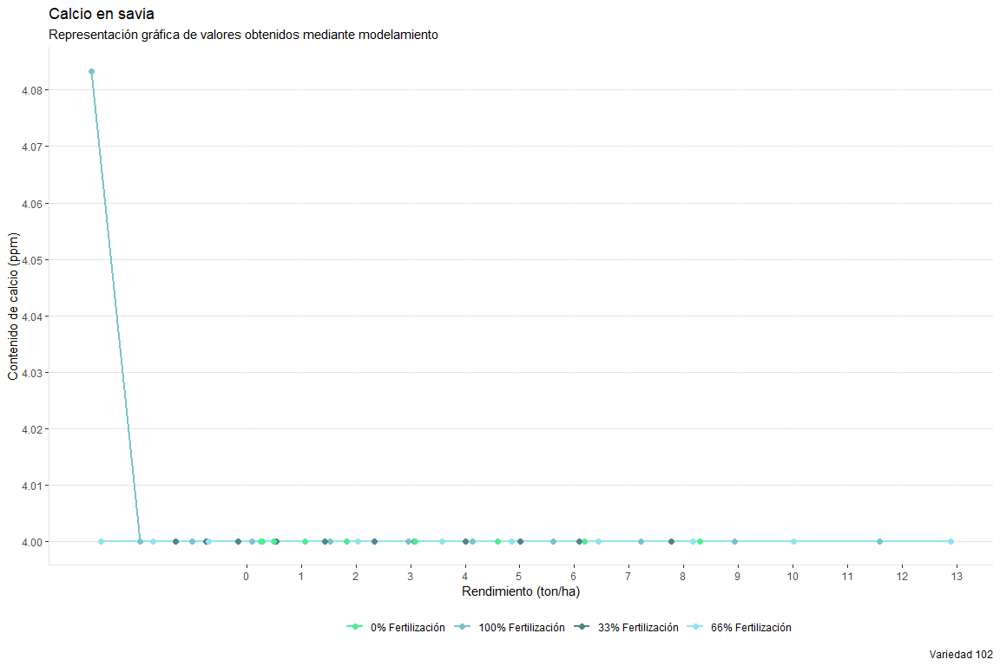<!-- -->

# K

# CPI 1

``` r
mccain_savia_0_1 <- mccain_savia %>%
  filter(Variedad =="CIP 1", Tratamiento =="0% Fertilización")%>%
  group_by(DDS,Variedad,Tratamiento)%>%
  summarise(K = mean(K, na.rm=T))
```

    ## `summarise()` has grouped output by 'DDS', 'Variedad'. You can override using
    ## the `.groups` argument.

``` r
Tabla_0_1 <- cbind(mccain_savia_0_1$Variedad,Tabla_RENDIMIENTOs_savia_0_1, mccain_savia_0_1$K)
colnames(Tabla_0_1) <- c('Variedad','RENDIMIENTO','DDS','Tratamiento','K')

mccain_savia_33_1 <- mccain_savia %>%
  filter(Variedad =="CIP 1", Tratamiento =="33% Fertilización")%>%
  group_by(DDS,Variedad,Tratamiento)%>%
  summarise(K = mean(K, na.rm=T))
```

    ## `summarise()` has grouped output by 'DDS', 'Variedad'. You can override using
    ## the `.groups` argument.

``` r
Tabla_33_1 <- cbind(mccain_savia_33_1$Variedad,Tabla_RENDIMIENTOs_savia_33_1, mccain_savia_33_1$K)
colnames(Tabla_33_1) <- c('Variedad','RENDIMIENTO','DDS','Tratamiento','K')

mccain_savia_66_1 <- mccain_savia %>%
  filter(Variedad =="CIP 1", Tratamiento =="66% Fertilización")%>%
  group_by(DDS,Variedad,Tratamiento)%>%
  summarise(K = mean(K, na.rm=T))
```

    ## `summarise()` has grouped output by 'DDS', 'Variedad'. You can override using
    ## the `.groups` argument.

``` r
Tabla_66_1 <- cbind(mccain_savia_66_1$Variedad,Tabla_RENDIMIENTOs_savia_66_1, mccain_savia_66_1$K)
colnames(Tabla_66_1) <- c('Variedad','RENDIMIENTO','DDS','Tratamiento','K')

mccain_savia_100_1 <- mccain_savia %>%
  filter(Variedad =="CIP 1", Tratamiento =="100% Fertilización")%>%
  group_by(DDS,Variedad,Tratamiento)%>%
  summarise(K = mean(K, na.rm=T))
```

    ## `summarise()` has grouped output by 'DDS', 'Variedad'. You can override using
    ## the `.groups` argument.

``` r
Tabla_100_1 <- cbind(mccain_savia_100_1$Variedad,Tabla_RENDIMIENTOs_savia_100_1, mccain_savia_100_1$K)
colnames(Tabla_100_1) <- c('Variedad','RENDIMIENTO','DDS','Tratamiento','K')

Tabla_1 <- rbind(Tabla_0_1,Tabla_33_1, Tabla_66_1, Tabla_100_1)

Tabla_1
```

    ##    Variedad  RENDIMIENTO DDS        Tratamiento        K
    ## 1     CIP 1 -0.025824691  36   0% Fertilización 5508.333
    ## 2     CIP 1 -0.009921534  45   0% Fertilización 5375.000
    ## 3     CIP 1  0.055075669  53   0% Fertilización 7966.667
    ## 4     CIP 1  0.244713328  61   0% Fertilización 7625.000
    ## 5     CIP 1  0.728464325  70   0% Fertilización 6191.667
    ## 6     CIP 1  1.480209275  78   0% Fertilización 6183.333
    ## 7     CIP 1  2.251130886  84   0% Fertilización 9800.000
    ## 8     CIP 1  3.342140467  91   0% Fertilización 8191.667
    ## 9     CIP 1  4.578001866  98   0% Fertilización 7683.333
    ## 10    CIP 1  5.883286437 105   0% Fertilización 9183.333
    ## 11    CIP 1  7.730052676 115   0% Fertilización 9162.500
    ## 12    CIP 1  0.024258896  36  33% Fertilización 5758.333
    ## 13    CIP 1  0.034620873  45  33% Fertilización 5358.333
    ## 14    CIP 1  0.082656964  53  33% Fertilización 7733.333
    ## 15    CIP 1  0.240214439  61  33% Fertilización 7158.333
    ## 16    CIP 1  0.691941174  70  33% Fertilización 6583.333
    ## 17    CIP 1  1.470152485  78  33% Fertilización 6266.667
    ## 18    CIP 1  2.331969974  84  33% Fertilización 9233.333
    ## 19    CIP 1  3.634958219  91  33% Fertilización 8466.667
    ## 20    CIP 1  5.208271470  98  33% Fertilización 8000.000
    ## 21    CIP 1  6.967820629 105  33% Fertilización 8475.000
    ## 22    CIP 1  9.614253263 115  33% Fertilización 9000.000
    ## 23    CIP 1  0.026029923  36  66% Fertilización 5616.667
    ## 24    CIP 1  0.036094826  45  66% Fertilización 4883.333
    ## 25    CIP 1  0.082877828  53  66% Fertilización 7816.667
    ## 26    CIP 1  0.237252357  61  66% Fertilización 6916.667
    ## 27    CIP 1  0.683714712  70  66% Fertilización 6225.000
    ## 28    CIP 1  1.460169325  78  66% Fertilización 6008.333
    ## 29    CIP 1  2.326994976  84  66% Fertilización 9450.000
    ## 30    CIP 1  3.647585071  91  66% Fertilización 8016.667
    ## 31    CIP 1  5.254798884  98  66% Fertilización 8216.667
    ## 32    CIP 1  7.065847124 105  66% Fertilización 8016.667
    ## 33    CIP 1  9.813106509 115  66% Fertilización 8760.000
    ## 34    CIP 1  0.234915361  36 100% Fertilización 5575.000
    ## 35    CIP 1  0.235775517  45 100% Fertilización 4833.333
    ## 36    CIP 1  0.245817078  53 100% Fertilización 8175.000
    ## 37    CIP 1  0.307131020  61 100% Fertilización 6616.667
    ## 38    CIP 1  0.580922759  70 100% Fertilización 6358.333
    ## 39    CIP 1  1.198833311  78 100% Fertilización 6000.000
    ## 40    CIP 1  1.984860676  84 100% Fertilización 9508.333
    ## 41    CIP 1  3.270910057  91 100% Fertilización 7966.667
    ## 42    CIP 1  4.893758916  98 100% Fertilización 7533.333
    ## 43    CIP 1  6.733647469 105 100% Fertilización 8175.000
    ## 44    CIP 1  9.467276906 115 100% Fertilización 8844.444

# CIP 39

``` r
mccain_savia_0_39 <- mccain_savia %>%
  filter(Variedad =="CIP 39", Tratamiento =="0% Fertilización")%>%
  group_by(DDS,Variedad,Tratamiento)%>%
  summarise(K = mean(K, na.rm=T))
```

    ## `summarise()` has grouped output by 'DDS', 'Variedad'. You can override using
    ## the `.groups` argument.

``` r
Tabla_0_39 <- cbind(mccain_savia_0_39$Variedad,Tabla_RENDIMIENTOs_savia_0_39, mccain_savia_0_39$K)
colnames(Tabla_0_39) <- c('Variedad','RENDIMIENTO','DDS','Tratamiento','K')

mccain_savia_33_39 <- mccain_savia %>%
  filter(Variedad =="CIP 39", Tratamiento =="33% Fertilización")%>%
  group_by(DDS,Variedad,Tratamiento)%>%
  summarise(K = mean(K, na.rm=T))
```

    ## `summarise()` has grouped output by 'DDS', 'Variedad'. You can override using
    ## the `.groups` argument.

``` r
Tabla_33_39 <- cbind(mccain_savia_33_39$Variedad,Tabla_RENDIMIENTOs_savia_33_39, mccain_savia_33_39$K)
colnames(Tabla_33_39) <- c('Variedad','RENDIMIENTO','DDS','Tratamiento','K')

mccain_savia_66_39 <- mccain_savia %>%
  filter(Variedad =="CIP 39", Tratamiento =="66% Fertilización")%>%
  group_by(DDS,Variedad,Tratamiento)%>%
  summarise(K = mean(K, na.rm=T))
```

    ## `summarise()` has grouped output by 'DDS', 'Variedad'. You can override using
    ## the `.groups` argument.

``` r
Tabla_66_39 <- cbind(mccain_savia_66_39$Variedad,Tabla_RENDIMIENTOs_savia_66_39, mccain_savia_66_39$K)
colnames(Tabla_66_39) <- c('Variedad','RENDIMIENTO','DDS','Tratamiento','K')

mccain_savia_100_39 <- mccain_savia %>%
  filter(Variedad =="CIP 39", Tratamiento =="100% Fertilización")%>%
  group_by(DDS,Variedad,Tratamiento)%>%
  summarise(K = mean(K, na.rm=T))
```

    ## `summarise()` has grouped output by 'DDS', 'Variedad'. You can override using
    ## the `.groups` argument.

``` r
Tabla_100_39 <- cbind(mccain_savia_100_39$Variedad,Tabla_RENDIMIENTOs_savia_100_39, mccain_savia_100_39$K)
colnames(Tabla_100_39) <- c('Variedad','RENDIMIENTO','DDS','Tratamiento','K')

Tabla_39 <- rbind(Tabla_0_39,Tabla_33_39, Tabla_66_39, Tabla_100_39)

Tabla_39
```

    ##    Variedad  RENDIMIENTO DDS        Tratamiento        K
    ## 1    CIP 39  0.248431452  36   0% Fertilización 4483.333
    ## 2    CIP 39  0.248485627  45   0% Fertilización 5041.667
    ## 3    CIP 39  0.250752204  53   0% Fertilización 7508.333
    ## 4    CIP 39  0.280375295  61   0% Fertilización 6966.667
    ## 5    CIP 39  0.488441066  70   0% Fertilización 6250.000
    ## 6    CIP 39  1.063079193  78   0% Fertilización 5900.000
    ## 7    CIP 39  1.836889581  84   0% Fertilización 9633.333
    ## 8    CIP 39  3.092508425  91   0% Fertilización 7233.333
    ## 9    CIP 39  4.600284909  98   0% Fertilización 6883.333
    ## 10   CIP 39  6.185594638 105   0% Fertilización 7750.000
    ## 11   CIP 39  8.296895750 115   0% Fertilización 8800.000
    ## 12   CIP 39  0.199068490  36  33% Fertilización 4741.667
    ## 13   CIP 39  0.199068933  45  33% Fertilización 5191.667
    ## 14   CIP 39  0.199336699  53  33% Fertilización 7925.000
    ## 15   CIP 39  0.213946006  61  33% Fertilización 6566.667
    ## 16   CIP 39  0.433504874  70  33% Fertilización 6233.333
    ## 17   CIP 39  1.237941111  78  33% Fertilización 5791.667
    ## 18   CIP 39  2.374477965  84  33% Fertilización 9591.667
    ## 19   CIP 39  4.127779024  91  33% Fertilización 7550.000
    ## 20   CIP 39  6.018117517  98  33% Fertilización 6841.667
    ## 21   CIP 39  7.753983072 105  33% Fertilización 7608.333
    ## 22   CIP 39  9.695462653 115  33% Fertilización 8866.667
    ## 23   CIP 39 -0.385161668  36  66% Fertilización 5008.333
    ## 24   CIP 39 -0.154761674  45  66% Fertilización 4808.333
    ## 25   CIP 39  0.212836561  53  66% Fertilización 7983.333
    ## 26   CIP 39  0.783305964  61  66% Fertilización 6625.000
    ## 27   CIP 39  1.708102905  70  66% Fertilización 6616.667
    ## 28   CIP 39  2.792326971  78  66% Fertilización 5891.667
    ## 29   CIP 39  3.758570905  84  66% Fertilización 9733.333
    ## 30   CIP 39  5.030299825  91  66% Fertilización 7441.667
    ## 31   CIP 39  6.426896736  98  66% Fertilización 7125.000
    ## 32   CIP 39  7.911183412 105  66% Fertilización 7700.000
    ## 33   CIP 39 10.107660753 115  66% Fertilización 8825.000
    ## 34   CIP 39 -0.029894866  36 100% Fertilización 4833.333
    ## 35   CIP 39  0.009230284  45 100% Fertilización 5225.000
    ## 36   CIP 39  0.137843175  53 100% Fertilización 8183.333
    ## 37   CIP 39  0.464144229  61 100% Fertilización 6683.333
    ## 38   CIP 39  1.222083449  70 100% Fertilización 6525.000
    ## 39   CIP 39  2.340062505  78 100% Fertilización 5966.667
    ## 40   CIP 39  3.461665179  84 100% Fertilización 9466.667
    ## 41   CIP 39  5.036862561  91 100% Fertilización 7341.667
    ## 42   CIP 39  6.823906844  98 100% Fertilización 7300.000
    ## 43   CIP 39  8.727988993 105 100% Fertilización 8400.000
    ## 44   CIP 39 11.469060604 115 100% Fertilización 8888.889

# CIP 102

``` r
mccain_savia_0_102 <- mccain_savia %>%
  filter(Variedad =="CIP 102", Tratamiento =="0% Fertilización")%>%
  group_by(DDS,Variedad,Tratamiento)%>%
  summarise(K = mean(K, na.rm=T))
```

    ## `summarise()` has grouped output by 'DDS', 'Variedad'. You can override using
    ## the `.groups` argument.

``` r
Tabla_0_102 <- cbind(mccain_savia_0_102$Variedad,Tabla_RENDIMIENTOs_savia_0_102, mccain_savia_0_102$K)
colnames(Tabla_0_102) <- c('Variedad','RENDIMIENTO','DDS','Tratamiento','K')

mccain_savia_33_102 <- mccain_savia %>%
  filter(Variedad =="CIP 102", Tratamiento =="33% Fertilización")%>%
  group_by(DDS,Variedad,Tratamiento)%>%
  summarise(K = mean(K, na.rm=T))
```

    ## `summarise()` has grouped output by 'DDS', 'Variedad'. You can override using
    ## the `.groups` argument.

``` r
Tabla_33_102 <- cbind(mccain_savia_33_102$Variedad,Tabla_RENDIMIENTOs_savia_33_102, mccain_savia_33_102$K)
colnames(Tabla_33_102) <- c('Variedad','RENDIMIENTO','DDS','Tratamiento','K')

mccain_savia_66_102 <- mccain_savia %>%
  filter(Variedad =="CIP 102", Tratamiento =="66% Fertilización")%>%
  group_by(DDS,Variedad,Tratamiento)%>%
  summarise(K = mean(K, na.rm=T))
```

    ## `summarise()` has grouped output by 'DDS', 'Variedad'. You can override using
    ## the `.groups` argument.

``` r
Tabla_66_102 <- cbind(mccain_savia_66_102$Variedad,Tabla_RENDIMIENTOs_savia_66_102, mccain_savia_66_102$K)
colnames(Tabla_66_102) <- c('Variedad','RENDIMIENTO','DDS','Tratamiento','K')

mccain_savia_100_102 <- mccain_savia %>%
  filter(Variedad =="CIP 102", Tratamiento =="100% Fertilización")%>%
  group_by(DDS,Variedad,Tratamiento)%>%
  summarise(K = mean(K, na.rm=T))
```

    ## `summarise()` has grouped output by 'DDS', 'Variedad'. You can override using
    ## the `.groups` argument.

``` r
Tabla_100_102 <- cbind(mccain_savia_100_102$Variedad,Tabla_RENDIMIENTOs_savia_100_102, mccain_savia_100_102$K)
colnames(Tabla_100_102) <- c('Variedad','RENDIMIENTO','DDS','Tratamiento','K')

Tabla_102 <- rbind(Tabla_0_102, Tabla_33_102, Tabla_66_102, Tabla_100_102)

Tabla_102
```

    ##    Variedad RENDIMIENTO DDS        Tratamiento        K
    ## 1   CIP 102  0.24843145  36   0% Fertilización 5800.000
    ## 2   CIP 102  0.24848563  45   0% Fertilización 5433.333
    ## 3   CIP 102  0.25075220  53   0% Fertilización 8208.333
    ## 4   CIP 102  0.28037530  61   0% Fertilización 7175.000
    ## 5   CIP 102  0.48844107  70   0% Fertilización 6480.000
    ## 6   CIP 102  1.06307919  78   0% Fertilización 6033.333
    ## 7   CIP 102  1.83688958  84   0% Fertilización 9450.000
    ## 8   CIP 102  3.09250843  91   0% Fertilización 8383.333
    ## 9   CIP 102  4.60028491  98   0% Fertilización 8325.000
    ## 10  CIP 102  6.18559464 105   0% Fertilización 8900.000
    ## 11  CIP 102  8.29689575 115   0% Fertilización 9822.222
    ## 12  CIP 102 -1.30583280  36  33% Fertilización 5633.333
    ## 13  CIP 102 -0.75125255  45  33% Fertilización 5491.667
    ## 14  CIP 102 -0.15483154  53  33% Fertilización 8075.000
    ## 15  CIP 102  0.53896434  61  33% Fertilización 7416.667
    ## 16  CIP 102  1.43587808  70  33% Fertilización 6283.333
    ## 17  CIP 102  2.33659553  78  33% Fertilización 6258.333
    ## 18  CIP 102  3.07603587  84  33% Fertilización 9408.333
    ## 19  CIP 102  4.00794370  91  33% Fertilización 7933.333
    ## 20  CIP 102  5.01440416  98  33% Fertilización 8791.667
    ## 21  CIP 102  6.09541725 105  33% Fertilización 8425.000
    ## 22  CIP 102  7.76904764 115  33% Fertilización 9700.000
    ## 23  CIP 102 -2.66736988  36  66% Fertilización 5516.667
    ## 24  CIP 102 -1.71654272  45  66% Fertilización 5525.000
    ## 25  CIP 102 -0.69397962  53  66% Fertilización 8083.333
    ## 26  CIP 102  0.49553256  61  66% Fertilización 7041.667
    ## 27  CIP 102  2.03329007  70  66% Fertilización 6300.000
    ## 28  CIP 102  3.57756904  78  66% Fertilización 5841.667
    ## 29  CIP 102  4.84533859  84  66% Fertilización 9108.333
    ## 30  CIP 102  6.44309344  91  66% Fertilización 8241.667
    ## 31  CIP 102  8.16866866  98  66% Fertilización 7825.000
    ## 32  CIP 102 10.02206428 105  66% Fertilización 9325.000
    ## 33  CIP 102 12.89150155 115  66% Fertilización 9787.500
    ## 34  CIP 102 -2.83763350  36 100% Fertilización 5358.333
    ## 35  CIP 102 -1.95577822  45 100% Fertilización 5291.667
    ## 36  CIP 102 -1.00739065  53 100% Fertilización 7941.667
    ## 37  CIP 102  0.09583572  61 100% Fertilización 7283.333
    ## 38  CIP 102  1.52204611  70 100% Fertilización 6233.333
    ## 39  CIP 102  2.95430490  78 100% Fertilización 6333.333
    ## 40  CIP 102  4.13011194  84 100% Fertilización 9341.667
    ## 41  CIP 102  5.61196752  91 100% Fertilización 7891.667
    ## 42  CIP 102  7.21237155  98 100% Fertilización 8200.000
    ## 43  CIP 102  8.93132403 105 100% Fertilización 8841.583
    ## 44  CIP 102 11.59261569 115 100% Fertilización 9709.091

# Gráficos

``` r
KCPI1 <-  Tabla_1%>%
  group_by(DDS,Tratamiento)%>%
  summarise(POTASIO=mean(K,na.rm=T),
            RENDIMIENTO=RENDIMIENTO,
            TRATAMIENTO=Tratamiento,
            SE=sd(K,na.rm=T)/sqrt(length(complete.cases(K))))
```

    ## `summarise()` has grouped output by 'DDS'. You can override using the `.groups`
    ## argument.

``` r
ggplot(KCPI1,aes(x=RENDIMIENTO, y=POTASIO, group = TRATAMIENTO, colour =TRATAMIENTO)) + 
  geom_line(size = 1)  +
  scale_y_continuous(breaks=seq(0,10000,500))+
  scale_x_continuous(breaks=seq(0,13,1))+
  labs(title="Potasio en savia", subtitle="Representación gráfica de valores obtenidos mediante modelamiento",caption="Variedad 1", x="Rendimiento (ton/ha)", y="Contenido de potasio (ppm)")+
  geom_point( size=2, fill="white") +
  scale_color_manual(values=c("seagreen2","cadetblue3","cadetblue4","cadetblue2"))+
  tema
```

<!-- -->

``` r
KCPI39 <-  Tabla_39%>%
  group_by(DDS,Tratamiento)%>%
  summarise(POTASIO=mean(K,na.rm=T),
            RENDIMIENTO=RENDIMIENTO,
            TRATAMIENTO=Tratamiento,
            SE=sd(K,na.rm=T)/sqrt(length(complete.cases(K))))
```

    ## `summarise()` has grouped output by 'DDS'. You can override using the `.groups`
    ## argument.

``` r
ggplot(KCPI39,aes(x=RENDIMIENTO, y=POTASIO, group = TRATAMIENTO, colour =TRATAMIENTO)) + 
  geom_line(size = 1)  +
  scale_y_continuous(breaks=seq(0,10000,500))+
  scale_x_continuous(breaks=seq(0,13,1))+
  labs(title="Potasio en savia", subtitle="Representación gráfica de valores obtenidos mediante modelamiento",caption="Variedad 39", x="Rendimiento (ton/ha)", y="Contenido de potasio (ppm)")+
  geom_point( size=2, fill="white") +
  scale_color_manual(values=c("seagreen2","cadetblue3","cadetblue4","cadetblue2"))+
  tema
```

<!-- -->

``` r
KCPI102 <-  Tabla_102%>%
  group_by(DDS,Tratamiento)%>%
  summarise(POTASIO=mean(K,na.rm=T),
            RENDIMIENTO=RENDIMIENTO,
            TRATAMIENTO=Tratamiento,
            SE=sd(K,na.rm=T)/sqrt(length(complete.cases(K))))
```

    ## `summarise()` has grouped output by 'DDS'. You can override using the `.groups`
    ## argument.

``` r
ggplot(KCPI102,aes(x=RENDIMIENTO, y=POTASIO, group = TRATAMIENTO, colour =TRATAMIENTO)) + 
  geom_line(size = 1)  +
  scale_y_continuous(breaks=seq(0,10000,500))+
  scale_x_continuous(breaks=seq(0,13,1))+
  labs(title="Potasio en savia", subtitle="Representación gráfica de valores obtenidos mediante modelamiento",caption="Variedad 102", x="Rendimiento (ton/ha)", y="Contenido de potasio (ppm)")+
  geom_point( size=2, fill="white") +
  scale_color_manual(values=c("seagreen2","cadetblue3","cadetblue4","cadetblue2"))+
  tema
```

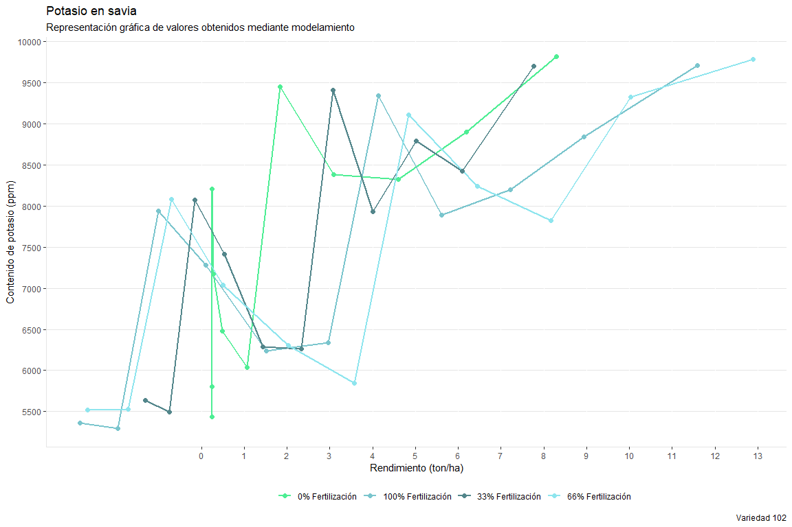<!-- -->
